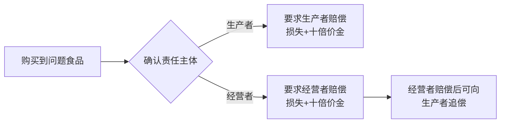
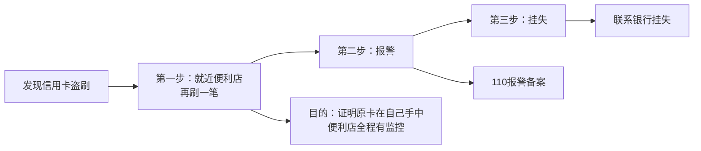
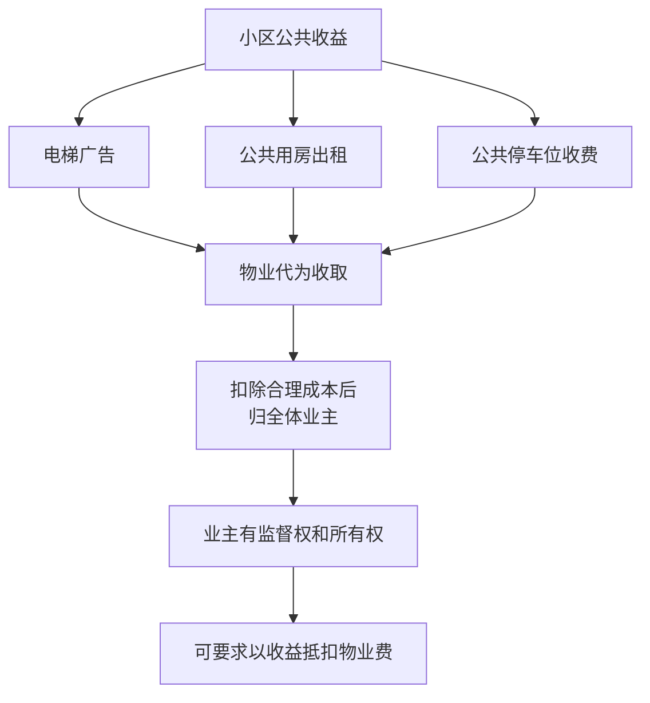

# 补充课02：常见消费避坑事例和维权指南

## Learning Objectives

- 掌握食品安全法"退一赔十"规则的适用条件
- 区分"定金"与"订金"的法律效力差异
- 学会识别霸王条款和消费陷阱
- 了解二手房买卖、二手车交易、信用卡盗刷等场景的应对方法
- 掌握小区公共收益归属等民法典新规

---

## 一、食品安全与十倍赔偿

> 食品安全法第96条：生产不符合食品安全标准的食品或者经营明知是不符合食品安全标准的食品，消费者除要求赔偿损失外，还可以向生产者或者经营者要求支付**价款十倍**的赔偿金。

> [!tip] 适用条件
> - 食品确实**不符合食品安全标准**
> - 经营者**明知**不符合标准仍销售
> - 赔偿基数 = 食品价格 × 10（不足1000元的按1000元计算）

---

## 二、"定金" vs "订金"的区别

| 类型 | 法律性质 | 违约后果 |
|------|---------|---------|
| **订金**（言字旁） | 预付款 | 不买了可**原数退回**；购买了则折合货款 |
| **定金**（宝盖头） | 担保金 | 交付方违约**无权取回**；接收方违约**双倍返还** |

> [!warning] 关键区别
> 虽然读音相同，但法律效果完全不同。签订合同时务必确认是哪个"定"。

---

## 三、信用卡盗刷的紧急处理

> [!tip]
> 盗刷后**不要首先挂失或报警**，而是先到就近便利店刷卡消费，用监控证明原卡在手中。这样银行就不会以"异地消费"为由拒赔。

---

## 四、二手车买卖避坑指南

### 关键合同条款

在买卖协议中务必加上：

> **"本车没有泡水，没有因泡水进行过翻修。如发现是泡水车，视为消费欺诈。"**

### 法律效果

- 一旦发现是泡水车，可主张**退一赔三**（消费者权益保护法第55条）
- 带上懂行的朋友一同验车
- 建议委托第三方检测机构进行全面检测

---

## 五、二手房买卖四个注意

> [!warning] 二手房交易四大要点
>
> 1. **中介费后付**——不要提前全额支付中介费
> 2. **确认房东身份**——核实是否本人、有无共同产权人
> 3. **核查抵押情况**——房子是否设定抵押
> 4. **明确违约责任**——合同上明确注明违约赔偿条款

---

## 六、小区公共收益归属

> 民法典规定：小区公共用房的出租、电梯间的广告等收入，**全部属于全体业主**。

> [!tip] 维权建议
> 如果物业不将公共收益交给业主，业主可以要求以收益抵扣物业费。

---

## 七、禁止自带酒水合法吗

> 商家无权干涉消费者自带酒水的行为，更不能索要"开瓶费"。这些都属于**违法行为**。

### 应对方法

| 步骤 | 操作 |
|------|------|
| 第一步 | 与商家协商，**全程录音** |
| 第二步 | 要求商家在流水单上写明"开瓶费"或收费金额 |
| 第三步 | 持证据到**消协投诉**（12315） |

---

## 八、人去世后花呗还要还吗

> [!faq] 人没了，花呗还用还吗？
>
> - **没有遗产** → 债务一笔勾销
> - **有遗产** → 继承人先偿还花呗债务，再继承遗产
>
> **注意**：因死亡所得的丧葬费、死亡赔偿金**不属于遗产**，赔再多也不用拿来还花呗。

---

## 知识图谱

- [[lessons/s01-spring-festival-risks|补充课01：春节法律盲区]] → 消费者维权场景的延伸
- `相关法律`：食品安全法第96条、消费者权益保护法第55条、民法典（小区公共收益规定）

---

> 笔记来源：补充课02 常见消费避坑事例和维权指南（315特别节目）
> 核心观点：消费维权重在事前预防——保留凭证、看清合同条款、了解常见陷阱；遇侵权时及时固定证据、寻求消协或法律途径解决