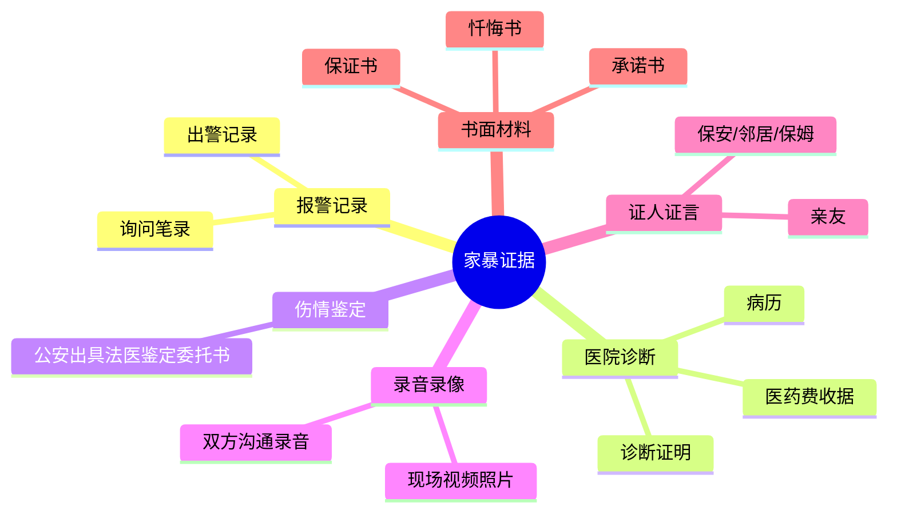

# 补充课04：评论区提问汇总答疑（二）——婚姻家庭相关

## Learning Objectives

- 理解婚内出轨在法律上的界定及其损害赔偿条件
- 掌握离婚后财产纠纷的管辖规则
- 了解轮流抚养子女的法律可行性
- 掌握家庭暴力的取证方法和法律救济途径

---

## 一、离婚后财产纠纷管辖

### 问题回顾

甲是A县人，与B县的乙结婚，乙常年在C县工作。离婚协议约定A县房屋归甲，甲补偿乙30万元。后因房屋所有权发生纠纷。甲应向哪个法院起诉？

- 乙户籍地：B县
- 乙工作地（经常居住地）：C县
- 房屋所在地：A县

**答案**：向 **C县法院**起诉。

> [!tip] 分析
> 1. **案由**：离婚后的财产纠纷（婚姻家庭纠纷），**不是**不动产纠纷
> 2. 适用**原告就被告**原则
> 3. 乙常住C县，住所地与经常居住地不一致
> 4. 应以**经常居住地C县**为管辖地

---

## 二、婚内出轨相关

### Q1：被婚内出轨的一方，离婚时会有什么优待？

> [!warning] 令人遗憾的答案：**几乎没有优待**

> [!law] 《民法典》规定的法定过错情形
> 有下列情形之一导致离婚的，无过错方有权请求**损害赔偿**：
> 1. **重婚**
> 2. **与他人同居**（持续、稳定的共同生活，偶尔出轨不算）
> 3. **实施家庭暴力**
> 4. **虐待、遗弃家庭成员**
> 5. 其他重大过错

**关键点**：

| 问题 | 答案 |
|------|------|
| **出轨算"与他人同居"吗？** | **不算**。法律上的"同居"要求持续稳定的共同生活，偶尔出轨不构成 |
| **没有同居的出轨能赔偿吗？** | **很难**。目前法律对婚内出轨惩罚性不大 |
|**还能做什么？** | 守住**财产利益**：如配偶为小三购买大额财物，侵犯了夫妻共同财产，可起诉追回 |

> [!tip] 郝律师提醒
> 出轨不相信眼泪。一旦发现配偶出轨：
> 1. 提高警惕
> 2. 搜集证据
> 3. 及时止损
> 4. 可起诉追回被赠与第三方的夫妻共同财产

---

## 三、抚养权相关问题

### Q2：离婚后是否可以轮流抚养孩子？

**答**：**可以**。

| 情形 | 可行性 |
|------|--------|
| **协议离婚** | 双方达成一致 → 可在离婚协议中约定轮流抚养，受法律保护 |
| **判决离婚** | 双方都抢孩子 → 法院强制判决后较难实现轮流抚养；建议仍可协商 |

> [!example] 轮流抚养约定示例
> "孩子随父亲生活半年、随母亲生活半年，每个周末轮流去爷爷奶奶和姥姥姥爷家看望老人。"

### Q3：离婚协议约定"抚养权归一方后，再婚必须放弃抚养权"，有效吗？

**答**：**该条款无效**。

> [!law] 婚姻自由原则
> **结婚自由、离婚自由**是婚姻法的基本原则。禁止对方再婚的约定侵犯了**结婚自由权**，应认定无效。

### Q4：离婚后孩子归女方抚养，男方不付抚养费，算老赖吗？怎么办？

**答**：

1. 以**孩子名义**向法院起诉，要求男方支付抚养费
2. 胜诉后男方仍不付 → 申请**强制执行**（法院可划拨男方银行卡资金）
3. 账户无钱 → 男方可能被列为**失信被执行人**（老赖）

> [!warning] 成为老赖的后果
> - 不能坐高铁**商务座**、飞机**头等舱**
> - 禁止进入**高消费场所**
> - 信息**全国公开**
> - 影响**个人事业、信誉、前途**

### Q5：离婚后孩子归女方，女方可以单方面将孩子姓氏由父姓改为母姓吗？

**答**：**不能**。

- 未成年人改姓需**父母双方协商一致**
- 公安部门才办理变更
- 孩子满**18岁**后可自主变更姓氏

> [!tip] 实用建议
> 孩子出生时在《出生医学证明》上可直接填**母姓**，无需父亲证明文件，避免日后改姓的尴尬。

---

## 四、家庭暴力

### Q6：婚姻中遇到家庭暴力该如何取证？

> [!danger] 家暴只有零次和一万次之分。不要沉默！

**取证六大方法**：

**家暴的法律后果**：

| 严重程度 | 法律后果 |
|----------|----------|
| 一般家暴 | 离婚时**过错赔偿** + 财产分割**多分** |
| 持续家暴（构成虐待）| 同上 + 可追及**刑事责任** |严重伤害 | 可能构成**故意伤害罪、虐待罪**，施暴者**坐牢** |

> [!quote] 郝律师寄语
> 你的沉默，是对对方的纵容。你的忍气吞声，赢不来对方的反思，只会增长其嚣张气焰。孩子希望看到的是**坚决抗争的父母**，而非默默承受伤害的父母。家暴不是私事，是**社会公共事件**。

---

> [!summary] 本课小结
> - **婚内出轨**：法律惩罚性不大，但可追回被赠与小三的**夫妻共同财产**
> - **抚养权**：可**轮流抚养**，但需双方协商一致
> - **抚养费**：不付可**强制执行**，或被列为**老赖**
> - **改姓**：未成年需**父母双方同意**，18岁后可自主变更
> - **家暴**：六大取证方法，沉默是最大的敌人