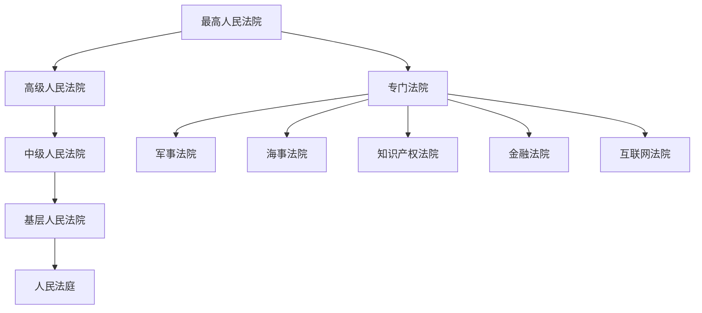
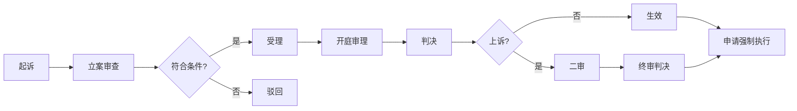

# 法律术语速查表

## 常见法律概念

### 诉讼相关

| 术语 | 含义 | 备注 |
|------|------|------|
| **诉讼** | 向法院提起诉讼，通过司法程序解决纠纷 | 分为民事、刑事、行政诉讼 |
| **起诉** | 原告向法院提出诉讼请求的行为 | 需提交起诉状 |
| **上诉** | 不服一审判决，向上一级法院请求重新审理 | 民事判决15日内，裁定10日内 |
| **抗诉** | 检察院认为法院判决有误，向上一级法院提出重新审理 | 刑事诉讼中的检察监督 |
| **财产保全** | 诉讼前或诉讼中申请法院冻结被告财产 | 防止对方转移资产 |
| **强制执行** | 判决生效后，对方拒不履行，申请法院强制其履行 | 可执行银行存款、房产、车辆等 |
| **管辖** | 确定由哪个法院受理案件 | 分为级别管辖和地域管辖 |

### 婚姻相关

| 术语 | 含义 | 备注 |
|------|------|------|
| **法定婚龄** | 男不得早于22周岁，女不得早于20周岁 | 民法典规定 |
| **无效婚姻** | 自始没有法律约束力的婚姻 | 重婚、近亲、未达婚龄 |
| **可撤销婚姻** | 一方可申请法院撤销的婚姻 | 胁迫、隐瞒重大疾病 |
| **事实婚姻** | 未登记但以夫妻名义共同生活 | 1994年2月1日后不再承认 |
| **共同财产** | 夫妻关系存续期间所得的财产 | 工资、奖金、投资收益等 |
| **个人财产** | 婚前财产及法定的个人特有财产 | 一方专用的生活用品等 |
| **夫妻共同债务** | 为夫妻共同生活所负的债务 | 需双方共同签字或事后追认 |
| **离婚冷静期** | 协议离婚申请后30天内可撤回 | 民法典新增 |

### 劳动相关

| 术语 | 含义 | 备注 |
|------|------|------|
| **劳动合同** | 确立劳动关系的协议 | 受劳动法保护 |
| **劳务合同** | 平等主体间的服务合同 | 不受劳动法保护 |
| **无固定期限劳动合同** | 没有确定终止时间的劳动合同 | 连续工作满10年可要求签订 |
| **五险一金** | 养老、医疗、失业、工伤、生育保险 + 住房公积金 | 法定强制缴纳 |
| **劳动仲裁** | 劳动争议的法定前置程序 | 不经仲裁不能直接起诉 |
| **工伤认定** | 认定工作期间受伤是否属工伤 | 有明确的认定标准 |

### 财产与继承

| 术语 | 含义 | 备注 |
|------|------|------|
| **遗嘱** | 自然人生前处分个人财产的意思表示 | 有自书、代书、打印、录音录像、公证等多种形式 |
| **法定继承** | 按法律规定的顺序和比例继承遗产 | 第一顺序：配偶、子女、父母 |
| **代位继承** | 被继承人的子女先于被继承人死亡，由该子女的晚辈直系血亲代位继承 | 民法典新规：侄甥也可代位 |
| **赠与合同** | 赠与人将自己的财产无偿给予受赠人 | 可撤销的例外情形 |

## 法律关系人

| 术语 | 含义 |
|------|------|
| **原告** | 提起诉讼的一方 |
| **被告** | 被起诉的一方 |
| **债权人** | 有权要求对方还债的人 |
| **债务人** | 有义务还债的人 |
| **被执行人** | 判决生效后不履行，被法院强制执行的人 |
| **失信被执行人（老赖）** | 有能力履行而拒不履行生效判决的人 |
| **法定代理人** | 依法代理无民事行为能力人实施法律行为的人 |

## 诉讼时效与期限

| 事项 | 期限 | 依据 |
|------|------|------|
| 民事诉讼时效 | 3年（自知道权利受损起） | 民法典 |
| 离婚冷静期 | 30天 | 民法典 |
| 劳动仲裁时效 | 1年（自知道权利受损起） | 劳动争议调解仲裁法 |
| 可撤销婚姻请求权 | 1年（自知道或应当知道起） | 民法典 |
| 工伤认定申请 | 单位30日内，个人1年内 | 工伤保险条例 |
| 上诉期限（民事判决） | 15天 | 民事诉讼法 |
| 上诉期限（民事裁定） | 10天 | 民事诉讼法 |

## 法院体系

## 诉讼流程

