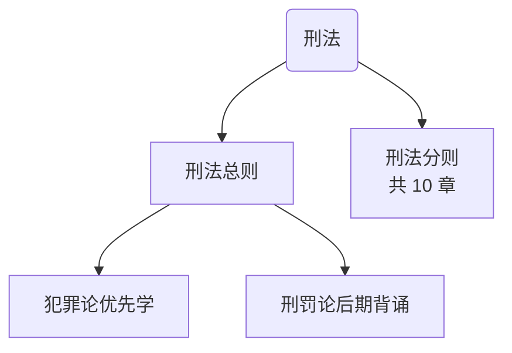
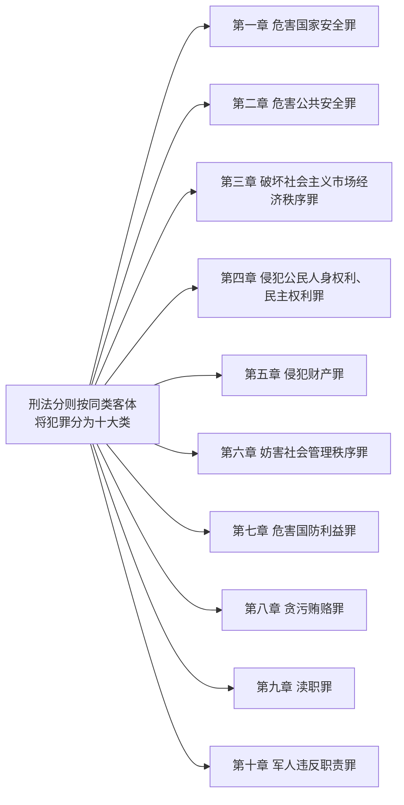
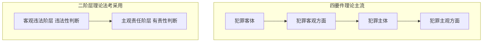
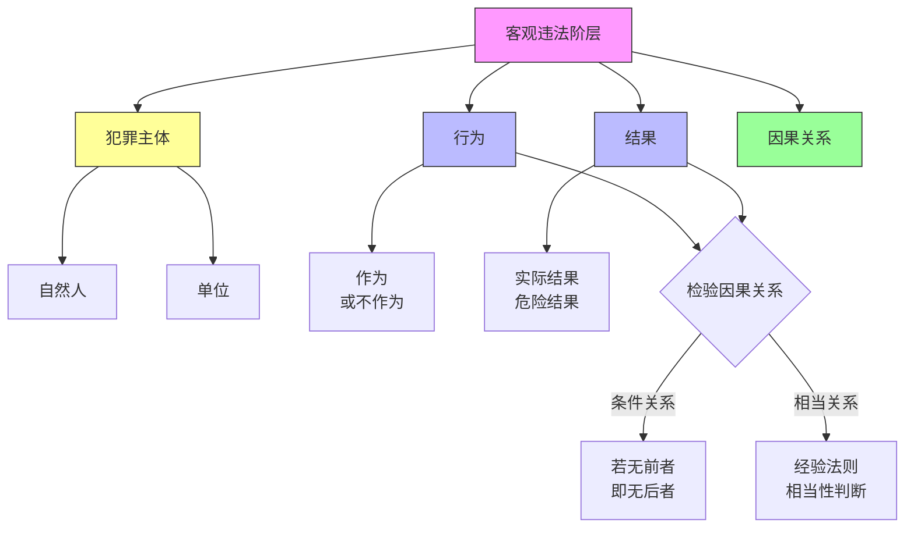
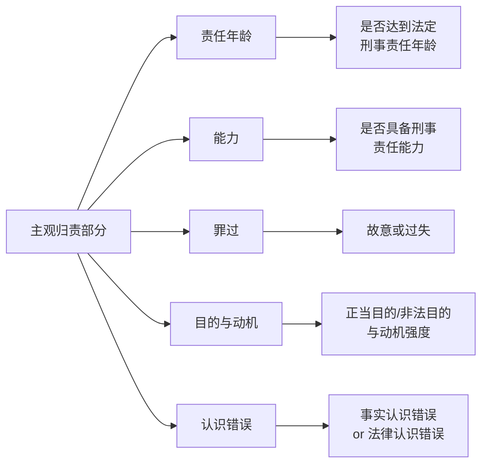
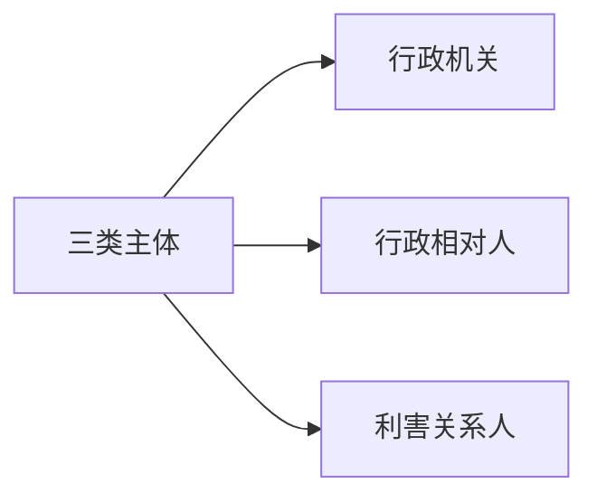
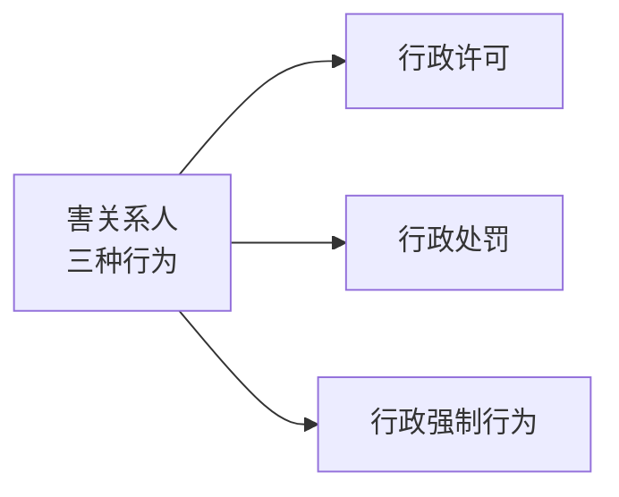
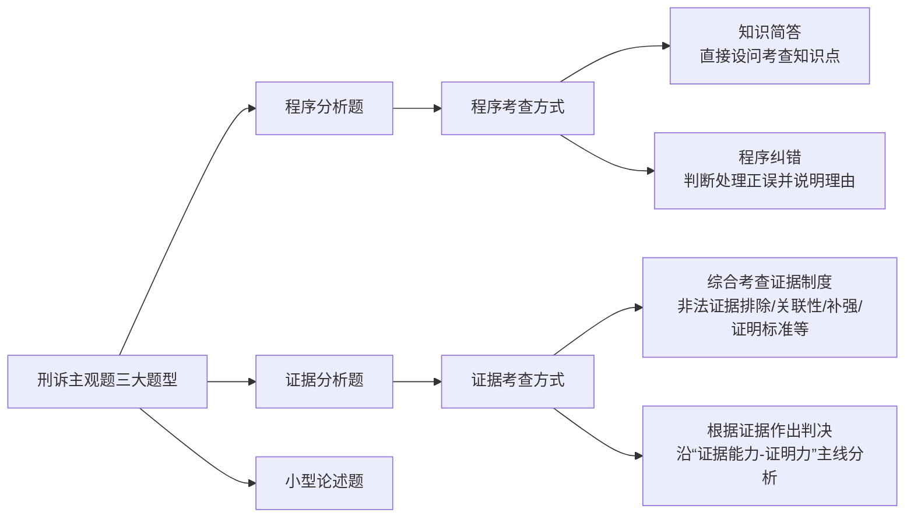
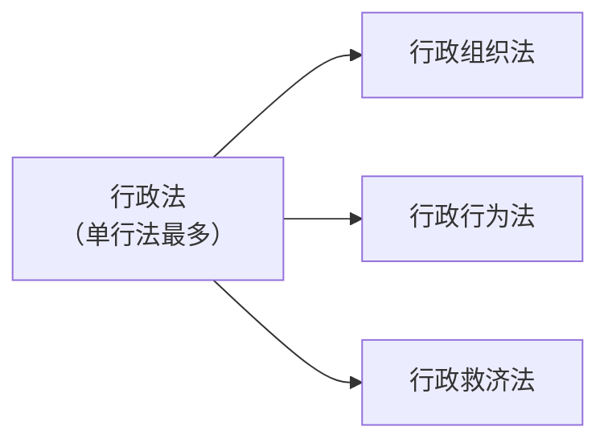

## 选择的老师
民法-李建伟
民诉法-戴鹏 
行政法-李佳 
理论法-马蜂 
刑法（柏浪涛）     
温云云 ---刑诉客观私塾   
刘安琪---RD商经法 
杨帆---三国法

## 流程时间轴

## 考试形式

## 题型

### 客观题

客观题考试共两卷，分为试卷一、试卷二，每张试卷100道试题，分值为150分，其中单项选择题50题、每题1分，多项选择题和不定项选择题共50题、每题2分，两张试卷总分为300分

| 卷别                     | 科目         | 分值    | 题型                                                  |
| ---------------------- | ---------- | ----- | --------------------------------------------------- |
| **客观题一** (9:00-12:00)  | 理论法        | 50-56 | 单选1-50题（1分/题） 多选51-90题（2分/题） 不定项91-100题（2分/题） |
|                        | 刑法         | 35-39 |                                                     |
|                        | 刑诉法        | 30-32 |                                                     |
|                        | 行政法        | 24-28 |                                                     |
|                        | 三国法（国际法）   | 4     |                                                     |
| **客观题二** (14:30-17:30) | 商经知        | 48-45 |                                                     |
|                        | 民法         | 45-51 |                                                     |
|                        | 民诉法        | 28-34 |                                                     |
|                        | 三国法（国私+国经） | 12-14 |                                                     |
全国合格分数线(180分)

---

### 主观题

| 卷别  | 题号  | 科目       | 题型    | 分值  |
| --- | --- | -------- | ----- | --- |
| 主观题 | 1   | 理论法      | 论述题   | 35  |
| 主观题 | 2   | 刑法       | 案例分析题 | 31  |
| 主观题 | 3   | 民法+民事诉讼法 | 案例分析题 | 56  |
| 主观题 | 4   | 刑事诉讼法法   | 案例分析题 | 30  |
| 主观题 | 选做题 | 行政法      | 案例分析题 | 28  |
| 主观题 | 选做题 | 商法       | 案例分析题 | 28  |

---

## 八科目介绍
法律职业资格考试涵盖了8大核心科目，分别是刑法、民法、刑事诉讼法、民事诉讼法、行政法、商法、三国法（国际法、国际私法、国际经济法）以及理论法（法理学、宪法、中国法律史等），

功能主线
1. 实体法——规定权利义务本身  
   ‎ 刑法、民法、行政法、商法  
2. 程序法——规定实现权利义务的“跑道”  
   ‎ 刑事诉讼法、民事诉讼法、行政诉讼法（已被并入行政法学科，但单列掌握）  
3. 综合交叉——兼有理论与多国元素  
   ‎ 理论法（法理学＋宪法＋法律史等）  
   ‎ 三国法（国际公法、国际私法、国际经济法）

客观题考试采用计算机考试形式，实行分批次考试方式，每名应试人员只参加其中一个批次考试。报名地司法行政机关按各考区机位数量和报考人数等随机确定应试人员考试批次，应试人员不能自行选择考试批次，考试批次和时间在准考证上注明

全国统一合格分数线客观题为180分，主观题为108分。

一般来说，正常的备考计划中，真题做3遍已经是一个合理的次数

## 复习策略

第一阶段 ：刑法、民法、行政法
第二阶段：刑诉、民诉、商经、知产
考前三个月：理论、三国【偏重于记忆。记忆性的学科可以放到后面学习】

---
## 刑法

刑法的整体框架

> [!Tip]
> 对于刑法分则的学习要结合总则的内容，总则的内容相当于对分则提公因式，将分则规定的共性问题进行抽象、归纳。特别是总则中的共同犯罪理论，经常结合分则的具体罪名进行考查。

两种犯罪构成学说对比

在客观违法阶层，包括犯罪主体、行为、结果和因果关系，其中行为、结果以及二者之间的因果关系是最主要的内容

法考经常考查不作为犯罪的情况

考查介入因素发生时，AB之间是否存在因果关系或者介入因素的出现是否割裂两者的因果关系。

> 例如，甲将被害人乙衣服点燃，被害人跳河灭火而溺亡，问甲的行为和乙的死亡之间是否有因果关系。

(客观)违法性阻却事由是指当出现特殊情况，不认为行为人的行为是犯罪，包括正当防卫、紧急避险、被害人承诺等。正当防卫是法考的常考点

主观归责部分包括责任年龄、能力、罪过、目的与动机、认识错误。

## 民法

作为“社会生活百科全书”，《民法典》中的法律规定一定是合理的，符合公民合理预期的。

## 行政法

公权力主体和普通公民之间的法律关系。行政法强调一种“官”“民”关系的不平等性，行政权以命令服从为其主要特征。行政法也有自己的原则，即六大基本原则，合法行政原则、合理行政原则、程序正当原则、高效便民原则、诚实守信原则和权责统一原则，这贯穿行政机关实施行政行为的始终，也是判断行政行为合法与否的标准。

![[_- visual selection.png]]

行政法要记住三类主体，三种行为。“三类主体”分别为行政机关、行政相对人和利害关系人。简单几句话介绍三个主体的意思是什么三类主体简要介绍如下：  
- 行政机关：依法行使行政权、作出行政行为的国家机关，如政府及其部门。  
- 行政相对人：行政行为直接针对的具体个人或组织，即“被管理”的一方。  
- 利害关系人：虽非行为直接对象，但合法权益受该行为影响的其他个人或组织。

**简单举例说明什么是利害关系人利害关系人举例：**  

> 假设你打算在小区空地新建一个儿童游乐场——  
• **居民家长**：希望设施安全、孩子玩得开心，是**直接受益的利害关系人**；  
• **一楼住户**：担心噪音，可能成为**反对的利害关系人**；  
• **居委会**：负责审批与协调，属于**管理型利害关系人**；  
• **玩具供应商**：想拿下设备订单，则是**商业利害关系人**。  

一句话：凡是会因这个项目“得利或受损”的人或组织，都是利害关系人。

**在上面这个案例里什么是行政相对人**?

行政相对人是指在行政法律关系中，与行政主体（具有行政职权的机关或组织）相对应、受行政行为直接影响的“另一方”。  
回到小区新建儿童游乐场的例子：

• 若居委会把建游乐场的申请报到街道办，由街道办作出“准予施工”或“不予许可”的行政决定，此时**申请人（通常是居委会或牵头筹备的居民代表）**就是该行政许可行为的**行政相对人**。  

一句话：案例中真正向行政机关提交申请、并直接承受“批或不批”这一行政行为的人或组织，就是本案的行政相对人。

“三种行为”指的是行政许可、行政处罚和行政强制行为。

**简单介绍下这三种行为分别是什么意思**
这三种行为是行政机关在行使行政权力时常见的三种管理方式，简单来说：

1. **行政许可**：  
   行政机关对公民或组织提出的申请进行审查，**允许其从事某些特定活动**的行为。  
   👉 举例：开餐馆前要向市场监管局申请《食品经营许可证》，这就是一种行政许可。

2. **行政处罚**：  
   行政机关对违反行政管理秩序的公民、法人或其他组织，**依法给予制裁**的行为。  
   👉 举例：某公司排放超标污水，环保局对其罚款，这就是行政处罚。

3. **行政强制**：  
   行政机关为了实现行政管理目的，**依法对拒不履行义务的主体采取强制措施**的行为。  
   👉 举例：某人拒不拆除违法建筑，城管依法强制拆除，这就是行政强制执行。

一句话总结：  
• **许可是“批准你干”**  
• **处罚是“罚你错了”**  
• **强制是“必须按我说的做”**

## 真题的使用
1. 分类真题从开始听课就要做
2. 真题至少要做2-3遍
3. 做错的真题，自己先反思为什么做错，是对于考点的理解和精准把握程度不够还是欠缺考点的灵活运用和分析能力，抑或是边缘性试题。

## 学习顺序
民诉后优先复习行政法，然后再复习商法和知产，先学习民法和民诉，将实体法和程序法之间的衔接理清楚。而商法作为特别法，放到后面学习就会比较容易理解。

刑法-刑诉-国公-法理、宪法

除了上述学科，法考的其他学科侧重于记忆，这类学科之间也有关联性，但是由于法考备考时间有限，只需记住知识点就可以。这类学科包括经济法、法治思想、中外法制史、法律职业伦理等。

刷题网站 [竹马法考](https://www.zhumavip.com/w/questionBank?curType=0&curQuestionType=0) 只刷近十年的题目，学完一章刷一章题

考生若想充分锻炼解答案例型题目的能力，不仅要在法考备考阶段认真研习各种案例题目，更要结合社会热点，经常地站在客观中立第三方的角度梳理一遍各类事件中的法律关系进而得出自己的独立见解，虽此种独立见解可能并不完全正确，但在此过程中案例分析的能力必定得到了提升。此外要重视对最高人民法院、最高人民检察院发布的指导性案例的学习，注重对指导性案例涉及的知识点和裁判思路进行分析与掌握。

## 主观题

主观题冲刺系列图书一般在客观题考试前后出版，服务于所有参加本年度主观题考试的考生，是备战主观题重要的工具书。

客观题真题图书中“解析”的主要作用在于帮助考生回顾之前学过的知识点、了解此类题目的惯常考法、明确与之相关联的考点、洞悉常见陷阱等等。

主观题首先需要考生能够准确地破译题干，明确题干背后的考点和法律关系。不仅如此，还要把答案按照一定的逻辑顺序简明扼要地写出来。

答案=结论+理由，先给出结论，然后简要说明理由，该引用法条的引用法条。

主观题本质是“思路题”，其两大特点：

1. **考点无序**：先得读题干把生活语言转成法律语言，才知考点在哪，且考点之间无先后关系。  
2. **设问具体**：以针对案情细节的设问为主（开放性问题较少），没有选项提示，须凭题干信息+知识自行判断并作答。

一般情况下会涉及多方当事人，法律关系也更加复杂，需要考生掌握**画图能力**，通过画图理清当事人之间的各种法律关系，一方面可以节省答题时间，另一方面也防止遗漏考点，不至于失分。

### 主观题各科考情分析及应对策略

1. 习近平法治思想
	- 主观题卷中第一题每年固定为法治理论的论述题。考查的形式都是“两三段材料+一个问题+一个要求”。
		- “两三段材料”大多出自中央文件或者总书记的讲话
		- “一个问题”通常的表达方式“请根据材料，结合A谈谈B”，A和B都是常规的考点，重点考查考生对知识、理论融会贯通的能力，在B的部分，增加论述的难度。对于法治思想部分，内容不多，建议大家把框架性知识点一字不差地掌握，需要理解的内容可以用自己的话表述。
		- “一个要求”一般都是观点、表述、字数，一般比指定字数多一两行

备考法治思想要抓住三条主线：  
1. 形成发展与重大意义——弄清“为什么”；  
2. 核心要义——弄清“是什么”，重点内容精准背；  
3. 实践要求——弄清“怎么做”，结合具体案例与时政热点理解运用。

---
2. 刑法
	- 刑法的考试题型总结起来其实就两种，一问一答式和综合分析式。
	- 一问一答式 考生做这种题目一定要先看问题，搞清楚问什么，然后带着问题阅读案情，这样读题才更有针对性，从而摒除无用信息的干扰。  切记，看清楚问题，问什么答什么，没有问的不要作答。
	- 
- 这个刑事责任通常包括：是否构成犯罪，构成何罪，犯罪形态如何，是否存在共同犯罪，如果有人触犯了数个罪，最终怎么处理，定一罪还是数罪并罚，是否存在自首、立功等量刑情节等等。

对于综合分析式的案例，我们在做题的时候要注意以下几点：
  
 第一，层次要分明。在阅读案情的时候，要以人物为主线，按照时间顺序，对行为人所实施的每一个行为进行分析，分别回答出各个行为人的刑事责任。如果涉及共同犯罪，从答题的简洁性角度来说，对于共同犯罪部分可以合并作答。
 第二，思考要全面。在对行为人的行为进行分析的时候，要按照定罪-量刑的顺序进行分析，务必全面。
第三，答案要多元化。刑法中很多问题没有唯一的结论，可能会涉及多种观点，如死者占有问题、对诈骗罪中处分意识的理解。知识点本身就存在不同观点，所以考生在答题时务必注意，不能只答一种观点，否则会失掉很多分数的。
第四，契合命题人观点。刑法有关观点展示的题目，主要还是侧重考查大家对“德日刑法阶层体系”的理解、掌握程度。而就如今的“刑法阶层体系”研究而言，当属清华的“五道口学派”为执牛耳者。尤其是，作为当今“刑法阶层体系”集大成者的张明楷老师，不仅是“五道口学派”的代表人物，他的诸多观点也在法考刑法真题中得以体现，足以体现其权威性。

---
3. 刑事诉讼法
考查的题型主要有三种。  

4. 民法
民法的主观题考查重点非常突出，基本上是围绕着合同编、物权编来命题，辅之以民法总则编、侵权责任编、婚姻家庭编、继承编。法考改革后，民法这个科目最大的变化就是民商融合，跨学科考查。

法考改革后，命题人想重点考查的是法学方法论，具体而言是指考生对六大基础学科的法学理论、法学思维与法言法语的应用。

首先是法学理论：就是在某一个或几个问题上设置为开放性试题。这样的考题并不存在标准答案，只要能找到现行法律依据并论证自已的观点，自圆其说即可。

  其次是法律思维：就是运用法律逻辑去思考问题、分析问题、解决问题。在法考中，这种思维模式要体现在答案的书写上，书写要规范，常用的能够体现法律思维的句式总结如下：
  ①开放题模式。
  A.本案中涉及的民事法律关系有...·
  
  B.本案中双方的合同（物权、侵权）法律关系的核心是..
  
  ②合同类题目。
  
  A.本案的某某合同双方当事人具有行为能力，意思表示真实，内容不违反法律、行政法规的规定，合法有效，双方当事人应该遵守履行。
  
  B.本案的某某合同已经双方当事人合意，依法成立，但尚未生效（所附条件未成就、所附期限未到来、未经主管机关审批等）。
  
  C.本案的合同已经成立，但由于双方当事人意思表示不真实（欺诈、胁迫、重大误解、显失公平等）而属于可撤销的合同，既然某方行使了撤销权，故自始无效，无须履行。
  
  D.本案的合同已经成立，但由于内容违法而属于无效的合同，自始无效，无须履行。
  
  E.本案的合同未成立，是由于一方当事人在缔约中违反诚实信用原则所致，该方当事人依法承担缔约过失责任，应该赔偿对方的信赖利益损失。
  
  F.本案的合同，构成表见代理，故自始有效；或者本案的合同，构成无权代理，属于效力待定的合同，既然被代理人某某方拒不追认，故自始无效。
  
  G.本案的合同合法有效，双方自应依约履行，既然某某方构成根本违约，则对方依法享有单方解除权，并有权追究其违约责任。
  
  H.本案的合同合法有效，双方自应依约履行，既然某某方构成违约，应当依约依法承担相应的违约责任。

③物权类。
A .某某依法享有物权（所有权），任何组织、个人不得侵害之，否则，依法承 担相应的民事责任。

B .某某作为占有人依法对某某物享有占有利益，任何组织、个人不得侵害之， 否则，依法承担相应的民事责任。

C .某某作为侵占人侵害了物权人（占有人）某 某 的 物 权 （占有利益），后者可 以请求其承担返还原物、停止侵害、排除妨害、消除危险等责任，造成损害的，依 法承担侵权损害赔偿责任。

D .某某依法享有对某物的抵押权（质押权），可以主张拍卖、变卖该物品以实 现优先受偿权。

E .某某虽然享有对某动产的抵押权（质押权），但由于没有依法登记，不得对 抗第三人。

F .某某对于某物的某种用益物权（地役权、居住权等）依法设立，受到法律保 护 ，任何人不得侵害。

④侵权类。

A .民事主体依法享有的财产权、人身权受到法律保护，任何组织、个人不得侵 害 ，否则依法承担侵权责任。

B .本案中，某某侵害了某某方的财产权（人身权），符 合 一 般 （特别）侵权责 任构成要件，依法承担侵权责任，包括……

C .本案中，某某侵害了某某方的财产权（人身权），符 合 一 般 （特别）侵权责 任构成要件，但是具备某某免责事由，依法可以免除、减轻侵权赔偿责任……

> [!tip]
>无论是民法还是其他学科，在语言表述上都要尽量使用法言 法语，现对民法试题中常用法言法语归纳总结如下：

①主体类。

A .总则：民事主体，民事法律关系当事人，自然人，法人，非法人组织，营利 法人，非营利法人，公司法人，子公司，分公司。

B .合同：合同当事人，卖 方 ，买 方 ，第三人，相 对 人 （善 意 、恶 意 ），违约 方 ，解除权人，对方。

C .物权：物权人，所有权人，占有人，侵占人，用益物权人，担保物权人。

D .其他债权。不当得利：受益人、受损人；无因管理：管理人、被 管 理 人 （受 益人）；侵权：侵 害 方 （人）、受 害 方 （人）。

②行为类。

A .总则：民事行为，民事活动，民事法律行为，民事事实行为。

B .债法：侵权行为，合同行为，不当得利行为，无因管理行为，单方允诺行 为 ，缔约过失行为，加害给付。

C .物权：处分行为，负担行为，物权设立行为，生效要件，对抗要件，设权行 为 ，证权行为。

D .侵权：加害行为，过错行为，抗辩事由，混 合 过 错 （与有过失），共同过错 （共同过失），共同侵权，第三人原因，受害人故意，紧急避险，自 甘 风 险 （甘冒风 险）。

③权利类。

A .民事权利，财产权利，人身权利，人格权，身份权，一般人格权，精神利 
益 ，个人信息。

B .相对权，绝对权，对人权，对世权。

C .支配权，请求权，抗辩权，形成权。

5. 民事诉讼法

①程序分析题

第一种是知识简答

要求考生对民诉中的重要程序烂熟于心方能应答自如。

第二种是程序纠错

这种类型的题目要求考生找出程序中的错误之处，为什么错误，并且给出正确 的处理方案。

②证据分析题

民事诉讼法中的证据分析题基本上都是和程序综合在一起出题，作为其中一问 或者数问，一般不会单独出题。

③小型论述题

很少

④法律文书题

简答 题。题目只是要求考生简要回答民事起诉状或者一审判决书的结构和内容即可。

民事诉讼法基本上不会再单独命题了，现在 都是结合民商法出题。

6. 商法

> [!tip] 
> 基本上都是围绕着公司法相关考点来 命题。

在备考过程中使用的资料可以包括历年真题、最高院的指导 案例、案例指导用书上的案例，以这些案例作为素材，训练事实认定和法律适用能 力。要重点关注论证的过程，注意逻辑的严密性，不要单纯关注结果的对与错，对 于开放性的题目，只要有理有据，能够自圆其说就足够了

除了把握重点、难点以外，对于新增的考点、变动的考点、新增的司法 解释及时消化吸收

7. 行政法与行政诉讼法

所有 法考科目中涉及单行法最多的学科。但是这个学科体系比较完整，大体上可以分为 行政组织法、行政行为法和行政救济法三大部分。

四大具体行政行 为 、行政复议、行政诉讼都是法考命题的重灾区。

解题方面，要 牢 记"18字箴言”：找主体、看行为、分阶段、辨诉求、摆事实、讲规则。用 “六步法”攻克行政法主观题。

第一步是找主体：解题第一步就是要找对主体，如果找不对主体，就无法确定行政复议的被申请人和行政诉讼的被告，进而无法确定复议机关和管辖法院。

第二步是看行为：行政行为是连接“官"和“民"之间的桥梁和纽带，它是行政法体系的核心。

第三步是分阶段：当事人经过复议后再起诉，复议机关作出的不同判断结论会直接影响被告资格的确定。经过复议再起诉，被告有三种情况：复议改变，单独告;复议维持，共同告；复议不作为，择一告。该内容不仅影响被告的确定，还影响以被告知识为基础的管辖制度、审理对象、举证责任、判决形式等。所以考生一定要重点关注题干中当事人是否提起行政复议、复议结果如何这一细节。

第四步是辨诉求：诉讼请求之所以重要，原因在于诉讼请求是审理对象、被告、管辖法院和判决形式等内容的基础，诉讼请求将决定法院审理和裁判的内容，“诉什么，审什么，判什么”是行政诉讼一条一以贯之的逻辑线索，考生在应试的时候，一定要仔细分辨当事人的诉讼请求。命题人为了加大试题难度，往往会出现多个主体作出多个行政行为的情况，此时，精准地判断当事人的诉讼请求就显得更为重要。诉讼请求判断错误，极容易导致后续问题的答案出现连环错误。

第五步是摆事实：“以事实为依据，以法律为准绳"是法律人做出判断的灵魂。

第六步是讲规则：行政诉讼法律适用问题在主观题中一直占据重要地位

客观题真题图书中“解析”的主要作用是在于帮助考生回顾知识点，明确考法、关联考点、常见陷阱等等

主观题关键点在于如何准确地破译题干中所表达的关键事实，对接关键事实背后的考点和法律关系

客观题要培养的是判断考点信息能力，主观题要培养的是提取关键事实能力，

客观题备考要求全，主观题备考主要是重点内容

**"只听不练"，严重缺乏主动输出能力**

下面这段可以作为主观题提示词,用来让AI检查自己的回答是否正确

> 第一步是锁定题眼，我们在拿到主观题考题时，一定要抓住问题中的关键字，搞明白出题人想要问你什么。这一步看似简单，在做题时其实很容易为同学们所忽视。尤其是刚刚坐在考场上惊魂未定的时候，看到秒表开始计时就惊慌失措，匆匆忙忙扫一眼题目就开始作答，甚至写到一半的时候才发现答非所问，白白浪费了宝贵的答题时间。因此，定了你整体回答的方向在审题时不要过于匆忙，审题不会花费你太多的时间，但决,不妨定下心神，仔细审阅一遍。
> 
> 第二步是锁定知识点，这里面的知识点一般还是指代我国现行法律法规以及司法解释的相关规定。因为出题人也一定是以现有法条作为依据来出题的，所以我们做题时一定要在锁定题眼后，快速在脑海中检索相关的法条依据。在这一步我们要做的就是把上一步找到的“题眼”和相关“法条”勾连起来。这一步其实非常考验我们的主观题功底, 有些表述非常清晰完整并且在考场上用到的可能性非常大的法条，要重点练习，最好能够背诵。无论是采用哪种方式都一定要亲自写一遍完整的答案，只有通过一次次实际运用法条，提升使用三段论进行逻辑推导的能力，才能在你的脑海中建立一个"法条汇编库”

重视主客观考试之间的一个月的时间，一个最简单的复习技巧就是，看到一个重点法条不仅要会记忆背诵，还要时常想一想如果能在主观题考场上遇到这道题目我要如何运用法条,我写出的哪些内容能够覆盖采分点。

重点掌握主观题冲刺版图书

8月开始着手主观题的考生，不建议做2018年以后的主管真题。主要是因为法考改革后的题目一般篇幅较长，案情复杂，难度较大。尤其是民商法的部分，跨科目交叉考查，综合性强，甚至出现“夺命13问”，考生花费的时间长做题效果也不明显。因此，2017年之前的题目比较适合此阶段的考生使用。

主观题在考查内容上比客观题要少很多。主要体现在：主观题的考查内容是七科，没有三国法，而且理论法中不考法制史，虽然将法理学、宪法、司法制度和法律职业道德列入了考纲，但是这几科几乎不考。

主观题精讲系列图书出版时间一般为考试当年4-5月，二战主观题考生6月备考的时候，此图书已经面市，可以购买使用。

进入9月以后，建议大家把主要精力放在背诵和练习上，课不是说完全不听，对于背诵和练习有直接帮助的课程可以听。

法治思想版块的论述题，这道题大家一定要重视

