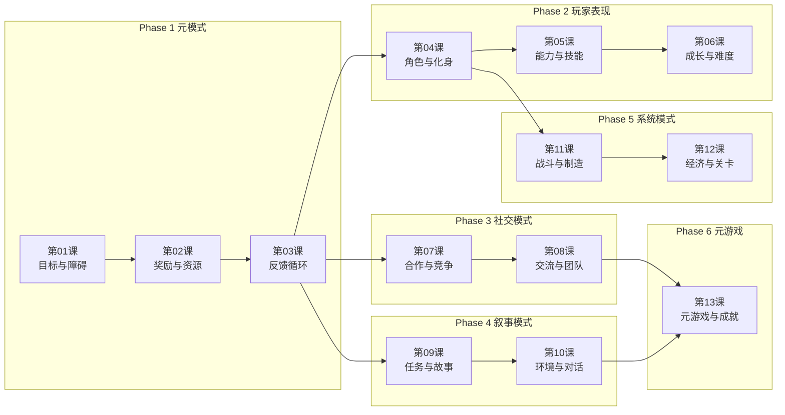

# 课程路线图

## 学习路径总览

## 阶段依赖关系

| 阶段 | 名称 | 前置阶段 | 课程数 | 核心主题 |
|------|------|---------|--------|---------|
| P1 | 元模式 | 无（起点） | 3 | 目标、障碍、奖励、资源、反馈循环 |
| P2 | 玩家表现 | P1 | 3 | 角色、化身、能力、技能、成长、难度 |
| P3 | 社交模式 | P1 | 2 | 合作、竞争、交流、团队、阵营 |
| P4 | 叙事模式 | P1 | 2 | 任务、故事讲述、环境叙事、对话 |
| P5 | 系统模式 | P2 | 2 | 战斗、制造、经济、关卡设计 |
| P6 | 元游戏 | P3+P4 | 1 | 成就、排行、跨游戏、Mod |

## 建议学习节奏

**标准模式（每天 1 课）**：
- 第 1-2 周：Phase 1（3课）+ Phase 2（3课）
- 第 3 周：Phase 3（2课）+ Phase 4（2课）
- 第 4 周：Phase 5（2课）+ Phase 6（1课）
- 总计约 3-4 周

**深度模式（每课配合游戏体验）**：
- 每课学习后，花 1-2 天体验对应推荐游戏
- 总计约 6-8 周

## 游戏案例推荐

| 课程 | 推荐游戏 | 原因 |
|------|---------|------|
| 01 目标与障碍 | 《塞尔达传说：旷野之息》 | 目标引导与开放世界障碍设计 |
| 02 奖励与资源 | 《暗黑破坏神》系列 | 经典 loot 奖励循环 |
| 03 反馈循环 | 《马里奥赛车》 | rubber-banding 追赶机制 |
| 04 角色与化身 | 《质量效应》 | 角色自定义与扮演深度 |
| 05 能力与技能 | 《巫师3》 | 技能树与能力搭配 |
| 06 成长与难度 | 《黑暗之魂》 | 高难度与成长设计 |
| 07 合作与竞争 | 《Among Us》 | 合作与背叛的社交玩法 |
| 08 交流与团队 | 《英雄联盟》 | ping 系统与团队协作 |
| 09 任务与故事 | 《巫师3》 | 主线与支线的叙事编织 |
| 10 环境与对话 | 《极乐迪斯科》 | 对话系统与内心独白 |
| 11 战斗与制造 | 《怪物猎人》 | 武器系统与制造循环 |
| 12 经济与关卡 | 《魔兽世界》 | 拍卖行经济与副本设计 |
| 13 元游戏 | 《以撒的结合》 | 元游戏层与多结局设计 |