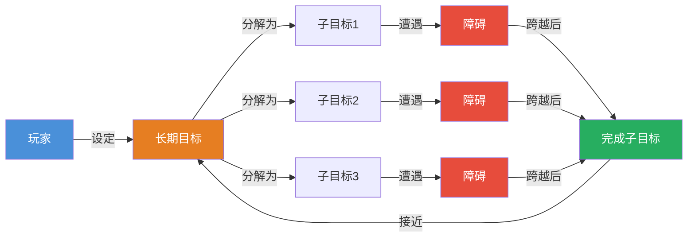
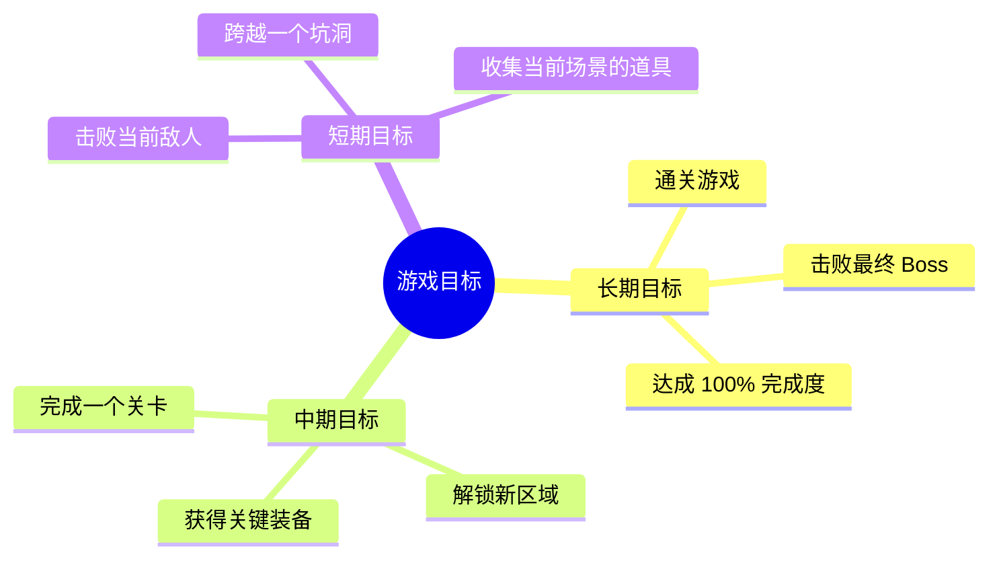
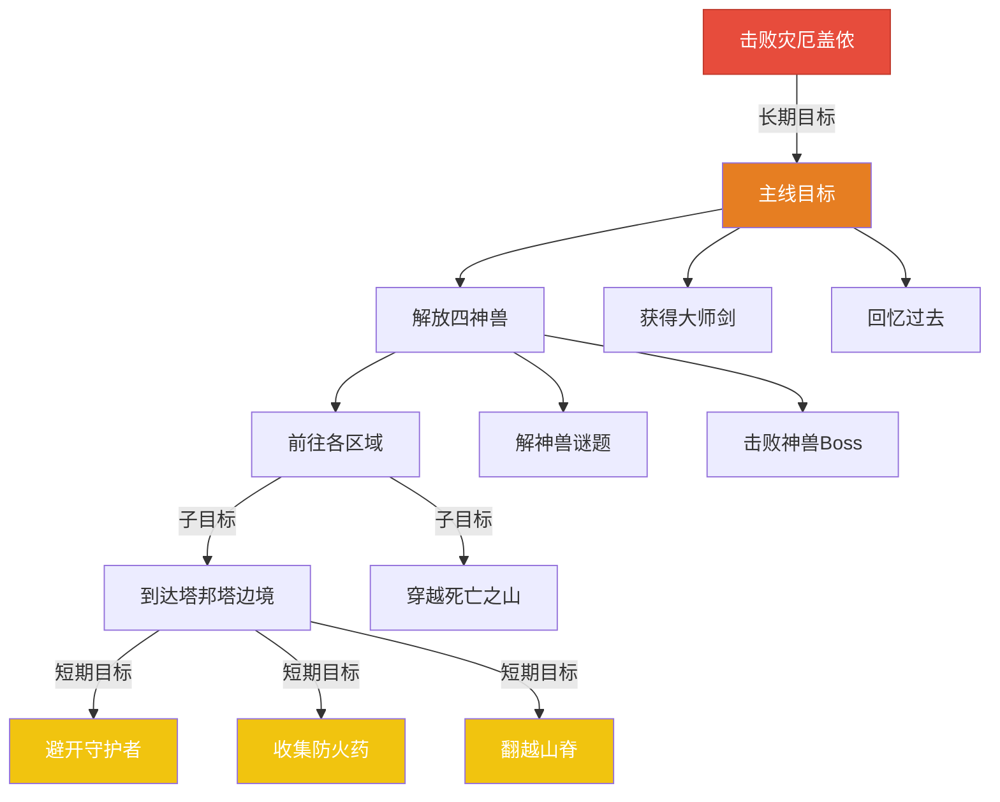

# 第01课：目标与障碍

## Learning Objectives

- 理解"目标"作为游戏设计的核心驱动力
- 区分长期目标与短期目标，以及子目标的作用
- 掌握不同类型的障碍及其设计意图
- 学会分析游戏中目标与障碍的互动关系

## Core Idea

游戏设计的本质是**为目标设定障碍，再让玩家享受跨越障碍的过程**。没有目标，玩家没有方向；没有障碍，游戏没有挑战。目标与障碍构成的张力，是所有游戏的底层结构。

> [!TIP] Key Insight
> 好的游戏不会让玩家直接"走向"目标，而是让玩家"克服障碍后抵达"目标。障碍不是设计的失败，而是游戏乐趣的来源。

### 目标的层级结构

### 障碍的类型学

障碍从不同维度可以分为多种类型，每种类型带给玩家的体验截然不同：

| 障碍类型 | 描述 | 例子 | 核心挑战 |
|---------|------|------|---------|
| Enemies（敌人） | 具有敌对意图的主动障碍 | 怪物、士兵、敌对玩家 | 反应、策略、操作 |
| Barriers（屏障） | 限制通行的物理/逻辑障碍 | 锁住的门、高墙、裂隙 | 找到解锁条件 |
| Puzzles（谜题） | 需要思考才能通过的障碍 | 机关谜题、密码锁、推箱子 | 逻辑推理、空间思维 |
| Resource Gaps（资源缺口） | 需要积累资源才能继续 | 需要特定道具、不够金币 | 资源规划、探索 |
| Information Gaps（信息缺口） | 需要知识才能正确行动 | 隐藏信息、Boss 机制未知 | 学习、记忆、探索 |

> [!NOTE] 区分"障碍"与"挑战"
> 障碍是阻止玩家达成目标的具体设计元素，而挑战是玩家面对障碍时感受到的难度。同样一个障碍，对新手是巨大挑战，对高手则轻松通过。优秀的游戏设计会通过动态难度调整，让不同水平的玩家都获得恰当的挑战感。

## Patterns in This Cluster

| 模式名称 | 定义 |
|---------|------|
| **Goals（目标）** | 玩家追求的结果状态，是游戏设计的核心驱动力。所有游戏元素最终服务于让玩家追求目标 |
| **Subgoals（子目标）** | 大目标被分解为更小、更可操作的步骤。子目标让玩家获得持续的成就感 |
| **Long-term Goals（长期目标）** | 跨越多个游戏会话的目标，为玩家提供宏观方向感和持续动力 |
| **Short-term Goals（短期目标）** | 在几分钟内可完成的即时目标，提供频繁的奖励反馈 |
| **Obstacles（障碍）** | 阻止玩家直接达成目标的设计元素，是挑战和乐趣的来源 |
| **Enemies（敌人）** | 具有敌对意图的障碍，会主动阻止玩家达成目标 |
| **Barriers（屏障）** | 限制玩家通行的物理或逻辑障碍，通常需要特定条件才能解除 |
| **Puzzles（谜题）** | 需要玩家运用思考、推理或模式识别才能通过的障碍 |

## Worked Example

### 《塞尔达传说：旷野之息》的目标引导与障碍设计

《旷野之息》被称为开放世界设计的天花板，其目标与障碍设计堪称教科书级别。

**目标结构分析：**

**障碍设计的精妙之处：**

1. **可见性引导**：游戏中的高塔、神庙、山脉顶点都是"可见目标"。玩家看到它们，自然想知道如何到达。

2. **多元化解障路径**：想去地图中心的死亡之山，玩家可以：
   - 直接走正门，遭遇大量高级敌人（Enemies）
   - 绕山路，但需要防火药来抵御高温（Resources/Barriers）
   - 从空中滑翔进入，但对体力值有要求（Stats Barrier）

3. **障碍即教学**：初始台地上的第一场雨，迫使玩家学习攀爬、滑翔、找避雨点——用障碍教会玩家生存技能。

4. **信息作为障碍**：玩家不知道神兽内部的结构，也不知道 Boss 的攻击模式——需要试探和死亡来学习。每次死亡都是信息缺口被填补的过程。

> [!TIP] 为什么旷野之息不走"锁钥"路线？
> 传统游戏用"你需要先拿 A 才能去 B"的屏障设计（锁钥式）。旷野之息则允许你尝试任何路径，如果你够强——哪怕穿新手装——也可以直接去打最终 Boss。这种"软屏障"而不是"硬屏障"的设计，让玩家的成就感来自于"我够强"，而不是"我有钥匙"。

## Practice

> [!QUESTION] 自我检测
> 1. 以下哪个不是障碍的类型？A) 敌人 B) 金币 C) 谜题 D) 屏障
>
> 2. 在《旷野之息》中，玩家看到远处的塔然后决定"我要爬到那座塔上"，这个塔依次扮演了什么角色？
>    A) 长期目标 → 奖励 → 障碍
>    B) 短期目标 → 障碍 → 子目标
>    C) 奖励 → 长期目标 → 敌人
>    D) 目标 → 障碍 → 奖励
>
> 3. 思考题：你正在设计一个平台跳跃游戏的第一关。请列出 3 个不同类型的障碍，并说明它们分别属于什么类型。

查看答案

1. **B) 金币** — 金币是资源/奖励，不是障碍。障碍是阻止玩家达成目标的东西，金币是玩家追求的资源。

2. **D) 目标 → 障碍 → 奖励** — 塔首先是一个可见目标（"我要去那里"）；攀爬过程中需要管理体力、躲避敌人，这是障碍；到达塔顶解锁地图，这是奖励。

3. **示例答案**：
   - 第一个坑洞（需要跳跃通过）→ **Barriers（屏障）** — 物理空间阻隔
   - 坑洞上方的浮动平台上有巡逻敌人 → **Enemies（敌人）** — 主动阻止玩家安全通过
   - 关卡末端需要找到三个机关才能打开的门 → **Puzzles（谜题）** — 需要探索和记忆

## Next Step

Continue with [[0002-rewards-resources]] to learn how games reward players for overcoming obstacles and how resources fuel the gameplay loop.