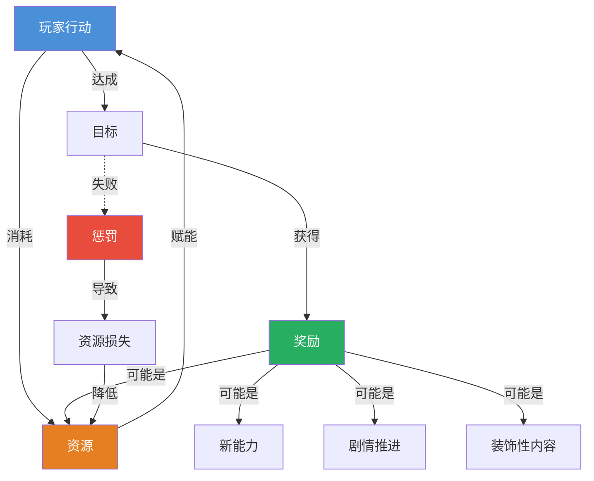
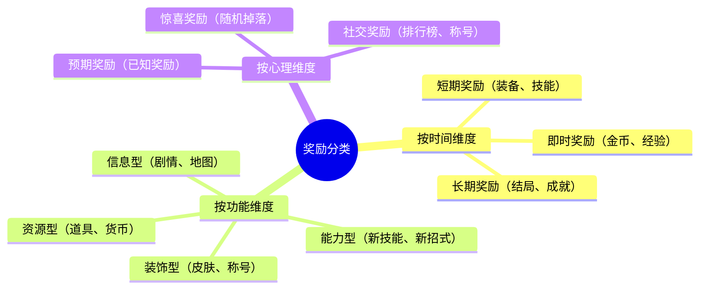
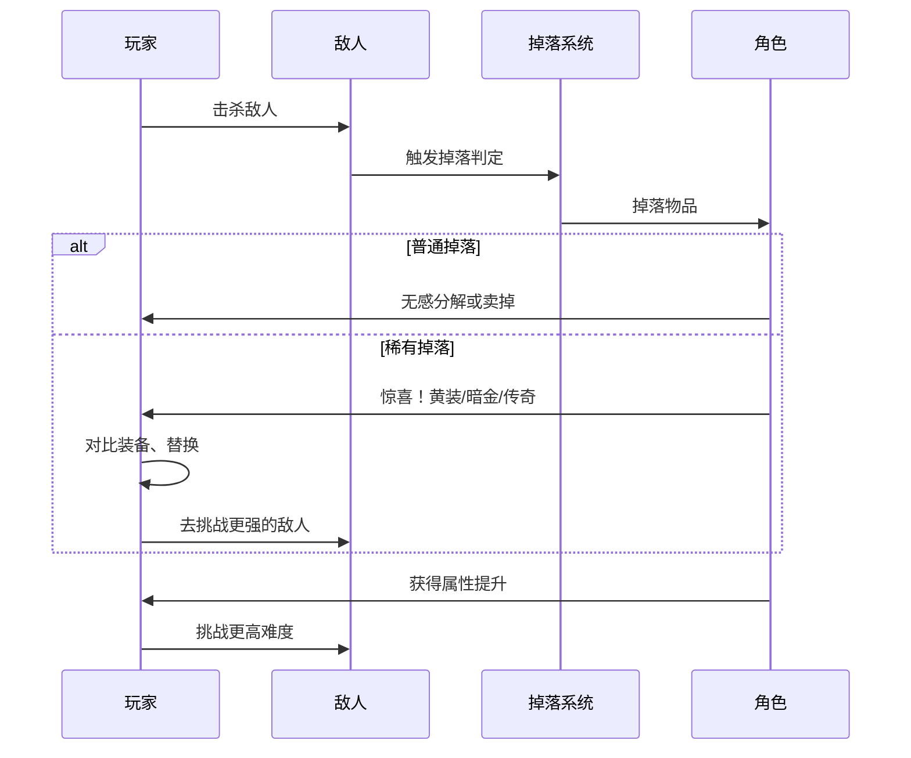

# 第02课：奖励与资源

## Learning Objectives

- 理解奖励在玩家动机系统中的作用机制
- 区分不同类型的奖励及其设计目的
- 掌握资源管理作为核心玩法循环的构成
- 理解惩罚与资源损失的辩证关系

## Core Idea

奖励是游戏给玩家的"回电"——每当你完成一个目标，游戏给你一个信号说"你做对了，继续"。资源则是玩家在游戏世界中的"行动资本"——拥有资源才能采取行动，消耗资源意味着做出了选择。

**奖励与资源的互动**构成了游戏的核心循环：

> [!TIP] Key Insight
> 奖励的终极秘密不是"给了玩家什么"，而是"让玩家感受到了什么"。一个好的奖励系统，本质上是情绪操控系统。

### 奖励的分类

### 资源类型对比

| 资源类型 | 特征 | 例子 | 管理策略 |
|---------|------|------|---------|
| **可再生资源** | 可以持续获得 | 血量、体力、基础弹药 | 合理分配，不浪费 |
| **有限资源** | 总量固定或极难获得 | 技能点、稀有材料 | 谨慎使用，战略投资 |
| **消耗品** | 使用后消失 | 药水、一次性道具 | 决定"何时用"比"用不用"更重要 |
| **永久资源** | 获得后持续有效 | 等级、技能、地图 | 如何组合比如何获取更重要 |
| **货币资源** | 可兑换其他资源 | 金币、钻石、声望 | 优先级排序，选择性兑换 |

### Rewards for Progress 与 Unlockable Content

**进度奖励（Rewards for Progress）** 是伴随玩家推进游戏逐步解锁的奖励。它的核心设计逻辑是：**给得太多，玩家失去追求；给得太少，玩家失去耐心。**

**可解锁内容（Unlockable Content）** 是进度奖励的升级版——新角色、新关卡、新模式本身作为奖励。这类设计的精妙之处在于：奖励本身就在创造更多的游戏内容。

> [!WARNING] 惩罚的辩证法则
> 惩罚本身不是目的。成功的惩罚设计让玩家"长记性"而不是"想摔手柄"。惩罚的黄金法则是：**惩罚玩家的决策，而不是惩罚玩家的操控**。因为决策下次可以优化，而操控失误可能是不可抗的。

## Patterns in This Cluster

| 模式名称 | 定义 |
|---------|------|
| **Rewards（奖励）** | 玩家达成目标后获得的回报，用于强化特定行为和提供满足感 |
| **Resources（资源）** | 玩家可用于达成目标的资产，包括生命、货币、道具、能量等 |
| **Resource Management（资源管理）** | 关于资源获取、存储和消耗的决策系统，要求玩家权衡取舍 |
| **Rewards for Progress（进度奖励）** | 随游戏进度自动解锁的奖励，确保玩家在长期流程中持续获得回报 |
| **Unlockable Content（可解锁内容）** | 以新内容作为奖励的设计，奖励本身扩展了可玩内容 |
| **Penalties（惩罚）** | 玩家失败或做出不良决策时承担的负面后果 |
| **Loss of Resources（资源损失）** | 特定条件下玩家被强制移除可用资源的设计机制 |

## Worked Example

### 《暗黑破坏神》系列的 Loot 奖励循环

《暗黑破坏神》系列定义了 "ARPG loot 循环" 这一经典设计范式。它的成功本质上是对奖励心理学的深刻理解。

**奖励循环的精妙设计：**

1. **随机性制造期待**：每次击杀敌人后掉落什么，玩家不确定。这种"开箱时刻"激活了大脑的奖励中枢——多巴胺在期待阶段释放得最多，而不是在获得时刻。

2. **颜色的力量**：白→蓝→黄→暗金→绿色（套装），每种颜色代表一个稀有度层级。玩家看到地上闪光的瞬间，大脑已经完成了"颜色识别→情绪激活"的自动化处理。

3. **进度奖励与目标分层**：
   - **即时奖励**：击杀精英怪的经验值和金币
   - **中期目标**：凑齐一套绿色套装
   - **长期目标**：达到满级，打造"毕业 Build"

4. **资源管理的深层决策**：背包空间有限，每件掉落都需要决定——装备、分解、还是卖掉？这个"三选一"看似简单，但在高频重复中形成了核心决策循环。

5. **惩罚的克制设计**：死亡惩罚是金币损失和修理费，不损失装备和等级。这种设计让玩家有"失败的紧张感"，但不怕到不敢尝试。

> [!NOTE] 惩罚的"黑暗设计"对比
> 对比《暗黑破坏神》的温和惩罚和《EVE Online》的残酷惩罚（死亡=彻底损失飞船），可以看到惩罚力度决定了游戏的气质。惩罚越重，玩家越谨慎，社群越"硬核"；惩罚越轻，玩家越敢于尝试，节奏越快。选择惩罚力度是游戏定位的核心决策。

## Practice

> [!QUESTION] 自我检测
> 1. 以下哪个不是奖励的功能维度分类？A) 资源型 B) 能力型 C) 社交型 D) 装饰型
>
> 2. 你在一款 RPG 中打败了一个 Boss，获得了一把属性极好的传奇武器。这个事件依次触发了哪几类奖励？
>
> 3. 思考题：某休闲游戏的设计师发现，玩家在完成第 20 关后流失率大幅上升。请你从"进度奖励"和"资源管理"的角度分析可能的原因，并提出改进建议。

查看答案

1. **C) 社交型** — 社交型奖励是奖励的"心理维度"或者说"来源维度"，不是"功能维度"。功能维度区分的是奖励本身对游戏玩法的实际作用（资源、能力、信息、装饰）。

2. **即时奖励**（击杀瞬间获得）→ **进度奖励**（打败了 Boss 的阶段性确认）→ **资源型奖励**（武器本身是可使用的资产）→ **能力型奖励**（武器提升了角色战斗力）。一次 Boss 战实际上触发了多层奖励系统。

3. **可能的原因**：
   - **进度奖励断层**：第 20 关后可能进入了一个"奖励荒漠"，玩家长时间拿不到新奖励
   - **资源失衡**：玩家要么资源过剩（不需要再收集），要么资源短缺到无法继续（卡关）
   - **目标真空**：没有新的长期目标来接替之前的驱动力
   **改进建议**：
   - 在第 20 关引入一个"里程碑奖励"（新角色、新模式）
   - 增加一种新的资源类型，开启新的管理维度
   - 在第 20 关前后展示后续更精彩的内容预览

## Next Step

Continue with [[0003-feedback-loops]] to understand how systems respond to player actions through positive and negative feedback loops.