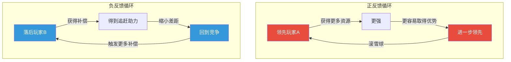
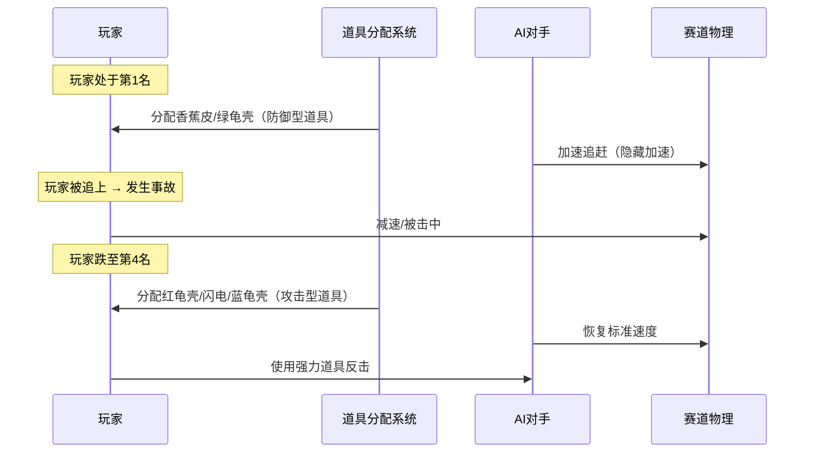

# 第03课：反馈循环

## Learning Objectives

- 理解反馈循环在游戏系统中的核心地位
- 区分正反馈与负反馈的机制和效果
- 掌握平衡循环和追赶机制的设计策略
- 学会分析游戏中反馈循环对玩家体验的影响

## Core Idea

反馈循环是游戏系统中最基础也最强大的设计模式。简单说：**系统的输出反过来影响下一次的输入**。用更直白的语言：你在游戏中的表现，会影响游戏接下来"怎么对你"。

> [!TIP] Key Insight
> 正反馈让赢家赢的更多，负反馈让输家不会输得太惨。**没有正反馈的游戏缺乏爽感，没有负反馈的游戏缺乏公平。** 优秀的设计在于两者的精准配比。

### 反馈循环的对比分析

| 维度 | 正反馈 (Positive Feedback) | 负反馈 (Negative Feedback) |
|------|---------------------------|---------------------------|
| **核心机制** | 优势者获得更多优势 | 劣势者获得补偿 |
| **效果** | 扩大差距 | 缩小差距 |
| **玩家体验** | 爽快感、碾压感 | 公平感、希望感 |
| **风险** | 过早失去悬念 | 补偿过度→"手刹"感 |
| **代表游戏** | 《真三国无双》割草 | 《马里奥赛车》道具 |
| **极端形式** | Snowball Effect（滚雪球） | Rubber-banding（橡皮筋） |

### 反馈循环的强度谱系

不同的游戏在正反馈与负反馈的光谱上处于不同位置：

> [!NOTE] 滚雪球效应 (Snowball Effect)
> 滚雪球是正反馈的极端表现——一个微小的初始优势被系统不断放大，最终导致压倒性的胜利。在MOBA游戏中，一个人头可能转化为经济优势、装备领先、等级压制、地图控制权…最终让对手完全无法反抗。**防止过早雪球**是现代竞技游戏设计中最棘手的问题之一。

### Balancing Loops（平衡循环）

平衡循环是设计中刻意引入的调节机制，目的是维持游戏的可玩性。常见手段包括：

- **经验值补偿**：等级低的玩家击杀高级怪获得更多经验
- **动态难度**：玩家表现越好，敌人越强
- **资源刷新**：落后方在地图关键位置获得更多资源
- **伤害修正**：比分落后时获得伤害加成或减免

## Patterns in This Cluster

| 模式名称 | 定义 |
|---------|------|
| **Feedback Loops（反馈循环）** | 系统的输出反过来影响后续输入的过程，是游戏动态系统的核心 |
| **Positive Feedback（正反馈）** | 强化已有趋势的反馈机制，领先者获得更多优势，加速差距扩大 |
| **Negative Feedback（负反馈）** | 抑制极端趋势的反馈机制，为劣势方提供补偿，阻止差距无限扩大 |
| **Balancing Loops（平衡循环）** | 专门用于维持游戏公平性和可玩性的调节机制集合 |
| **Snowball Effect（滚雪球效应）** | 正反馈的极端表现，初始小优势被不断放大为压倒性优势 |
| **Catch-up Mechanisms（追赶机制）** | 帮助落后玩家缩小差距的负反馈设计，确保比赛悬念持续 |

## Worked Example

### 《马里奥赛车》的 Rubber-banding AI

《马里奥赛车》系列是负反馈设计的经典教科书。它的 AI 使用了著名的 **Rubber-banding（橡皮筋）** 技术——AI 的速度会根据玩家所处位置动态调整。

**Rubber-banding 的设计细节：**

1. **道具分配与名次绑定**：
   - **第1-2名**：只能拿到香蕉皮、绿龟壳（需要瞄准技巧，难命中）
   - **第3-5名**：可能拿到红龟壳（自动追踪，稳定命中）  
   - **第6-8名**：可以拿到闪电、蓝龟壳等翻盘神器

2. **AI速度动态调整**：第1名的 AI 对手并不会全力跑，而是保持在玩家前方不远处。一旦玩家被超越，原来的第1名会"慢下来"等玩家。

3. **隐藏的负反馈**：第1名的赛车受到的道具攻击频率更高，而落后玩家的道具更强力。结果就是"没有人能一骑绝尘"——永远"在望的"第一名是赛道设计的核心悬念。

> [!WARNING] Rubber-banding 的争议
> 过度使用橡皮筋机制会引起"手刹感"——玩家感觉自己的技术无关紧要，系统在替天行道。这就是为什么《马里奥赛车》的竞技玩家更喜欢"无道具公平模式"。**好的追赶机制让玩家感觉"是我打回来的"，而不是"系统施舍给我的"。**

### 其他游戏的反馈循环设计

| 游戏 | 反馈类型 | 具体机制 | 设计意图 |
|------|---------|---------|---------|
| 《文明6》 | 正反馈 | 领先文明解锁更强政策、更快科技 | 模拟"历史惯性"，但用科技胜利条件制造终局压力 |
| 《魔兽世界》 | 负反馈 | 任务经验随等级递减 | 鼓励玩家探索新区域，防止死磕练级 |
| 《Left 4 Dead》 | 负反馈 | AI Director 动态分配特感和补给 | 确保每局游戏都有适度的紧张感 |
| 《FIFA》 | 负反馈 | 落后方球员能力隐性提升 | 保持足球比赛的悬念感 |

## Practice

> [!QUESTION] 自我检测
> 1. 正反馈和负反馈的核心区别是什么？
>
> 2. 《马里奥赛车》中排名第8的玩家获得蓝龟壳，这属于：A) 正反馈 B) 负反馈 C) 平衡循环 D) 滚雪球效应
>
> 3. 思考题：某 PvP 游戏的新手反馈说"这个游戏对新手极不友好，输了以后更难赢"。请分析这个问题出在哪种反馈循环上？应如何修改？

查看答案

1. **正反馈** 让优势者获得更多优势（扩大差距），**负反馈** 给劣势者提供补偿（缩小差距）。前者产生爽感/碾压感，后者产生公平感/悬念感。

2. **B) 负反馈**（或者说 B + C 都算对）——蓝龟壳作为强力的攻击道具分配给最后一名，本质上是一种补偿机制，帮助落后玩家追赶领先者。这既是负反馈，也是平衡循环的一部分。

3. **问题分析**：
   这通常是 **正反馈过度** 的问题——赢家的优势不断自我强化（可能通过等级装备差距、地图控制、资源积累等），导致输家越输越难翻身。
   **修改建议**：
   - 引入 ELO/MMR 匹配机制，确保匹配到水平接近的对手（最根本的解法）
   - 添加 **负反馈** 补偿，如落后方获得额外经济或经验加成
   - 移除或弱化与胜负直接挂钩的资源积累（如连胜奖励）
   - 设计"翻盘机制"——特殊时刻或条件下，落后方有一次性翻盘机会

## Next Step

Continue with [[0004-characters-avatars]] to explore how players identify with characters and avatars in game worlds.