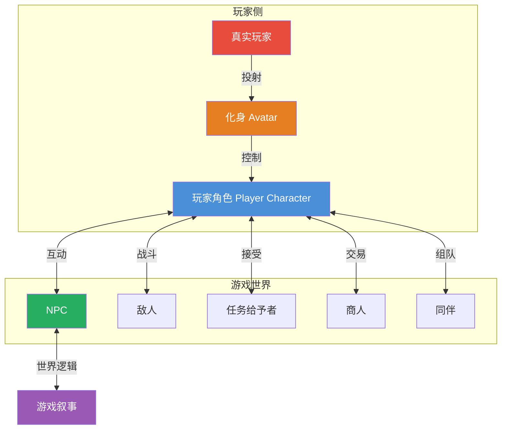

# 第04课：角色与化身

## Learning Objectives

- 区分角色（Character）与化身（Avatar）的设计差异
- 理解玩家角色与 NPC 的互补关系
- 掌握角色发展和自定义系统的设计逻辑
- 学会分析角色如何影响玩家的身份认同

## Core Idea

游戏中有两种"人"：**玩家扮演的**和**世界中的**。玩家角色（Player Character）是你的化身（Avatar），是你在游戏世界中的代表。NPC 则是世界中的角色，他们有自己的人格、故事和功能。**角色让世界可信，化身让玩家在场。**

> [!TIP] Key Insight
> 化身是"玩家自我在游戏世界中的投射"，角色是"游戏世界中的独立人格"。**好的角色设计让玩家关心他们，好的化身设计让玩家成为他们。** 这两个目标有时是冲突的——这就是为什么有"自定义主角"（高化身感）和"预写主角"（强叙事性）两种流派。

### 角色-化身谱系

不同游戏在"化身"和"角色"的光谱上分布不同：

### 角色维度分析

| 维度 | 说明 | 化身型设计 | 角色型设计 |
|------|------|-----------|-----------|
| **身份** | 角色的身份设定 | 自定义（名字、外貌、背景） | 预写（具体人物、固定背景） |
| **性格** | 性格倾向和表达 | 玩家自由发挥 | 预设性格+可选对话 |
| **语音** | 是否有配音对话 | 沉默主角/可选语音 | 完整配音+演出 |
| **发展** | 角色能否变化 | 玩家决定发展方向 | 剧情驱动固定发展 |
| **关系** | 与其他角色的互动 | 功能性关系 | 情感性关系 |

> [!NOTE] 沉默主角的设计哲学
> 很多 RPG 的主角不说话（如《塞尔达传说》的林克、《传送门》的 Chell）。这不是技术限制，而是设计选择——**沉默的主角让玩家更容易投射自我**。一旦主角开口说话，说出了玩家不同意的观点，这种投射就断裂了。

## Patterns in This Cluster

| 模式名称 | 定义 |
|---------|------|
| **Characters（角色）** | 游戏世界中具有人格设定、行为逻辑和叙事功能的实体 |
| **Avatars（化身）** | 玩家在游戏世界中的代表，是玩家自我投射的载体 |
| **Player Character（玩家角色）** | 玩家直接控制的角色，兼具化身和角色的双重属性 |
| **Non-Player Character / NPC（非玩家角色）** | 由 AI 控制的角色，服务于叙事、功能或世界观 |
| **Character Development（角色发展）** | 角色在游戏过程中在外观、能力或人格上的变化 |
| **Customization（自定义）** | 玩家对角色外观、能力或特质进行个性化调整的能力 |

## Worked Example

### 《质量效应》的角色自定义与扮演

《质量效应》三部曲是"化身-角色平衡"的教科书级案例。它让玩家在"扮演自己"和"扮演薛帕德"之间找到了精妙平衡。

**角色系统的精妙设计：**

1. **自定义的三个层次**：
   - **表层**（外貌、性别）→ 让玩家的化身"看起来像自己"
   - **中层**（职业、技能）→ 让玩家的化身"玩起来像自己"
   - **深层**（道德选择、人物关系）→ 让玩家的化身"决策起来像自己"

2. **楷模/叛逆双轴系统**：薛帕德的对话和行为积累两种"声誉值"。这不仅是一个进度条，更是角色人格的外化——其他 NPC 会根据你的声誉值来回应你。

3. **NPC 关系的深度塑造**：每个同伴都有自己的任务链、价值观和结局。玩家与 NPC 的关系不是"好感度数值"，而是实实在在的剧情分支。当玩家必须在两个同伴之间做生死抉择时，角色设计的深度就浮现出来了。

4. **角色发展的叙事化**：薛帕德从头到尾在变——脸上会留下伤疤（如果你走叛逆路线），盔甲会升级，指挥的飞船会变豪华。这些**可视化的发展**让玩家直观感受到角色的成长。

> [!TIP] 自定义的悖论
> 《质量效应》揭示了一个有趣的悖论：**自定义选项越多，玩家的代入感可能越强，但也可能越弱。** 因为每次选择都意味着对其他可能性的放弃。这就是"选择焦虑"的来源。好的自定义系统不是给玩家无限选择，而是给玩家**有意义的有限选择**。

### NPC 设计的核心功能

| 功能 | 说明 | 设计要点 | 《质量效应》示例 |
|------|------|---------|----------------|
| **叙事功能** | 推动剧情、提供信息 | 让 NPC 有自己的目标和动机 | Liara 寻找普洛仙秘密 |
| **游戏功能** | 提供任务、交易、服务 | 确保功能和角色融合 | 军需官、飞船驾驶员 |
| **情感功能** | 建立情感连接 | 给予 NPC 日常生活感和弱点 | Garrus 的幽默和义肢 |
| **世界功能** | 让世界更可信 | 让 NPC 之间也有关联 | 船员之间的对话 |

## Practice

> [!QUESTION] 自我检测
> 1. "化身（Avatar）"和"角色（Character）"的主要区别是什么？
>
> 2. 《塞尔达传说》的林克不说话，这是一个什么设计决策？A) 技术限制 B) 预算限制 C) 增强玩家代入感 D) 剧情需要
>
> 3. 思考题：你正在开发一款开放世界 RPG，主角是预设角色（固定的姓名和背景故事）。玩家反馈说"主角不像我"。请从角色自定义角度提出三条不会破坏剧情的改进方案。

查看答案

1. **化身是玩家自我的投射载体**，强调的是玩家"在场"的感觉；**角色是游戏世界中的独立人格**，强调的是故事的可信度。化身是"玩家在游戏中的我"，角色是"游戏世界中有个性的人"。

2. **C) 增强玩家代入感**——沉默主角是游戏设计中的有意选择，目的是避免主角说出玩家不同意的观点，从而保持玩家与化身之间的投射连接不被打断。

3. **建议方案**：
   - **外观自定义不涉及叙事**：允许玩家调整发型、肤色、纹身等外貌特征，不影响已预设的背景故事
   - **对话风格选择**：虽然主角有固定性格，但提供 2-3 种"语气模式"（严肃/幽默/温和），对话文本根据选择调整措辞
   - **装备视觉自定义**：即使装备属性固定，允许玩家选择装备的视觉外观（幻化系统），这不会改变剧情但显著提升个性表达
   - **额外小选择**：增加不影响主线的"品味选择"——玩家住处如何布置、宠物选什么、徽章样式等

## Next Step

Continue with [[0005-abilities-skills]] to understand how abilities and skill systems define what players can do in the game world.