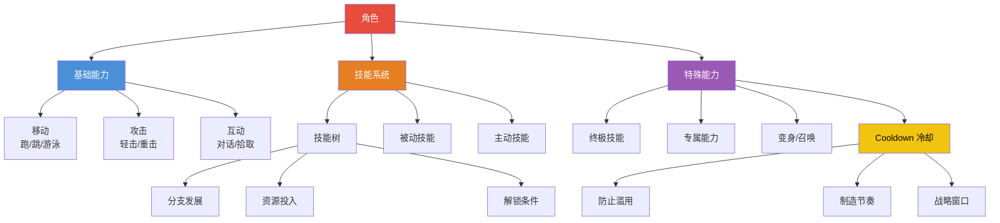
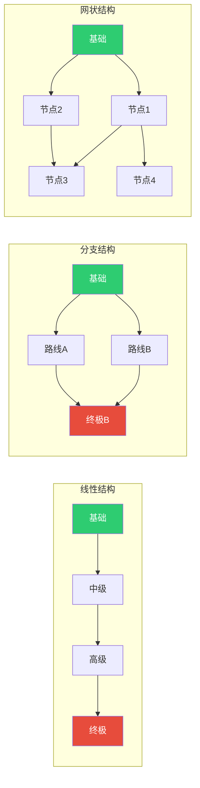
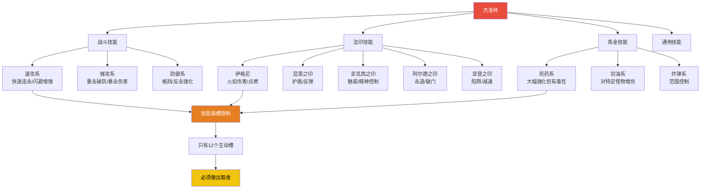

# 第05课：能力与技能系统

## Learning Objectives

- 理解能力（Ability）与技能（Skill）的概念边界
- 掌握技能树和职业系统的设计逻辑
- 理解冷却机制和能力平衡的设计原理
- 学会分析能力组合如何产生策略深度

## Core Idea

能力是"你能做什么"，技能是"你做得有多好"。能力系统定义了玩家在游戏世界中的**行动可能性边界**。学习一种新能力不是单纯的数值变化——它改变了玩家解决问题的**方式**。

> [!TIP] Key Insight
> 一个能力是否"有趣"，不取决于它的效果多华丽，而取决于它**创造了多少新的决策机会**。火球术如果只是"造成伤害"就无聊，但如果它还能点燃藤蔓、融化冰块、驱散毒雾——它就变得有趣了。

### Ability 与 Skill 的区别

| 维度 | Ability（能力） | Skill（技能） |
|------|----------------|--------------|
| **本质** | "能不能做" | "能做得怎么样" |
| **获得方式** | 通过学习/升级获得 | 通过练习/点数提升 |
| **变化方式** | 质变（获得新功能） | 量变（数值提升） |
| **示例** | 学会"二段跳" | "二段跳高度+20%" |
| **设计意图** | 扩展可能性 | 优化已有路径 |

### 技能树的拓扑结构

技能树的设计直接影响玩家的决策体验：

| 结构类型 | 特点 | 代表游戏 | 设计意图 |
|---------|------|---------|---------|
| **线性树** | 逐级解锁，路径固定 | 早期 RPG | 清晰的成长感，但缺少选择 |
| **分支树** | 关键节点决定路线 | 《巫师3》 | 有意义的选择，不同的 Build |
| **网状树** | 多路径可达同一节点 | 《最终幻想X》晶球盘 | 高自由度，鼓励探索 |
| **环形树** | 最终可点满所有 | 《女神异闻录5》 | 终极全能感，但缺少取舍 |

> [!NOTE] 职业系统 (Character Classes)
> 职业是预设的能力组合模板。它本质上是**设计者替玩家做了一部分选择**——减少决策疲劳的同时，确保了能力组合的内在协调性。职业的黄金标准是：**每个职业都有一件"只有我能做到"的事，且这件事在特定场景下不可替代。** 这就是为什么《魔兽世界》的设计团队始终坚持职业特色——如果战士能加血，那牧师的存在感就被消解了。

## Patterns in This Cluster

| 模式名称 | 定义 |
|---------|------|
| **Abilities（能力）** | 角色可执行的特殊动作或功能，扩展玩家的交互可能性 |
| **Skills（技能）** | 通过练习或点数投入获得的量化能力提升 |
| **Skill Trees（技能树）** | 技能的分支发展结构，玩家通过选择路径决定角色发展方向 |
| **Character Classes（职业）** | 预设的能力组合模板，提供风格各异的玩法框架 |
| **Upgrades（升级）** | 对已有能力进行数值或效果的提升 |
| **Special Abilities（特殊能力）** | 独特的强力能力，通常有使用限制，往往定义角色的核心价值 |
| **Cooldown（冷却）** | 能力使用后的强制等待时间，防止滥用并创造战略节奏 |

## Worked Example

### 《巫师3》的技能树与能力搭配

《巫师3》的技能树设计是"有意义的选择"的典范。它的核心巧思在于：**技能不是越多越好，而是搭配越巧妙越好**。

**技能系统的设计亮点：**

1. **技能插槽的硬约束**：玩家可以学习几十种技能，但只能激活 12 个（4 个技能组 × 每组 3 槽）。这个"学会但不一定能用"的设计迫使玩家做出真正的取舍——这是技能树的灵魂所在。

2. **技能之间的化学效应**：《巫师3》的技能不孤立。例如：
   - "速攻"技能 + "中毒"煎药 = 高速叠毒流
   - "昆恩之印反弹" + "炼金加血" = 坦克回复流
   - 这些组合不是系统明说的，而是玩家自己发现的——探索本身也是乐趣

3. **法印的多功能性**：五个法印各有独特功能，不只有战斗价值：
   - 伊格尼（火）→ 点燃敌人、烧毁障碍物
   - 亚克西（精神控制）→ 魅惑人形敌人、解锁对话选项
   - 阿尔德（冲击）→ 击退敌人、炸开被堵住的墙
   - 每个法印在战斗外都有实用性，让能力系统与探索系统深度耦合

4. **Cooldown 的节奏设计**：法印有极短的冷却（约 2-3 秒），但需要精力值。这个"短 CD + 资源限制"的组合让战斗中需要不断决策：是用法印还是留着精力翻滚？

> [!TIP] 冷却设计的三种哲学
> - **长 CD 强技能**（如大招 2 分钟 CD）→ 制造"决定性的时刻"
> - **短 CD 普通技能**（如 5 秒 CD）→ 构建"循环节奏"
> - **无 CD 但有消耗**（如耗蓝）→ 创造"资源管理"深度
> 三者可以共存，形成不同层次的决策频率。

## Practice

> [!QUESTION] 自我检测
> 1. "Ability（能力）"和"Skill（技能）"的核心区别是什么？
>
> 2. 技能树设计中，"分支结构"比"线性结构"好的地方在于：A) 更简单易懂 B) 玩家的选择更有意义 C) 更容易平衡 D) 需要的点数更少
>
> 3. 思考题：某动作游戏的技能系统中，玩家最终可以点满所有技能。玩家初期觉得选择很多，但后期所有人物都一样了。请分析问题并提出改进方案。

查看答案

1. **能力（Ability）决定玩家能不能做某件事**，是质变（学会二段跳）；**技能（Skill）决定玩家做这件事的效率和效果**，是量变（二段跳高度+20%）。能力扩展可能性边界，技能优化已有能力。

2. **B) 玩家的选择更有意义**——分支结构强迫玩家在两条路线之间做出不可逆（或代价很高）的选择，从而催生个性化的角色 Build。线性结构只是时间问题，不是选择问题。

3. **问题分析**：
   - 核心问题是"没有取舍"——既然最终什么都能学，前期的"选择"只是假象
   - 所有玩家最终 Build 趋同，缺乏角色个性和重玩价值
   **改进方案**：
   - **方案A（硬约束）**：设定等级上限，让玩家无法点满所有技能——每个选择意味着对其他选择的放弃
   - **方案B（互斥分支）**：在关键节点设计互斥分支（选 A 就不能选 B），如"火焰专精 vs 冰冻专精"
   - **方案C（切换成本）**：允许重置技能点，但重置成本递增——让改变方向有代价
   - **方案D（协同效应）**：增加隐藏的组合加成（特定技能搭配产生额外效果），引导玩家探索不同的组合路线

## Next Step

Continue with [[0006-progression-difficulty]] to understand how progression systems and difficulty curves shape the player's journey.