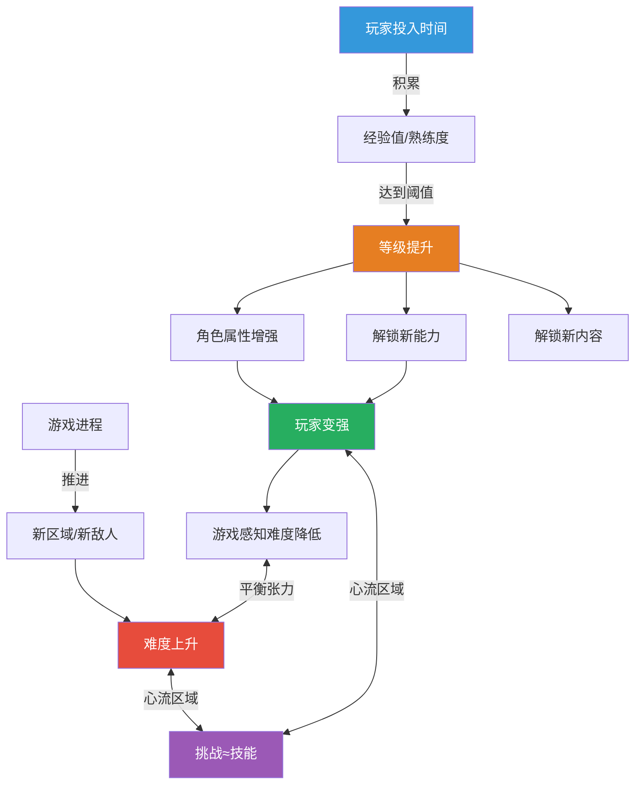
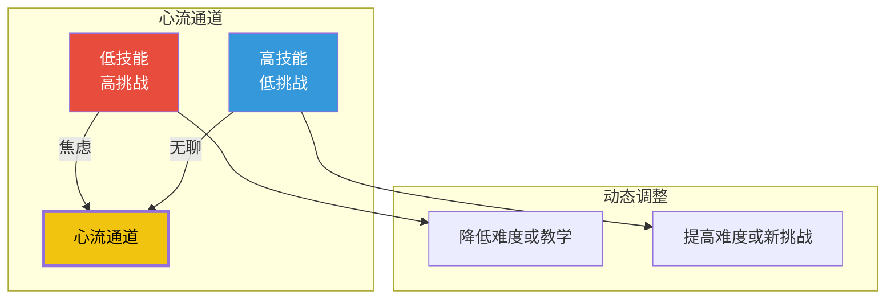
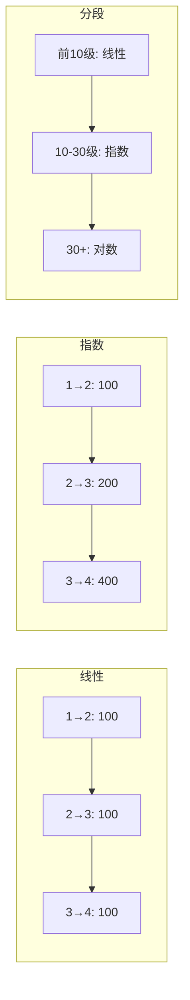
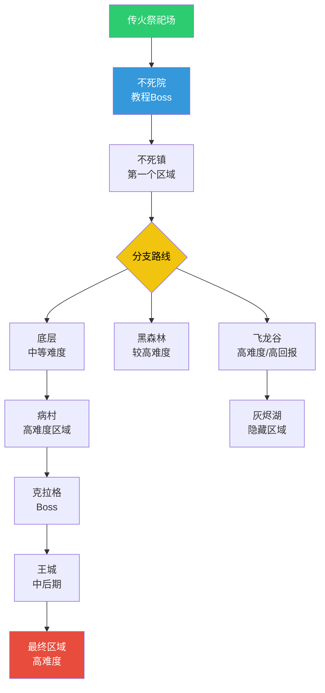

# 第06课：成长与难度曲线

## Learning Objectives

- 理解成长系统（Progression）的设计原理和类型
- 掌握经验值和等级系统的数学模型
- 理解难度曲线与心流（Flow）的关系
- 学会分析动态难度调整的优劣

## Core Idea

成长系统回答玩家一个根本问题：**"我在变强吗？"** 难度曲线则回答：**"挑战够劲吗？"** 两者的交汇点就是心流——挑战与技能的完美平衡状态。



> [!TIP] Key Insight
> 等级不是目的，**等级是确保玩家始终处于心流区域的调节工具**。当玩家变强导致挑战感下降时，等级系统引入新的挑战来重新拉高难度。好的成长系统让玩家永远觉得"再升一级就能打赢了"。

### 心流通道模型

心流理论由心理学家 Mihaly Csikszentmihalyi 提出，在游戏设计中是极其重要的框架：



| 状态 | 挑战 vs 技能 | 玩家感受 | 设计对策 |
|------|-------------|---------|---------|
| **心流** | 挑战 ≈ 技能 | 投入、专注、愉悦 | 维持节奏 |
| **焦虑** | 挑战 > 技能 | 挫折、想放弃 | 教学/降难度/给提示 |
| **无聊** | 技能 > 挑战 | 走神、想跳过 | 增加新敌人/新机制/提速 |
| **放松** | 技能略 > 挑战 | 舒适但可能失去兴趣 | 逐渐加码 |
| **控制** | 技能略 > 挑战，主动探索 | 掌控感、创造力 | 给自由度 |

### 难度曲线的数学模型

```mermaid
xychart-beta
    title ”经典的难度曲线设计”
    x-axis [”教程”, ”前期”, ”中期”, ”后期”, ”终局”]
    y-axis ”难度” 0 --> 100
    line [10, 30, 50, 75, 90]
    line [15, 35, 55, 70, 85]
```

> [!NOTE] 难度曲线的设计原则
> 好的难度曲线不是一条平滑的斜线，而是一系列"上升-平台期"的阶梯。每个平台期让玩家"熟悉新难度"，然后新的机制会打破这个平台，把玩家推向更高挑战。这就是为什么很多游戏每几关就会引入一种新敌人或新机制——它在"打扰"玩家的舒适区。

## Patterns in This Cluster

| 模式名称 | 定义 |
|---------|------|
| **Progression（成长/进程）** | 玩家随时间推移在能力、知识和可及内容上的系统性发展 |
| **Level（等级）** | 角色能力的量化阶段划分，是成长系统的核心度量单位 |
| **Experience Points（经验值）** | 量化玩家进步的主要数值工具，累积到阈值触发等级提升 |
| **Difficulty Curve（难度曲线）** | 挑战强度随游戏进程的变化设计，目标是维持心流 |
| **Dynamic Difficulty（动态难度）** | 根据玩家实时表现自动调整游戏难度的自适应系统 |
| **Flow（心流）** | 挑战与玩家技能达到精确平衡时的最佳体验状态 |
| **Learning Curve（学习曲线）** | 玩家掌握游戏规则和操作所需的时间和认知成本 |

### 经验值与等级的数学模型

| 模型 | 公式特征 | 效果 | 代表游戏 |
|------|---------|------|---------|
| **线性模型** | 每级所需 EXP 固定 | 升级速度恒定，容易被预测 | 早期街机游戏 |
| **指数模型** | 每级所需 EXP 按比例递增 | 前期升级快→成就感，后期慢→挑战性 | 《魔兽世界》 |
| **对数模型** | 每级所需 EXP 增幅递减 | 前期升级慢，后期趋同 | 某些手游 |
| **分段模型** | 不同阶段用不同公式 | 精准控制各阶段的节奏 | 大部分现代 RPG |



> [!WARNING] 动态难度的陷阱
> 动态难度调整看似完美——系统永远让挑战匹配玩家技能。但它的根本问题是：**如果难度永远匹配我的水平，我为什么还要变强？** 玩家在成长游戏中获得的成就感很大一部分来自于"我之前打不过的，现在我轻松过了"——这种"变强的证据"在完美动态难度下是不存在的。所以大部分游戏只在特定场景使用动态难度，而不是作为核心设计。

## Worked Example

### 《黑暗之魂》的难度曲线与成长系统

《黑暗之魂》被誉为难度设计的标杆。它的特别之处在于：**它从不妥协难度，却通过精妙的成长系统让几乎所有玩家都能通关。**



**难度曲线的精妙设计：**

1. **非线性路径的自由与后果**：到达传火祭祀场后，玩家有 3-4 条路可以选择走的。弱的敌人（墓地骷髅）和强的敌人（地下墓穴）并存——玩家通过"被打败"来判断"这里我该不该现在来"。**死亡本身就是难度指示器。**

2. **魂（Soul）作为经验值与货币的统一**：
   - 击杀敌人获得魂，魂既可以升级也可以买东西
   - 死亡后魂留在死亡地点，再死一次永久丢失
   - 这个设计的精妙之处：**魂既是成长资源又是风险载体**。"我身上有 10000 魂"和"我身上有 0 魂"的冒险行为是完全不同的——系统通过风险制造紧张感。

3. **不存在动态难度，但有隐形的"玩家控制难度"**：
   - 《黑暗之魂》的难度表面上是固定的，但玩家可以通过以下方式"自调节"难度：
     - 先去别的区域练级再来（提升等级）
     - 使用远程武器/魔法（改变战斗距离）
     - 召唤其他玩家协助（多人模式）
     - 看攻略了解 Boss 机制（信息获取）
   - 所以它的难度曲线实际上是**"硬关卡 + 软成长"**——敌人不变，但玩家可以持续变强。

4. **学习曲线 = 死亡曲线**：玩家的死亡次数本质上就是学习曲线的度量。每次死亡都教会玩家一件事——Boss 的攻击模式、陷阱的位置、敌人的弱点。**《黑魂》的学习不是通过"降低难度"，而是通过"增加知识"。**

```mermaid
xychart-beta
    title ”《黑暗之魂》的典型玩家心流轨迹”
    x-axis [”开始”, ”初见Boss”, ”死亡×5”, ”看破模式”, ”击败Boss”]
    y-axis ”紧张感/投入度” 0 --> 100
    line [50, 85, 95, 70, 30]
```

> [!TIP] "难"的三种含义
> - **操作难**：需要精确到帧的操控（《超级食肉男孩》）→ 练手
> - **策略难**：需要找到特定解法（《塞尔达》谜题）→ 动脑
> - **知识难**：需要了解机制和克制关系（《黑魂》）→ 学习
> 《黑暗之魂》主要是"知识难"——一旦你知道了，就不难了。这才是它"难但公平"的真相。

## Practice

> [!QUESTION] 自我检测
> 1. 心流状态的核心条件是什么？
>
> 2. 《黑暗之魂》中玩家带着大量魂探索新区域时会感到紧张。这种紧张感来自于哪个设计模式？A) 动态难度 B) 心流 C) 魂作为资源与经验值的统一 D) 学习曲线
>
> 3. 思考题：有一款 RPG 的玩家到 30 级后开始流失。数据分析发现：30 级的敌人刚好是 25 级玩家能应对的强度，但 30 级的玩家装备提升后战斗变得太简单。请从难度曲线和成长系统的角度分析问题并提出方案。

<details>
<summary>查看答案</summary>

1. **挑战与技能达到精确平衡**。具体来说：玩家感知到的挑战难度与玩家感知到的自身技能水平大致相等。挑战太高→焦虑，挑战太低→无聊，二者平衡→心流。

2. **C) 魂作为资源与经验值的统一**——魂既是成长资源（经验值）又是货币（购买力），死亡后魂留在尸体上，再死一次永久丢失。这种设计让"带着魂探索"变成了一种高风险决策，产生了紧张感。

3. **问题分析**：
   - 难度曲线在 30 级出现断裂——敌人的强度没有跟上玩家的成长速度
   - 成长系统产生了"溢出"——玩家在 25 级时体验最佳，但继续升级后战斗失去了挑战
   - 核心问题是：等级和装备的提升速度 > 难度曲线的增长速度
   **改进方案**：
   - **方案A（调难度曲线）**：30 级区域引入具有新机制的敌人（不单是数值增加），比如会躲避、会召唤援军、有特殊抗性
   - **方案B（调成长节奏）**：降低 25-30 级的升级速度，或者让 30 级后的升级带来更显著的能力提升（配合更难的敌人）
   - **方案C（加垂直维度）**：30 级后引入"转职"或"精通"系统，原有等级到顶但开启新的成长维度——不是更强，而是更多样
   - **方案D（动态内容解锁）**：在玩家达到 30 级时开启全新的挑战内容（如 30 级专属试炼、精英怪区域或隐藏 Boss），而非只是"同一种怪数值更高"

</details>

## Next Step

This concludes Phase 2 of the course. Review the previous lessons to solidify your understanding: [[0001-goals-obstacles]], [[0002-rewards-resources]], [[0003-feedback-loops]], [[0004-characters-avatars]], [[0005-abilities-skills]].