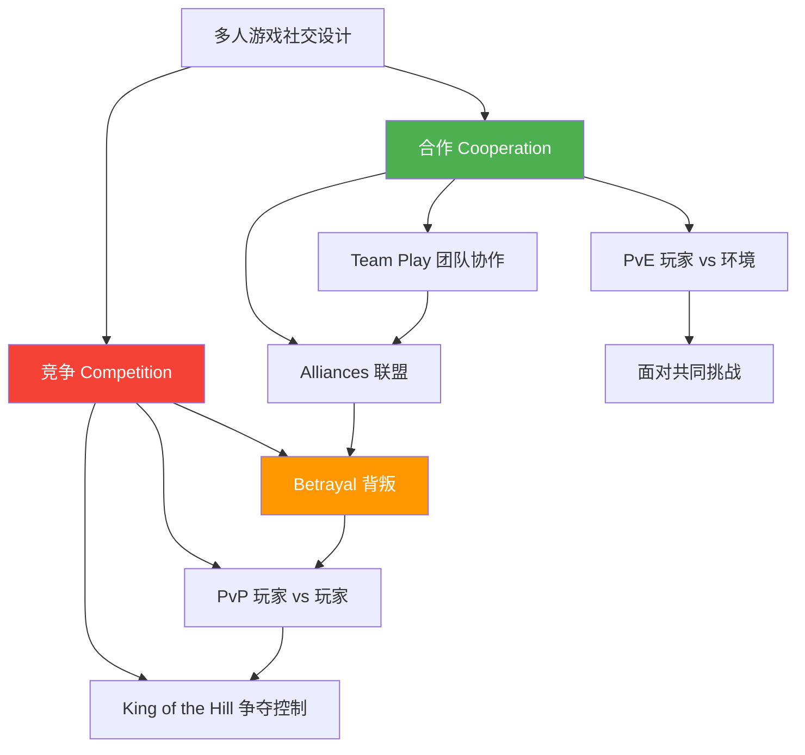
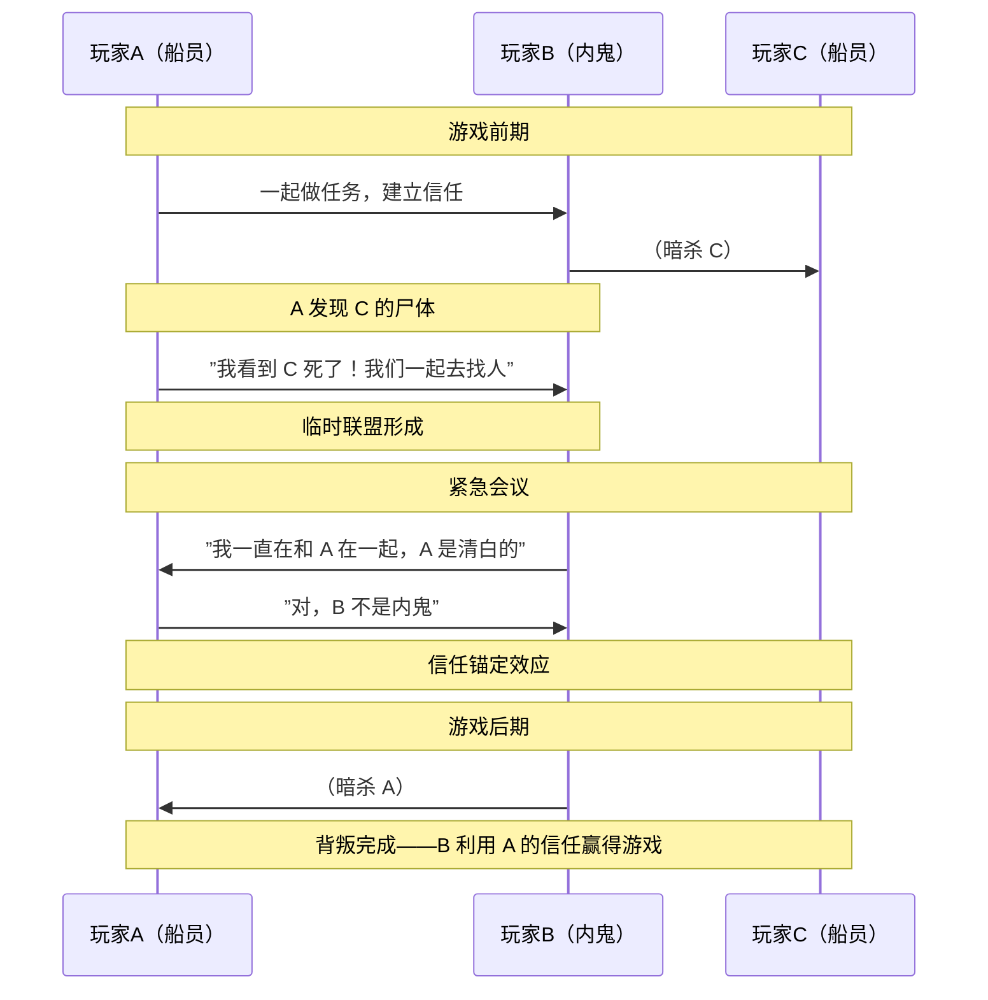
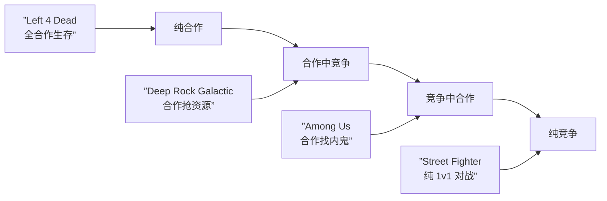

# 第07课：合作与竞争

## Learning Objectives

- 区分合作型与竞争型游戏设计，理解它们各自的动机来源
- 分析团队协作和玩家对抗在不同游戏中的实现方式
- 辨识联盟与背叛等动态社交关系的设计原理
- 评估社交张力（Social Tension）在多人游戏中的价值

## Core Idea

多人游戏的社交性可以归纳为一条基本轴线：**合作**与**竞争**。这两股力量并非互斥，大多数多人游戏同时在两个方向上做文章，创造出复杂的社交张力和策略深度。

> [!TIP] Key Insight
> 最好的社交设计往往**混合**合作与竞争。纯粹的合作为何容易变得单调？因为缺少张力。纯粹的竞争为何容易变得 toxic？因为缺少共情。当玩家**不得不依赖彼此，同时又不得不防备彼此**时，社交深度就真正产生了。

**博弈论视角**：从博弈论来看，合作游戏通常是**正和博弈**（大家一起做大蛋糕），竞争游戏是**零和博弈**（我赢你就输）。而"合作中带背叛"的设计（如 Among Us）则是**囚徒困境**的游戏化——个人利益与集体利益形成冲突。

## Patterns in This Cluster

| 模式 | 英文名 | 简短定义 |
|------|--------|----------|
| 合作 | Cooperation | 玩家共同行动以实现共同目标，所有参与者共赢 |
| 竞争 | Competition | 玩家争夺有限资源、排名或胜利条件，一方获利即他方受损 |
| 团队协作 | Team Play | 在团队框架下成员分工协同，整合不同能力达成团队目标 |
| 玩家对抗 | PvP (Player vs Player) | 玩家之间直接对抗，考验操作、策略和心理 |
| 玩家对环境 | PvE (Player vs Environment) | 玩家合作对抗游戏系统控制的敌人或挑战 |
| 联盟 | Alliances | 玩家之间临时或永久的合作契约，可以随时缔结或解除 |
| 背叛 | Betrayal | 破坏已有合作关系的设计，通过背弃承诺获取个人优势 |
| 山丘之王 | King of the Hill | 多个玩家或团队争夺并控制特定区域，控制权随时间动态变化 |

## Worked Example：《Among Us》中的合作与背叛

> [!WARNING]
> 以下内容包含对《Among Us》核心机制的解析，如果你尚未玩过且希望保持完全盲玩体验，请跳过本案例。

**基本信息**：《Among Us》（Innersloth, 2018）是一款 4-10 人的社交推理游戏，其中 1-3 人是隐藏的"内鬼"（Impostor），其余是"船员"（Crewmate）。

### 合作层：船员视角

- **PvE 合作**：船员需要合作完成任务（Tasks），通过修理飞船各系统来达成集体胜利目标
- **通信协作**：通过文字聊天、紧急会议（Emergency Meeting）分享信息，共同推理谁可能是内鬼
- **信息整合**：目击报告、任务进度跟踪、安全摄像头观察——每个玩家的观察拼成完整的推理图景

### 竞争层：内鬼视角

- **不对称 PvP**：内鬼的核心设计是"伪装中的对抗"——在看起来合作的同时破坏合作
- **直接竞争**：暗杀船员、破坏飞船系统（Oxygen / Reactor）、关闭灯光制造混乱
- **信息战**：利用谎言误导、嫁祸他人，在会议阶段操纵投票

### 联盟与背叛的动态

Among Us 最精彩的设计在于**联盟的不稳定性**：

1. **临时联盟形成**：两名玩家目击同一事件后自然形成"证人联盟"，相互背书
2. **联盟破裂**：当证据链出现矛盾，联盟成员可能怀疑对方就是内鬼，果断投票驱逐
3. **背叛的艺术**：内鬼的最佳策略往往是与某位船员建立信任关系，然后在关键时刻"杀掉"这位信任者，制造混乱
4. **最终阶段反转**：游戏后期仅剩 3-4 人时，联盟快速重组，背叛变得更加频繁，因为每一票都至关重要

> [!QUESTION] 思考
> Among Us 中"紧急会议"按钮（Emergency Meeting）的设计如何影响合作与竞争的平衡？如果每个玩家只能召开一次会议，社交动态会发生什么变化？

答案

紧急会议按钮的次数限制是关键设计决策。如果会议次数过少，船员的信息交换不足，内鬼占优；如果会议次数过多，船员可以用频繁会议无限核查 alibi，内鬼几乎无法取胜。当前设计（通常每人一次+尸体报告触发会议）创造了"有限的信息交换窗口"，迫使玩家在信息不完整的情况下做决策——这正是社交张力的来源。如果每人仅限一次会议，游戏会更加偏向内鬼，因为船员不敢轻易使用宝贵的会议机会。

## 总结：社交张力的光谱

从左到右，社交张力递增。设计师需要思考：我的游戏目标受众期望什么样的社交体验？

## Next Step

Continue with [[0008-communication-teams]] to learn about how communication systems and team structures enable multiplayer gameplay patterns.