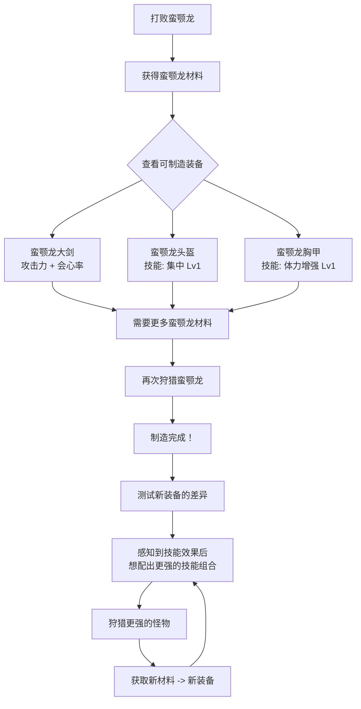

# 第11课：战斗与制造系统

## Learning Objectives

- 理解回合制战斗与实时战斗的核心设计差异及各自的适用场景
- 分析制造系统如何构建玩家驱动的"目标-资源-回报"循环
- 辨识伤害类型与武器/护甲系统的对抗关系
- 评估配方设计在制造系统中的指引作用

## Core Idea

战斗与制造是游戏系统模式中最重要的两个**核心循环**（Core Loop）。战斗提供即时反馈和挑战解决，制造提供延时满足和成长感。二者的结合创造了经典的"战斗→获取材料→制造更强装备→挑战更强敌人"升级循环。

```mermaid
graph TB
    subgraph ”战斗系统 Combat”
        TBC[回合制战斗<br/>Turn-based] --> STRAT[策略 Planning]
        RTC[实时战斗<br/>Real-time] --> REFLEX[反应 Reflex]
        TBC --> DMG[伤害计算]
        RTC --> DMG
    end

    subgraph ”装备系统 Equipment”
        WPN[武器 Weapons] --> DPS[伤害输出]
        ARM[护甲 Armor] --> DEF[防御能力]
        DT[伤害类型 Damage Types] --> ROCK_PAPER[相克关系]
    end

    subgraph ”制造系统 Crafting”
        RCP[配方 Recipes] --> GUIDE[引导制造方向]
        CRAFT[制造] --> GEAR[产出装备]
        GEAR --> POWER[提升战斗力]
        POWER --> CHALLENGE[挑战更强敌人]
        CHALLENGE --> LOOT[获取更好材料]
        LOOT --> CRAFT
    end

    DMG --> CHALLENGE
    GEAR --> WPN
    GEAR --> ARM

    style TBC fill:#2196F3,color:#fff
    style RTC fill:#f44336,color:#fff
    style CRAFT fill:#FF9800,color:#fff
    style RCP fill:#4CAF50,color:#fff
```

> [!TIP] Key Insight
> 回合制与实时制战斗的根本区别不是"快慢"，而是**决策空间的重心不同**。回合制将决策重心放在"选择做什么"（战术、资源管理、风险计算），实时制则将决策重心放在"何时以及如何在压力下执行"（时机、定位、反应）。**好的战斗系统在两者之间选择了适合其目标玩家的决策分配。**

### 回合制 vs 实时制：决策空间对比

| 维度 | 回合制战斗 | 实时战斗 |
|------|-----------|---------|
| 核心能力 | 策略规划、预测 | 反应速度、多任务处理 |
| 信息透明度 | 高（可以查看所有状态） | 低/中（动态变化中需要实时监控） |
| 压力来源 | 资源稀缺性、不可逆选择 | 时间压力、同时处理多维信息 |
| 学习曲线 | 逐步理解系统交互 | 基础操作 -> 肌肉记忆 -> 高阶策略 |
| 代表游戏 | 文明系列、神界原罪2 | 黑暗之魂、怪物猎人 |
| 多人协同 | 容易（无时间压力） | 困难（需要大量练习达成默契） |

## Patterns in This Cluster

| 模式 | 英文名 | 简短定义 |
|------|--------|----------|
| 战斗 | Combat | 玩家与敌人之间的冲突机制，是游戏核心挑战的重要来源 |
| 回合制战斗 | Turn-based Combat | 敌我轮流行动的战斗方式，强调策略规划和资源管理 |
| 实时战斗 | Real-time Combat | 所有角色同时行动的战斗方式，强调反应速度和操作精度 |
| 制造 | Crafting | 玩家通过组合原材料来制作新物品的系统 |
| 配方 | Recipes | 制造所需的材料组合和条件，指引玩家收集方向 |
| 武器 | Weapons | 玩家用于造成伤害的工具，通常有数值属性和特殊效果 |
| 护甲 | Armor | 减少或改变伤害承受的装备，提供防御属性和特殊抗性 |
| 伤害类型 | Damage Types | 按照不同机制分类的伤害形式（物理/魔法/元素等） |

## Worked Example：《怪物猎人》的武器系统与制造循环

《怪物猎人》系列（Capcom, 2004-）是战斗与制造系统结合的教科书级案例。其核心设计原则异常简洁：**"狩猎怪物 -> 取其材料 -> 制造装备 -> 狩猎更强的怪物"**。

### 14 种武器：同一次元中的完全不同的战斗

《怪物猎人》最令人惊叹的设计之一是**14 种武器类型各有完全不同的操作逻辑**：

| 武器类型 | 战斗风格 | 核心机制 | 决策重心 |
|---------|---------|---------|---------|
| 大剑（Great Sword） | 蓄力重击 | "收刀-走位-拔刀-蓄力-砍-收刀"循环 | 出刀时机的预判 |
| 太刀（Long Sword） | 连击气刃 | 气刃槽管理，见切反击 | 连续攻击中的资源管理 |
| 双剑（Dual Blades） | 高速乱舞 | 鬼人化，耐力管理 | 保持攻击密度与走位的平衡 |
| 狩猎笛（Hunting Horn） | 演奏支援 | 旋律系统，同时输出+Buff | 攻击节奏与乐曲管理的多线程 |

**核心设计原理**：每种武器通过**改变玩家的移动、攻击节奏和资源管理方式**来创造截然不同的"战斗韵律"。这好比同一款格斗游戏里有 14 个操作完全不同的角色——而它们居然在同一个 PvE 系统中完美平衡。

### 制造循环的"拉力"设计

《怪物猎人》的制造系统不是简单的收集材料——它通过**装备技能系统**创造了持续的"拉力"：



这个循环的驱动力来自：

1. **视觉驱动**：在制造界面预览新武器的造型，提供外观上的"想要"
2. **技能驱动**：装备附带的技能（如"集中"减少蓄力时间）创造可感知的战斗效率提升
3. **套装驱动**：装备同一怪物的多件装备可触发套装技能，鼓励全套制造
4. **升级驱动**：武器沿树状路线升级，制造完成后还有新的分支等待探索

### 伤害类型的对抗设计

《怪物猎人》的伤害类型设计遵循**部位破坏**的逻辑：

- **斩击**（Severing）：切割尾巴、破坏可切断的部位
- **打击**（Blunt）：击晕头部、破坏硬壳部位  
- **弹药**（Ammo）：远程攻击、特定弹种引发异常状态
- **属性伤害**（Elemental）：火/水/雷/冰/龙，针对不同怪物弱点

玩家需要针对不同怪物**调整装备和战术**，这一"研究-准备-执行"的循环本身就是游戏的重要内容。

> [!QUESTION] 自我检测
> 《怪物猎人》中，一个玩家使用大剑，另一个使用狩猎笛。虽然他们面对的是同一个怪物，但体验完全不同。从设计模式的角度看，这体现了什么设计原则？

> A. 难度曲线设计
> B. 武器作为"战斗模式切换器"——同一套核心系统支持多种交互模式
> C. 角色扮演要素
> D. 竞技平衡性设计

<details>
<summary>查看答案</summary>
B。虽然《怪物猎人》只有一套战斗系统（实时战斗+部位破坏+伤害计算），但它通过 14 种武器类型创造了 14 种不同的"战斗模式"。每种武器的操作逻辑、决策重心和节奏完全不同。这是一种**系统复用下的体验多样化**设计模式——不创建多个战斗系统，而是创建多个"交互界面"共享同一核心系统。这种设计的好处是：维护成本低（核心系统只有一个）、学习迁移成本高（换武器相当于玩新游戏但有基础铺垫）、内容深度高（玩家可探索所有武器）。
</details>

## 总结

战斗系统提供游戏的核心挑战体验，制造系统提供持续的目标感和成长满足。二者的衔接——"战斗获取材料→制造升级装备"——构成了无数游戏的核心循环。最好的战斗与制造设计，不是在各个维度做出最"平衡"的系统，而是创造**让玩家产生"如果我能拿到那个材料做那个装备，我就能挑战那个怪物"的欲望链条**。

## Next Step

Continue with [[0012-economy-level]] to learn about game economy systems and level design.