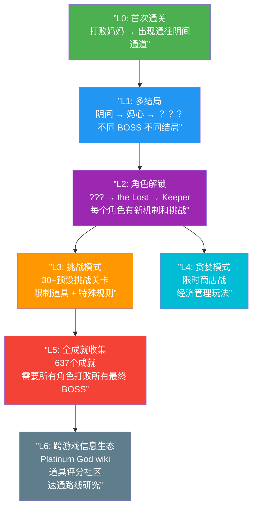

# 第13课：元游戏与成就系统

## Learning Objectives

- 理解元游戏（Metagame）的概念——"关于游戏的游戏"
- 分析成就/奖杯系统如何转化为玩家的行为引导工具
- 评估排行榜、速通、New Game+ 等模式对游戏重玩价值的影响
- 认识模组系统如何将玩家从"消费者"转变为"共创者"

## Core Idea

如果核心游戏（Core Game）是"你玩的游戏"，那么**元游戏（Metagame）就是"围绕这个游戏展开的更高一层的游戏"**。元游戏不改变核心玩法本身，但它通过叠加新目标、新规则和新视角，让玩家在已经熟悉的内容中找到新的乐趣。这是游戏长期留存的关键设计维度。

```mermaid
graph TB
    subgraph ”元游戏层 Metagame Layer”
        AC[成就系统<br/>Achievements]
        LB[排行榜<br/>Leaderboards]
        NG[新游戏+<br/>New Game+]
        ME[多结局<br/>Multiple Endings]
        SP[速通<br/>Speedrunning]
        MOD[模组<br/>Modding]
        COLL[收集品<br/>Collectibles]
        TGI[跨游戏信息<br/>Trans-Game Info]
    end

    subgraph ”核心游戏层 Core Game”
        PLAY[核心玩法循环<br/>Combat / Exploration / Puzzle]
    end

    subgraph ”玩家驱动力”
        COMP[完成主义<br/>Completionism]
        MAST[精通 Mastery]
        CREAT[创造 Creativity]
        SOCIAL[社交展示<br/>Social Display]
    end

    AC --> COMP
    LB --> SOCIAL
    LB --> MAST
    NG --> MAST
    ME --> COMP
    SP --> MAST
    MOD --> CREAT
    COLL --> COMP
    TGI --> SOCIAL
    TGI --> MAST

    PLAY --- AC
    PLAY --- LB
    PLAY --- NG
    PLAY --- ME
    PLAY --- SP
    PLAY --- MOD
    PLAY --- COLL
    PLAY --- TGI

    style PLAY fill:#2196F3,color:#fff
    style AC fill:#4CAF50,color:#fff
    style MOD fill:#FF9800,color:#fff
    style SP fill:#f44336,color:#fff
```

> [!TIP] Key Insight
> 元游戏的核心设计原则可以总结为一句话：**"让玩家在相同的核心内容上找到不同的游戏方式"**。成就系统把"通关"变成"收集"，速通把"探索"变成"竞速"，New Game+把"冒险"变成"碾压"，模组把"游玩"变成"创作"。每种元游戏机制本质上是在重新定义"赢"的含义——当玩家已经赢过一次核心游戏时，元游戏告诉他们还有另一种"赢法"。

### 元游戏类型的分类

| 类型 | 核心诉求 | 对核心游戏的影响 | 例子 |
|------|---------|----------------|------|
| 完成主义（成就/收集） | "我要拥有全部" | 引导玩家尝试不熟悉的玩法分支 | 全成就解锁需要玩所有武器/路线 |
| 精通主义（排行榜/速通） | "我是最好的" | 推动玩家探索核心系统的极限 | 速通者利用游戏机制 bug 优化路线 |
| 创作主义（模组/编辑器） | "我要做自己的" | 通过社区内容无限延展游戏寿命 | 老滚5的模组生态 |
| 重玩主义（New Game+/多结局） | "我错过了什么" | 让玩家在同一内容看到不同侧面 | 尼尔自动人形的周目系统 |

## Patterns in This Cluster

| 模式 | 英文名 | 简短定义 |
|------|--------|----------|
| 元游戏 | Metagame | 超越核心游戏系统的上层设计，为已熟悉内容的玩家提供新目标和新规则 |
| 成就 | Achievements | 针对特定完成条件的记录系统，追踪和表彰玩家的特殊行为 |
| 奖杯/徽章 | Trophies/Badges | 成就的视觉化层级呈现（如青铜/白银/黄金/白金），提供等级感知 |
| 排行榜 | Leaderboards | 按特定指标对玩家进行排序比较的公共排名系统 |
| 速通 | Speedrunning | 以最快速度完成游戏或特定关卡为目标的重玩模式 |
| 新游戏+ | New Game+ | 继承玩家进度和能力后重新开始游戏，提供更高难度或新内容 |
| 多结局 | Multiple Endings | 基于玩家在游戏中的选择和行为产生不同结局的设计 |
| 收集品 | Collectibles | 散布在游戏地图中的可收集元素，驱动探索和完成主义动机 |
| 跨游戏信息 | Trans-Game Info | 游戏外的 wiki、攻略、数据挖掘等信息生态，影响玩家对游戏的理解和决策 |
| 模组 | Modding | 玩家使用官方或非官方工具修改和扩展游戏内容的能力 |

## Worked Example：《以撒的结合》的元游戏层与多结局设计

《以撒的结合》（Edmund McMillen, 2011）及其重制版《重生》（2014）是元游戏设计的极端案例——它的每一个层面都堆叠了多层元游戏系统。

### 核心游戏：极简的 Rogue-lite

表面上，这是一个俯视角动作游戏，操作简单：移动+射击，每次随机生成地图和道具。核心循环是：
1. 进入随机生成的楼层 → 2. 探索房间、获取道具 → 3. 打败 BOSS → 4. 进入下一层 → 5. 最终打败"妈妈/妈心/撒旦/？？？"→ 结束一轮

### 元游戏层的分层堆叠

《以撒》的元游戏设计堪称**"分层洋葱模型"**——每次玩家以为"打通了"，游戏打开一个新层：



### 多结局的设计哲学

《以撒》的多结局不是简单的"选 A 或选 B"——它是一整套**渐进式揭示系统**：

| 阶段 | 击败 BOSS | 解锁内容 | 设计目的 |
|------|-----------|---------|---------|
| 第一次通关 | 妈妈 | 出现阴间层入口 | 让玩家知道游戏"不止于此" |
| 中期 | 妈心 10次 | ？？？层，新 BOSS | 给重复游戏以阶段性目标 |
| 后期 | 撒旦/？？？ | 更难的 BOSS 变种 | 提供精通挑战 |
| 终极 | 全 BOSS 全角色 | 真结局 | 完成主义的最终承认 |

**关键设计原理**：每一次新结局的解锁，不仅是一个叙事节点，也是**游戏机制的扩展**——新角色出现、新模式解锁、新道具加入掉落池。这意味着玩家每打出一个新结局，"核心游戏"也在发生实际变化。这解决了元游戏设计的核心难题：**如何让玩家愿意重复玩已经通关的内容**——《以撒》的回答是：每次通关后，游戏本身变得更丰富。

### 收藏品与跨游戏信息

《以撒》的收集系统是游戏史上最大的之一：

- **道具图鉴**：700+ 道具，每次拾取后获得图鉴条目
- **怪物图鉴**：200+ 敌人，击败后解锁
- **成就系统**：游戏内 637 个成就 + Steam 成就双重追踪
- **秘密系统**：特殊房间、隐藏角色、解谜彩蛋

> [!WARNING]
> 《以撒》的设计也暴露了元游戏的潜在问题：**内容焦虑**。当一个游戏有 637 个成就和 700 多个道具时，玩家可能感到的不是"有很多事可以做"，而是"我永远无法完成"。设计者需要在"足够的重玩价值"和"过度的内容负担"之间找到平衡。《以撒》的选择是：让成就在后台自然追踪，不强制要求全收集，且核心体验在第一次通关时就已完整。

### 模组生态

《以撒：重生》发布后，模组社区迅速发展：

- 新角色模组、新道具模组、新 BOSS 模组
- 视觉重制包、游戏改进 Mod（如"External Item Descriptions"显示道具效果）
- 完整的自定章节（Antibirth/Repentance 等大型模组被官方吸纳为 DLC）

模组系统的元游戏价值在于：**当玩家耗尽了官方内容，社区创造的近乎无限的新内容接续了游戏寿命**。《以撒》自 2011 年发售至今仍保持活跃，模组生态功不可没。

> [!QUESTION] 自我检测
> 《以撒的结合》中，玩家需要击败"妈心"（Mom's Heart）11 次才能打开通往"？？？"（Sheol）的道路。从元游戏设计的角度看，这种重复要求的目的是什么？

> A. 增加游戏时长，掩盖内容不足
> B. 通过渐进式解锁机制给重复游戏赋予阶段性目标，将"无聊的重复"转化为"有意义的进度"
> C. 测试玩家的耐心
> D. 开发者忘记设计更短的解锁路径

<details>
<summary>查看答案</summary>
B。这是元游戏设计中**渐进式解锁**的典型案例。如果所有的内容和结局一开始就开放，玩家可能体验一次就流失。11 次挑战妈心并不是在"浪费时间"——每次挑战都可能因随机道具组合而产生不同的体验，而"第 X/11 次"的进度标记让每次失败或成功都有意义。这个机制巧妙地将"重复"转化为"推进"：玩家心理上不是在"做同样的事"，而是在"逐渐接近下一层的入口"。这是元游戏解决"如何延长游戏寿命"的核心手段——**不创造更多内容，而是创造更多发现现有内容的理由**。
</details>

## 总结

元游戏是"游戏之上的游戏"——它不改变核心玩法，但通过叠加新目标、新规则和新视角，让玩家在已经熟悉的内容中持续获得新鲜感。成就系统引导玩家探索常规路线之外的玩法，排行榜和速通将游戏变为竞技场，New Game+让玩家带着新的力量回顾过去，模组则把玩家从消费者变成创作者。

**元游戏设计的最终挑战不是"加多少内容"，而是"如何让玩家想在同一个世界里继续玩下去"**。最好的元游戏不是清单式的"去做 100 件事"，而是不断告诉玩家"还有你还没见过的风景"。

## Next Step

恭喜你完成了 Gameplay Design Patterns 全部 13 课的学习！回顾整个课程，你从核心游戏机制（Phase 1-2）出发，理解了社交设计（Phase 3）和叙事设计（Phase 4），再到系统设计（Phase 5）和元游戏设计（Phase 6）。现在你已经拥有了分析任何游戏设计的能力——**下次拿起一个游戏时，试着问自己：这个游戏用了哪些设计模式？它们为什么这样组合？如果换一种组合会怎样？**