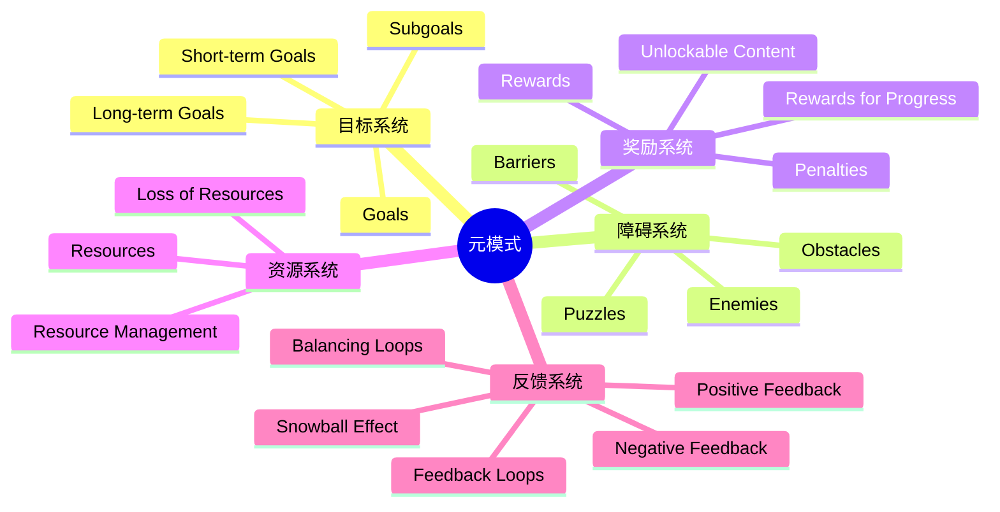
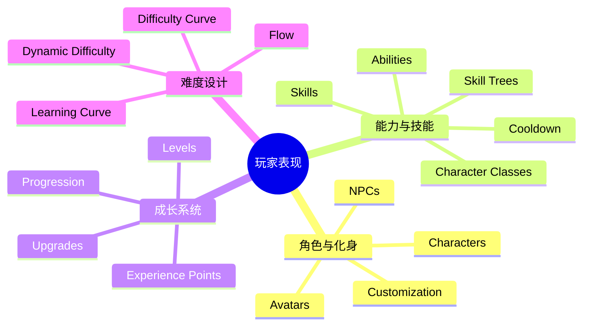

# 游戏设计模式术语表

> 基于 Gameplay Design Patterns (GDP3) v3 百科体系整理。

## 按字母排列

| 术语 | 英文 | 定义 |
|------|------|------|
| 成就 | Achievement | 记录玩家完成特定条件的元游戏机制 |
| 能力 | Ability | 角色可执行的特殊动作或效果 |
| 盟友 | Ally | 帮助玩家的友好代理，通常由AI控制 |
| 化身 | Avatar | 玩家在游戏世界中的具身代表 |
| 平衡 | Balance | 游戏系统各部分之间的公平与协调状态 |
| 屏障 | Barrier | 限制通行的物理或逻辑障碍 |
| 背叛 | Betrayal | 破坏合作关系的玩家行为 |
| 构建 | Build | 游戏系统要求玩家对物体、关卡或内容的自主组装 |
| 制造 | Crafting | 从原材料制作新物品的系统 |
| 角色 | Character | 游戏中具有人格设定和背景的实体 |
| 职业 | Class | 预设的能力组合模板 |
| 冷却 | Cooldown | 限制能力使用频率的时间机制 |
| 合作 | Cooperation | 玩家共同行动以实现共同目标 |
| 竞争 | Competition | 玩家争夺有限资源或排名 |
| 自定义 | Customization | 玩家个性化游戏元素的能力 |
| 关卡设计 | Level Design | 游戏空间的布局与挑战编排 |
| 对话树 | Dialog Tree | 分支对话结构，玩家选择影响对话走向 |
| 难度曲线 | Difficulty Curve | 挑战强度随时间的设计变化 |
| 动态难度 | Dynamic Difficulty | 根据玩家表现自动调整难度 |
| 经济 | Economy | 游戏内资源的生产、分配与消费系统 |
| 敌人 | Enemy | 具有敌对意图的AI控制角色 |
| 环境叙事 | Environmental Storytelling | 通过场景布局、物品放置等讲述故事 |
| 经验值 | EXP / XP | 量化玩家进步的主要数值 |
| 阵营 | Faction | 基于立场或利益的大规模分组 |
| 反馈循环 | Feedback Loop | 系统输出影响后续输入的自循环机制 |
| 心流 | Flow | 挑战与技能平衡时的最佳体验状态 |
| 目标 | Goal | 玩家在游戏中努力追求的结果 |
| 游戏经济 | Game Economy | 游戏中资源和货币的生产与消耗系统 |
| 物品 | Item | 玩家可获取、持有和使用的游戏元素 |
| 排行榜 | Leaderboard | 玩家间比较排名的元游戏机制 |
| 等级 | Level | 角色能力的量化阶段 |
| 关卡布局 | Level Layout | 关卡的空间结构与路径设计 |
| 模组 | Modding | 玩家修改游戏内容的能力 |
| 叙事 | Narration | 游戏传递故事信息的方式 |
| 负反馈 | Negative Feedback | 帮助劣势方追赶的平衡机制 |
| 障碍 | Obstacle | 阻止玩家达成目标的设计元素 |
| 惩罚 | Penalty | 失败或错误决策带来的负面后果 |
| 玩家角色 | Player Character | 玩家直接控制的角色 |
| 正反馈 | Positive Feedback | 放大优势方优势的机制 |
| 进度 | Progression | 玩家随时间推移的发展体验 |
| 谜题 | Puzzle | 需要思考和分析才能通过的障碍 |
| 任务 | Quest | 游戏赋予玩家的结构化目标序列 |
| 资源 | Resource | 玩家可用于达成目标的资产 |
| 奖励 | Reward | 玩家达成目标后获得的回报 |
| 技能树 | Skill Tree | 技能分支发展结构 |
| 技能 | Skill | 通过练习获得的能力提升 |
| 滚雪球效应 | Snowball Effect | 微小优势被正反馈持续放大的现象 |
| 故事讲述 | Storytelling | 游戏向玩家传递叙事的方法 |
| 子目标 | Subgoal | 大目标分解后的小步骤 |
| 团队 | Team | 为共同目标而组织的玩家群体 |
| 跨游戏信息 | Trans-Game Info | 超越单次游戏会话的信息传递 |
| 可解锁内容 | Unlockable Content | 通过达成条件解锁的新内容 |
| 升级 | Upgrade | 能力数值或效果的提升 |
| 武器 | Weapon | 用于战斗的工具或装备 |
| 元游戏 | Meta Game | 超越主要游戏系统的上层设计框架 |

## 按阶段分类

### Phase 1: 元模式

### Phase 2: 玩家表现

### Phase 3-6 核心术语

| 社交模式 | 叙事模式 | 系统模式 | 元游戏模式 |
|---------|---------|---------|-----------|
| Cooperation | Quests | Combat | Achievements |
| Competition | Storytelling | Crafting | Leaderboards |
| Team Play | Cutscenes | Game Economy | New Game+ |
| Communication | Dialog Trees | Level Design | Multiple Endings |
| Factions | Environmental Storytelling | Resources | Modding |
| Alliances | Narrative Structures | Weapons | Collectibles |
| Betrayal | Backstory | Armor | Speedrunning |
| Roles | Flavor Text | Checkpoints | Meta Games |