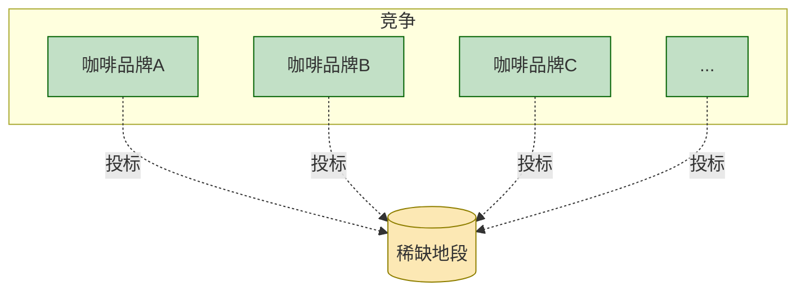

## 读《卧底经济学1》

### 第1次：序言 + 第1、2章——咖啡、超市与价格的秘密

序言部分是从买一杯咖啡谁赚钱开始，又用书店举例，买书涉及流程也很长，强调这是一个复杂的系统，经济学家解释这个系统是如何运行，不光从身边小事，也会讲一些宏观大事（中国如果每月让百万人脱贫）

开头从一杯繁华位置的咖啡店说起，成本不到一美元的咖啡，卖2.55美元，下意识以为是咖啡店的人赚了大部分的钱，但实际上是房东，因为几家店租房，不如一家店出高价垄断，如果报价太低，留下来的潜在利润大，其他咖啡店就会出高价抢走，这样留给咖啡店的利润变少，房东拿到了最大的收益

草甸和移民

李嘉图提出的理论：还价能力来自稀缺性

很多地主，但只有一位农户，地主还价能力就很低，最后只能以较便宜价格给农户，但新来一个农户愿意出更高价，会对之前的定价有影响，然而现实是更复杂的，因为要考虑之前签订的合同，道德观念，不一定要过来当农户

所以有时候看到价格高要从稀缺的角度来看问题

“边际”土地至关重要

草甸土地的租金总是等于两种土地的粮食产出之间的差额：一种是草甸土地，另一种是新农夫能够免费得到的土地。经济学家称后一种土地为“边际”土地

没有绝对的价值，一切都相对于边际土地发生变化。

从草甸回到咖啡屋

有两个因素决定了重要位置（如草甸）的地租：草甸与边际土地 [^1] 的农产品产出的差额，还有农产品本身的重要性。

意思就是要有利润且根据农产品的重要性决定利润的大小才决定下来租金数量

李嘉图的模型存在局限，不适合扩大

在理解某种事物时，如果不关注某些特定方面以降低其复杂性，就不可能真正理解这种事物。经济学家要关注的方面很多，稀缺就是其中之一。

“可持续竞争优势”，意指那种能够压倒竞争对手、常年产生利润的优势。

### 第2次：第3、4章——完美市场与交通拥堵的经济学

### 第3次：第5、6章——内幕交易与看似疯狂的理性

### 第4次：第7、8章——价值与贫困国家的困境

### 第5次：第9、10章——全球化、贸易与中国的发展

## 读《卧底经济学4》

### 第6次：序言 + 第1、2章——经济使用指南与保姆合作社的衰退

### 第7次：第3、4章——货币本质与适度通胀

### 第8次：第5、6章——刺激政策与战俘营的经济衰退

### 第9次：第7、8章——产出缺口与失业的经济逻辑

### 第10次：第9、10章——企业管理与宏观经济学的“塞壬”

### 第11次：第11、12章——GDP崇拜与幸福经济学

### 第12次：第13–15章——经济增长的可持续性、不平等与宏观经济学的未来

[^1]: 指的是最贫瘠的土地，但仍然被用于耕作，其产出刚好覆盖生产成本（如种子、劳动力等），因此在这块土地上耕种没有经济利润（即地租为零）
