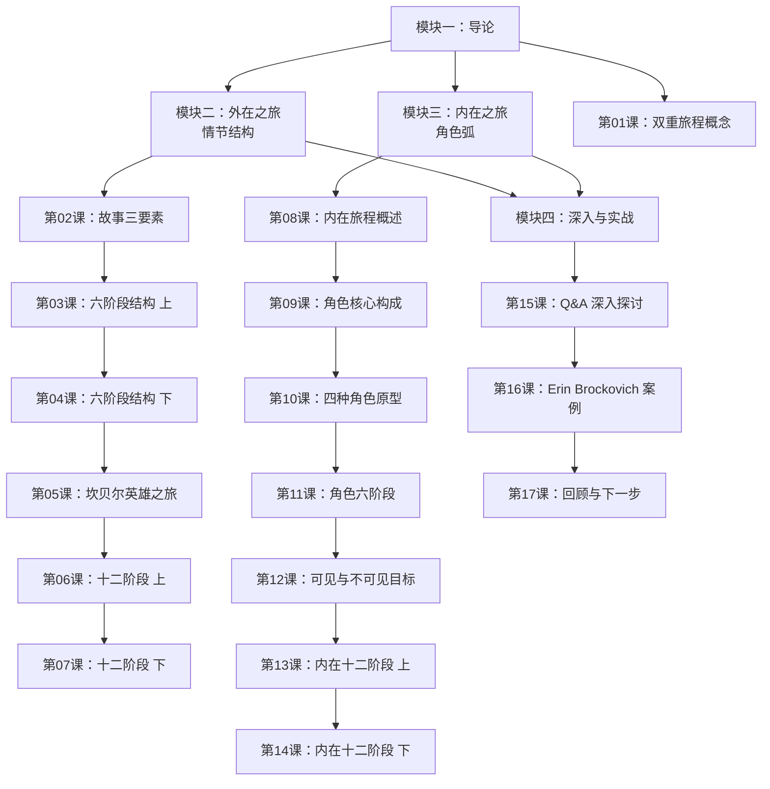

# 课程地图

## 先修关系

- 第01课是所有课的前置
- 第02-07课为情节结构线，建议顺序学习
- 第08-14课为角色弧线，建议在第02-07课之后或并行学习
- 第15-17课依赖前面的所有知识

## 参考文档

- [[reference/glossary|术语表]] — 随时查阅，贯穿全课程
- [[reference/cheatsheet|六阶段+十二阶段速查表]] — 写作时的快速参考
- [[reference/podcast-insights|播客精华]] — 两位导师的深入见解