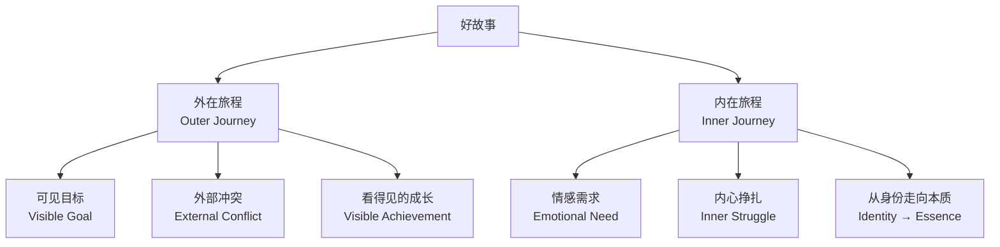
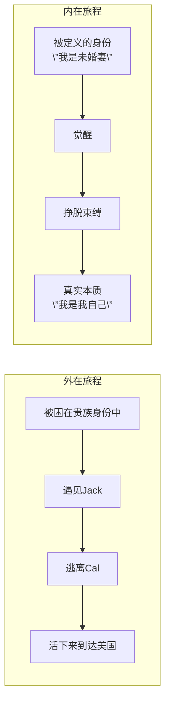

# 第01课：什么是英雄的双重旅程？

> 每个好故事都有两个层次——一个看得见，一个看不见。这一课将为你揭示这个秘密。

---

## 两位导师：珠联璧合

这门课程由好莱坞两位顶尖的故事大师联手打造：

| 导师 | 专长 | 核心理念 |
|------|------|----------|
| **Michael Hauge** | 外在旅程（Outer Journey） | 故事是英雄追求一个**可见目标**的过程 |
| **Chris Vogler** | 内在旅程（Inner Journey） | 故事是角色从**身份**走向**本质**的蜕变 |

> [!NOTE] 关于Chris Vogler
> Chris Vogler 是迪士尼的故事顾问，他的著作《作家之旅》（*The Writer's Journey*）基于约瑟夫·坎贝尔的"千面英雄"理论，是好莱坞编剧的必读书目。

> [!NOTE] 关于Michael Hauge
> Michael Hauge 是好莱坞顶级剧本顾问，服务过哥伦比亚、华纳兄弟等大制片厂，擅长从情感层面拆解故事结构。

---

## 核心概念：双重旅程

一个让人无法抗拒的故事，永远在同时讲述**两个故事**：

### 外在旅程（Outer Journey）

外在旅程是**观众能看到的那条线**。

- 英雄有一个**清晰可见的目标**
- 路上有**具体的障碍和对手**
- 最终取得成功或失败——**观众看得见结果**

> 简单说：外在旅程回答**"英雄要做什么？"**

### 内在旅程（Inner Journey）

内在旅程是**观众能感受到的那条线**。

- 英雄有一个**情感上的缺失或创伤**
- 故事的推进迫使他**面对自己**
- 最终从"被定义的身份"走向"真实的本质"

> 简单说：内在旅程回答**"英雄要成为谁？"**

---

## 案例拆解：《泰坦尼克号》

这是两位导师在全课程中反复使用的贯穿案例。

| 维度 | 内容 |
|------|------|
| **外在目标** | Rose 想要逃离未婚夫Cal，赢得Jack的爱，去美国开始新生活 |
| **外在冲突** | 冰山、沉船、Cal的阻挠、阶级差异 |
| **内在需求** | Rose 被禁锢在"贵族未婚妻"的身份里，内心渴望做真实的自己 |
| **内在转变** | 从"被定义的女人" → "为自己而活的人" |

> [!TIP] 为什么双重旅程如此重要？
> 单一的外在旅程会让人觉得**只是任务清单**。单一的内在旅程会让人觉得**空洞说教**。只有两者结合，观众才会既**为英雄加油**，又**被故事打动**。

---

## 这节课的承诺

这门课程要教你的是**两套完整的工具**：

1. 一套工具用来**构建外在旅程**——六阶段情节结构、可见目标、冲突升级
2. 另一套工具用来**构建内在旅程**——身份与本质、情感需求、角色弧线

当你掌握了这两套工具，你就能写出**既扣人心弦又深入人心**的故事。

---

## 自测题

> [!QUESTION] 为什么Rose的故事不能只有"逃离沉船"这个层面？
> 

> 
点击查看答案

>
> 如果只有逃离沉船，Rose就只是一个被动获救的遇难者。正是因为她同时经历了内在转变——从一个被社会定义的贵族女性，变成敢于为爱情和自由抗争的人——观众才会在片尾看到她活得精彩时热泪盈眶。**外在事件给了故事张力，内在转变给了故事意义。**
> 

> [!QUESTION] 请判断以下描述属于外在旅程还是内在旅程：
> "英雄必须找回被盗的圣物"
> 

> 
点击查看答案

>
> **外在旅程。** 这是一个可见目标——找回圣物。观众可以清楚地看到英雄是否成功。如果故事只到这一步，它就是一个冒险动作片。加上内在旅程（比如英雄从自私变得无私），它才会成为一个令人难忘的故事。
> 

---

## 应用作业

1. **选一部你最喜欢的电影**，分别写出主人公的（a）外在目标和（b）内在需求
2. **观察你的作业**：如果去掉内在旅程，故事还剩什么？如果去掉外在旅程呢？
3. **带着这个框架去看一部新电影**，在观看过程中随时暂停，记录主人公的双重旅程分别在哪个阶段

---

## 课程导航

- **下一课：** [[0002-story-elements|第02课：故事核心三要素]]
- **术语表：** [[reference/glossary|术语表]]