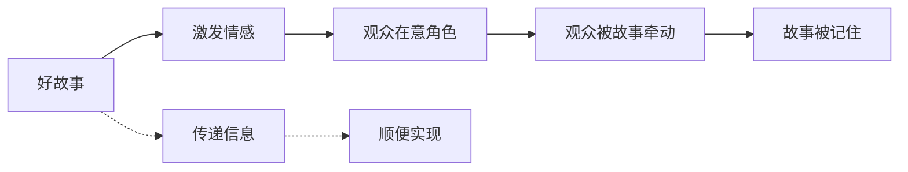
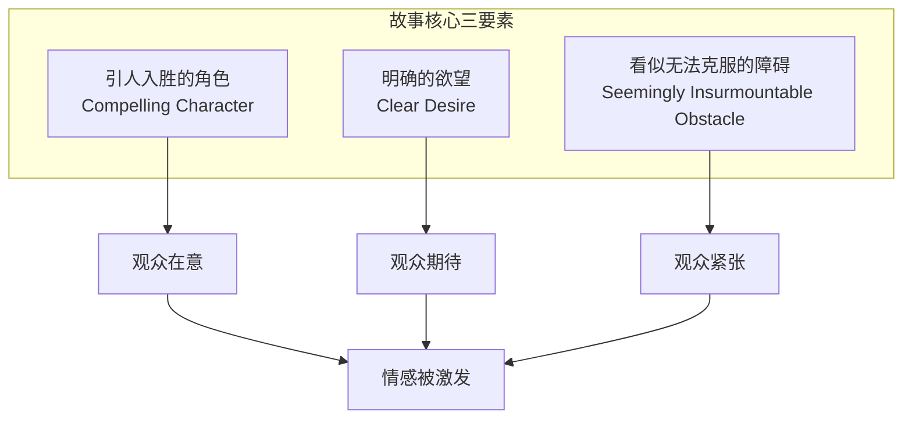
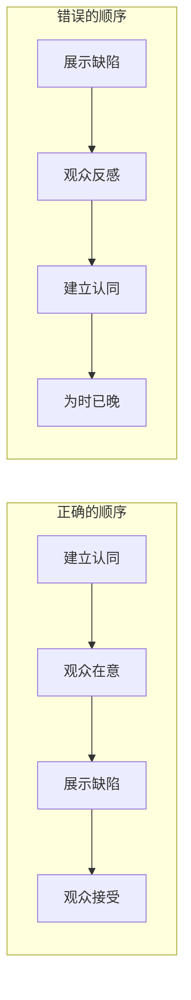

# 第02课：故事核心三要素

> 在动笔之前，你必须理解故事存在的唯一理由——以及构筑故事的三根支柱。

---

## 故事的根本目标：激发情感

Chris Vogler 在课程中反复强调一个核心观点：

> [!IMPORTANT] 故事不是为了传递信息
> 故事不是为了传递信息，不是为了讲道理，也不是为了让观众思考。故事的**唯一目标**是**激发情感**。如果观众没有感受到任何东西，故事就失败了。

信息可以用说明书传递，道理可以用论文阐述。但**情感**——只有故事能做到。

> 信息传递是故事的副产品，不是目标。

---

## 三要素：故事的三个支柱

每个能激发情感的故事都包含三个基本要素：

### 要素一：引人入胜的角色

观众不需要"喜欢"主角，但他们必须**在意**主角。Michael Hauge 提出了五种建立认同感（Identification）的方式：

| 方式 | 说明 | 例子 |
|------|------|------|
| **同情（Sympathy）** | 角色受到不公正对待 | 《泰坦尼克号》Rose 被母亲和未婚夫控制 |
| **困境（Vulnerability）** | 角色身处危险或弱势 | Rose 在沉船时被困在船舱 |
| **讨喜（Likeability）** | 角色善良、有趣、招人喜欢 | Jack 教 Rose 吐口水那场戏 |
| **幽默（Humorous）** | 角色有幽默感或带来欢乐 | Jack 在晚宴上应对上流社会的冷嘲热讽 |
| **能力（Power/Competence）** | 角色擅长做某件事 | Rose 在最后关头拿起斧头去救 Jack |

### 要素二：明确的欲望（可见目标）

角色的欲望必须转化成一个**可见目标**——观众可以用眼睛看到的终点。

> [!WARNING] 不见则不关心
> 如果观众不知道角色想要什么，他们就不知道应该为角色期待什么，也就无法投入情感。

四种常见的可见目标类型：

1. **赢得**（Win）——赢得比赛、赢得爱情、赢得认可
2. **逃脱**（Escape）——逃离危险、逃离囚禁、逃离追杀
3. **阻止**（Stop）——阻止灾难、阻止反派、阻止计划
4. **取回**（Retrieve）——取回宝物、救回亲人、找回记忆

> [!TIP] 可见目标必须有清晰的终点
> "我想变得更好"不是可见目标——你看不到终点。"我要赢下这场比赛"才是。你能想象那个画面，观众也能。

### 要素三：看似无法克服的障碍

如果没有障碍，故事在第一页就结束了。障碍必须**足够强大**，让观众觉得"这怎么可能成功？"

障碍的来源可以是：
- 另一个人（反派）
- 自然力量（风暴、疾病）
- 社会制度（阶级、法律）
- 角色自身（恐惧、缺陷）

---

## 先认同，再展现缺陷

这是 Michael Hauge 强调的一条重要原则：

> [!NOTE] 顺序至关重要
> 必须在故事**早期**让观众认同角色，然后再展示角色的缺陷。如果顺序反了——先展示缺陷——观众会直接反感角色，后面怎么补救都很难。

---

## 自测题

> [!QUESTION] 以下哪个是"可见目标"？
> 
> a) "我想找到人生的意义"
> b) "我要找回被偷走的那幅画"
> c) "我希望被人理解"
> 
> 

> 
点击查看答案

>
> **答案是 b。** "找回被偷走的画"有一个可以想象的终点——画回到英雄手中。"找到人生的意义"和"希望被人理解"是情感需求（内在旅程的范畴），它们很重要，但不能替代可见目标。
> 

> [!QUESTION] 一个主角自私自利又傲慢，但观众仍然在意他。按照"先认同再展现缺陷"的原则，编剧做了什么？
> 

> 
点击查看答案

>
> 编剧**先建立了认同感**——可能是让他受到不公平的对待（同情），或者身处险境（困境），或者展现出某种令人钦佩的能力。等观众已经在意他了，再揭露他的自私和傲慢。这时候观众的反应是："他有缺点，但我知道他本质上不坏。"
> 

---

## 应用作业

1. **分析一部电影的第一幕**：记录前10分钟内，编剧用了哪几种方式来让你认同主角
2. **测试你的故事概念**：用三要素检查——你的主角是否让人在意？目标是否可见？障碍是否足够强大？
3. **转换练习**：把一个模糊的目标（"我想过上更好的生活"）改写成五个不同的可见目标

---

## 课程导航

- **上一课：** [[0001-hero-two-journeys|第01课：什么是英雄的双重旅程？]]
- **下一课：** [[0003-six-stage-plot|第03课：六阶段情节结构（上）]]
- **术语表：** [[reference/glossary|术语表]]