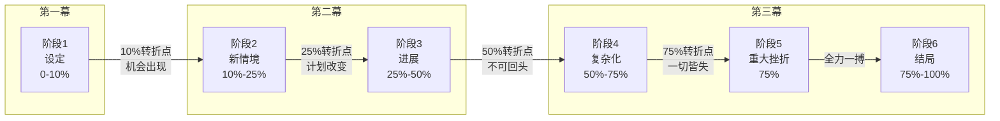
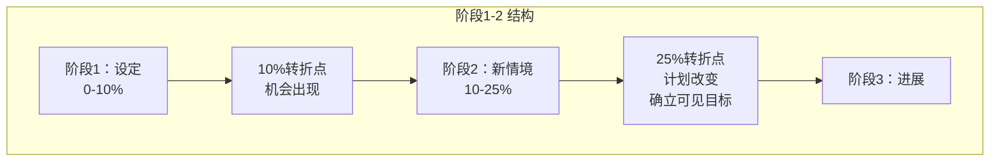

# 第03课：六阶段情节结构（上）

> Michael Hauge 的六阶段结构是构建外在旅程的骨架。这一课我们学习前三个阶段——从英雄的日常生活到踏上征途。

---

## 六阶段总览

> 本节课先讲**前三个阶段**（阶段1-3），对应故事的第一幕和第二幕前半段。

---

## 阶段1：设定（Setup）——0% ~ 10%

**目标：** 让观众认识英雄，理解他的日常生活，并**在意**他。

在这个阶段，你需要完成以下任务：

- [x] 介绍主角——用[[0002-story-elements|五种认同感方式]]让观众在意
- [x] 展示日常生活——英雄在"进入故事之前"是什么状态
- [x] 暗示内在需求——埋下角色情感缺失的线索
- [x] 建立故事世界——时间、地点、氛围

### 10% 转折点：机会出现（Opportunity）

在这个节点，英雄遇到某个人或某件事，激发了他的渴望。

> [!NOTE] 转折点不是英雄主动选择
> 10%的转折点是**机会**，不是**决定**。英雄只是看到了某种可能性，他还没有真正踏上征途。真正的决定在后头。

**《律师事务所》（The Firm）例子：** 年轻律师Mitch接到一家律师事务所的高薪offer，这看起来是千载难逢的机会。

---

## 阶段2：新情境（New Situation）——10% ~ 25%

英雄进入了一个**新的环境**，但还没有完全投入。

- 英雄试探性地探索新世界
- 新世界有它自己的规则、人物、风险
- 英雄开始意识到：这里和我想象的不太一样

### 25% 转折点：计划改变（Plan Change）

这是**第一幕的终点**，也是整部电影最重要的转折点之一。英雄**确立可见目标**，正式踏上征途。

> [!IMPORTANT] 第一幕结束的标志
> 25%的转折点意味着：英雄不能再回到原来的生活了。他做出了一个**明确的决定**，观众知道接下来他要做什么。

**《律师事务所》例子：** Mitch接受了律所的offer，进入了这个看似光鲜的律师事务所。但很快他发现自己被监控、被利用。25%时，FBI找上门，告诉他这个律所是黑帮的洗钱工具。Mitch面临选择——合作或死亡。他**决定暗中与FBI合作**。这就是他的可见目标。

---

## 阶段3：进展（Progress）——25% ~ 50%

英雄的计划似乎奏效了。他用尽全力去追求可见目标，而且看起来**正在成功**。

- 英雄积极行动，不再被动
- 小胜利接连不断
- 观众开始相信"也许他真的能行"

> [!WARNING] 虚假胜利
> 阶段3的所有胜利都是**暂时的**。如果英雄在这里就彻底成功了，故事就没有后半段了。阶段3的存在正是为了给后半段的崩塌积蓄力量。

**《律师事务所》例子：** Mitch一边应付律所的工作，一边偷偷收集证据给FBI。他表现得游刃有余，既取得了律所合伙人的信任，又给了FBI想要的东西。看起来一切都在掌控之中。

---

## 节奏要点

| 阶段 | 位置 | 英雄状态 | 情感效果 |
|------|------|----------|----------|
| 阶段1：设定 | 0-10% | 被动/日常 | 建立认同 |
| 10%转折点 | 10% | 被召唤 | 期待 |
| 阶段2：新情境 | 10-25% | 试探 | 好奇 |
| 25%转折点 | 25% | 决定 | 投入 |
| 阶段3：进展 | 25-50% | 主动/自信 | 乐观 |

> 用百分比来理解节奏，而不是页数或分钟数。这样无论你写的是30分钟短片还是3小时史诗，结构都是相同的。

---

## 自测题

> [!QUESTION] 25%转折点（计划改变）和10%转折点（机会出现）的本质区别是什么？
> 

> 
点击查看答案

>
> **10%转折点：** 英雄遇到了一个**可能性**，但他还没有做出承诺。他还可以掉头回去。
> **25%转折点：** 英雄做出了**决定**，确立了可见目标。他已经踏上了征途，退路被切断了。
>
> 用《律师事务所》来理解：10%是Mitch收到offer（机会），25%是Mitch决定与FBI合作（计划改变）。前者是被动接收，后者是主动选择。
> 

> [!QUESTION] 为什么阶段3的"成功"必须被设计成虚假的？
> 

> 
点击查看答案

>
> 因为如果英雄真的成功了，故事在中点就结束了。阶段3的成功是为了让观众**放松警惕**——让他们相信英雄正走在正确的道路上。这样当阶段4（复杂化）和阶段5（重大挫折）来临时，打击才会更沉重。**先给希望，再粉碎希望**——这是操控观众情感的核心技巧。
> 

---

## 应用作业

1. **找一部你看过的电影**，在时间线上标出10%和25%的位置，写下这两个节点的具体事件
2. **用百分比计算你正在构思的故事**：第一阶段展示日常生活需要多少篇幅？10%的机会是什么？25%时主角的决定是什么？
3. **检查你的阶段3**：你为英雄安排的小胜利够不够多？这些胜利是否都暗藏隐患？

---

## 课程导航

- **上一课：** [[0002-story-elements|第02课：故事核心三要素]]
- **下一课：** [[0004-six-stage-plot-2|第04课：六阶段情节结构（下）]]
- **术语表：** [[reference/glossary|术语表]]