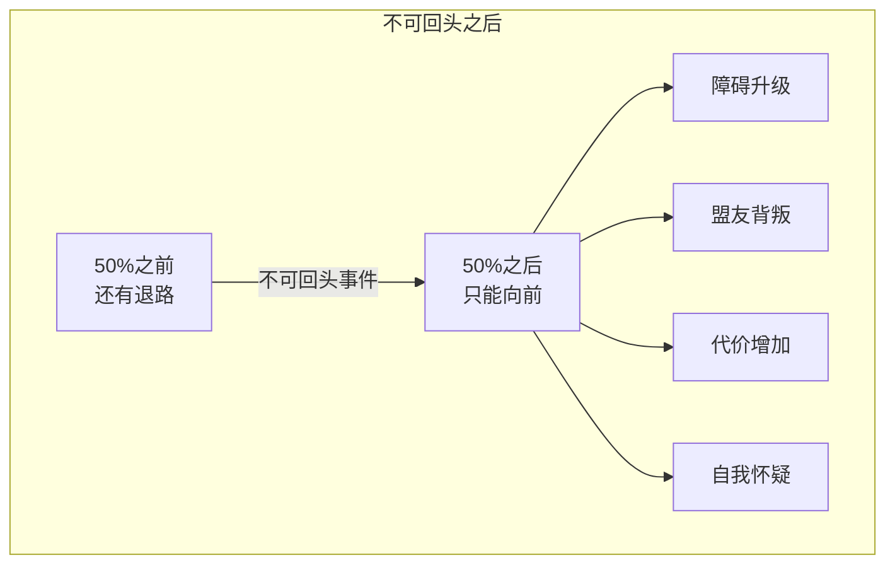
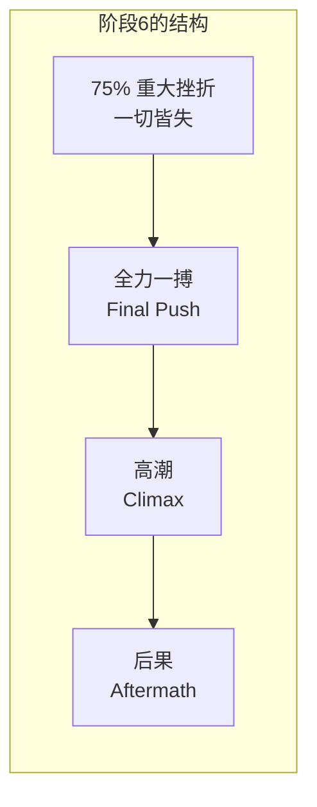
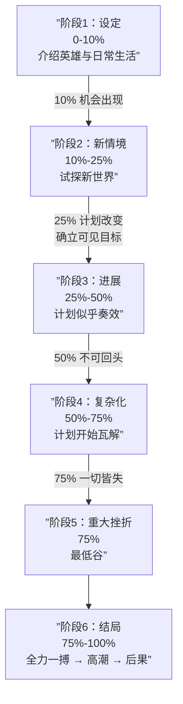

# 第04课：六阶段情节结构（下）

> 故事的后半段才是真正的考验。英雄走到半步，退无可退，然后遭遇毁灭性的打击——最后，全力一搏。

---

## 回顾与衔接

在 [[0003-six-stage-plot|上一课]] 中，我们学习了前三个阶段：

- **阶段1-3**：英雄从日常生活被召唤，进入新世界，计划似乎进展顺利

现在进入后半段——**故事真正残酷的部分**。

```mermaid
flowchart LR
    subgraph 前半段（上节课）
        A[阶段1<br/>设定]
        B[阶段2<br/>新情境]
        C[阶段3<br/>进展]
    end
    subgraph 后半段（本节课）
        D[阶段4<br/>复杂化]
        E[阶段5<br/>重大挫折]
        F[阶段6<br/>结局]
    end
    A --> B --> C --> D --> E --> F
```

---

## 阶段4：复杂化（Complications）——50% ~ 75%

英雄的计划开始**瓦解**。

- 之前看似可控的局面开始失控
- 障碍越来越大，代价越来越高
- 英雄开始怀疑自己的选择

### 50% 转折点：不可回头（Point of No Return）

这是**第二幕的中点**。在这个节点：

> [!IMPORTANT] 退路被烧毁了
> 英雄做了一件事，让他**无法回到原来的状态**。不管他愿不愿意，都必须继续往前走。

**不可回头可以是：**
- 身体上的：无法回到原来的地方
- 法律上的：犯了不可挽回的罪
- 关系上的：说出了无法收回的话
- 道德上的：越过了某条底线



**用游泳来比喻：** 50%之前，你还在浅水区，脚能踩到底。50%之后，你到了深水区——只能往前游，没有退路。

---

## 阶段5：重大挫折（Major Setback）——75%

这是故事中**最低谷的时刻**。

> [!CAUTION] 一切皆失
> 英雄似乎彻底失败了。目标遥不可及，他可能受伤、失去盟友、被反派击败——甚至看起来已经"死"了（身体上或精神上）。

**75% 转折点的特征：**
- 这是英雄最脆弱的时刻
- 所有希望似乎都破灭了
- 观众感到绝望——"他真的不行了"

**但请注意：** 75%不是故事的结局。它是**最后一搏前的黑暗**。

> [!TIP] 从绝望中迸发的力量
> 很多时候，英雄正是在这个最低谷找到了内在的力量——不是外在的资源，而是内心的某种觉醒。这正是内在旅程（从身份走向本质）与外在旅程交汇的时刻。

---

## 阶段6：结局（Resolution）——75% ~ 100%

英雄从谷底**全力一搏**。

- 英雄用尽最后的力气和资源
- 动作升级到最高强度
- 最终对决/最终挑战

### 高潮（Climax）

> 高潮不一定是英雄达成目标。

Michael Hauge 指出，高潮有三种可能的结果：

| 结果 | 说明 | 例子 |
|------|------|------|
| **成功** | 英雄达成可见目标 | 典型的商业片结局 |
| **失败** | 英雄没有达成目标，但在过程中完成了内在转变 | 《洛奇》：输了比赛但赢得了尊严 |
| **改变目标** | 英雄发现原来的目标不重要了，转而去追求更重要的东西 | 《黑客帝国》：Neo从"逃出矩阵"变成"拯救人类" |

### 后果（Aftermath）

故事不能在高潮结束后戛然而止。你需要**展示英雄的新生活**：

- 英雄发生了怎样的变化？
- 他是否完成了内在旅程——从身份走向了本质？
- 观众需要"深呼吸"的时间



---

## 六阶段完整结构图



---

## 百分比是灵活的

> [!NOTE] 百分比是节奏指南，不是数学公式
> Chris Vogler 强调：对于电影，百分比相对严格。但对于**小说或剧集**，某些阶段可以拉长或缩短。关键在于**节奏感**——你知道故事到了哪个阶段，也知道接下来需要什么。

**变体示例：**
- 一部悬疑小说：阶段1（设定）可能只占5%，但阶段4（复杂化）可能会拉长到30%
- 一部浪漫喜剧：阶段3（进展）可能特别长，给观众更多甜蜜时刻
- 一部艺术片：阶段6（后果）可能占据很大的篇幅

---

## 自测题

> [!QUESTION] 50%转折点（不可回头）和75%转折点（重大挫折）有什么区别？为什么它们不能是同一个事件？
> <details>
> <summary>点击查看答案</summary>
>
> **功能完全不同：**
> - **50%（不可回头）**：英雄的**主动选择**，烧毁退路，从此只能向前。这个节点让观众知道：故事没有回头路了。
> - **75%（重大挫折）**：英雄的**被动打击**，一切崩塌。这个节点让观众知道：情况糟透了。
>
> 它们不能是同一个事件，因为中间需要**阶段4（复杂化）**来逐步升级压力。如果刚烧完桥就被车撞了，观众会感觉不到压力累积的过程。**先有决心，再有考验**——这是故事结构的节奏规律。
> </details>

> [!QUESTION] 《泰坦尼克号》的75%重大挫折是什么？Rose在这个节点经历了怎样的转变？
> <details>
> <summary>点击查看答案</summary>
>
> **75%重大挫折：** Jack被铐在沉船底层船舱的水管上，Rose已经上了救生艇，但看着逐渐下沉的船意识到Jack还在下面。表面上"一切皆失"——船在沉，爱人在等死，她似乎无能为力。
>
> **内在转变：** 但正是在这个节点，Rose做出了决定——她跳回沉船去救Jack。这个行动标志着她的内在旅程到达转折点：她不再是被拯救的公主，而是主动拯救爱人的英雄。她从"被定义的身份"（听话的未婚妻）变成了"真实的本质"（为自己而活的人）。
> </details>

---

## 应用作业

1. **用50%-75%-100%框架分析你最喜欢的一部电影**：找出不可回头事件、重大挫折和高潮
2. **检查你正在创作的故事后半段**：阶段4的障碍是否比阶段3逐步升级？75%的打击是否够重？高潮是否提供了情感释放？
3. **尝试改写一个高潮**：如果你原来的高潮是"英雄成功"，试试改成"英雄失败但有内在收获"——哪个版本更有力量？

---

## 课程导航

- **上一课：** [[0003-six-stage-plot|第03课：六阶段情节结构（上）]]
- **下一课：** *待定*
- **术语表：** [[reference/glossary|术语表]]