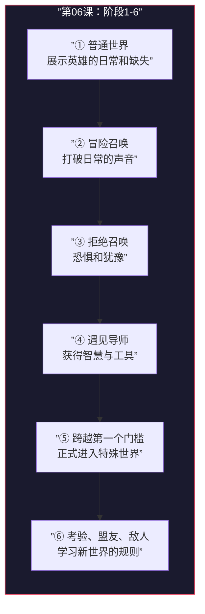

# 第06课：十二阶段英雄之旅（上）

## 课程导航

- 前置课程：[[0005-joseph-campbell|第05课：约瑟夫·坎贝尔与英雄之旅]]
- 下一课：[[0007-twelve-stages-2|第07课：十二阶段英雄之旅（下）]]
- 本课参考：[[reference/glossary|术语表]] · [[reference/cheatsheet|速查表]]

---

## 一、十二阶段总览

Chris Vogler 在《作家之旅》中将坎贝尔的17阶段简化为 **12阶段**，分为三个大的乐章：

```mermaid
flowchart LR
    subgraph 第一幕[”第一幕：出发”]
        direction TB
        S1[”① 普通世界<br/>Ordinary World”]
        S2[”② 冒险召唤<br/>Call to Adventure”]
        S3[”③ 拒绝召唤<br/>Refusal of the Call”]
        S4[”④ 遇见导师<br/>Meeting the Mentor”]
        S5[”⑤ 跨越第一个门槛<br/>Crossing the Threshold”]
    end

    subgraph 第二幕[”第二幕：启蒙”]
        direction TB
        S6[”⑥ 考验、盟友、敌人<br/>Tests, Allies, Enemies”]
        S7[”⑦ 接近最深的洞穴<br/>Approach to the Inmost Cave”]
        S8[”⑧ 磨难<br/>Ordeal”]
        S9[”⑨ 奖励<br/>Reward”]
    end

    subgraph 第三幕[”第三幕：回归”]
        direction TB
        S10[”⑩ 回归之路<br/>Road Back”]
        S11[”⑪ 复活<br/>Resurrection”]
        S12[”⑫ 携带灵药归来<br/>Return with the Elixir”]
    end

    S1 --> S2 --> S3 --> S4 --> S5
    S5 --> S6 --> S7 --> S8 --> S9
    S9 --> S10 --> S11 --> S12

    style 第一幕 fill:#1a1a2e,stroke:#e94560,color:#fff
    style 第二幕 fill:#16213e,stroke:#0f3460,color:#fff
    style 第三幕 fill:#0f3460,stroke:#e94560,color:#fff
```

### 三个阶段对应关系

| 结构 | 阶段范围 | 对应六阶段结构 |
|---|---|---|
| **第一幕：出发** | 阶段1-5 | 设定 → 新情境 → 确立目标 |
| **第二幕：启蒙** | 阶段6-9 | 进展 → 复杂化 → 重大挫折 |
| **第三幕：回归** | 阶段10-12 | 结局 → 高潮 → 后果 |

> 本课聚焦**阶段1-6**（第一幕 + 第二幕的第一个阶段），[[0007-twelve-stages-2|下节课]]详解阶段7-12。

---

## 二、阶段1：普通世界 (Ordinary World)

### 定义

**普通世界**是英雄在冒险开始前的日常生活。这里展示英雄是谁、她的环境、她的缺失和局限。

### 核心功能

- 建立观众的 **认同感**（Empathy / Identification）
- 展示英雄的 **缺憾**（她的人生缺少了什么）
- 展示英雄的 **恐惧和限制**（她为什么不敢改变）
- 建立故事的 **基线**（这样我们才能对比她后来的成长）

### 关键问题

> 在英雄开始冒险之前，她的生活是什么样的？她正在逃避什么？她渴望什么却不敢去追求？

### 与六阶段结构的对应

普通世界对应六阶段中的 **设定**（0%-10%）阶段。

### 经典案例

| 电影 | 普通世界 | 展示的缺憾 |
|---|---|---|
| **《星球大战》** | 卢克在塔图因星球上做农场少年 | 渴望冒险、被困在枯燥的日常中 |
| **《黑客帝国》** | 尼奥作为程序员托马斯·安德森 | 对世界感到不安和怀疑、格格不入 |
| **《指环王》** | 佛罗多在夏尔的宁静生活 | 天真无知、不了解世界的黑暗面 |
| **《绿野仙踪》** | 多萝西在堪萨斯的黑白世界 | 渴望色彩、渴望离开被忽视的生活 |
| **《黑客帝国》** | 艾玛在里士满高中的日常生活 | 被困在完美外表下的虚伪中 |

---

## 三、阶段2：冒险召唤 (Call to Adventure)

### 定义

**冒险召唤**是打破英雄日常生活的事件或信息。它呼唤英雄踏上旅程。

### 核心功能

- 打破平衡，让英雄无法继续「假装一切都好」
- 展示一个 **选择的机会**：留在普通世界 vs. 踏上冒险
- 引入故事的 **外在目标**（可见目标）

### 召唤的形式

冒险召唤可以以多种形式出现：

- **人物召唤**：一个信使带来消息（比如《星球大战》中R2-D2带来的莉亚公主的求救信息）
- **事件召唤**：一个突发事件（比如《黑客帝国》中尼奥被特工追捕）
- **内在召唤**：英雄内心的冲动（比如《末路狂花》中塞尔玛自己做出出发的决定）

### 关键问题

> 是什么事情让英雄无法再继续原来的生活？这个机会或威胁是什么？

### 与六阶段结构的对应

冒险召唤对应六阶段中的 **机会降临**（10%转折点）。

---

## 四、阶段3：拒绝召唤 (Refusal of the Call)

### 定义

**拒绝召唤**是英雄面对冒险召唤时的第一反应——恐惧、犹豫、退缩。

### 为什么英雄会拒绝

英雄拒绝冒险不是因为胆小，而是因为 **改变太可怕了**。英雄的「身份」保护着她不受创伤之痛，踏上冒险意味着放下这层保护。

> 拒绝召唤是英雄内心的恐惧被激活的时刻。恐惧是合理的——冒险确实有风险。

### 核心功能

- 展示英雄的 **恐惧和创伤**
- 让观众意识到 **这趟旅程不易**，提升紧张感
- 加深观众对英雄的 **同理心**（「她和我一样也会害怕」）

### 经典案例

| 电影 | 英雄的拒绝 |
|---|---|
| **《星球大战》** | 卢克说「我有太多工作要做」，拒绝和欧比旺一起去 |
| **《黑客帝国》** | 尼奥在墨菲斯给出红蓝药丸选择时的犹豫 |
| **《指环王》** | 佛罗多在瑞文戴尔的会议上几乎拒绝接受魔戒任务 |
| **《洛奇》** | 洛奇起初拒绝与阿波罗·克里德比赛 |

### 与六阶段结构的对应

拒绝召唤发生在六阶段中的 **新情境** 阶段内部（10%-25%之间）。

---

## 五、阶段4：遇见导师 (Meeting with the Mentor)

### 定义

**遇见导师**是英雄遇到一个能给她智慧、工具、训练或鼓励的角色。

### 导师的多种面貌

| 导师类型 | 提供什么 | 经典例子 |
|---|---|---|
| **智慧导师** | 知识和智慧 | 欧比旺·克诺比（《星球大战》） |
| **实用导师** | 工具和技能 | Q先生（007系列） |
| **精神导师** | 信念和勇气 | 甘道夫（《指环王》） |
| **反面导师** | 反面教材 | 在失败教给英雄教训的角色 |
| **内在导师** | 英雄自己的直觉 | 《少年派的奇幻漂流》中派的内心 |

### 核心功能

- 为英雄提供「过渡工具」——进入特殊世界所需的装备
- 传递关键信息或智慧箴言
- 给予英雄勇气和鼓励
- 设定故事的 **主题陈述**（导师常常说出电影的主题）

### 关键点

> 导师不是故事的英雄。导师的训练和指导只持续到英雄能够独立为止。**导师必须在英雄证明自己之前退场。**

### 与六阶段结构的对应

遇见导师也发生在 **新情境** 阶段内部。

---

## 六、阶段5：跨越第一个门槛 (Crossing the First Threshold)

### 定义

**跨越第一个门槛**是英雄正式离开普通世界、进入特殊世界的时刻。这是一个 **不可回头点**。

### 核心功能

- 英雄做出 **刻意承诺**（Commitment）
- 英雄正式 **接受冒险**
- 「旧世界」的 **门关上了**
- 观众觉得「好戏要开始了」

### 什么是「门槛」

门槛（Threshold）是普通世界和特殊世界之间的分界线。迈过这个门槛意味着英雄不能再像以前一样生活。

- 在《星球大战》中，是卢克离开塔图因
- 在《黑客帝国》中，是尼奥吞下红色药丸
- 在《指环王》中，是佛罗多在瑞文戴尔自愿接过魔戒
- 在《绿野仙踪》中，是龙卷风把多萝西卷到奥兹国

### 与六阶段结构的对应

跨越第一个门槛对应六阶段中的 **确立目标**（25%转折点）。

---

## 七、阶段6：考验、盟友、敌人 (Tests, Allies, Enemies)

### 定义

**考验、盟友、敌人**是英雄进入特殊世界后的学习阶段。她在这里适应新环境，结交朋友，面对敌人，学会「新世界」的规则。

### 核心功能

- 展示特殊世界的 **运作规则**
- **测试**英雄的能力和承诺
- 引入 **盟友**（朋友、助手、同伴）
- 引入 **敌人**（对手的爪牙或代理人）
- 让观众看到 **英雄还没有准备好**面对最大的挑战

### 这个阶段为什么重要

这个阶段给观众 **希望**——英雄似乎在进步，她的计划好像能行得通。同时它也通过较小的冲突来展示英雄的弱点和成长潜力。

### 经典案例

| 电影 | 考验、盟友、敌人 |
|---|---|
| **《星球大战》** | 卢克在千年隼号上学习原力、遇到韩·索罗和楚巴卡、在酒吧遇到敌人 |
| **《黑客帝国》** | 尼奥在母体中进行训练、遇到其他团队成员、与特工周旋 |
| **《指环王》** | 护戒远征队穿越莫里亚矿坑、面对兽人攻击、结识阿拉贡和莱戈拉斯 |
| **《哈利·波特与魔法石》** | 哈利在霍格沃茨学习魔法、交到罗恩和赫敏、面对马尔福和斯内普 |

### 与六阶段结构的对应

考验、盟友、敌人对应六阶段中的 **进展**（25%-50%）。

---

## 八、本课小结

### 关键记忆点

1. **阶段1-5 = 第一幕「出发」**——英雄从普通世界被推向特殊世界
2. **阶段6 = 第二幕的开端**——英雄开始适应新世界
3. **每个阶段都有特定功能**——缺失任何一段都会让故事感觉「不对劲」
4. **恐惧是贯穿前六个阶段的核心驱动力**——英雄一直在和恐惧做斗争

---

## 课堂练习

> [!QUESTION] 实战练习
> 选一部你熟悉的电影（最好是[[0005-joseph-campbell|第05课]]中提到过的那部），对照前六个阶段，一个一个写出这部电影中每个阶段对应的具体场景。如果某个阶段在你的电影中不明显，思考一下——这是电影的问题，还是你的理解问题？

点击查看示例：以《星球大战》为例

| 阶段 | 对应场景 |
|---|---|
| **1. 普通世界** | 卢克在塔图因从事农场工作，看着双日落——一个渴望冒险却被困在枯燥生活中的少年 |
| **2. 冒险召唤** | R2-D2带来的莉亚公主的全息信息——「帮助我，欧比旺·克诺比，你是唯一的希望」 |
| **3. 拒绝召唤** | 卢克对欧比旺说：「我有太多工作要做，我不能离开」——他找借口留下 |
| **4. 遇见导师** | 欧比旺·克诺比教卢克原力，给他光剑——既是智慧导师也是实用导师 |
| **5. 跨越第一个门槛** | 卢克回到家发现叔叔和婶婶被帝国士兵杀害——他别无选择，只能和欧比旺一起走 |
| **6. 考验、盟友、敌人** | 在千年隼号上学习原力（「用原力来感受」）、结识韩·索罗和楚巴卡、在死星上与风暴兵作战 |

**提示**：在《星球大战》中，「跨越第一个门槛」的触发事件是叔叔婶婶的死亡——卢克不再有家可回，门槛被强行推倒。很多时候英雄不是主动选择冒险，而是冒险被迫选择了他们。

---

## 参考资料

- [[reference/glossary|术语表]] — 查看本课涉及的术语定义
- [[reference/cheatsheet|速查表]] — 六阶段与十二阶段对照
- [[0005-joseph-campbell|第05课：约瑟夫·坎贝尔与英雄之旅]]
- [[0007-twelve-stages-2|第07课：十二阶段英雄之旅（下）]]
- Chris Vogler, 《作家之旅：源自神话的写作要义》