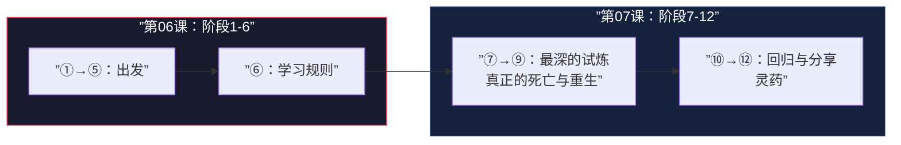
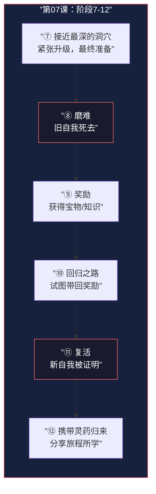

# 第07课：十二阶段英雄之旅（下）

## 课程导航

- 前置课程：[[0006-twelve-stages|第06课：十二阶段英雄之旅（上）]]
- 下一课：待定
- 本课参考：[[reference/glossary|术语表]] · [[reference/cheatsheet|速查表]]

---

## 一、回顾与总体定位

在[[0006-twelve-stages|第06课]]中，我们学习了英雄之旅的前六个阶段：

1. 普通世界 → 2. 冒险召唤 → 3. 拒绝召唤 → 4. 遇见导师 → 5. 跨越第一个门槛 → 6. 考验、盟友、敌人

本课我们继续学习 **阶段7-12**，这是英雄之旅中 **最黑暗、也最辉煌** 的后半段：

如果说前六个阶段是 **「学习如何成为英雄」**，那么后六个阶段就是 **「证明自己是英雄」**。

---

## 二、阶段7：接近最深的洞穴 (Approach to the Inmost Cave)

### 定义

**接近最深的洞穴**是英雄在进入最终考验前的准备阶段。英雄接近旅程中最危险的地方、最深处的恐惧。

### 为什么叫「最深的洞穴」

「洞穴」是一个隐喻——代表英雄最深层的恐惧所在之处。这不是普通的敌人，而是英雄内心最害怕面对的东西。

### 核心功能

- 提升 **紧张感**——观众知道大事要发生了
- 展示英雄的 **最终准备状态**
- 通常包含 **最后的犹豫或动员**——盟友之间可能产生分歧，英雄可能再次动摇
- 建立 **团队协作或孤军奋战**的氛围

### 经典案例

| 电影 | 「最深的洞穴」 | 英雄的恐惧 |
|---|---|---|
| **《星球大战》** | 接近死星——进攻前夜，战友们互相告别 | 卢克可能无法活着回来 |
| **《指环王》** | 接近魔多——佛罗多、山姆和咕噜穿越荒原 | 魔戒的力量越来越难以抵抗 |
| **《黑客帝国》** | 进入大楼营救墨菲斯——制定营救计划 | 尼奥觉得自己还没准备好 |
| **《夺宝奇兵》** | 进入藏宝的洞穴/神庙——查看陷阱和守卫 | 面对未知的超自然力量 |

### 与六阶段结构的对应

接近最深的洞穴对应六阶段中的 **复杂化**（50%-75%），尤其是后半段——英雄已经无路可退，最后的试炼就在眼前。

---

## 三、阶段8：磨难 (Ordeal) —— 核心死亡与重生

### 定义

**磨难**是英雄经历核心的 **死亡与重生体验**——面对最大的恐惧，旧的自我「死去」，新的自我有机会「诞生」。

### 这是整个英雄之旅最关键的时刻

> 坎贝尔说：「磨难是英雄之旅的核心——没有死亡，就没有重生。」

### 磨难的双层含义

| 层面 | 含义 | 例子 |
|---|---|---|
| **外在层面** | 英雄面对最大的身体/外部威胁 | 卢克在死星上对决达斯·维达 |
| **内在层面** | 英雄的「旧自我」被彻底击碎 | 卢克必须面对「原力的黑暗面」的诱惑 |
| **真正的磨难** | **内外结合**——外在危机逼迫英雄做出内在改变 | 两者同时发生 |

### 磨难 = 75%重大挫折？

是的！磨难阶段直接对应六阶段中的 **重大挫折**（75%转折点）。这是同一个节点从不同角度的描述：

- **六阶段视角**：这是「一切皆失」——英雄的可见目标似乎彻底失败了
- **坎贝尔视角**：这是「死亡与重生」——英雄的旧自我必须死去

### Michael Hauge 的深刻洞察

> Hauge 强调：磨难不仅仅是外在的失败。如果英雄只是在外部战斗中失败然后重新站起来，那只是一个路障。真正的磨难是英雄被迫面对 **她最不想面对的东西**——她的恐惧、她的创伤、她的身份。

### 经典案例的深度分析

**《黑客帝国》：尼奥在浴室中被杀死与复活**

- 外在事件：尼奥被史密斯特工枪击死亡
- 内在事件：特里尼蒂说出的预言（「你就是救世主」）、尼奥选择相信
- 死亡：尼奥作为「怀疑一切的程序员」死去
- 重生：尼奥作为「救世主」复活——他看到了母体的代码
- **关键**：尼奥的复活不是自动的——**他必须选择接受他的本质**

**《星球大战》：卢克在死星上失去欧比旺**

- 外在事件：卢克看着欧比旺被达斯·维达杀死
- 内在事件：卢克失去导师的打击、必须独自面对
- 死亡：卢克作为「被保护的孩子」死去
- 重生：卢克作为「必须自己做决定的战士」重生
- **关键**：磨难不一定是英雄自己的死亡——有时候是英雄珍视的人或信念「死去」

**《指环王》：佛罗多在摩瑞亚失去甘道夫**

- 外在事件：甘道夫在对抗炎魔时坠落深渊
- 内在事件：佛罗多意识到这趟旅程的代价——不止他自己会死，他爱的人也会
- 死亡：佛罗多的天真和盲目乐观死去
- 重生：佛罗多开始意识到牺牲的真正含义

### 与六阶段结构的对应

磨难对应六阶段中的 **重大挫折**（75%转折点）。

---

## 四、阶段9：奖励 (Reward / Seizing the Sword)

### 定义

**奖励**是英雄在磨难中存活后获得的东西——她赢得的宝物、知识、经验或能力。

### 奖励的形式

| 奖励类型 | 含义 | 例子 |
|---|---|---|
| **有形的宝物** | 具体的物品 | 《夺宝奇兵》中的约柜 |
| **知识和智慧** | 对世界/自我的更深理解 | 《黑客帝国》中尼奥看到的母体代码 |
| **能力和成长** | 内在力量 | 《星球大战》中卢克开始真正信任原力 |
| **爱情或友谊** | 与他人的深层连接 | 《真爱至上》类型中的爱情收获 |
| **接纳自我** | 接受自己的本质 | 《绿野仙踪》中多萝西发现「家就在心里」 |

### 核心功能

- 给英雄和观众 **情感的呼吸空间**——磨难后的片刻喘息
- 展示英雄 **值得得到奖励**——这是她付出代价后挣来的
- 照亮 **前进的方向**——奖励通常告诉英雄下一步该做什么

### 重要提醒

> 奖励是短暂的。英雄虽然获得了宝物，但还需要 **带回家**。宝藏不能只在特殊世界里使用——必须带回普通世界才有意义。这引出接下来的问题：如何回归？

---

## 五、阶段10：回归之路 (Road Back)

### 定义

**回归之路**是英雄试图将奖励带回普通世界的过程。冒险还没有完全结束——仍然有残余的挑战需要面对。

### 核心功能

- 展示 **冒险的后遗症**——特殊世界不会轻易放英雄走
- 引入 **最后的障碍**——对手的反扑或新的问题
- 测试安全 **能否携带奖励**——如果可以，用渡鸦测试英雄是否成长了

### 回归之路中常见的危机

1. **追击**：对手或特殊世界的力量追击英雄（《星球大战》中TIE战斗机追击千年隼）
2. **新的困境**：在返回途中遇到新的问题（《指环王》中在返回夏尔路上的破坏）
3. **内讧**：团队成员之间产生分歧（盟友可能想走不同的方向）
4. **奖励失去意义**：英雄发现辛苦获得的奖励并不能解决真正的问题
5. **不可能的选择**：保护奖励 vs. 拯救某人——英雄必须做出艰难的选择

### 与六阶段结构的对应

回归之路对应六阶段中 **结局的后半段**——也就是从高潮前到高潮之间的过渡。这是「最后大决战」前夕的紧张时刻。

---

## 六、阶段11：复活 (Resurrection)

### 定义

**复活**是英雄在回到普通世界之前经历的 **最后一次、最纯粹的考验**。这是整个故事中 **最接近「高潮」** 的时刻。

### 复活与磨难的区别

| 维度 | 磨难（阶段8） | 复活（阶段11） |
|---|---|---|
| **位置** | 75%重大挫折 | 高潮 |
| **性质** | 旧的自我死去 | 新的自我被证明 |
| **氛围** | 黑暗、绝望、失败 | 光明、净化、胜利 |
| **焦点** | 英雄面对恐惧 | 英雄活出本质 |
| **结果** | 旧的死亡 | 新的重生 |

> 磨难是 **「旧英雄的葬礼」**，复活是 **「新英雄的加冕礼」**。

### 复活的核心功能

- **证明转变是真实的**——英雄在磨难中学到的教训在这里得到检验
- **最后一次展示英雄「活出本质」**——她不再躲回身份
- **为观众提供情感宣泄**——高潮的满足感
- **解决故事的核心冲突**——外在目标实现 + 内在成长完成

### 复活考验的两个层面

好的复活考验总是同时作用于外在和内在两个层面：

1. **外在层面**：英雄需要面对最终的外部威胁（对手、敌人、灾难）
2. **内在层面**：英雄需要面对最纯粹的内心选择——是继续用身份保护自己，还是选择活出本质

### 经典案例

| 电影 | 复活考验 | 英雄的选择 |
|---|---|---|
| **《黑客帝国》** | 尼奥面对史密斯特工——在母体中的最终对决 | 选择相信「我是救世主」，而不是怀疑 |
| **《星球大战》** | 卢克在死星攻击最终战机——使用原力而不是瞄准器 | 选择相信原力，放下控制 |
| **《指环王》** | 佛罗多在末日火山中——魔戒最终考验 | 在最后一刻失败（被咕噜拯救），但证明了旅程的价值 |
| **《洛奇》** | 洛奇与阿波罗的最终回合——坚持战斗到最后 | 选择「证明自己」而不是「赢得比赛」 |

### 与六阶段结构的对应

复活对应六阶段中的 **高潮**。

---

## 七、阶段12：携带灵药归来 (Return with the Elixir)

### 定义

**携带灵药归来**是英雄将旅程中学到的东西带回普通世界，并与他人分享。

### 什么是「灵药」（Elixir）

灵药是英雄从特殊世界带回来的「礼物」——它可以有形的，也可以是无形的：

| 灵药类型 | 含义 | 例子 |
|---|---|---|
| **具体的宝物** | 可以挽救或改变世界的有形物品 | 《夺宝奇兵》中的约柜 |
| **知识和智慧** | 英雄学到的教训 | 《黑客帝国》中尼奥代表的选择自由 |
| **治愈的力量** | 能治愈他人（或自己）的能力 | 《心灵捕手》中威尔学会去爱 |
| **分享的故事** | 旅程经历本身成为礼物 | 《少年派的奇幻漂流》中的故事本身 |
| **改变的心态** | 英雄带着全新的世界观回来 | 《绿野仙踪》中多萝西明白了「家」的真正含义 |

### 灵药不能仅仅是「荣誉」

> 一个常见错误是：英雄回来了，但什么都没带回来。观众会感到 **空虚**。灵药必须是某种可以被 **分享和传递** 的东西——即使只是一个改变的心态，也必须通过英雄的行动展现出来，让它能够「感染」周围的人。

### 核心功能

- **展示改变的证据**——英雄不再是普通人，她带来了改变
- **解决故事的「回响」**——让观众知道普通世界因为英雄的介入而变好
- **传递主题**——灵药本身就是主题的外化
- **给观众希望**——故事最终结束在积极的情感上

### 与六阶段结构的对应

携带灵药归来对应六阶段中的 **后果**（Aftermath）。

---

## 八、十二阶段与六阶段完整对应表

这是本课程最核心的参考表格，将两个结构体系一一对齐：

| 时间位置 | 六阶段结构 | 角色状态 | 十二阶段英雄之旅 |
|---|---|---|---|
| **0%-10%** | **设定** Setup | 完全活在身份中 | ① 普通世界 |
| **10%** | **机会** Opportunity | 瞥见另一种可能性 | ② 冒险召唤 |
| **10%-25%** | **新情境** New Situation | 一只脚踏入本质 | ③ 拒绝召唤 → ④ 遇见导师 |
| **25%** | **确立目标** Commitment | 做出承诺 | ⑤ 跨越第一个门槛 |
| **25%-50%** | **进展** Progress | 试探性地拥抱本质 | ⑥ 考验、盟友、敌人 |
| **50%** | **不可回头点** Point of No Return | （承诺深化） | （跨越半程门槛） |
| **50%-75%** | **复杂化** Complications | 全心全意投入本质 | ⑦ 接近最深的洞穴 |
| **75%** | **重大挫折** Major Setback | 恐惧，逃回身份 | ⑧ 磨难（死亡与重生） |
| **75%-高潮前** | **结局** Resolution | 重新振作 | ⑨ 奖励 → ⑩ 回归之路 |
| **高潮** | **高潮** Climax | 完全活出本质 | ⑪ 复活 |
| **高潮后** | **后果** Aftermath | 带着改变继续生活 | ⑫ 携带灵药归来 |

> 这个表格应该成为你分析故事时的 **标准参考工具**。打印出来、贴在墙上、随时对照。

---

## 九、深刻理解：为什么死亡与重生是所有伟大故事的核心

### Michael Hauge 的视角

Hauge 曾反复强调：**伟大的故事本质上是关于转变的。** 而转变必然涉及某种形式的「死亡」：

> 英雄必须放弃她一直用来保护自己的身份——这本身就是一种死亡。不是肉体的死亡，而是 **「旧自我的死亡」**。

### 坎贝尔的视角

坎贝尔认为英雄之旅本质上是一个 **成年仪式（Rite of Passage）**：

> 在原始部落中，年轻人在成年仪式上必须经历某种形式的象征性死亡——独自在荒野中度过、忍受痛苦、接受割礼——然后以「成年人」的身份重生。英雄之旅正是这种成年仪式的 **叙事版本**。

### 编剧的视角

从实用角度来看，「死亡与重生」之所以是所有伟大故事的核心，是因为：

1. **观众需要见证代价** ——如果英雄不付出真正重要的东西（她的旧自我），转变就没有说服力
2. **观众需要双重满足** ——磨难带来情感打击，复活带来情感释放，两者缺一不可
3. **观众自己也在经历旅程** ——通过观察英雄经历死亡与重生，观众在自己的心中模拟了同样的转变过程
4. **重复的模式让转变可信** ——英雄不是一次就彻底改变的，磨难和复活是两次死亡与重生的「回声」
5. **最深的恐惧必须面对** ——故事越伟大，英雄在面对恐惧时付出的代价就越大

### 灵药的真正含义

灵药之所以重要，是因为它回答了 **「所以呢？」** 这个问题。英雄经历了这一切，有什么意义？

- 灵药是 **改变的可传递性**
- 它让英雄的牺牲 **不是为了自己，而是为了他人**
- 它让故事 **超越个人成长**，触及更广的 **社会意义**
- 它完成了坎贝尔所说的：「英雄不是为自己拿走宝藏，而是为部落带回水源」

---

## 十、本课小结

### 关键记忆点

1. **阶段7-12 = 第二幕后段 → 第三幕**——从最后的试炼到最终的回归
2. **磨难（阶段8）和复活（阶段11）是双重死亡与重生**——先死旧我，后生新我
3. **灵药（阶段12）必须可分享**——英雄不能只为自己改变，必须为「部落」带回礼物
4. **所有结构都是工具，不是规则**——每个故事都可以根据自身需求调整这些阶段
5. **六阶段 + 十二阶段 = 完全覆盖故事的全貌**——两者结合使用，而不是二选一

---

## 课堂练习

> [!QUESTION] 综合练习
> 用一张纸（或一个文档），画一个两行表格：
> - 第一行：列出你正在创作（或最喜欢的）故事中的十二个阶段
> - 第二行：在每个阶段旁边，写下英雄在这个阶段结束时「对自己或对世界的认知发生了什么样的变化」
>
> 然后问自己：这个变化有说服力吗？如果没有，哪个阶段缺失了？故事中是否缺少真正的「死亡与重生」？

点击查看完整示例：《黑客帝国》全十二阶段

| 阶段 | 场景 | 英雄的变化 |
|---|---|---|
| ① 普通世界 | 托马斯·安德森在办公室，被「白兔」困扰 | 对现实感到不安，但还在假装正常 |
| ② 冒险召唤 | 墨菲斯发来的消息「跟着白兔走」 | 收到一个无法忽视的暗示 |
| ③ 拒绝召唤 | 尼奥犹豫是否要跳出窗外去救墨菲斯 | 恐惧让他差点错过机会 |
| ④ 遇见导师 | 墨菲斯提供红蓝药丸的选择 | 得到真相和选择的机会 |
| ⑤ 跨越第一个门槛 | 吞下红色药丸，从母体中「诞生」 | 无法回头，永远改变 |
| ⑥ 考验、盟友、敌人 | 在 Nebuchadnezzar 上训练，与特工交手 | 开始学习「真实世界」的规则 |
| ⑦ 接近最深的洞穴 | 进入大楼营救墨菲斯 | 面对自己「不是救世主」的信念 |
| ⑧ 磨难 | 尼奥被史密斯杀死 | 「托马斯·安德森」死去 |
| ⑨ 奖励 | 复活后看到母体的代码 | 获得看到真相的能力 |
| ⑩ 回归之路 | 逃离母体，躲避特工追击 | 带着新能力试图回到真实世界 |
| ⑪ 复活 | 最终在母体中与史密斯对决 | 完全活出「救世主」的本质 |
| ⑫ 携带灵药归来 | 电话响起，尼奥宣布要展示「另一种可能」 | 开始改变世界的使命 |

**关键洞察**：尼奥真正的「磨难」（死亡）发生在第8阶段——**被史密斯杀死**。但有意思的是，死亡本身就是重生的条件。这正好说明了坎贝尔的核心观点：旧的自我必须完全毁灭，新的自我才能诞生。

---

## 参考资料

- [[reference/glossary|术语表]] — 本课涉及的术语定义（磨难、复活、灵药、死亡与重生）
- [[reference/cheatsheet|速查表]] — 六阶段与十二阶段完整对照
- [[0006-twelve-stages|第06课：十二阶段英雄之旅（上）]]
- [[0005-joseph-campbell|第05课：约瑟夫·坎贝尔与英雄之旅]]
- [[0003-six-stage-plot|第03课：六阶段情节结构（上）]]
- [[0004-six-stage-plot-2|第04课：六阶段情节结构（下）]]