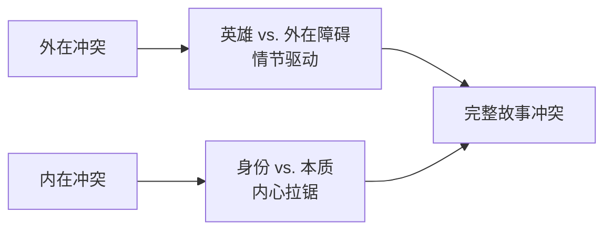
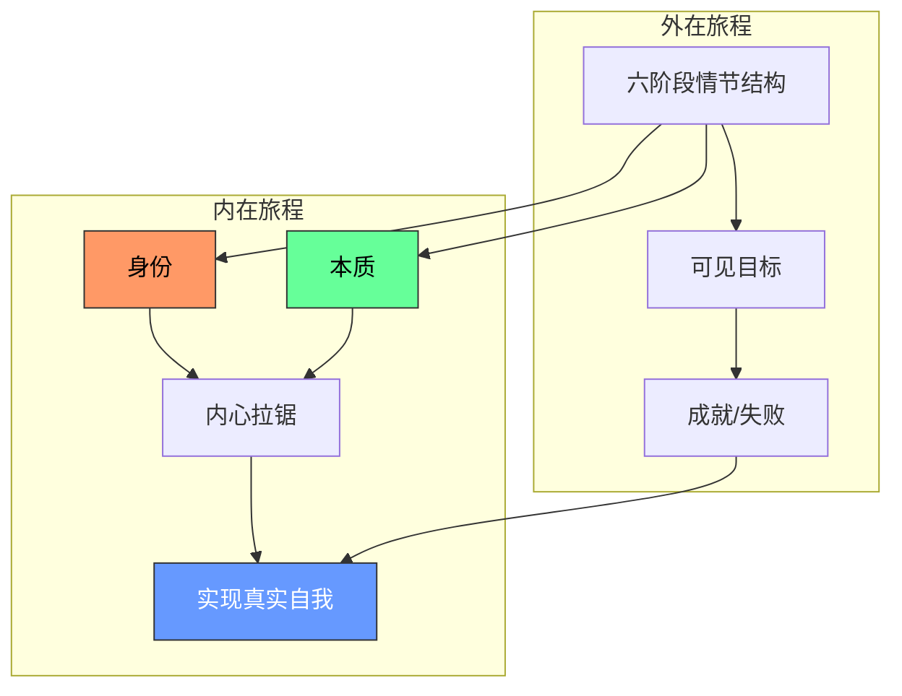

# 第08课：理解角色的内在旅程

> [!WARNING] 本章最重要的提醒
> **情节结构必须先于角色深度！** 这不是一个可以颠倒的顺序。你必须先让观众坐下（用好的情节吸引他们），然后才能改变他们的生活（用角色深度打动他们）。没有结构支撑的「深度角色」只会让观众在十分钟后关掉电影。

---

## 什么是内在旅程？

**内在旅程**（Inner Journey）是英雄从「**身份**」（Identity）走向「**本质**」（Essence）的内心历程。

如果说外在旅程是**「成就之旅」**——英雄想要获得、赢得、阻止、逃脱某样东西——那么内在旅程就是**「实现之旅」**——英雄学会放下盔甲，做真实的自己。

> [!TIP] 理解的关键
> 外在旅程回答「英雄想要什么？」
> 内在旅程回答「英雄需要什么？」

---

## 身份 vs. 本质

这两个概念是整个内在旅程理论的基石：

| 概念 | 含义 | 比喻 |
|------|------|------|
| **身份** (Identity) | 英雄为了保护自己而戴上的面具/盔甲 | 外壳、保护层 |
| **本质** (Essence) | 去掉所有身份元素后剩下的真实自我 | 内核、真心 |

- **身份 = 保护**。它是英雄在过往创伤中学会的生存策略。
- **本质 = 真实自我**。它是英雄在旅程终点最终活出的状态。

课程的核心理念可以浓缩为一句话：

> 英雄的旅程，就是从 **「身份」** 走向 **「本质」** 的旅程。

---

## 冲突的两个来源

每个好故事都有**两层冲突**在同时运作：

**1. 外在障碍（情节驱动）**
- 反派的阻挠、环境的限制、时间的紧迫
- 这是故事可见的表层冲突

**2. 内心拉锯（角色驱动）**
- 英雄想保护自己，但又渴望做真实的自己
- 这层冲突是故事真正打动人的根源

Michael Hauge 用了一个精彩的比喻：

> 外在冲突是让观众**坐稳**的东西，内在冲突是让观众**心碎**的东西。

---

## 为什么内在旅程如此重要？

如果没有内在旅程，一个故事可能仍能娱乐观众——但无法真正打动他们。以下是几个关键原因：

### 1. 角色旅程与现实相连

我们每个人在生活中都在经历同样的挣扎。我们都有戴面具的时候，都有不敢做真实自己的时候。当观众在银幕上看到一个角色经历这种拉锯时，他们看到的不是虚构，而是<u>自己</u>。

### 2. 深度感动需要内心冲突

想想那些让你流泪的电影——它们让你哭的原因从来不是爆炸场面或追车戏。而是角色在关键时刻放下了保护、做出了真实的选择。

### 3. 外在旅程 + 内在旅程 = 完整故事

没有内在旅程的故事只有**骨架**，没有内在旅程的**灵魂**。

---

## 关键概念图谱

---

> [!QUESTION] 检查你的理解
> 外在旅程和内在旅程最大的区别是什么？为什么内在旅程能让故事「深刻感人」？

点击查看答案

**外在旅程**是英雄追求可见目标的「成就之旅」——她想赢得比赛、逃脱困境、阻止坏人。**内在旅程**是英雄从「身份」走向「本质」的「实现之旅」——她学会放下盔甲、做真实的自己。

内在旅程之所以深刻感人，是因为它反映了我们每个人在现实生活中的挣扎：我们都有不敢做真实自己的时刻，都有戴着面具生活的时候。当一个角色在银幕上经历这种从身份到本质的转变时，观众看到的不是虚构人物，而是自己的投射。

---

## 本课要点速览

- **情节结构优先于角色深度**——先让观众坐下，再改变他们的生活
- 内在旅程 = 从「身份」→「本质」
- 身份是保护层/面具，本质是真实自我
- 故事需要同时拥有「外在冲突」（情节）和「内心拉锯」（身份 vs. 本质）
- 角色的内心挣扎与现实生活相连，这是观众被深深打动的原因

---

**继续学习：** [[0009-character-components|第09课：角色的核心构成]] | [[reference/glossary|术语表]]