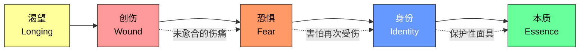
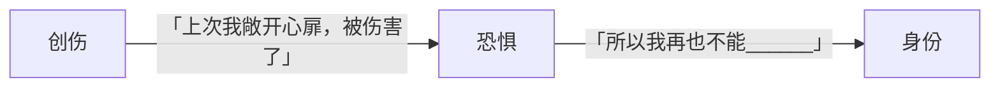
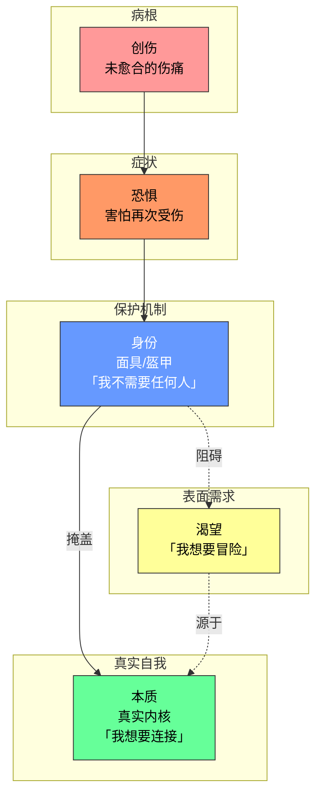

# 第09课：角色的核心构成

> [!TIP] 本课核心洞见
> 角色的内心不是混沌的——它有完整的因果链条。一旦你理解了这条链条，你就能为任何故事构建一个有血有肉、让观众心碎的角色。

---

## 角色构成的完整链条

Michael Hauge 提出了一个强大的角色构成模型。它由五个环环相扣的元素组成：

> 关键方向：链条从**渴望**出发，经过创伤产生恐惧，恐惧塑造身份，身份掩盖本质。

---

## 逐一拆解五大元素

### 1. 渴望（Longing）

**定义：** 英雄嘴上说想要的东西——她宣称但害怕去真正追求的事物。

> 渴望是英雄 **「说出口的梦想」**，但她自己可能都没有勇气去追。

**例子：《泰坦尼克号》中的 Rose**
- Rose 对 Jack 说：**「我想要冒险，想要离开这一切」**
- 但她的行为恰恰相反——她留在上流社会的牢笼里，准备嫁给 Caledon
- 她的渴望是真心的，但她**害怕去追求**

> [!NOTE] 渴望 vs. 可见目标
> 渴望不是可见目标（plot goal），而是更深层的情感需求。可见目标是「我要登上那艘船」，渴望是「我想要自由」。

---

### 2. 创伤（Wound）

**定义：** 故事开始前英雄经历的未愈合的伤痛。它是整个角色链条的**根源**。

> 创伤是故事的「幕后故事」（backstory）——观众可能永远不会直接看到，但它驱动着角色的一切行为。

**例子：**
- *《怪物史莱克》*：史莱克被父母送走，因为他是怪物
- *《泰坦尼克号》*：Rose 在压抑的上流社会长大，从未被当作独立的人对待
- *《狮子王》*：Simba 目睹父亲被杀（且自认有责任）

> [!WARNING] 重要区分
> 创伤不是「悲惨的过去」，它是**未愈合的伤口**。一个角色可能经历过很多困难，但只有那些仍然在痛、仍然影响当下选择的事情才是真正的创伤。

---

### 3. 恐惧（Fear）

**定义：** 创伤导致的害怕——害怕**再次**受到同样的伤害。

恐惧是连接创伤和身份的桥梁：

**角色的恐惧通常可以填进这个句式：**

> 只要别让我 **再次经历那种伤痛**

- 史莱克的恐惧：只要别让我再被拒绝、被当作怪物
- Rose 的恐惧：只要别让我再被困住、失去自由
- Shrek 的恐惧推动他建立了「我不需要任何人」的独立堡垒

---

### 4. 身份（Identity）

**定义：** 英雄为保护自己免受创伤之痛而戴上的面具/盔甲。

> **身份不是真实自我**。身份是英雄在恐惧中建造的保护壳。

**核心公式：**
> 身份 = 恐惧催生的保护性策略

**例子：《怪物史莱克》中的 Shrek**
- 他的身份是：**「我不需要任何人，我一个人就很好」**
- 他住在沼泽里，主动推开所有试图接近他的人
- 这是一种保护——「如果我先拒绝别人，就不会被再次拒绝」

**面具（Persona）的希腊起源：**
这个概念的源头在古希腊戏剧。演员们佩戴大型面具（persona），面具上刻画着鲜明的表情——喜悦、悲伤、愤怒。通过面具，观众知道这个角色在**扮演谁**。但面具永远不等于演员本身。

英雄的身份，就是她在日常生活中佩戴的面具。

> [!TIP] 面具不是贬义词
> 「面具」不是虚伪的意思，它是人类的一种自然保护机制。我们每个人都有多重面具——在父母面前是乖孩子，在工作面前是专业人士。问题是，当英雄**忘记**面具只是面具时，身份就囚禁了她。

---

### 5. 本质（Essence）

**定义：** 去除所有身份元素后剩下的真实自我。这是英雄在旅程结束时最终活出的状态。

> 本质就是当你把所有「应该怎么做」、「必须怎么做」都剥掉之后，剩下的那个**你真正是谁**。

**例子：**
- *史莱克的本质*：他渴望连接，渴望被爱，渴望有人能透过怪物的外表看到真实的他
- *Rose 的本质*：她天生是自由的、热情的、不受约束的灵魂
- 旅程的任务就是让英雄**从身份走向本质**

---

## 完整链条图解

这个图展示了角色内心的完整生态：
- **创伤**在最底层，是源头
- **恐惧**是创伤的症状表现
- **身份**是角色在恐惧中建立的保护机制
- **本质**是被身份掩盖的真实自我
- **渴望**是本质发出的微弱呼声——英雄说出口但害怕去追求的东西

---

## 实用技巧：帮角色填空

Michael Hauge 提供了一个极其强大的工具，可以帮助你快速定位任何角色的内心冲突。

> **「为了达成目标我愿意做任何事，只要别让我 ______」**

把这句话填完整，填进去的就是英雄的**身份**——她最害怕放弃的东西、最不想面对的事。

**例子：**
- 史莱克：**「只要别让我再次被拒绝」**
- Rose：**「只要别让我面对真实世界的残酷」**
- 《洛基》中的 Rocky：**「只要别让我觉得自己一无是处」**

> [!QUESTION] 试试看
> 用 Shrek 为例，按照「渴望 → 创伤 → 恐惧 → 身份 → 本质」的链条，梳理他的角色构成。

点击查看完整分析

**Shrek 的角色构成链条：**

| 元素 | 内容 | 说明 |
|------|------|------|
| **渴望** | 想要独处、不被打扰的生活 | 他嘴上说「我想要沼泽、安静、一个人」 |
| **创伤** | 小时候被父母送走，因为他是怪物 | 这是所有行动的根源伤痛 |
| **恐惧** | 害怕再次被拒绝、被当作怪物对待 | 创伤导致的直接后果 |
| **身份** | 「我不需要任何人，我一个人就很好」 | 保护性面具——主动推开别人，假装不在乎 |
| **本质** | 渴望连接、渴望被爱的人 | 去掉所有保护层后留下的真实需求 |

**关键洞见：** Shrek 所有的行为都来自这个链条。他赶走村民是因为恐惧被拒绝，他最终打开心扉是因为 Fiona 和 Donkey 让他发现，即使展现真实自我也不会被伤害。

这恰恰就是电影如此感人的原因——我们从 Shrek 身上看到了自己。

---

## 本课要点速览

- 角色构成的完整链条：**渴望 → 创伤 → 恐惧 → 身份 → 本质**
- **渴望**是英雄说出口但害怕去追求的东西
- **创伤**是故事开始前未愈合的伤痛，是链条的根源
- **恐惧**是创伤导致的「害怕再次受伤」
- **身份**是恐惧催生的保护性面具/盔甲
- **本质**是去掉所有身份元素后剩下的真实自我
- **面具（Persona）** 一词源于希腊戏剧
- **实用工具：** 「只要别让我______」——填空即身份

---

**继续学习：** [[0008-inner-journey-intro|第08课：理解角色的内在旅程]] | [[reference/glossary|术语表]]