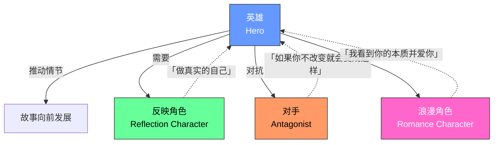
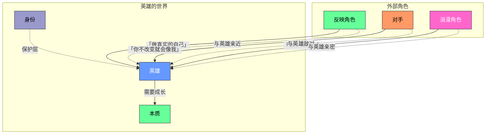

# 第10课：四种主要角色原型

> [!TIP] 本课核心洞见
> 一个好的故事不需要十几个角色——它只需要四种核心原型各司其职。理解这四种原型的互动方式，你的角色关系就会自然产生戏剧张力。

---

## Michael Hauge 的四角色系统

Michael Hauge 认为绝大多数主流电影都可以用四种角色原型来理解其角色生态系统：

---

## 1. 英雄（Hero）

**定义：** 主角，观众认同的核心角色，推动情节发展的引擎。

**外在功能：** 推动情节，追求可见目标。
**内在功能：** 经历从「身份」到「本质」的转变。

**角色定位：**
- 英雄不一定是「好人」，但观众必须**认同**她
- 英雄不一定是「最强者」，但必须有**欲望**和**行动力**
- 英雄的成长弧线是故事的情感主干

**例子：**
- *《怪物史莱克》*：Shrek
- *《泰坦尼克号》*：Jack（但也有人认为 Rose 是真正的英雄）
- *《莫扎特传》*：Salieri（他是主角，不是莫扎特）
- *《洛基》*：Rocky Balboa
- *《Erin Brockovich》*：Erin

> [!NOTE] 英雄 = 观众认同的角色
> 判断谁是英雄的标准很简单——当你走出电影院时，你**关心**谁？你希望谁成功？那个角色就是英雄。

---

## 2. 反映角色（Reflection Character）

**定义：** 与英雄最亲近的配角，担当英雄的**良知**，不断提醒英雄做真实的自己。

**外在功能：** 帮助英雄达成可见目标。
**内在功能：** 英雄的良知——说「这不是你」。

**反映角色 vs. 对手——关键区别：**

| 对比维度 | 反映角色 | 对手 |
|---------|---------|------|
| 核心信息 | 「做真实的自己」 | 「如果你不改变就会变成这样」 |
| 与英雄的关系 | 亲近、信任 | 敌对、冲突 |
| 功能 | 提醒英雄她的本质 | 体现英雄的内心冲突 |
| 典型台词 | 「你明明不是这样的人」 | 「你和我一样，别装了」 |

**反映角色的经典时刻：**
- 当英雄即将做出违背本心的决定时，反映角色站出来说：**「这不是你。」**（*This is not you.*）
- 这句话的力量在于——它是帮助英雄看清自己的镜子

**例子：**
- *《怪物史莱克》*：Donkey（不断提醒 Shrek 他并不是真的想独处）
- *《泰坦尼克号》*：Jack（他不仅是浪漫角色，也是反映角色——他看到 Rose 的本质，不断推她走向自由）
- *《洛基》*：Adrian（她看到 Rocky 的价值，相信他有能力改变）
- *《钢铁侠》*：Pepper Potts（她是 Tony 的良知，提醒他什么才是真正重要的）

> [!TIP] 反映角色的力量
> 一个出色的反映角色会让观众说：**「对，TA说得对！英雄就是应该这样！」** 她替观众说出了英雄内心深处的真相。

---

## 3. 对手（Antagonist）

**定义：** 与英雄在可见目标上冲突最大的角色，同时体现英雄的内心冲突。

**重要提示：** 对手 ≠ 反派（Villain）。

**外在功能：** 制造最大的障碍，阻止英雄达成可见目标。
**内在功能：** 体现英雄的内心冲突——如果不改变，英雄就会变成对手的样子。

**对手可以是「好人」！**

这是很多人容易忽略的一点。对手不一定邪恶，TA 只是站在英雄的对立面。

**例子：《莫扎特传》（Amadeus）**
- **英雄：** Salieri（宫廷音乐家）
- **对手：** Mozart（天才音乐家）
- 冲突来源：Salieri 追求「控制与秩序」，Mozart 代表「天赋与放纵」
- 关键：Mozart 不是坏人，他只是代表了 Salieri 内心最嫉妒但也最渴望的东西

> [!NOTE] 对手的深层含义
> 对手是英雄的**阴影**——TA 体现了英雄如果继续躲在身份里、拒绝改变的话会成为的样子。打败对手的过程，就是英雄战胜自己内心恐惧的过程。

**更多例子：**
- *《狮子王》*：Scar 不仅是夺位的叔叔，他也体现了 Simba 如果被内疚吞噬会变成的样子
- *《黑暗骑士》*：Joker 不仅是 Batman 的敌人，他也在质问 Batman 的根本信念

---

## 4. 浪漫角色（Romance Character）

**定义：** 爱情故事中英雄欲望/浪漫追求的对象，是英雄克服内心冲突后的奖赏。

**外在功能：** 英雄追求或渴望的对象。
**内在功能：** 看到英雄的本质并爱上TA——这是对英雄成长的最大肯定。

### 好的爱情故事的核心原则

> **浪漫角色看到了英雄保护性身份之下的本质，并因此爱上了TA。**

这才是真正打动人的爱情——不是因为对方的外表、地位、财富（这些都是身份的层面），而是因为浪漫角色**看穿了面具**，看到了面具下面那个真实的、脆弱的人，并且选择去爱那个人。

**例子：《泰坦尼克号》**
- Jack 看到了 Rose 的身份（上流社会的淑女面具）之下的本质——一个渴望自由、充满激情的灵魂
- 他爱上的不是 Rose 的贵族身份，而是 Rose 的本质
- 这就是为什么这段爱情如此有力——Jack 爱的不是 Rose 的「包装」，而是 Rose 本人

> [!WARNING] 常见的爱情故事陷阱
> 很多糟糕的爱情故事的共同问题：浪漫角色爱上的是英雄的身份（外表、财富、地位），而不是本质。这种爱情不会让观众感动，因为它缺乏真实性。

---

## 四种原型的关系图谱

---

> [!QUESTION] 四种原型的互动
> 为什么说反映角色和浪漫角色经常「合二为一」？请举一个熟悉的电影例子说明。

点击查看答案

在爱情故事中，反映角色和浪漫角色往往是同一个人。原因很简单：如果你真心爱一个人，你自然会希望TA做真实的自己——这既是浪漫角色的位置，也是反映角色的功能。

**典型例子：《泰坦尼克号》中的 Jack**
- 作为**浪漫角色**：Rose 爱他、被他吸引
- 作为**反映角色**：他不断鼓励 Rose 挣脱上流社会的束缚，做真正的自己（「Come on, Rose! Don't let go!」）
- 他既是 Rose 追求的对象，也是她的良知

另一个例子：《怪物史莱克》中的 Fiona
- 她是 Shrek 的浪漫角色——Shrek 最终爱上了她
- 她也充当了反映角色——她让 Shrek 意识到独处并不是他真正想要的

这种「合二为一」在爱情故事中非常常见，因为这加强了角色关系的戏剧张力：你爱的人就是那个让你面对真相的人。

---

## 本课要点速览

| 原型 | 外在功能 | 内在功能 | 核心信息 |
|------|---------|---------|---------|
| **英雄** | 推动情节 | 经历从身份到本质的转变 | 「我要改变」 |
| **反映角色** | 帮助英雄达成目标 | 英雄的良知 | 「这不是你」 |
| **对手** | 制造最大障碍 | 体现英雄的内心冲突 | 「你会变成我」 |
| **浪漫角色** | 英雄追求的对象 | 看到英雄本质并爱上TA | 「我爱真实的你」 |

- 对手不一定是反派，TA 可以是好人（如《莫扎特传》）
- 反映角色和浪漫角色在爱情故事中经常是同一个人
- 好的爱情故事的核心：浪漫角色爱上了英雄的**本质**，而不是身份

---

**继续学习：** [[0009-character-components|第09课：角色的核心构成]]