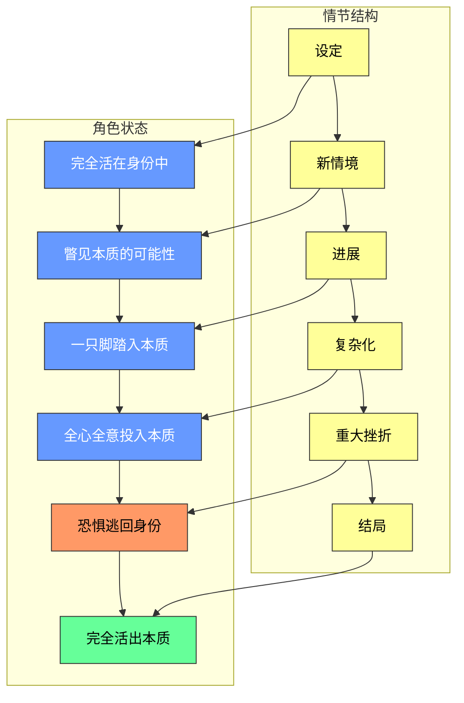
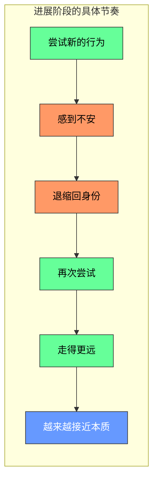

# 第11课：角色的六阶段发展

> [!TIP] 本课核心洞见
> 角色的发展不是随意编排的——它**精确对应**六阶段情节结构。每个情节阶段都有对应的角色状态。当你理解了这种对应关系，你就能让情节和角色同步推进，浑然天成。

---

## 核心对应关系

---

## 第一阶段：设定（Setup）—— 英雄完全活在身份中

**情节位置：** 0%-10%
**角色状态：** 英雄展示她的保护层，观众建立认同感。

这是一个展示「面具」的阶段。观众还看不到英雄的本质——他们只看到英雄向世界展示的那个样子。

**《怪物史莱克》例子：**
- Shrek 独自住在沼泽里
- 他在泥巴里洗澡、打嗝放屁、享受「怪物」式的生活
- 当村民来抓他时，他熟练地吓跑他们——这是他习惯了的互动方式
- 他的身份宣言：**「我一个人就很好」**

> [!NOTE] 设定阶段的核心任务
> 这个阶段不是让观众看英雄的缺陷——而是让观众**认同**英雄。通过同情、困境、讨喜、幽默、能力五种方式，让观众先和英雄建立情感连接。

---

## 第二阶段：新情境（New Situation）—— 英雄瞥见本质的可能性

**情节位置：** 10%-25%
**角色状态：** 英雄遇到机会（或被迫进入新环境），第一次看到「另一种生活」的样子。

英雄还没有改变，但她开始意识到自己的身份可能不是全部。

**《怪物史莱克》例子：**
- 童话生物入侵沼泽，Shrek 被迫踏上旅程去找 Farquaad
- 他遇到了 Donkey——一个不断侵入他私人空间的「麻烦」
- Donkey 问他：**「你真的喜欢一个人吗？还是害怕和別人一起？」**
- Shrek 没有回答，但这个问题在心里埋下了种子
- 关键变化：Shrek 第一次允许 Donkey 跟着他（虽然不情愿）

---

## 第三阶段：进展（Progress）—— 英雄一只脚踏入本质

**情节位置：** 25%-50%
**角色状态：** 英雄在身份和本质之间摇摆——**进两步，退一步**。

这是最微妙的阶段。英雄开始尝试新的行为方式，但随时会缩回原来的保护壳。

**《怪物史莱克》例子：**
- 在去救 Fiona 的路途中，Shrek 和 Donkey 的关系逐渐升温
- Shrek 开始和 Donkey 分享感受——虽然是以抱怨的方式
- 他救了 Donkey（第一次表现出对别人的在乎）
- 但在 Donkey 问「你到底为什么不让人靠近你」时，Shrek 立刻关闭了自己
- 关键观察：进两步（分享、救助）→ 退一步（关闭、否认）

> [!WARNING] 渐进式的关键
> 角色改变是**渐进的**。不要让你的英雄在第二阶段就彻底改变，那是虚假的成长。真正的成长是有起伏的——就像现实生活中一样。

---

## 第四阶段：复杂化（Complications）—— 英雄全心全意投入本质

**情节位置：** 50%-75%
**角色状态：** 英雄烧毁退路，承诺改变。

这是「不可回头点」（Point of No Return）。英雄已经在这条路上走了太远，无法假装什么都没发生。

**《怪物史莱克》例子：**
- Shrek 和 Fiona 的感情在相处中加深——他爱上了她
- 他带她去了那个著名的「火烧夕阳」场景（虽然不是故意的）
- 在 Fiona 唱完歌、小鸟爆炸后，Shrek 说：**「其实你和我想象中的公主不太一样，但我很喜欢。」**
- 这是一个本质性的时刻——Shrek 放下了怪物的自我保护，说出了真心话
- 但现在他还是不敢完全敞开心扉——他不知道 Fiona 晚上会变成 ogre

---

## 第五阶段：重大挫折（Major Setup）—— 英雄恐惧退缩，逃回身份

**情节位置：** 75%
**角色状态：** 英雄遭遇最大打击，害怕失去旧的保护，**最后一次逃回身份**。

这是角色弧的最低点。英雄在快要成功的时候被恐惧吞噬，退回到最安全的保护壳里。

**《怪物史莱克》例子：**
- Shrek 无意中听到了 Fiona 和 Donkey 的对话——Fiona 说「谁会爱上一个怪物？」
- 他立刻误解了这句话的意思（Fiona 说的是自己，不是 Shrek）
- 他愤怒地赶走 Donkey，独自回到沼泽
- 他的回归宣言：**「这就是我应有的样子——一个人，怪物，不需要任何人。」**
- 这是最令人心碎的时刻——因为他已经接近了本质，但恐惧把他拉回了身份

> [!TIP] 重大挫折的角色含义
> 这个阶段之所以叫「重大挫折」，不只是因为情节上出了大事——更是因为英雄在内心层面**放弃了自己**。她选择回到身份，因为她觉得那样更安全。优秀的编剧会在这个时刻让观众感到绝望——「不，不要回去！」

---

## 第六阶段：结局（Resolution）—— 英雄完全活出本质

**情节位置：** 75%-高潮
**角色状态：** 英雄做出最终选择，放下身份，活出真实自我。

**《怪物史莱克》例子：**
- Donkey 不放弃，追回沼泽，告诉 Shrek 真相
- Shrek 意识到自己的误解，做出选择——他要去找回 Fiona
- 在城堡塔顶，他不再躲藏，不再假装不在乎
- 他当着所有人的面承认：**「我爱你，Fiona」**
- 他接受了自己是个 ogre 的事实——也接受了 Fiona 晚上会变成 ogre 的事实
- 他没有等待「完美的自己」出现，而是拥抱了现在的自己

> 这才是真正的角色成长：不是因为变得完美了才被爱，而是因为**敢于做真实的自己**。

---

## 完整对应速览

| 情节阶段 | 角色状态 | 情节事件 | 角色行为 |
|---------|---------|---------|---------|
| 设定 | 完全活在身份中 | Shrek 在沼泽独居 | 吓跑村民，享受独处 |
| 新情境 | 瞥见本质的可能性 | 遇到 Donkey，踏上旅程 | 允许 Donkey 跟随 |
| 进展 | 一只脚踏入本质 | 和 Donkey 建立关系 | 分享、救助、又关闭自己 |
| 复杂化 | 全心全意投入本质 | 和 Fiona 相爱 | 说出真心话，表现出在乎 |
| 重大挫折 | 恐惧逃回身份 | 误解 Fiona 的话 | 赶走 Donkey，回到沼泽 |
| 结局 | 完全活出本质 | 去救 Fiona | 当众表白，接受真实的自己 |

---

## 进两步、退一步：角色变化的节奏

一个非常重要的概念：角色变化不是直线上升的，而是**波浪式前进**的。

> **进两步**——尝试新的行为方式，表现出真实的感受
> **退一步**——感到害怕，缩回旧的保护壳
> **再进两步**——在安全感的支撑下，尝试走得更远

这个节奏让角色的成长看起来**真实可信**。没有人能一夜之间改变——角色也一样。

---

> [!QUESTION] 用你自己的话解释
> 为什么角色的重大挫折阶段（75%）是她「最后一次逃回身份」？这和「英雄已经接近本质」有什么关系？

点击查看答案

这是一个残酷但真实的心理机制：**越接近目标，就越害怕失去。**

在复杂化阶段，英雄已经一只脚（有时是两只脚）踏入了本质——她开始做真实的自己，体验到了真正的连接与亲密。但正因为尝到了甜头，她也开始害怕失去这一切。

当重大挫折发生时，英雄的创伤被重新激活——那个「上次我敞开心扉被伤害了」的记忆涌上来。她的第一反应不是去面对它，而是逃回那个她熟悉的、安全的保护壳里。她对自己说：**「看到了吗？这就是为什么我不该相信任何人。」**

这就是为什么这个阶段如此关键——它是对英雄的最终考验。如果她选择留下，她就永远活不出本质。她必须**主动选择**走出身份，而不是被动逃避。

在 Shrek 的故事中，如果他不回去找 Fiona，他确实可以安全地活在沼泽里——但他将永远失去爱的可能性。重大的挫折测试的不是英雄的能力，而是她的**决心**。

---

## 本课要点速览

- 角色的六阶段发展**精确对应**六阶段情节结构
- 每个阶段英雄在身份与本质之间的位置不同
- 角色变化是**渐进式**的：进两步、退一步、再进两步
- 重大挫折阶段是英雄「最后一次逃回身份」
- 结局阶段英雄做出最终选择——完全活出本质
- 《怪物史莱克》是理解角色六阶段发展的完美范例

---

**继续学习：** [[0003-six-stage-plot|第03课：六阶段情节结构（上）]] | [[0010-four-primary-characters|第10课：四种主要角色原型]]