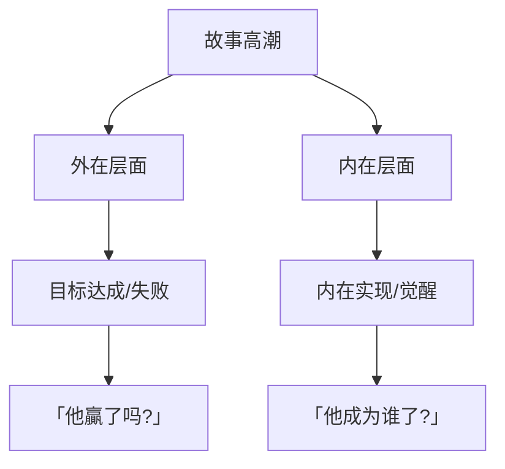
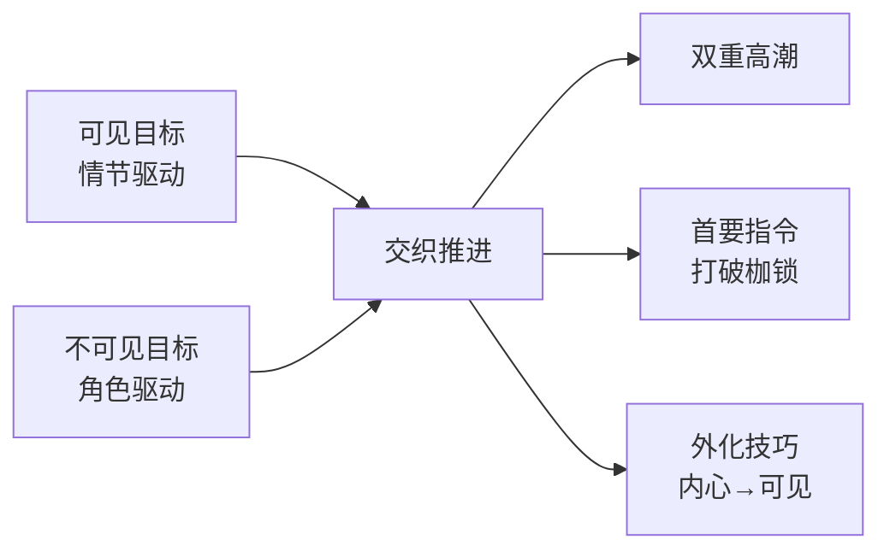

# 第12课：可见目标与不可见目标

> **核心主题**：一个故事必须同时追逐两个目标——外在的可见目标驱动情节，内在的不可见目标驱动角色蜕变。双重目标的交织才是好故事的灵魂。

---

## 什么是「可见目标」？

**可见目标（Visible Goal）** 是角色在故事中试图实现的**外在成就**。它是具体的、可衡量的、观众可以用眼睛看到的。

> 可见目标 = 角色「想要」的东西

| 类型 | 例子 |
|------|------|
| 竞赛胜利 | 赢得比赛、打败对手 |
| 完成任务 | 拯救世界、解开谜团 |
| 获得物品 | 找到宝藏、获取情报 |
| 赢得爱情 | 追求到心仪的人 |

## 什么是「不可见目标」？

**不可见目标（Invisible Goal）** 是角色在内心真正**需要**的东西。它是抽象的、情感层面的、通常角色自己都没有意识到的。

> 不可见目标 = 角色「需要」的东西

| 类型 | 例子 |
|------|------|
| 找到自我 | 认清自己真正是谁 |
| 克服恐惧 | 战胜内心的阴影 |
| 活出本质 | 不再伪装，成为真实的自己 |

---

## 两个目标必须交织推进

这是本课最重要的原则：

> [!WARNING] 黄金法则
> 可见目标与不可见目标**不能分开处理**。它们必须在故事的每一个阶段**同时推进、互相影响**。

**错误写法：** 前半段只追外在目标，结尾突然来个内心感悟。

**正确写法：** 每一次外在行动都同时改变内在状态，每一次内心觉醒都影响外在决策。

用 [[0012-visible-invisible-goal|可见目标与不可见目标]] 的理论来看：外在推动情节，内在推动角色。两者缺一不可。

---

## 双重高潮

故事的高潮具有**双重含义**：

- 外在高潮回答：「他赢了吗?」
- 内在高潮回答：「他成为谁了?」

一个伟大的故事会让两个高潮**同时发生**——在最后一刻，外在目标的成败与内在目标的实现交织在一起，产生最大的情感冲击。

---

## 角色的「首要指令」

**首要指令（Prime Directive）** 是角色从小形成的**错误信念**——它像一个隐藏的程序，控制着角色的大部分行为。

| 要素 | 说明 |
|------|------|
| 来源 | 童年的创伤或误解 |
| 内容 | 关于自己或世界的错误认知 |
| 表现 | 角色用一生在「证明」这个信念 |
| 改变 | 只有当角色敢于面对创伤，才能打破指令 |

首要指令就是角色在旅程中需要**摆脱的枷锁**。

> [!EXAMPLE] 经典范例
> 在《律师事务所》（The Firm）的结尾，主角 Mitch 说了一句关键台词：
> **「我想起法律是什么了。」**
>
> 这句话的表面意思是「我记起了法律的定义」，但深层含义是——他找到了自己的本质。他从一个被金钱和恐惧控制的律师，变回了一个真正相信正义的人。
>
> 这一刻，可见目标（摆脱黑帮控制）和不可见目标（找回自我）同时达成。

---

## 希区柯克的技巧：外化内心

阿尔弗雷德·希区柯克有一个著名技巧：**将角色的内心感受转化为可视的物体或动作。**

他的理论是：电影是视觉媒介，你不能让角色说「我很焦虑」，而要让观众**看到**焦虑。

| 内心状态 | 外化方式 |
|----------|----------|
| 焦虑 | 不断看表、手心出汗、敲桌子 |
| 恐惧 | 躲避某个人、对特定声音反应过度 |
| 内疚 | 不敢直视某人、回避某个地点 |
| 渴望 | 反复看照片、前往某个地方 |

在编剧实践中，这意味着你要为角色的**不可见目标**找到**可见的象征**。

---

## 双重目标对照表

| 维度 | 可见目标 | 不可见目标 |
|------|----------|------------|
| 本质 | 外在成就 | 内在实现 |
| 驱动 | 情节推进 | 角色发展 |
| 问题 | 他想要什么？ | 他需要什么？ |
| 呈现 | 观众看到 | 观众感受到 |
| 改变 | 改变处境 | 改变自我 |

---

> [!QUESTION] 思考练习
> 回想一部你喜欢的电影。
>
> 1. 主角的可见目标是什么？
> 2. 主角的不可见目标是什么？
> 3. 两个目标在哪个时刻交织在一起？
> 4. 如果删掉不可见目标，故事还剩什么？
>
> 

> 
点击查看提示

>
> 以《星球大战》为例：
> - 可见目标：卢克摧毁死星
> - 不可见目标：从农场男孩成长为相信原力的绝地武士
> - 交织时刻：在摧毁死星的最后一刻，他关掉瞄准器，信任原力
> - 如果删掉不可见目标：「一个男孩炸掉一个空间站」——一个毫无情感的技术活儿
>
> 

---

## 本课回顾

- **可见目标**驱动情节，回答「他想要什么?」
- **不可见目标**驱动角色，回答「他需要什么?」
- 两个目标**交织推进**，在故事高潮同时解决
- **首要指令**是角色需要打破的错误信念
- 用**外化技巧**将内心感受变成观众能看到的东西

---

**上一课：** [[0009-character-components|角色核心构成]]
**下一课：** [[0013-inner-twelve-stages|内在之旅十二阶段（上）]]