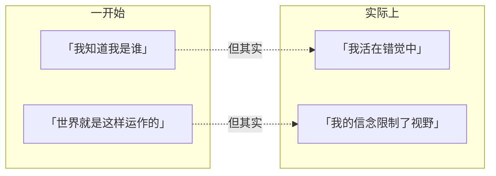
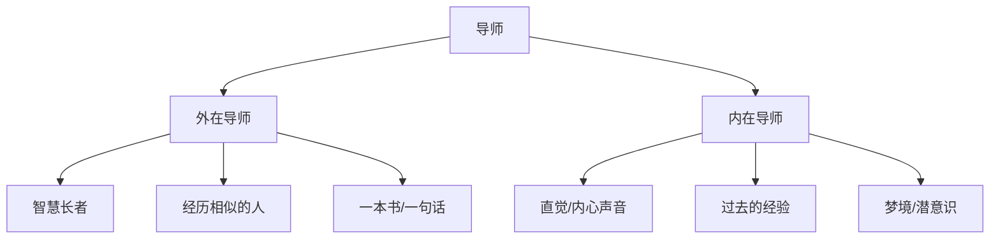
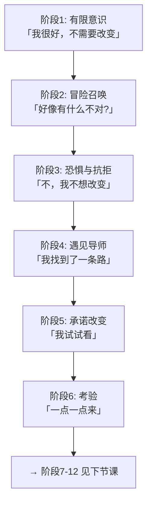

# 第13课：内在之旅十二阶段（上）

> **核心主题**：Chris Vogler 将约瑟夫·坎贝尔的「英雄之旅」解读为一场**意识的扩展过程**——从有限意识一步步走向完全觉醒。本课聚焦前六个阶段（阶段1-6）的内在视角。

---

## Vogler 的内在旅程视角

Chris Vogler 在《The Writer's Journey》中提供了一个革命性的视角：**英雄之旅的十二阶段不只是情节结构，更是一个人意识觉醒的内在过程。**

> [!NOTE] 核心洞见
> 外在旅程是「英雄做了什么」，内在旅程是「英雄成为了谁」。
>
> 十二阶段的本质是一场**意识的扩展**——从有限、受限的自我认知，到完整、觉醒的自我实现。

---

## 阶段1：有限意识

在故事开始之前，英雄处于**有限意识**状态：

- 英雄看不到自己的限制
- 英雄活在自己的「舒适区」中
- 这种限制本身就是问题的一部分
- 英雄以为世界就是他所看到的样子

> 有限意识 = 英雄以为自己知道一切，却不知道自己不知道。

---

## 阶段2：冒险召唤（意识层面）

冒险召唤不只是「有人来请英雄出发」，在内在旅程中，它是**意识层面的唤醒**：

- 日常生活出现裂痕
- 一些事情让英雄开始感到「不对劲」
- 这个召唤来自外部，但触动了内心
- 它暗示着：还有一种不同的活法

> [!TIP] 写作提示
> 好的冒险召唤应该让观众和英雄同时意识到：**改变的可能性出现了。** 哪怕英雄选择无视它，这粒种子已经种下。

---

## 阶段3：恐惧与抗拒

这是内在旅程中**最容易被忽略、却最重要的阶段**之一。

抗拒不是弱点——**抗拒本身蕴藏着力量。**

| 抗拒的表现 | 内在含义 |
|------------|----------|
| 「我不去」| 我害怕改变 |
| 「这不适合我」| 我害怕失败 |
| 「别人比我更合适」| 我害怕自己不够好 |
| 「现在时机不对」| 我还没准备好面对真实的自己 |

> 抗拒之所以重要，是因为它告诉观众：**英雄将要面对的东西对他来说真的很难。** 没有抗拒的旅程不是英雄之旅，只是观光旅行。

---

## 阶段4：遇见导师

在内在旅程中，导师不一定是白发老头或智慧长者。

**导师可以是任何帮助英雄克服阻碍的存在：**

导师的本质功能是：帮助英雄找到**克服恐惧的方式**，让他有勇气迈出下一步。

---

## 阶段5：承诺改变——跨越门槛

这是从「想改变」到「开始改变」的转折点。

英雄在这一刻**跨越门槛**——主动或被动地投入到「改变的实验」中。

| 跨越方式 | 例子 |
|----------|------|
| 主动跨越 | 英雄自己做出决定 |
| 被动跨越 | 环境迫使英雄不得不改变 |
| 无意跨越 | 英雄还没意识到自己已经跨过去了 |

> [!WARNING]
> 跨越门槛不意味着英雄已经改变了——它只意味着英雄**开始走上改变的路。** 真正的改变需要时间去完成。

---

## 阶段6：考验

这是内在旅程的「尝试期」：

- 英雄开始做一些之前不会做的事
- 这些尝试都是**小的、安全的实验**
- 关键概念：「小差异法则」

### 小差异法则

> [!IMPORTANT] 小差异法则
> 真正的改变不是来自一次巨大的突破，而是来自**微小进步的积累。**
>
> 每次只改变1%，看起来微不足道，但持续积累下来，就会形成巨大的转变。

| 时间 | 1%的改变积累 |
|------|-------------|
| 第1天 | 看不出来 |
| 第10天 | 几乎看不出来 |
| 第30天 | 有点感觉了 |
| 第100天 | 明显不同 |
| 第365天 | 判若两人 |

**在故事中的应用：**

英雄在考验阶段所做的每一件小事，都是在为最后的大转变做铺垫。这些尝试可能失败，可能成功，但它们都在改变英雄的**自我认知**。

---

## Vogler 的个人案例

Chris Vogler 本人曾分享过他自己的生活方式改变的例子：

他想改变自己的饮食习惯——不是一下子戒掉所有不健康食物，而是每天做一个小选择：

- 今天多吃一份沙拉
- 今天少喝一瓶汽水
- 今天走楼梯而不是坐电梯

这些细微的选择累积起来，最终改变了整个生活方式。

> 这也说明了为什么「小差异法则」在叙事中如此有效——观众能理解它，因为它真实。

---

## 阶段1-6 全景图

---

> [!QUESTION] 思考练习
> 回想你最喜欢的一部电影的主角。
>
> 1. 主角在故事开始时的「有限意识」是什么？他/她对自己的认知局限在哪里？
> 2. 冒险召唤是什么时候出现的？主角如何反应？
> 3. 主角的恐惧和抗拒表现在哪里？这种抗拒为什么是有力量的？
> 4. 谁是主角的「导师」？导师给了他/她什么（不止是技能）？
> 5. 主角跨越门槛的那一刻，是主动的还是被动的？
> 6. 在考验阶段，主角做了哪些「小实验」来尝试改变？
>
> 

> 
点击查看参考答案

>
> 以《黑客帝国》的尼奥为例：
>
> 1. **有限意识**：尼奥认为自己只是一个普通程序员，叫安德森先生，生活在一个正常的世界里。
> 2. **冒险召唤**：墨菲斯通过电脑联系他，说「你在寻找什么」。尼奥开始怀疑世界的真实性。
> 3. **恐惧与抗拒**：尼奥说「我不想要任何麻烦」——他想回到安全的生活里。这种抗拒让后续的选择更有分量。
> 4. **导师**：墨菲斯。他给了尼奥的不是格斗技能（那只是工具），而是「选择」——让他看到真相的勇气。
> 5. **跨越门槛**：红药丸蓝药丸——尼奥主动选择了红药丸。
> 6. **考验**：训练程序中的一次次练习，从「我不会功夫」到「我准备好了」。
>
> 

---

## 本课回顾

- Vogler 的内在旅程 = **意识觉醒的六个步骤**
- 阶段1-3：**从无知到觉醒**（有限意识 → 召唤 → 抗拒）
- 阶段4-5：**从抗拒到承诺**（导师 → 跨越门槛）
- 阶段6：**从承诺到实践**（小实验积累）
- **小差异法则**：真正的改变来自1%的积累，不是一次性的飞跃

---

**上一课：** [[0012-visible-invisible-goal|可见目标与不可见目标]]
**下一课：** [[0014-inner-twelve-stages-2|内在之旅十二阶段（下）]]