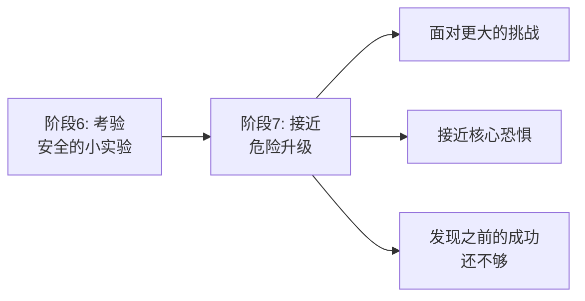
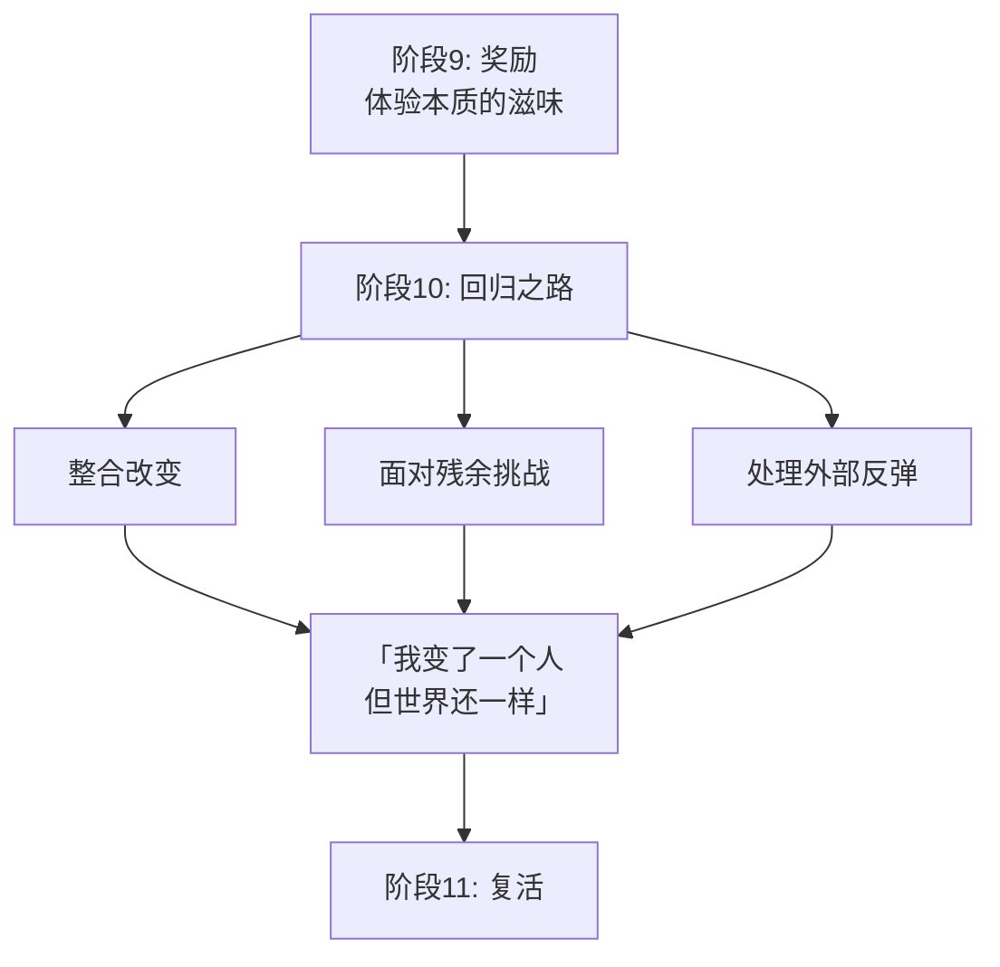
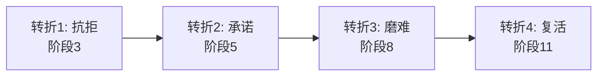
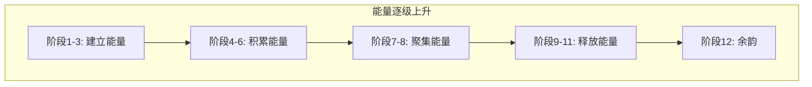
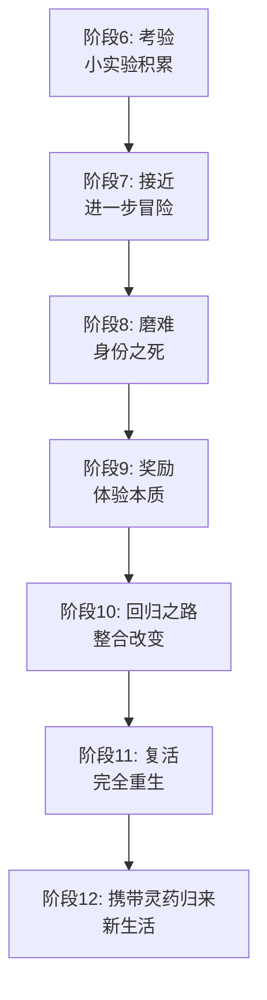

# 第14课：内在之旅十二阶段（下）

> **核心主题**：内在旅程的后六个阶段（阶段7-12）从「接近最深恐惧」到「带着灵药归来」，完成意识扩展的全过程。本课揭示这四个主要转折点如何塑造角色的蜕变弧线。

---

## 阶段7：接近

英雄在前六阶段中完成了「小实验」和初步尝试，现在到了**更进一步**的时候了：

- 冒险变得更加危险
- 英雄接近了自己最深层的恐惧
- 之前的舒适区已经回不去了
- 这是暴风雨前的宁静

> 接近阶段的核心动态：**英雄知道前方有什么，但仍然选择前进。**

---

## 阶段8：磨难——身份之死

这是内在旅程的**核心转折点**，也是整部故事的情感顶点。

> [!WARNING] 核心概念
> 在磨难阶段，英雄经历的是一次**身份之死**——旧有的自我认知被彻底摧毁，为新的自我让出空间。

| 维度 | 旧的（死亡） | 新的（诞生） |
|------|-------------|-------------|
| 信念 | 我一直相信的 | 我真正需要的 |
| 身份 | 我假装是谁 | 我其实是誰 |
| 恐惧 | 我逃避的东西 | 我面对的东西 |

磨难不是「英雄差点死掉」——虽然在外在情节层面上它经常表现为生死危机。在内在旅程的层面上，磨难是：

> **英雄必须放弃那个「不真实的自己」，才能真正活出本质。**

---

## 阶段9：奖励

在经历了身份之死后，英雄得到了**奖励**：

- 这个奖励不是外在的战利品
- 它是一次**体验本质的滋味**
- 英雄第一次感受到「如果我是真实的自己会怎样」
- 这个时刻通常短暂但深刻

| 外在层面 | 内在层面 |
|----------|----------|
| 获得圣杯 | 体验到自我价值的滋味 |
| 救出公主 | 体验到爱的真正含义 |
| 找到宝藏 | 体验到内心的充实 |
| 打败敌人 | 体验到自信的力量 |

> [!NOTE]
> 奖励阶段很重要，因为它给了英雄一个**示范**——让他知道真正的自己到底是什么样的。这个体验会支撑他走完剩下的旅程。

---

## 阶段10：回归之路

奖励之后，英雄需要**带着新的自我回到现实世界**。

回归之路的挑战：

- 如何将内在的改变**整合**到日常生活中？
- 如何面对那些还没有完全解决的挑战？
- 如何应对那些还停留在「旧版本」的他人？

---

## 阶段11：复活——完全重生

复活是内在旅程的**第二次死亡与重生**（比磨难阶段更完整、更彻底）。

### 磨难 vs 复活

| 对比维度 | 磨难（阶段8） | 复活（阶段11） |
|----------|--------------|----------------|
| 死亡什么 | 旧身份的核心部分 | 最后残留的旧执念 |
| 发生在 | 特殊世界内部 | 回到普通世界的边界 |
| 程度 | 部分死亡 | 完全重生 |
| 效果 | 体验到另一种可能 | 彻底变成新的人 |

复活阶段是英雄的**最后一次考验**——在外部故事中通常表现为最终决战或终极选择。在内在旅程中，它是：

> **英雄彻底释放旧我，成为新我。**

---

## 阶段12：携带灵药归来

英雄带着改变回到「普通世界」，开始新的生活。

| 灵药的形式 | 具体例子 |
|------------|----------|
| 新的心态 | 不再恐惧、不再自我否定 |
| 新的认知 | 理解了世界和自己的关系 |
| 实际的智慧 | 学到的教训可以分享 |
| 象征性物品 | 提醒自己改变的纪念品 |
| 新的关系 | 能够与他人建立真实的连接 |

灵药的本质是：**英雄拥有了之前没有的东西**——这个东西使得他无法再回到原来的状态。

---

## 四个主要转折点

在整个十二阶段中，有四个转折点最为关键：

| 转折点 | 阶段 | 动态 |
|--------|------|------|
| 抗拒 | 3 | 英雄说「不」——这是改变的起点 |
| 承诺 | 5 | 英雄说「好」——这是改變的開始 |
| 磨难 | 8 | 英雄失去旧我——这是改变的核心 |
| 复活 | 11 | 英雄成为新我——这是改变的完成 |

---

## 每个阶段都是一场「微型剧」

> [!IMPORTANT] 写作技巧
> 十二阶段的每一个阶段本身就是一场**「微型剧」**——有自己的起承转合、自己的小高潮、自己的小奖励。
>
> 好的编剧会让每个阶段都像一个迷你故事一样有吸引力，而不是「生硬的过渡」。

---

## 关于「高潮」一词

「高潮」（Climax）一词源自希腊语 **klimax**，原意是「梯子」。

> 它的原义是能量**逐级上升**到达顶峰，而不是突然的爆发。

这意味着：

- 故事的能量在整部电影中**逐步积累**
- 每一个阶段都在为高潮**添砖加瓦**
- 高潮之所以有力量，是因为前面的铺垫足够充分

---

## 一个重要提醒

> [!CAUTION]
> **不是所有故事都需要角色改变。**
>
> 你可以写一个完全不变的人的故事——一个从头到尾都坚守自己原则的英雄。
>
> 双重旅程理论提供的是**工具**，不是**规则**。有些故事是关于一个人**坚持自我**而非**改变自我**的。只要你明确自己的选择并且知道为什么这么选，那就没有问题。

---

## 阶段7-12 全景图

---

> [!QUESTION] 思考练习
> 回顾一部你看过多次的电影，用内在十二阶段进行分析：
>
> 1. 第七阶段（接近）中，英雄面对了什么更深层的恐惧？
> 2. 第八阶段（磨难）中，英雄的「身份之死」发生在哪个时刻？旧我中的什么被摧毁了？
> 3. 第九阶段（奖励）中，英雄体验到了什么？这个体验为什么是短暂的？
> 4. 第十阶段（回归之路）中，英雄遇到了什么整合的困难？
> 5. 第十一阶段（复活）中，最后残留的旧执念是什么？英雄如何彻底放下它？
> 6. 第十二阶段（灵药）中，英雄带回了什么？这改变了英雄的什么？
>
> 

> 
点击查看参考答案

>
> 以《玩具总动员》的胡迪为例：
>
> 1. **接近**：胡迪意识到巴斯光年不只是新玩具，而是安迪可能更喜欢他——接近了自己「不被爱的恐惧」。
> 2. **磨难**：在加油站，胡迪看到巴斯被 Sid 的妹妹拿走——他作为「安迪最爱的玩具」的身份被摧毁了。
> 3. **奖励**：胡迪和巴斯成为朋友——体验到了「友情」而非「地位」的价值。
> 4. **回归之路**：胡迪和巴斯必须从 Sid 家回到安迪家——物理上和情感上的回归同步进行。
> 5. **复活**：胡迪选择不去争宠，而是帮助巴斯回到安迪身边——放下「我是第一」的执念。
> 6. **灵药**：胡迪学会了分享——他不再需要「唯一被爱」来证明自己的价值。
>
> 

---

## 本课回顾

- **阶段7-9**：面对最深恐惧，经历身份之死，体验本质
- **阶段10-12**：整合改变，完全重生，带灵药归来
- **四个转折点**：抗拒 → 承诺 → 磨难 → 复活
- **高潮是梯子**：能量逐级上升，不是突然爆发
- **每个阶段都是微型剧**：有自己的起承转合
- 不是所有故事都需要角色改变——工具在选择，不在规则

---

**上一课：** [[0013-inner-twelve-stages|内在之旅十二阶段（上）]]
**下一课：** [[0015-qa-deeper|Q&A 深入探讨]]