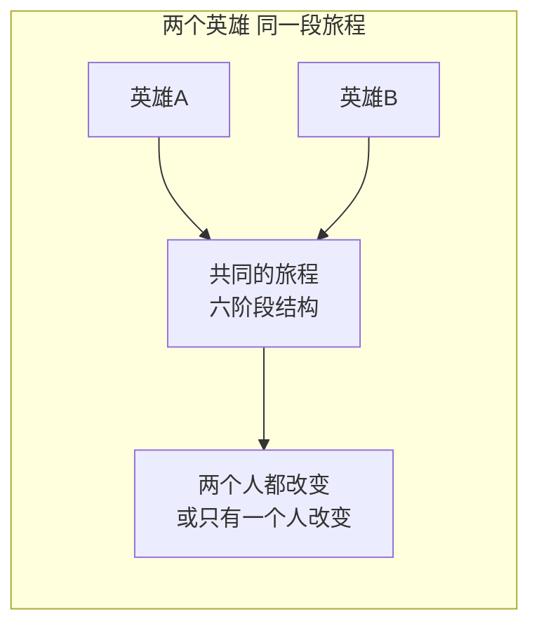
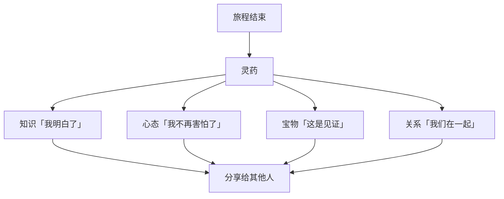
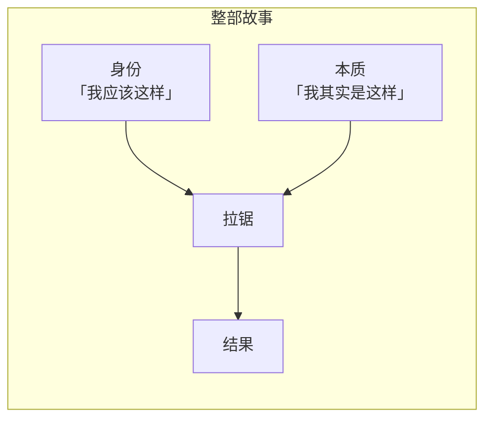
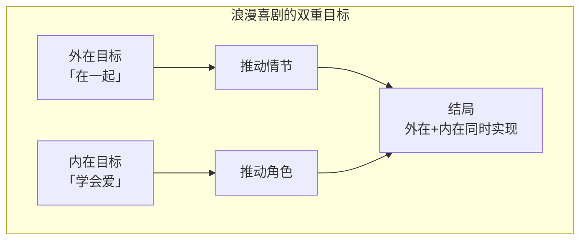

# 第15课：Q&A 深入探讨

> **核心主题**：针对双重旅程理论在实际写作中常见的疑问进行深入解答。从类型适用性到具体写作技巧，本课涵盖了一系列实战问题。

---

## Q1：六阶段结构适用于所有类型吗？

**是的。** 六阶段结构不是动作片的专利。

| 类型 | 六阶段的应用方式 |
|------|------------------|
| 动作片 | 外在旅程明显，冲突表现为物理对抗 |
| 喜剧 | 主角的「缺陷」制造笑点，六阶段表现为改变的过程 |
| 爱情片 | 「正常世界」是单身，「新情境」是遇到对方，「进展」是关系发展 |
| 剧情片 | 六阶段更加内化，冲突更多是情感层面的 |
| 恐怖片 | 「特殊世界」是危险场所，进展是恐惧不断升级 |

> 六阶段是**深层结构**，不是**表层模板**。不同的类型穿不同的外衣，但骨架是相通的。

---

## Q2：双重主角怎么办？

**双重主角不改变六阶段结构。** 两个英雄共同经历同一段旅程。

关键要点：

- 两个英雄可以是**互补的**（各自的弱点被对方的优势弥补）
- 两个英雄可以经历**不同的内在旅程**（虽然外在旅程相同）
- 其中一个英雄可能在途中「掉队」（死亡或放弃）
- 有时候看似是双重主角，实际上一个只是「镜像」或「导师」

---

## Q3：进展阶段的障碍怎么设计？

进展阶段的障碍设计有一条核心原则：

> [!IMPORTANT] 障碍设计原则
> 障碍可以**绕过**，可以**延迟**，但**不会被消除**——除非英雄发生了真正的改变。

### 障碍的三种操作方式

| 方式 | 说明 | 例子 |
|------|------|------|
| 绕过 | 找到另一条路，不直接面对 | 从侧门进入，避开守卫 |
| 延迟 | 暂时解决，但问题会回来 | 先对付小喽啰，Boss还在后面 |
| 消除 | 彻底解决（应避免，除非伴随角色改变） | 英雄克服恐惧后，之前的障碍自然消失 |

障碍设计的本质是：**每一个障碍都迫使英雄做出选择，而每一个选择都在塑造英雄。**

---

## Q4：灵药（Elixir）到底是什么？

灵药是英雄在旅程结束后 **带回普通世界的东西**。

| 灵药的类型 | 具体例子 |
|------------|----------|
| 知识 | 理解了某个道理、学会了一门技能 |
| 经验 | 经历了某些事情后心态改变 |
| 改变的心态 | 不再恐惧、不再自我否定、学会信任 |
| 实际的宝物 | 具体的物品（通常是象征性的） |
| 新关系 | 找到了真爱、与家人和解 |

灵药的核心功能是：**英雄无法回到旅程开始前的状态。** 灵药使他永远地改变了。

---

## Q5：故事可以从「特殊世界」开始吗？

**可以。** 但需要一个快速建立认同感的过程。

如果一个故事直接从特殊世界开始（比如《疯狂的麦克斯》），观众没有任何参照系，会感到迷失。

### 快速建立认同感的技巧

1. **通过英雄的反应「定义」世界**——英雄对这个世界感到正常，说明对观众不正常的在这里是正常的
2. **找一个「参照角色」**——一个和观众一样对这个世界感到困惑的角色
3. **用细节暗示「普通世界」的存在**——一句对白、一个闪回、一张照片

---

## Q6：内心冲突如何发展？

内心冲突的本质是一场**身份 vs 本质**的拉锯战。

| 阶段 | 身份占上风 | 本质占上风 |
|------|-----------|-----------|
| 开场 | 绝大部分 | 几乎看不见 |
| 进展 | 逐渐松动 | 逐渐浮现 |
| 中间 | 剧烈拉锯 | 越来越强 |
| 高潮 | 最后挣扎 | 最终胜利 |
| 结尾 | 被释放 | 完全主导 |

这场拉锯不是线性发展，而是**反复的**——英雄会在「退回身份」和「迈向本质」之间来回摇摆。这种摇摆是让角色显得真实的关键。

---

## Q7：主题（Theme）到底是什么？

> 主题 = 这个故事**真正关于什么**

主题不是「爱情」或「正义」这样的单一词汇，而是一个**完整的命题**：

| 不是主题 | 是主题 |
|----------|--------|
| 「这是一个关于爱情的故事」| 「真正的爱需要牺牲而不是占有」|
| 「这是一个关于正义的故事」| 「正义不是复仇，而是重建」|
| 「这是一个关于成长的故事」| 「成长意味着接受自己的不完美」|

在双重旅程的理论框架下：

> **英雄从身份到本质的转变本身，就是主题的表达。**

一个关于「勇敢」的主题，不是通过角色说「我很勇敢」来表达的，而是通过角色从一个懦弱者变成一个勇敢者的**过程**来表达的。

---

## Q8：创伤必须在开场时揭示吗？

**不一定。** 创伤的揭示时机可以根据叙事需要灵活安排。

| 揭示时机 | 效果 | 例子 |
|----------|------|------|
| 开场（前10分钟） | 观众从一开始就理解角色的行为动机 | 《海底总动员》——马林失去家人 |
| 进展中段 | 在一个关键时刻揭示，提升情感冲击 | 《唐人街》——逐步揭露伊芙琳的过去 |
| 接近高潮 | 大反转效果，但需要前期的暗示 | 《第六感》——揭示布鲁斯·威利斯的真实状态 |

**技巧提示：** 即使创伤在后期才完全揭示，前期也必须有**线索或暗示**——观众应该能在事后回想时发现：「原来如此！」

---

## Q9：浪漫喜剧中，内在动机和外在动机哪个更重要？

> 在浪漫喜剧中，**内在动机比外在动机更重要。**

原因：浪漫喜剧的外在目标通常很简单（「我要和这个人在一起」「我要在婚礼前找到真爱」），但观众真正关心的不是「他们能否在一起」，而是：

- 他们会变成更好的人吗？
- 他们会克服自己的缺陷吗？
- 他们会学会真正去爱吗？

好的浪漫喜剧会让主角的**个人成长**成为「能否获得爱情」的前提条件。

---

## Q10：追求真相主题的写作框架

一个关于「追求真相」的故事，可以按照以下框架来搭建：

1. **起点**：主角活在一个谎言或误解中（自己骗自己或被别人骗）
2. **触发**：一个事件让主角开始怀疑「真相不是这样的」
3. **阻力**：有人或环境在阻止主角靠近真相——这个阻力通常是来自外部（他人）和内部（自己不愿意接受）的双重阻力
4. **逼近**：主角一步步接近真相，每接近一步都要付出代价
5. **真相**：真相被揭示——往往不是主角预期的那样
6. **接受**：主角接受真相，并因此改变

> [!EXAMPLE] 应用范例
> 《罗生门》——每个人都有自己的「真相」，真正的「真相」是什么？
> 《楚门的世界》——「真相」是楚门生活的整个世界都是假的。
> 《谋杀绿脚趾》——「真相」有时候不重要，重要的是你选择了相信什么。

---

> [!QUESTION] 思考练习
>
> 1. 选一个你正在构思的故事，它的六阶段结构可以用在哪种类型中？
> 2. 如果你有两个主角，他们的内在旅程分别是什么？他们如何互相影响？
> 3. 你的故事中，进展阶段最大的障碍是什么？英雄必须付出什么代价才能跨越它？
> 4. 你的故事的主题是什么？试着用一句话写出来。
> 5. 你的故事始于「正常世界」还是「特殊世界」？如果是后者，你准备如何让观众快速进入状态？
>
> 

> 
点击查看参考答案

>
> 这些问题没有标准答案——它们是为你的故事量身定做的诊断工具。以下是每个问题背后的检验标准：
>
> 1. **类型适配**：如果你发现六阶段结构「不适合」你的类型，很可能是你还没有找到该类型在六阶段中的对应方式。再想一下。
> 2. **双重主角**：如果两个主角的内在旅程完全一样，你实际上只写了一个主角的分身。考虑让他们互补。
> 3. **障碍**：如果障碍可以被轻易消除，它还不够大。真正的障碍应该迫使英雄改变。
> 4. **主题**：一句话主题是整个故事的「北极星」——如果写不出来，说明故事的核心还不够清晰。
> 5. **世界设定**：如果一个故事全部发生在特殊世界，观众的代入感会降低。总得有一个「回家的路」。
>
> 

---

## 本课回顾

- **类型不是限制**——六阶段适用于所有类型，只是表现方式不同
- **双重主角**——两个英雄共同经历旅程，内在旅程可以不同
- **障碍设计**——障碍可以绕过或延迟，但不会被轻易消除
- **灵药**——知识、心态、宝物、关系，英雄带回的东西
- **内心冲突**——身份 vs 本质的拉锯贯穿始终
- **主题**——英雄从身份到本质的转变本身就是主题
- **创伤揭示**——前后呼应最重要，时机可以灵活

---

**上一课：** [[0014-inner-twelve-stages-2|内在之旅十二阶段（下）]]
**下一课：** [[0016-erin-brockovich|案例拆解 — Erin Brockovich]]

---

> [!NOTE] 附加资源
> 参见 [[reference/glossary|术语表]] 了解更多关键词定义。