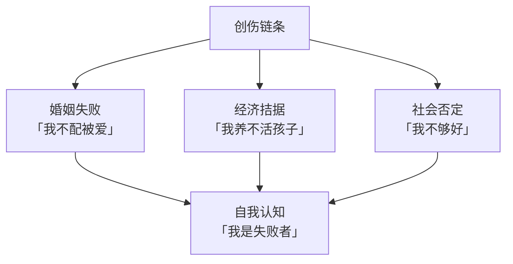
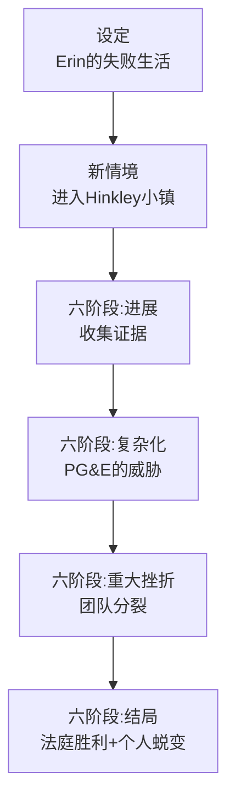
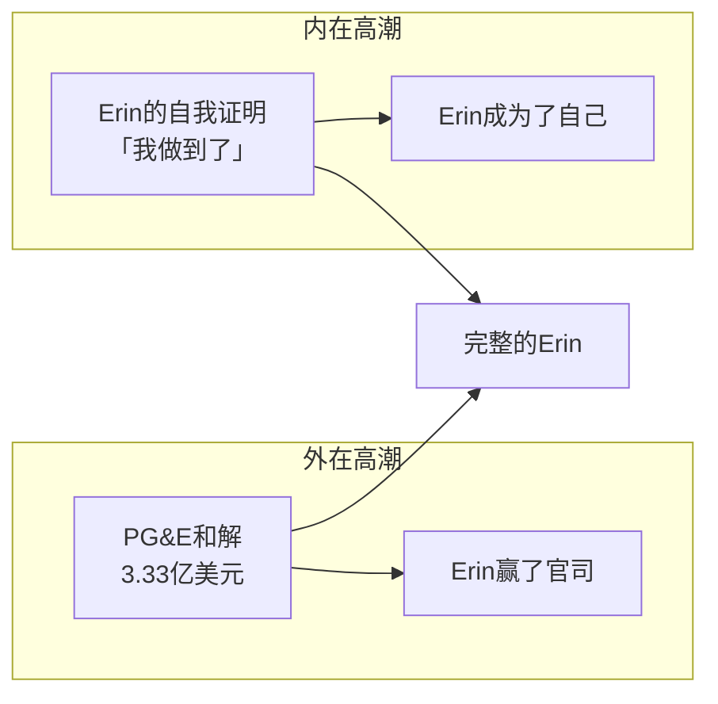

# 第16课：案例拆解 — Erin Brockovich

> **核心主题**：用双重旅程理论全面拆解《Erin Brockovich》（永不妥协）。从角色核心构成到六阶段结构，看真实故事如何被铸造成经典的英雄旅程。

---

## 电影简介

《Erin Brockovich》（2000年，导演 Steven Soderbergh，主演 Julia Roberts，荣获奥斯卡最佳女主角）讲述了一个真实故事：

**一个没有法律背景的单身母亲，凭着一股倔强和正义感，揭发了太平洋燃气电力公司（PG&E）对饮用水的污染，促成了美国历史上最大的一笔环境诉讼和解——3.33亿美元。**

---

## 角色核心构成

### 持久缺陷

Erin 的持久缺陷是**自我毁灭的行为模式**：

| 表现 | 说明 |
|------|------|
| 言语犀利 | 说话不过滤，想什么说什么 |
| 不信任权威 | 对律师、法官、医生等权威人物天然抵触 |
| 极端固执 | 认定的事绝不退让，即使对自己不利 |
| 冲动决策 | 凭情绪做决定，不顾后果 |

> 这些「缺陷」在故事中既是她的弱点，也是她的力量——当她用它们来捍卫正义时，它们就变成了武器。

### 创伤

Erin 的创伤是层层叠加的：

1. **失败的婚姻**——两次离婚，独自抚养三个孩子
2. **经济困境**——银行账户只有几百美元，连牛奶都买不起
3. **社会否定**——被贴上「不靠谱」「没学历」「没教养」的标签
4. **一场车祸**——正是在这起交通事故的诉讼中，她走进了 Ed Masry 的律师事务所

### 身份 vs 本质

| 维度 | 内容 |
|------|------|
| 身份（身份） | 「我是失败的单身母亲」「我不是专业人士」「我什么都不懂」|
| 本质（本质） | 「我天生就有正义感」「我善于与人沟通」「我能看到别人看不到的东西」|

**关键洞察**：Erin 的本质一直存在，只是她被自己的身份认知压得喘不过气来。

### 渴望

Erin 最深层的渴望是：

> **被认真对待、证明自己的价值。**

她不需要别人说她「好」，她需要别人看到她的「好」。

| 表层渴望 | 深层渴望 |
|----------|----------|
| 找到一份工作 | 证明自己不是失败者 |
| 打赢 PG&E 的官司 | 证明「小人物」也能扳倒「大公司」 |
| 得到 Ed 的认可 | 被真正地尊重和信任 |

---

## 双重目标

| 目标类型 | 内容 |
|----------|------|
| 外在目标 | 打赢 PG&E 的官司，为受害者争取赔偿 |
| 内在目标 | 从不被认可的单身母亲成长为自信的正义斗士 |

外在目标推动了整部电影的**情节**——收集证据、组织受害者、对抗 PG&E。
内在目标推动了 Erin 的**角色发展**——从自我怀疑到自信，从被轻视到被尊重。

---

## 六阶段结构分析

### 第一幕：设定

**Erin 的「正常世界」：**

- 正在打一场交通事故的官司
- 经济极度拮据
- 输掉了官司，因为她的律师 Ed 不够准备充分
- 她去 Ed 的律所软磨硬泡，最终得到一份文件整理的工作

> 在这个阶段，我们看到了 Erin 的：彪悍、不屈、还有她的自我毁灭倾向。她赢了 Ed 的一分好感（被雇佣），但也彰显了她的所有缺陷。

### 第二幕：新情境

**进入特殊世界：**

- Erin 在整理文件时发现了一个医疗记录中可疑的水质信息
- 她不顾 Ed 的反对，坚持要去调查
- 她开车到了 Hinkley 小镇
- 在这个「新世界」里，Erin 是彻底的 outsider——一个穿超短裙的单身母亲，在保守的小镇上格格不入

> 新情境的核心是：**Erin 进入了一个她完全不懂的世界（法律/环境科学）**，但她敢于承认自己「不懂」并开始学习。

### 第三幕：进展

**Erin 开始行动：**

- 逐家拜访 Hinkley 的居民，记录他们的病症
- 自学了水质报告、化学分析、法律判例
- 从一开始的被拒绝、被怀疑，到逐渐赢得居民的信任
- 收集了600多个受害者的资料

**同步的内在进展：**

- Erin 开始意识到：我可以做到一些事
- 她的「身份」（我不是专业人士）在一点点松动
- 她开始穿得更「专业」——这是一个微妙但重要的外在信号

### 第四幕：复杂化

**障碍升级：**

- PG&E 开始反击——威胁、利诱、拖延
- Ed 对这个案子有犹豫——成本太高，风险太大
- Erin 自己的精力问题——三个孩子、一份工作、一个巨大的案子，她在崩溃边缘
- 律所的合伙人反对投入太多资源在这个案子上

**深层的复杂化：**

> 来自 [[0003-six-stage-plot|六阶段情节结构]] 的理论：复杂化的本质是**角色必须面对自己最不愿意面对的东西。**

对 Erin 来说，最大的敌人不是 PG&E，而是**「所有人都说我不行」**——而这个声音已经内化成了她自己的声音。

### 第五幕：重大挫折

**几乎失去一切：**

- 律所因为财务压力决定减少投入
- 律所合伙人质疑 Erin 的能力
- Erin 和 Ed 爆发激烈争吵
- Erin 一度被调离这个案子
- 她回到家里，面对一堆账单和无助的自己

**这是故事的最低点**——不是外在目标的最坏情况，而是她内心最黑暗的时刻：**「也许我确实不行。」**

### 第六幕：结局

**从最低点反弹：**

- Ed 意识到 Erin 是对的，重新把她调回案子
- Erin 带着 600 多位受害者与 PG&E 对簿公堂
- 最终和解金额：3.33 亿美元
- 每个受害者平均获得 25 万美元赔偿

**内在结局：**

- Erin 对着 Ed 微笑——这个微笑的含义是：**「我做到了。」**
- 她不再是那个「失败的单身母亲」
- 她成为了一个改变了 600 多个家庭命运的人
- 她没有成为律师，但她成为了她自己

---

## 高潮的双重含义

外在胜利（打赢官司）和内在胜利（证明自己不被否定）在最后一刻同时达成。

---

## 关键写作启示

### 1. 缺陷即力量

Erin 的缺陷（彪悍、固执、冲动）在故事前半段让她处处碰壁，但在后半段成为她对抗 PG&E 的武器。

> 写作启示：不要创造一个「完美」的主角。**角色的最大缺陷，往往也是他最大的力量——只是需要放在正确的地方。**

### 2. 身份之死

Erin 在重大挫折阶段经历了「身份之死」——她差一点就相信了「我确实不行」的结论。但正是因为这个时刻足够黑暗，后面的反弹才足够有力。

### 3. 可见的内心变化

导演用非常微妙的外在细节来表现 Erin 的内在变化：

| 阶段 | 外在变化 |
|------|----------|
| 开场 | 超短裙、深V上衣、丰满的首饰 |
| 进展 | 开始穿衬衫 |
| 后期 | 专业套装、简单发型 |

不需要她说什么——观众能看到她在变化。

---

> [!QUESTION] 思考练习
>
> 1. Erin 的「首要指令」（Prime Directive）是什么？她从小形成的错误信念是什么？
> 2. Erin 在哪个时刻「跨越门槛」？是她主动的还是被动的？
> 3. Erin 的「导师」是谁？导师给了她什么帮助？
> 4. Erin 在「特殊世界」中面对的「考验」是什么？她做了哪些「小实验」？
> 5. Erin 的「灵药」是什么？她带回了什么？
>
> 

> 
点击查看参考答案

>
> 1. **首要指令**：Erin 的深层信念是「我不够好，我不值得被认真对待」。这个信念来自她过去的失败和周围人的否定。她一生都在「证明」这个信念——同时也在「反抗」这个信念。
>
> 2. **跨越门槛**：当 Erin 不顾 Ed 的反对，自己开车去 Hinkley 调查时。这是她主动选择的——从一个「被雇佣的文件管理员」变成了「自封的调查员」。
>
> 3. **导师**：Ed Masry（Albert Finney 饰演）。他给了 Erin 的不仅是法律知识，更是一个「被信任的机会」——尽管他经常和她争吵，但他最终站在了她这一边。
>
> 4. **考验**：挨家挨户走访居民。这是她的小实验——从第一次被拒绝、被怀疑，到学会如何与人沟通，如何建立信任。每一个访问都是她「律师」身份的一次练习。
>
> 5. **灵药**：Erin 带回来的是「自信」和「被看见的存在感」。她不再需要通过别人来证明自己的价值——她已经证明了给自己看。
>
> 

---

## 本课回顾

- **角色核心**：持久缺陷、创伤、身份 vs 本质、渴望——Erin 的每一个元素都清晰可见
- **双重目标**：外在（打赢官司）+ 内在（证明自己），交织推进
- **六阶段结构**：设定→新情境→进展→复杂化→重大挫折→结局，完美对应
- **身份之死**：在重大挫折阶段，Erin 面对「我可能确实不行」的深渊
- **内外同步**：外在胜利（官司）和内在胜利（成为自己）同时达成
- **缺陷即力量**：Erin 的缺陷在后半段成为她最大的武器

---

**上一课：** [[0015-qa-deeper|Q&A 深入探讨]]
**下一课：** [[0017-recap|旅程回顾与下一步]]

---

> [!NOTE] 附加资源
> 参见 [[reference/glossary|术语表]] 了解更多关键词定义。