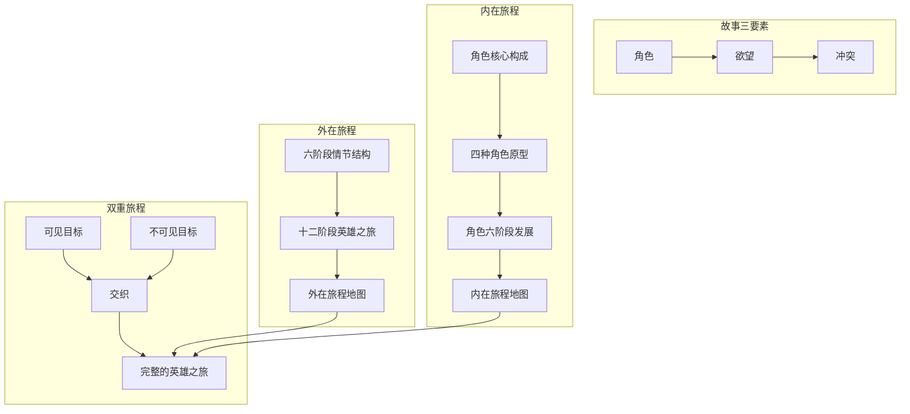
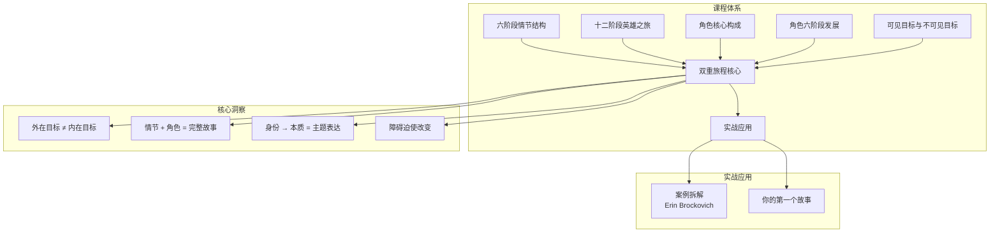
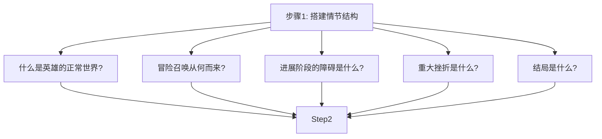
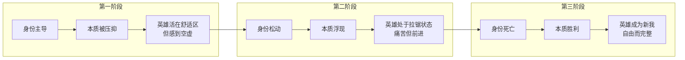
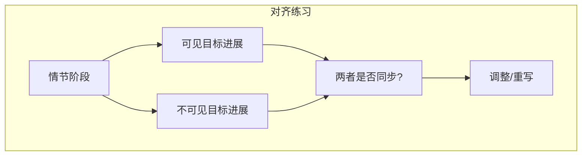

# 第17课：旅程回顾与下一步

> **核心主题**：将整个「双重旅程」课程的核心框架进行一次全景式的回顾与整合，并提供下一步的实践方向和阅读资源。

---

## 全景回顾

整个课程的核心框架可以用一个简单而强大的公式来概括：



---

## 核心框架分解

### 故事的三要素

一切故事的基础：

```
故事 = 角色 + 欲望 + 冲突
```

| 要素 | 问题 | 说明 |
|------|------|------|
| 角色 | 谁的故事？ | 一个有缺陷、有渴望的人 |
| 欲望 | 他想要什么？ | 驱动故事前进的动力 |
| 冲突 | 什么东西阻止他？ | 故事之所以存在的原因 |

没有欲望，故事会停滞。没有冲突，故事会无聊。没有角色，故事没有意义。

---

### 外在旅程地图

**六阶段情节结构**（[[0003-six-stage-plot|六阶段情节结构]]）提供了情节的骨架：


**十二阶段英雄之旅**（[[0006-twelve-stages|十二阶段]]）提供了更细致的旅程地图，并在每一个阶段融入了内在视角。

---

### 内在旅程地图

**角色核心构成**（[[0009-character-components|角色核心构成]]）：

| 元素 | 问题 |
|------|------|
| 渴望 | 他最深切想要的是什么？ |
| 创伤 | 他过去经历的什么让他变成了现在这样？ |
| 身份 | 他认为自己是谁？ |
| 本质 | 他真正是谁？ |

**四种角色原型**（[[0011-six-stages-character|角色六阶段发展]]）：

- 渴望 → 故事驱动力
- 创伤 → 行为根源
- 身份 → 要放下的枷锁
- 本质 → 要实现的真我

**角色六阶段发展**与情节六阶段一一对应，同步推进。

---

### 双重目标的交织

**可见目标**（外在成就）× **不可见目标**（内在实现）

[[0012-visible-invisible-goal|可见目标与不可见目标]] 的核心原则：

> 每一个外在行动都应该影响内在状态，每一次内心觉醒都应该改变外在决策。

---

## 完整体系全景图



---

## 双重旅程在实际写作中的应用流程

### 第一步：先确定情节结构

从六阶段或十二阶段入手，搭建故事的**外在骨架**：



### 第二步：再设计角色构成

在情节骨架上填充角色的**内在血肉**：

| 问题 | 对应的情节位置 |
|------|---------------|
| 英雄的渴望是什么？ | 驱动整个故事 |
| 英雄的创伤是什么？ | 解释他为什么在正常世界中停滞 |
| 英雄的身份是什么？ | 在正常世界/设定阶段揭示 |
| 英雄的本质是什么？ | 在整个旅程中逐步浮现 |

### 第三步：让两者在每个阶段呼应

这是最关键的一步——**在每个情节阶段中，确保角色也在发展：**

| 情节阶段 | 角色发展 | 举例 |
|----------|----------|------|
| 设定 | 揭示身份和创伤 | Erin 在法庭上输掉官司，回到家面对账单 |
| 新情境 | 角色进入陌生环境 | Erin 第一次走进 Hinkley |
| 进展 | 身份开始松动 | Erin 学会了看水质报告，开始穿衬衫 |
| 复杂化 | 身份与本质剧烈拉锯 | Erin 被律所质疑，开始自我怀疑 |
| 重大挫折 | 身份之死 | Erin 被调离案子，回到最低点 |
| 结局 | 本质的胜利 | Erin 赢得官司，也赢得自己 |

---

## 身份 → 本质：转化的三个阶段



---

## 推荐进一步阅读

### 核心著作

| 书名 | 作者 | 为什么读 |
|------|------|----------|
| 《The Writer's Journey》 | Chris Vogler | 双重旅程理论的核心来源，将坎贝尔的学术理论转化为实用的编剧工具 |
| 《Writing Screenplays That Sell》 | Michael Hauge | 六阶段结构系统的原创者，好莱坞最顶尖的剧本顾问之一 |
| 《The Hero with a Thousand Faces》 | Joseph Campbell | 所有英雄之旅理论的「祖宗」，学术深度和无尽灵感来源 |
| 《Story》 | Robert McKee | 编剧理论的另一座高峰，与双重旅程理论互补 |
| 《Save the Cat》 | Blake Snyder | 好莱坞最实用的节拍表系统，可作为六阶段的补充工具 |

### 延伸阅读

| 书名 | 为什么读 |
|------|----------|
| 《The Anatomy of Story》 | John Truby 提供了与双重旅程不同的视角，适合拓宽思维 |
| 《Into the Woods》 | John Yorke 从结构主义角度分析故事，学术性更强 |
| 《The Seven Basic Plots》 | Christopher Booker 分析了所有故事背后的七种基本模式 |

---

## 建议的实践练习

### 练习一：用六阶段结构分析一部喜欢的电影

1. 选择一部你熟悉且喜欢的电影
2. 在笔记本上画出六阶段结构的轴线（0%-100% 的时间线）
3. 标出每个阶段在电影中的起止位置
4. 分析：每个阶段的**核心冲突**是什么？
5. 评估：哪个阶段做得好？哪个阶段可以更好？

### 练习二：为原创故事想法搭建完整的情节结构

1. 写下你的故事的一句话梗概（logline）
2. 用六阶段结构写出每个阶段的简要描述
3. 再用十二阶段结构细化每个阶段的细节
4. 检查：每个阶段都有一个核心冲突吗？

### 练习三：为主角设计渴望→创伤→身份→本质链条

1. 确定主角的**渴望**（他想要什么？）
2. 确定主角的**创伤**（为什么他会有这个渴望？）
3. 确定主角的**身份**（他以为他是谁？）
4. 确定主角的**本质**（他真正是谁？）
5. 将这四个元素**标注到六阶段结构上**——在每个阶段，这些元素如何变化？

### 练习四：双重目标对齐



1. 为每一个情节阶段写下可见目标的状态（前进/后退/受阻）
2. 同时写下不可见目标的状态（身份被消解/本质在成长）
3. 检查两者是否同步——如果不同步，调整

---

> [!QUESTION] 终极思考
>
> 在完成这个课程之后，请回答以下问题：
>
> 1. 这个理论中最让你「顿悟」的概念是什么？
> 2. 你打算如何将这些概念应用到你的写作中？
> 3. 你最大的写作挑战是什么？这个理论是否提供了解决方向？
>
> <details>
> <summary>点击查看总结</summary>
>
> **本课程的核心信息可以浓缩为三句话：**
>
> - **外在旅程**告诉观众「发生了什么」——情节是故事的骨。
> - **内在旅程**告诉观众「为什么重要」——角色是故事的肉。
> - **双重旅程的交织**让观众既看到故事，又感受到意义——这才是好的故事的灵魂。
>
> 而这一切的起点，只是一个简单的问题：
>
> **「我想要讲一个什么故事？」**
>
> 现在，去写吧。
>
> </details>

---

## 本课回顾

- **故事三要素**：角色 + 欲望 + 冲突
- **外在旅程地图**：六阶段情节结构 + 十二阶段英雄之旅
- **内在旅程地图**：角色核心构成 + 四种角色原型 + 角色六阶段发展
- **双重目标交织**：可见目标 + 不可见目标
- **实践流程**：情节结构 → 角色构成 → 阶段呼应
- **继续学习**：三本核心著作 + 四组实践练习

---

**上一课：** [[0016-erin-brockovich|案例拆解 — Erin Brockovich]]
**第一课：** [[0001-hero-two-journeys|引言：双重旅程概览]]