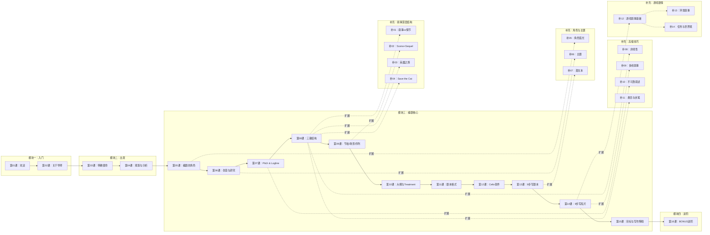

# 课程地图

## 学习路径说明

1. **入门** — 了解课程和导师背景，建立学习预期
2. **出发** — 明确你的创作使命，学会用"编剧的眼睛"看电影
3. **编剧核心（推荐按顺序学习）**
   - **概念层**（第05-07课）：理解编剧做什么，如何找灵感，如何把你的想法变成可传达的 Pitch
   - **结构层**（第08-10课）：学习故事的核心骨架（三幕结构、节拍层次），用大纲和 Treatment 把故事固定下来
   - **实操层**（第11-14课）：掌握剧本的专业格式和写作软件，按步骤写出初稿
   - **完稿层**（第15课）：设定目标，克服写作障碍，完成你的剧本
4. **进阶** — 了解如何继续提升编剧技能

## 参考文档

- [[reference/glossary|编剧术语表]]
- [[reference/script-format|剧本格式速查]]
- [[reference/three-act-structure|三幕结构速查]]
- [[reference/pitch-page-template|Pitch Page 模板]]
- [[reference/film-diary-template|观影日记模板]]

## 各课快速链接

| # | 课程 | 核心主题 |
|---|---|---|
| 01 | [第01课：欢迎与课程概览](lessons/0001-welcome.md) | 课程介绍与使用方法 |
| 02 | [第02课：关于你的导师](lessons/0002-about-mentor.md) | 导师背景与教学理念 |
| 03 | [第03课：明确你的使命](lessons/0003-your-mission.md) | 类型、目的与标准设定 |
| 04 | [第04课：观影与分析](lessons/0004-watch-analyze.md) | 如何看片、分析、写观影日记 |
| 05 | [第05课：编剧的角色](lessons/0005-role-of-screenwriter.md) | 编剧职责、Spec Script、合作 |
| 06 | [第06课：创意与研究](lessons/0006-ideas-research.md) | 灵感来源、版权、冲突 |
| 07 | [第07课：Pitch Page、Logline、Synopsis](lessons/0007-pitch-page-logline-synopsis.md) | 核心推销文档 |
| 08 | [第08课：三幕式故事结构](lessons/0008-three-act-structure.md) | 三幕详解、Catalyst、转折点 |
| 09 | [第09课：节拍、场景与序列](lessons/0009-beats-scenes-sequences.md) | 故事构建块层次 |
| 10 | [第10课：大纲、索引卡与Treatment](lessons/0010-outline-index-cards-treatment.md) | 写前的规划工具 |
| 11 | [第11课：什么是剧本](lessons/0011-what-is-a-screenplay.md) | 剧本格式与页面规范 |
| 12 | [第12课：使用免费编剧软件Celtx](lessons/0012-celtx-software.md) | Celtx 实战操作 |
| 13 | [第13课：撰写剧本的8个步骤](lessons/0013-8-steps-writing-screenplay.md) | 从大纲到初稿的路线图 |
| 14 | [第14课：撰写短片的9个步骤](lessons/0014-9-steps-short-film.md) | 短片专属创作指南 |
| 15 | [第15课：目标设定与写作障碍](lessons/0015-goal-setting-writers-block.md) | 习惯养成与心理建设 |
| 16 | [第16课：BONUS — 进阶之路](lessons/0016-bonus-next-steps.md) | 后续学习资源 |

## 补充课程（叙事与游戏剧情设计）

| # | 模块 | 课程 | 核心主题 |
|---|---|---|---|
| 补01 | 叙事深层结构 | [补充课01：叙事 vs 情节](lessons/s01-narrative-vs-plot.md) | Story vs Plot、Fabula/Syuzhet |
| 补02 | 叙事深层结构 | [补充课02：场景内部结构](lessons/s02-scene-sequel.md) | Scene + Sequel 模型 |
| 补03 | 叙事深层结构 | [补充课03：英雄之旅与七点结构](lessons/s03-hero-journey-seven-point.md) | Campbell、Seven-Point |
| 补04 | 叙事深层结构 | [补充课04：Save the Cat 节拍表](lessons/s04-save-the-cat.md) | 15 节拍详解 |
| 补05 | 角色与主题 | [补充课05：角色弧光](lessons/s05-character-arcs.md) | 扁平弧/变化弧/堕落弧 |
| 补06 | 角色与主题 | [补充课06：主题](lessons/s06-theme.md) | 主题如何从角色诞生 |
| 补07 | 角色与主题 | [补充课07：潜文本与对白](lessons/s07-subtext-dialogue.md) | Subtext、游戏对话树 |
| 补08 | 高级叙事技巧 | [补充课08：非线性叙事](lessons/s08-nonlinear-narrative.md) | 闪回、多时间线、时间循环 |
| 补09 | 高级叙事技巧 | [补充课09：多线叙事](lessons/s09-multi-thread.md) | 多主角、网络叙事 |
| 补10 | 高级叙事技巧 | [补充课10：不可靠叙述者](lessons/s10-unreliable-narrator.md) | 类型、信号、游戏案例 |
| 补11 | 高级叙事技巧 | [补充课11：悬念与伏笔](lessons/s11-suspense-foreshadowing.md) | 三种张力、Chekhov's Gun |
| 补12 | 游戏剧情设计 | [补充课12：游戏叙事基础](lessons/s12-game-narrative-fundamentals.md) | Ludonarrative、Embedded vs Emergent |
| 补13 | 游戏剧情设计 | [补充课13：环境叙事与分支](lessons/s13-env-storytelling-branching.md) | 环境叙事、分支结构 |
| 补14 | 游戏剧情设计 | [补充课14：任务与世界构建](lessons/s14-quest-worldbuilding.md) | Quest 类型、世界观原理 |

> 补充课程可以单独学习，也可以在主课的对应知识点之后扩展阅读。推荐在学完主课第08-09课后开始补充课01-04。