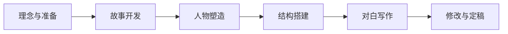

## Learning Objectives

- 了解本课程的整体结构与学习路径
- 明确课程的核心目标：写出一部精彩的虚构剧本
- 掌握推荐的学习工具与方法（笔记本+笔）
- 理解本课程对纪录片和剧集创作的适用性

## 欢迎来到编剧世界

欢迎来到《Screenwriting for Beginners: The Ultimate Online Course》。这是一门按时间顺序（chronological）编排的课程——也就是说，我们会从头到尾模拟一个真实编剧项目的完整流程。你不需要跳跃式地学习，只需跟随每一课，循序渐进。

本课程的核心目标是帮助你写出一部**精彩的虚构剧本（fiction script）**。但请注意，课程中学到的所有原理、方法和技巧，同样适用于**纪录片（documentaries）** 和**剧集（series）** 的创作。

> [!TIP]
> 无论你的最终目标是一部短片、一部长片、一部纪录片还是一季剧集，本课程的知识体系都能为你服务。关键在于理解**故事原理**本身，而非局限于某种格式。

## 课程结构

本课程采用**线性递进**的结构设计：

每一阶段都建立在前一阶段的基础上，因此在进入下一课前，建议你确保已经消化了当前课的内容。

## 推荐的学习工具

课程导师强烈建议你准备以下工具：

- **一本笔记本（notebook）**——用于随时记录灵感、观影笔记和练习作业
- **一支笔（pen）**——手写有助于加深记忆和创造性思维

> [!NOTE]
> 数字化工具当然也可以，但手写笔记被证明能更好地激活大脑中与创意和记忆相关的区域。在本课程中，我们鼓励你至少在初期尝试用笔和纸来记录。

## 课程适用范围

虽然课程主线是虚构剧本创作，但以下领域同样受益：

| 领域 | 适用性 | 说明 |
|------|--------|------|
| 虚构短片/长片 | 核心适用 | 课程设计的默认目标 |
| 纪录片 | 高度适用 | 叙事结构、人物弧光、节奏控制等原理相通 |
| 剧集（系列） | 高度适用 | 场景构建、对白写作、悬念设计等方法可直接迁移 |

## 关于笔记的建议

在课程进行过程中，你会接触到大量知识点、案例分析和实战练习。我们建议你：

1. **分类记录**——在笔记本中划分不同章节区域
2. **标记重点**——用符号标注你认为最重要的概念
3. **课后回顾**——每节课结束后花5分钟回顾笔记
4. **记录疑问**——随时写下你想进一步探索的问题

## 本课小结

本课为你勾勒了课程的宏观图景。你知道了这是一门按时间顺序编排的课程，核心目标是虚构剧本，但知识覆盖面广；你也了解了推荐的学习工具——笔记本和笔。

> [!QUESTION] 自我反思
> 写下这两个问题的答案，贴在笔记本的第一页：
> 1. 我为什么想学编剧？
> 2. 我希望通过这门课程完成什么样的作品？

## 课程导航

**下一课：** [[0002-about-mentor|第02课：关于你的导师]]

### 自我测验

1. 本课程采用什么样的编排方式？
2. 除了虚构剧本，本课程的知识还能应用于哪些领域？
3. 导师推荐的学习工具是什么？为什么？

参考答案

1. 本课程采用按时间顺序（chronological）编排，模拟真实编剧项目的完整流程。
2. 纪录片（documentaries）和剧集（series）。
3. 笔记本（notebook）和笔（pen）。手写有助于加深记忆和激活创造性思维。

### 课后练习

**练习 1.1：写在笔记本上**
打开你的新笔记本，在第一页写下你对这门课程的三个期待。可以是你想学会的技能、你想完成的作品类型，或者你想解决的写作问题。这将作为你课程结束时回顾的起点。

**练习 1.2：设定你的目标**
用一句话描述你希望通过本课程完成的项目。例如："我想写一部15分钟的科幻短片"或"我想完成一部剧集的第一集剧本"。把它写在笔记本的扉页上。