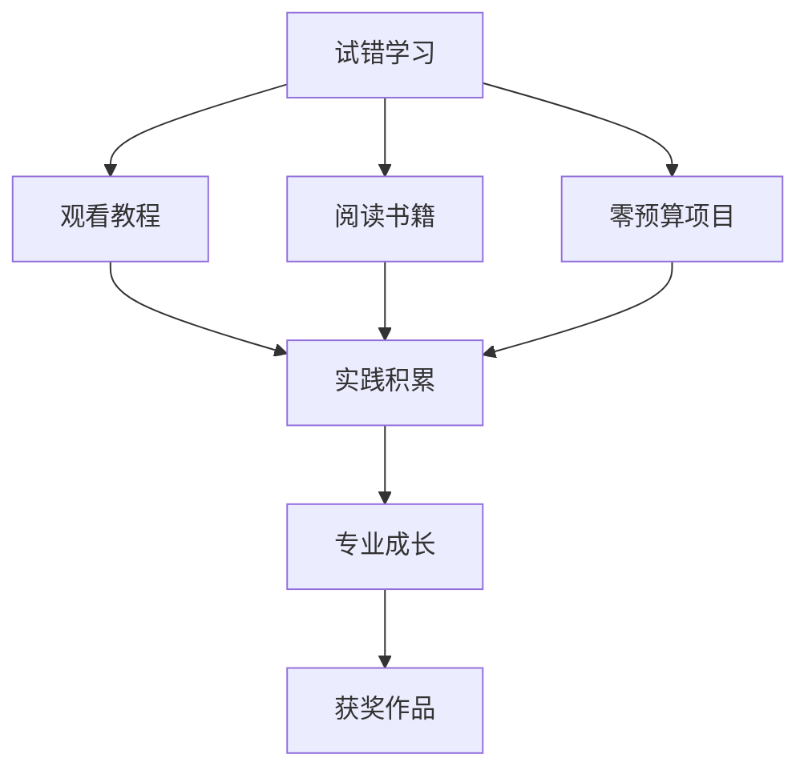

## Learning Objectives

- 认识课程导师Ire（René Vidboschnyak）及其专业背景
- 了解导师的创作成长路径：从试错到获奖
- 理解"零预算激情项目"对新手编剧的价值
- 通过导师的处女作案例获得灵感与信心

## 认识你的导师

> [!NOTE]
> 本课程由**Ire（René Vidboschnyak）** 亲自讲授。在正式开始课程之前，了解你的导师是谁、他从哪里来、他凭什么教你——这很重要。

**Ire**（全名 René Vidboschnyak）是一位获奖电影制作人（award-winning filmmaker），也是 **Ire Studios Academy**（原名 V Ray Studios Academy）的创始人。他将作为你的个人导师（personal mentor），陪伴你走完整门课程。

## 导师的专业背景

Ire 在影视行业拥有**超过10年**的经验，具备扎实的学术基础和实践经历：

- **MA in Film Directing**（电影导演硕士）
- **BA in Film and Audio Production**（电影与音频制作学士）
- **10+ years** 电影与电视行业从业经验
- 创立并运营 Ire Studios Academy

## 导师的成长之路

Ire 的成长经历并非一帆风顺。他没有走一条"天赋异禀、一鸣惊人"的捷径，而是通过以下方式一步步积累经验：

### 试错中学习（Trial and Error）

"我做错过很多事，也从每一个错误中学到了重要的教训。"——这是 Ire 对自己早期经历的总结。他鼓励初学者不要害怕犯错，每一个错误都是宝贵的学习机会。

### 观看教程（Watching Tutorials）

在互联网资源还不像今天这样丰富的年代，Ire 花了大量时间观看各类电影制作教程。他相信，只要有心学习，世界上从不缺乏知识来源。

### 阅读电影制作书籍（Reading Filmmaking Books）

除了在线资源，Ire 也是狂热的阅读者。他阅读了大量关于编剧、导演、摄影和剪辑的书籍，从经典理论中汲取养分。

### 零预算激情项目（Zero-Budget Passion Projects）

这是最关键的成长环节。在没有资金支持的条件下，Ire 用自己的热情和创意完成了多个"零预算"项目。这些项目虽然没有商业回报，但为他积累了不可替代的实操经验。

> [!TIP]
> 零预算项目是新编剧最被低估的训练场。当资源有限时，你必须依赖创造力和解决问题的能力——这两者恰恰是编剧最需要的核心素质。

## 处女作案例：《How to be a Writer》

Ire 的导演处女作长片 **《How to be a Writer》** 是一部斯洛文尼亚-苏格兰合拍片（Slovene-Scottish co-production），它的数据令人印象深刻：

| 项目 | 数据 |
|------|------|
| 制作预算 | **15,000欧元** |
| 国际电影节奖项 | **15项大奖** |
| 制片模式 | 跨国合拍 |

这个案例告诉我们：**预算有限不代表作品有限**。一部仅用15,000欧元完成的长片，能够在国际电影节上获得15项大奖，靠的是出色的故事和扎实的执行力。

> [!WARNING]
> 很多人把"没有钱"当作不开始的借口。《How to be a Writer》证明了：真正限制你的不是预算，而是想象力和坚持。不要等待完美的条件，现在就开始。

## 导师的教学理念

基于自己的成长经历，Ire 形成了以下教学理念：

1. **实践优先**——理论知识必须通过写作练习来内化
2. **错误是老师**——你的每一个错误都是进步的阶梯
3. **资源不是障碍**——从你现有的条件开始，比等待完美条件更重要
4. **激情驱动**——只有你真正热爱的东西，才能支撑你走完漫长的创作之路

## 本课小结

通过本课，你认识了这门课程的导师——Ire（René Vidboschnyak）。他拥有超过10年的影视行业经验和扎实的学术背景，但他的成长之路是靠试错、自学和零预算项目一步一步走出来的。他的处女作《How to be a Writer》以15,000欧元的预算赢得了15项国际大奖，证明了好的故事比好的预算更重要。

> [!QUESTION]
> 你的"零预算激情项目"是什么？如果现在给你一台手机和一周时间，你能拍出一个什么样的故事？把它记录在笔记本上。

## 课程导航

**上一课：** [[0001-welcome|第01课：欢迎与课程概览]]
**下一课：** [[0003-your-mission|第03课：明确你的使命]]

### 自我测验

1. 导师的全名是什么？大家通常怎么称呼他？
2. 导师拥有哪些学术背景？
3. 导师的处女作长片名称是什么？它取得了什么样的成绩？

参考答案

1. 全名是 René Vidboschnyak，大家通常称他为 Ire。
2. 电影导演硕士（MA in Film Directing）和电影与音频制作学士（BA in Film and Audio Production）。
3. 处女作长片是《How to be a Writer》，一部斯洛文尼亚-苏格兰合拍片，预算15,000欧元，获得了15项国际电影节奖项。

### 课后练习

**练习 2.1：我的起步清单**
在你的笔记本上，列出你已经具备的创作资源——可以是一台手机、一个录音软件、一台笔记本电脑，或者一个可以免费使用的剪辑软件。然后写下你打算如何利用这些资源开始你的第一个项目。

**练习 2.2：寻找激励案例**
像 Ire 一样，找一部由新人导演以极低预算完成并取得成功的电影。研究它的制作背景，写下三个你可以从中学习的要点。