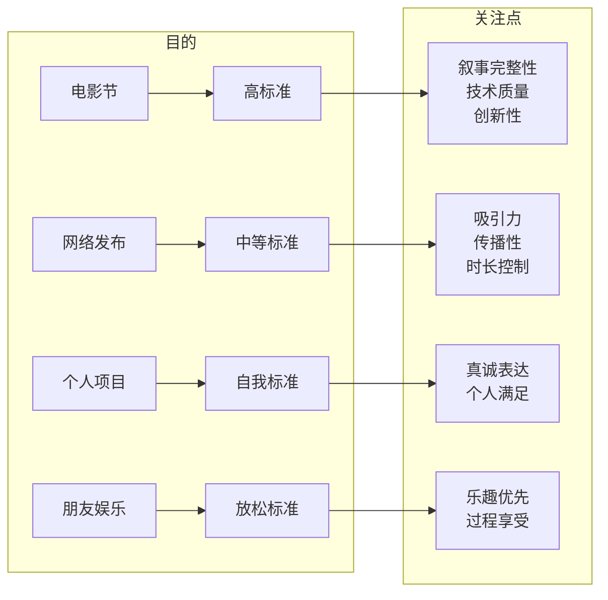

## Learning Objectives

- 确定你要创作的电影类型（genre）及其核心规则
- 明确你的项目目的（festivals / online / personal / fun）
- 学会根据项目目的调整创作标准
- 掌握研究获奖短片的方法与渠道

## 在动笔之前

在正式开始写作之前，你需要先回答两个根本性问题：

1. **我要拍什么类型？**
2. **我为什么要拍这个项目？**

这两个问题的答案将决定你后续所有的创作决策。

> [!WARNING]
> 很多新手编剧跳过这一课，直接开始写对白和场景。这就像没有地图就去探险——你可能走得很兴奋，但大概率会迷路。

## 第一步：选择你的电影类型

每一种类型（genre）都有自己**独特的规则集（set of rules）**。你的第一个任务就是决定你要创作哪个类型的电影。

### 常见电影类型

| 类型 | 核心特征 | 经典参考 |
|------|----------|----------|
| 恐怖（Horror） | 制造恐惧与紧张，利用观众的深层不安 | 《闪灵》《遗传厄运》 |
| 喜剧（Comedy） | 引发笑声，依赖节奏、反差和意外 | 《土拨鼠之日》《伴娘》 |
| 剧情（Drama） | 聚焦人物情感与真实冲突 | 《婚姻故事》《月光男孩》 |
| 科幻（Sci-Fi） | 基于科学想象未来或异世界 | 《降临》《机械姬》 |
| 惊悚（Thriller） | 维持悬念与紧张感，扣人心弦 | 《惊魂记》《消失的爱人》 |
| 爱情（Romance） | 探索人际关系与情感连接 | 《爱在黎明破晓前》 |
| 动作（Action） | 以身体冲突和冒险为核心 | 《疯狂的麦克斯4》 |

### 为什么类型很重要

类型不仅仅是标签——它为你的创作提供了**框架和期待**。当观众选择看一部恐怖片时，他们期待的是恐惧和紧张；当他们选择看一部喜剧时，他们期待的是欢笑和轻松。

> [!TIP]
> 选择类型不仅要考虑你"喜欢看什么"，更要考虑你"擅长写什么"。如果你从未写过喜剧，不要第一部作品就挑战纯喜剧——从你最有感觉的类型开始。

## 第二步：定义项目的目的

同一类型的故事，因为目的不同，创作标准也不同。你需要清楚地定义：

- **电影节参赛（Festivals）**——需要较高的制作和叙事标准
- **网络发布（Online）**——可以更灵活，关注吸引力和传播性
- **个人项目（Personal）**——以自我表达为核心，无需迎合他人
- **与朋友娱乐（Fun with Friends）**——以乐趣为主，标准可适度降低

### 标准调整指南

### 标准调整的具体含义

- **电影节（Festivals）**：你需要对标业内专业水准。每一个镜头、每一句对白、每一个情节转折都需要经过精心打磨。
- **网络发布（Online）**：你可以更自由地实验，但需要关注作品的吸引力和传播性。短视频平台有自己的叙事节奏。
- **个人项目（Personal）**：这是最自由的创作空间。你可以完全按照自己的意愿去表达，不必迎合任何人的期待。
- **与朋友娱乐（Fun with Friends）**：享受创作过程本身。不需要给自己太大压力。许多伟大的导演都是从和朋友们一起拍着玩开始的。

> [!NOTE]
> 同一个故事，放在不同的目的下，评价标准完全不同。一部在朋友聚会上大获成功的短片，放在电影节评委面前可能显得粗糙。反过来，一部为电影节精心打磨的作品，在朋友聚会上可能显得过于严肃。**关键不在于标准的高低，而在于你的标准是否匹配你的目的。**

## 第三步：研究获奖短片

在确定了类型和目的之后，你需要进行有针对性的研究。观看和分析在你选定类型中获得成功的短片——尤其是获奖短片（award-winning short films）。

### 研究渠道

- **电影节官网**——查看往届获奖作品列表
- **YouTube / Vimeo**——搜索 "award-winning short film + [你的类型]"
- **短片平台**——Short of the Week、Omeleto 等专业短片网站
- **IMDB**——使用高级筛选查看短片类别

### 研究清单

当你找到目标短片后，带着以下问题观看：

1. 这个短片在多少分钟内完成了故事？
2. 它是如何快速建立类型氛围的？
3. 它的核心冲突是什么？冲突是如何引入的？
4. 它的人物有多少？人物塑造的效率如何？
5. 它的预算看起来如何？它是如何用有限资源讲述故事的？

> [!TIP]
> 一次研究5-10部获奖短片，然后把你的发现整理成一个"类型规则清单"，作为你后续创作的参考指南。

## 本课小结

本课帮助你完成了动笔之前最重要的准备工作。你确定了要创作的类型（genre），明确了项目的目的（festivals / online / personal / fun with friends），学会了根据目的调整创作标准，也知道了如何研究获奖短片来获取参考。这些准备工作将确保你在后续的创作中有明确的方向。

> [!QUESTION]
> 问问自己：我的项目目的是什么？如果我要把它投递电影节，我是否愿意为了达到那个标准而付出加倍的努力？如果答案是否定的，也许你应该考虑调整你的目的——而不是调整你的标准。

## 课程导航

**上一课：** [[0002-about-mentor|第02课：关于你的导师]]
**下一课：** [[0004-watch-analyze|第04课：观影与分析]]

### 自我测验

1. 为什么说选择类型不仅仅是贴标签，而是选择一套"规则集"？
2. 项目目的有哪四种类型？各自对应的创作标准是什么？
3. 研究获奖短片时应该关注哪些方面？

参考答案

1. 每一种类型都有其独特的叙事规则、观众期待和创作惯例。选择类型就是选择你要遵循哪一套规则来构建你的故事。
2. 四种目的：电影节（高标准）、网络发布（中等标准）、个人项目（自我标准）、与朋友娱乐（放松标准）。
3. 时长、类型氛围建立方式、核心冲突与引入方式、人物数量与塑造效率、预算水平与资源利用方式。

### 课后练习

**练习 3.1：类型决策**
在笔记本上写下你要创作的类型，以及选择这个类型的三个理由。然后列出你认为这个类型最重要五条规则（例如：恐怖片需要建立不安感的节奏、喜剧需要意外的转折等）。

**练习 3.2：目的声明**
用一句话写下你的项目目的声明，格式如下：
"我写这部[类型]片是为了[目的]，因此我的创作标准是[标准描述]。"

例如："我写这部科幻短片是为了投递电影节，因此我的创作标准是专业级的故事完整性和制作质量。"

**练习 3.3：短片研究**
找3部在你所选类型中获得成功的短片（建议从电影节获奖作品中选），观看后完成下表：

| 片名 | 时长 | 核心冲突 | 人物数量 | 亮点 |
|------|------|----------|----------|------|
|      |      |          |          |      |