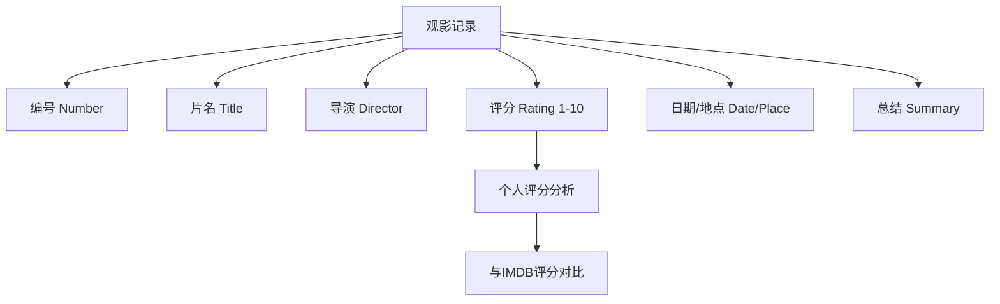
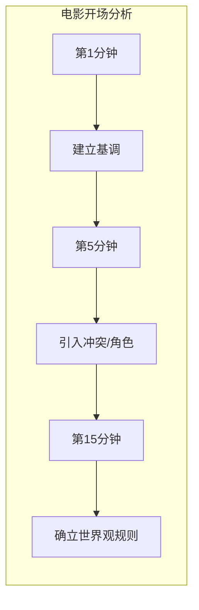

## Learning Objectives

- 建立跨类型、跨国界、跨年代的观影习惯
- 掌握"重看电影"的学习方法
- 学会使用 IMDB Top 250 作为观影起点
- 建立个人观影日记（film diary）系统
- 理解不带字幕观看外语片的价值
- 学会识别和区分有意与无意的失误
- 掌握分析影片节奏、流程和世界观引入的方法

## 重新训练你的大脑

现在你已经在心理上做好了开始电影制作之旅的准备。接下来你需要做的，是**重新训练你的大脑（rewire your brain）**，让你以全新的方式来观察电影。

从今天开始，你不再只是一个"看电影的观众"——你要像一个编剧、一个导演、一个电影制作人那样去看电影。

> [!WARNING]
> 从一个普通观众转变为一个电影制作者的视角，需要时间和刻意的练习。刚开始你会觉得"拆解"电影破坏了观影的乐趣，但很快你会发现，分析带来的理解深度让观影体验变得更加丰富。

## 拓展你的观影版图

### 跨越类型（Across Genres）

不要只盯着你喜欢的类型看。如果你喜欢恐怖片，也要看喜剧片；如果你喜欢科幻片，也要看爱情片。每一种类型都有其独特的叙事技巧，这些技巧可以跨类型借鉴。

### 跨越国度（Across Countries）

不同国家的电影有不同的叙事传统和美学风格：

| 国家/地区 | 叙事特点 | 推荐入门 |
|-----------|----------|----------|
| 日本 | 极简对白、留白美学、情感含蓄 | 《东京物语》《驾驶我的车》 |
| 韩国 | 类型融合、情感极致、社会批判 | 《寄生虫》《燃烧》 |
| 法国 | 哲学思辨、人物驱动、淡化情节 | 《四百击》《阿黛尔的生活》 |
| 伊朗 | 生活流、朴素美学、道德困境 | 《樱桃的滋味》《一次别离》 |
| 丹麦 | 道格玛95传统、自然主义表演 | 《狩猎》《酒精计划》 |

### 跨越年代（Across Decades）

电影语言在过去一百多年中经历了巨大的演变。看不同年代的影片，能帮助你理解叙事手法的进化：

- **1940s-50s**——经典叙事的确立，黄金好莱坞
- **1960s-70s**——新浪潮运动，叙事形式的实验与革命
- **1980s-90s**——类型片复兴与独立电影的崛起
- **2000s-今**——数字时代的叙事新可能

> [!TIP]
> 制定一个"观影食谱"：每周看一部你从未接触过的类型的电影、一部外语片和一部老片（至少20年以上）。这样坚持三个月，你的电影语言感知力会发生质变。

## 重看电影的力量

**Re-watch films to learn new things.**

这是最被低估的学习方法。第一次看电影时，你被情节和情感牵引；第二次看时，你开始注意到结构；第三次看时，你能看到每一个镜头的选择。

### 重看的三次方法

| 次数 | 关注焦点 | 具体内容 |
|------|----------|----------|
| 第1次 | 情感体验 | 像普通观众一样感受故事，记录第一印象 |
| 第2次 | 结构分析 | 关注三幕结构、情节点、转折、节奏 |
| 第3次 | 细节拆解 | 关注对白、镜头、音效、剪辑、调度 |

## 使用 IMDB Top 250

IMDB Top 250 列表是世界上最广泛认可的电影排行榜之一，它作为你的观影起点具有以下价值：

- 涵盖了不同年代、不同国家的经典作品
- 由大量观众评分，具备一定的代表性和参考价值
- 提供了IMDB评分（IMDB rating）作为分析的参考数据
- 可以作为你个人观影分析的基准线

> [!NOTE]
> IMDB Top 250 不是"最好的250部电影"的绝对标准，但它确实是一个极佳的入门清单。把它当作你的"电影必修课列表"，而不是终极权威。

## 建立你的观影日记

**观影日记（film diary）** 是一个简单但极其有效的工具。每次看完一部电影，在笔记本上记录以下信息：



### 观影日记模板

```
# [编号]
片名：[Title]
导演：[Director]
个人评分：[1-10]
IMDB评分：[X.X]
观看日期：[Date]
观看地点：[Place]

总结与思考：
[用你自己的话总结电影内容并写下你的分析]

亮点：
- 什么让你印象深刻？

改进点：
- 如果是你，你会怎么改？
```

> [!TIP]
> 不要只记录你喜欢电影。记录你不喜欢的电影同样重要——分析"为什么我不喜欢这部电影"能让你学到很多关于叙事偏好的知识。

## 挑战：不带字幕观看外语片

**Watch foreign films without subtitles.**

这个练习听起来很奇怪，但它有一个重要的目的：当语言信息被移除后，你的大脑会转向分析**视觉叙事**——镜头构图、色彩、光影、演员的肢体语言、场景的调度和节奏。

### 无字幕观影练习步骤

1. 选择一部你已经看过的外语片
2. 关闭字幕（所有字幕，包括中文字幕）
3. 专注分析画面的信息传递
4. 记下你仅通过视觉能理解多少故事
5. 重新打开字幕观看，验证你的分析

> [!WARNING]
> 如果你对这门语言完全陌生，一开始会很不舒服。这是正常的。坚持15-20分钟，你会惊讶地发现你的大脑开始自动寻找视觉线索。

## 看电影中的失误

专业电影制作人看电影时，会带着一双"挑错的眼睛"。你需要学会区分两种失误：

### 有意失误（Intentional Mistakes）

导演为了特定的艺术效果故意制造的不完美。例如：

- 手持摄影带来的晃动感以增强真实感
- 跳切（jump cut）制造时间压缩或不安感
- 打破第四面墙（breaking the fourth wall）

### 无意失误（Unintentional Mistakes）

制作过程中的疏忽导致的瑕疵。例如：

- 连续性错误（continuity error）——道具位置变化、服装变化
- 音画不同步
- 明显的人工痕迹

> [!QUESTION]
> 下次看电影时，注意找一找连续性错误。你会发现即使是大制作的好莱坞电影也难免有这些小瑕疵。关键问题是：**这个失误是否影响了故事本身？** 如果影响了，它就是一个需要避免的错误；如果没有，它可能只是制作过程中一个无关紧要的小插曲。

## 分析电影的流程与节奏

当你开始训练自己的分析能力时，以下几个维度值得特别关注：

### 流程（Flow）

故事从一个场景移动到下一个场景的方式是否流畅？过渡是否自然？观众是否会在某些时刻感到"断掉"了？

### 节奏（Pacing）

- 快速段落是否真的快？
- 慢速段落是否有意为之，还是因为叙事乏力？
- 节奏变化是否有内在逻辑？

### 世界观引入（Universe Introduction）

- 电影在多久时间内让你理解了它所在的世界？
- 是通过对白说明的，还是视觉展示的？
- 信息量控制得如何——会不会太多或太少？



## 本课小结

本课的核心是重新训练你的大脑，让你从一个被动观影的观众转变为一个主动分析的电影制作者。你学会了拓展观影版图（跨类型、跨国界、跨年代）、重看电影的三次方法、使用 IMDB Top 250 作为起点、建立观影日记系统、挑战无字幕观影、识别有意与无意的失误，以及分析电影的流程、节奏和世界观引入。从今天开始，你的每一次观影都是一次学习。

> [!QUESTION]
> 回想你最近看过的三部电影，你能立刻说出它们的节奏特点吗？哪一部的前15分钟做的最好？为什么？把这些思考写进你的观影日记。

## 课程导航

**上一课：** [[0003-your-mission|第03课：明确你的使命]]

### 自我测验

1. 为什么建议观看不同年代的电影？
2. 重看电影的三次方法分别关注什么？
3. 观影日记需要记录哪些核心信息？
4. 不带字幕观看外语片的目的是什么？
5. 有意失误和无意失误的区别是什么？

<details><summary>参考答案</summary>

1. 不同年代的影片展示了电影语言的演变历史。从经典叙事到新浪潮再到数字时代的叙事新可能，每一代电影人都在前人的基础上发展新的语言。
2. 第1次关注情感体验，第2次关注结构分析，第3次关注细节拆解。
3. 编号（Number）、片名（Title）、导演（Director）、个人评分（Rating 1-10）、观看日期/地点（Date/Place）、总结（Summary），以及可选的IMDB评分对比。
4. 移除语言信息后，迫使大脑转向分析视觉叙事——镜头构图、色彩、光影、肢体语言、场景调度和节奏。
5. 有意失误是导演为了特定的艺术效果刻意制造的，如手持摄影、跳切等；无意失误是制作过程中疏忽导致的瑕疵，如连续性错误。关键判断标准是这个失误是否影响了故事的传达。

</details>

### 课后练习

**练习 4.1：建立你的观影日记**
创建你的第一个观影日记条目。如果你最近看过一部电影，立即以本课提供的模板为标准进行记录。如果没有，今天看一部电影，以分析而非娱乐的心态看完，然后完成记录。

**练习 4.2：三次重看**
选择一部你最喜欢的电影，按照本课的三次方法执行：
1. 第1次：沉浸式观看，记录第一印象
2. 第2次：分析三幕结构和情节点
3. 第3次：拆解一个具体场景（建议5分钟以内）的每一个镜头

将三次的发现整理到你的笔记本中。

**练习 4.3：无字幕挑战**
选择一部你已经看过且熟悉的外语片，关闭所有字幕观看前20分钟。记录你通过视觉理解到的信息。然后重开字幕，对比你的理解是否准确。写下你的发现。