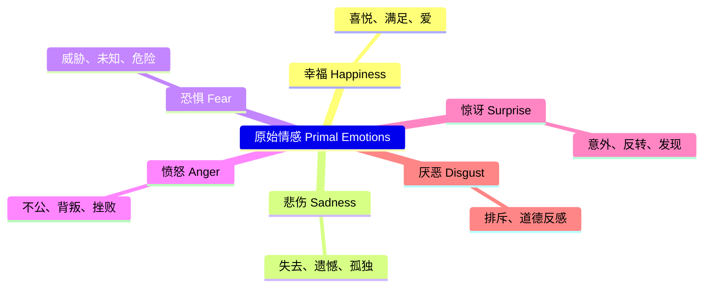

# 第06课：创意与研究

## Learning Objectives

- 掌握从多个渠道发现故事灵感的方法
- 学会根据预算评估创意的可行性
- 理解版权的基本概念及其对编剧的影响
- 运用原始情感（Primal Emotions）作为故事驱动核
- 学习如何进行有效的项目研究
- 理解冲突在故事中的本质地位
- 了解编剧合作关系的可能性

---

## 创意的来源：从"What If"开始

在落笔之前，你首先需要的是一个**想法（Idea）**。这个想法可能来自任何地方。关键在于保持敏锐的感知力和记录的习惯。

> [!TIP]
> 一切创意都始于一个简单的问题：**"What if...（如果……会怎样）？"**
>
> - 如果一个人醒来后发现全世界只剩下他一个人？
> - 如果一个杀手偶然捡到了一部不属于他的手机？
> - 如果一场婚礼上来了一个不速之客，揭露了一个隐藏了二十年的秘密？

### 六大灵感渠道

#### 1. 报纸与新闻（Newspapers）

真实事件是最好的故事矿藏。每天都有无数离奇、感人、讽刺的故事在新闻中上演。一个简短的新闻报导就可能是一个电影的核心 premise。

- 关注社会新闻、科技报道、人物特写
- 寻找那些"如果拍成电影一定很精彩"的真实故事
- 注意故事中的**戏剧性冲突**和**超乎寻常的转折**

#### 2. 个人生活（Life）

你自己的经历是独一无二的故事素材库：
- 童年的记忆和家庭故事
- 关键的成长时刻（初恋、离别、失去）
- 职业生涯中的奇遇
- 旅行中的见闻

> [!WARNING]
> 从生活中取材时需要注意隐私和版权问题。如果是别人的真实故事，你可能需要获得他们的许可或更改足够多的细节以避免侵权。

#### 3. 梦境（Dreams）

梦境是人类潜意识的作品。很多著名的创意作品都源自梦境：
- 将梦中的场景、人物或氛围记录下来
- 注意那些在清醒时不会出现的、超现实的组合
- 梦境往往跳脱逻辑，而这恰好可以催生独特的创意

#### 4. 想象力（Imagination）

纯粹的想象 — 这是编剧最核心的能力。你可以：
- 创造一个全新的世界（科幻、奇幻）
- 将熟悉的事物推向极端
- 把不同元素进行"碰撞"（如：恐龙 + 现代公园 = 《侏罗纪公园》）

#### 5. "What If" 提问

这是最直接的创意生成工具。随意选择一个常见场景，然后问"如果……会怎样"：
- 如果银行抢劫案里的人质爱上了劫匪？
- 如果你的宠物狗突然开口说话？
- 如果时间可以倒流，但只能倒流30秒？

#### 6. 从陈词滥调出发（Start with Clichés）

这是一个反直觉但极其有效的方法：**从一个套路开始，然后发展它**。

例如，"霸道总裁爱上灰姑娘"是一个陈词滥调 — 但你可以问自己：
- 如果这个"灰姑娘"其实有自己的秘密计划？
- 如果"霸道总裁"才是这段关系中弱势的一方？
- 如果这一切发生在一个完全不同的时代或文化中？

> [!NOTE]
> 套路本身不可怕，可怕的是停留在套路表层。从一个 cliché 开始，然后做 180 度的转弯，往往能产生最精彩的原创故事。

---

## 匹配创意与预算

并非所有精彩的创意都适合作为你的第一部剧本。一个关键考量是：**这个想法能否在现有的资源下被拍出来？**

| 预算水平 | 建议策略 | 例子 |
|---|---|---|
| 低预算 | 少量演员、少量场景、室内为主 | 两个人在一个房间里谈话（《十二怒汉》） |
| 中等预算 | 少量外景、有限特效 | 一部以小镇为主场景的悬疑片 |
| 高预算 | 大量演员、多地拍摄、复杂特效 | 科幻史诗、战争片 |

> [!TIP]
> 作为初学者，**限制（Limitations）反而能给我们焦点（Focus）**。当你的选择非常有限时，你会被迫更有创意地解决问题。一部在单一场景中的两人对话，如果写得足够精彩，比一部试图涵盖全球但写得空洞的剧本要强大得多。

---

## 版权：你的法律防线

**版权（Copyright）** 是编剧必须理解的基本法律概念。

### 需要获得版权的情况

- **改编已有作品** — 如果你想改编一部小说、游戏、漫画或其他人的真实故事，必须获得版权持有人的授权
- **使用真实人物故事** — 如果故事涉及仍在世的人，可能需要获得他们的"肖像权/故事权"许可

### 不需要版权的情况

- **公有领域（Public Domain）** — 版权到期的经典作品。你可以自由改编莎士比亚、《傲慢与偏见》、《德古拉》等经典
- **你自己创作的内容** — 你自动拥有原创作品的版权
- **基于事实的报道** — 新闻报道的事实本身不受版权保护（但表达方式受保护）

> [!WARNING]
> 不要以为"只要我不说就没人知道"。在剧本进入制作阶段之前，法律团队会进行版权清权（Copyright Clearance）。侵权不仅可能导致项目被叫停，还可能面临高额赔偿诉讼。如果你不确定，**宁可咨询律师也不要冒险**。

---

## 原始情感：故事的驱动力

最好的故事总是触及人类最底层的情感。Linda Seeger 等编剧理论家强调，所有成功的故事都建立在**原始情感（Primal Emotions）** 之上。

六大原始情感：

在构思故事时，问自己：
- 这个故事让观众感受到哪种/哪些原始情感？
- 情感的转换是否清晰有力？
- 这些情感是否与角色的经历有机联系？

> [!QUESTION]
> 想一想你最喜欢的电影。它是否可以在这些原始情感中找到核心驱动力？大多数经典电影可以归结为恐惧（恐怖片）、幸福（爱情喜剧）、悲伤（悲剧）、愤怒（复仇故事）或它们的组合。你的故事的情感核心是什么？

---

## 研究阶段

一旦你有了一个想法，不要急着写剧本。**研究（Research）** 是你为剧本打下的地基。

### 三种主要的研究方式

#### 1. 观看类似电影（Watch Similar Films）

这不是消遣，而是工作。找到与你想法类型相似、氛围相近的电影，分析它们：
- 剧本如何处理类似的情节
- 节奏和结构的规律
- 哪些做法有效，哪些无效

#### 2. 阅读书籍（Read Books）

- **编剧理论书** — Syd Field、Robert McKee、Linda Seeger 等大师的著作
- **相关主题书籍** — 如果你的故事讲的是职业拳击手，去读真实的拳击手传记

#### 3. 采访（Conduct Interviews）

如果你的故事涉及你不熟悉的专业领域（如医学、法律、军事），找到真实从业者进行访谈。这些第一手资料会让你的剧本拥有无可替代的真实感。

### 研究时间线

| 项目类型 | 研究时长 |
|---|---|
| 长片（Feature Film） | 最长可达一年 |
| 短片（Short Film） | 少于一周即可 |

> [!NOTE]
> 短片的研究时间远短于长片，但研究的质量同样重要。即使在有限的时间内，也要确保你深入理解了故事所需的背景知识。

---

## 记录与管理创意

创意是不稳定的。它可能在最意想不到的时刻出现，然后在下个瞬间消失。因此：

- **随身携带笔记本（Notebook）** — 老派但最可靠的方法
- **使用数字笔记（Digital Notes）** — 手机备忘录、Notion、Evernote 等工具
- **定期整理** — 将散落的灵感按主题或项目分类

> [!TIP]
> 优秀的编剧往往有一个"创意银行"（Idea Bank）。当他们需要新项目时，可以从这个银行"取款"。不要把所有的好想法都压在一个项目上 — 把那些不适合当前项目但依然精彩的创意存起来，它们在未来可能会派上用场。

---

## 冲突：故事的心脏

> [!WARNING]
> **每一个故事都需要一个障碍（Obstacle）。** 没有冲突就没有故事。

冲突（Conflict）的定义很简单：**主角想要某样东西，但是有东西挡在路中间。**

冲突的层次：

1. **外部冲突** — 主角与他人/环境的对抗
   - 人与人之间的冲突（对手、反派）
   - 人与社会的冲突（制度、文化）
   - 人与自然的冲突（灾难、荒野）

2. **内部冲突** — 主角与自己内心的对抗
   - 道德困境
   - 恐惧与勇气
   - 欲望与责任

> [!NOTE]
> 最好的故事往往同时包含外部和内部冲突。主角不仅要打败外部的敌人，还要克服内心的障碍。这构成了故事的双重张力。

---

## 合作关系

并非所有编剧都在独自工作。许多最成功的作品诞生于写作伙伴关系：

### 著名的编剧搭档

- **科恩兄弟（Coen Brothers）** — 乔尔和伊桑·科恩，代表作《老无所依》、《冰血暴》
- **达菲兄弟（Duffer Brothers）** — 马特和罗斯·达菲，代表作《怪奇物语》
- **阿弗莱克与达蒙（Ben Affleck & Matt Damon）** — 共同创作《心灵捕手》

### 合作的优势

- **互补技能** — 一个人擅长结构，另一个人擅长对白
- **互相激励** — 在写不下去时，伙伴可以推你一把
- **双重过滤** — 任何创意在被放入剧本之前都经过两个人的检验

### 合作的风险

- **创意分歧** — 两个人可能对故事走向有完全不同的想法
- **节奏不一致** — 一个人可能比另一个人快得多
- **署名争议** — 谁做了什么，谁该排在第一位

> [!TIP]
> 如果你决定与某人合作写剧本，建议在开始之前就**签订一份简单的合作协议**，明确署名顺序、收入分配和决策机制。这看起来不够"艺术"，但它能保护你们的关系。

---

## 本章小结

创意可以来自任何地方 — 报纸、生活、梦境、想象力和"What if"提问。关键是养成随时随地记录想法的习惯。好的编剧不仅会寻找想法，还会评估这个想法是否适合当下的预算和资源。

版权是编剧的法律底线，公有领域作品可以自由改编，但受版权保护的作品必须获得授权。原始情感是所有好故事的驱动力 — 幸福、悲伤、恐惧、愤怒、惊讶、厌恶，你的故事至少要触及其中之一。

研究阶段是剧本的地基，通过观看类似电影、阅读书籍和采访专业人士来丰富你的素材。而冲突，无论外部还是内部，是每一条故事线不可或缺的核心。最后，写作伙伴关系可能让你的创作之旅更有成效，但事先的约定同样重要。

---

## 下一步

- **下一课：** [[0007-pitch-page-logline-synopsis|第07课：Pitch Page、Logline 与 Synopsis]] — 学习如何把你的想法包装成专业的推销文档
- **课后练习：** 拿出一张纸或打开一个空白文档，写 10 个 "What if..." 问题。不必追求完美，只管写。然后选其中一个，写下它可能涉及的原始情感和潜在的冲突。
- **自我测验：**
  1. 创意的六大来源渠道是什么？
  2. 为什么说"限制能带来焦点"？
  3. 什么是公有领域（Public Domain）？为什么它对编剧有用？
  4. 六大原始情感是什么？
  5. 冲突的定义是什么？内外两种冲突的区别是什么？

参考答案

1. 报纸/新闻、个人生活、梦境、想象力、"What if"提问、从陈词滥调出发。
2. 当资源有限时，编剧必须更有创造性地解决问题，反而能创作出更聚焦、更深刻的故事。
3. 公有领域是指版权已过期的作品，任何人都可以自由改编而不需要获得授权或支付费用。
4. 幸福（Happiness）、悲伤（Sadness）、恐惧（Fear）、愤怒（Anger）、惊讶（Surprise）、厌恶（Disgust）。
5. 冲突是主角想要某样东西，但有障碍挡在路中间。外部冲突是主角与外界（他人/社会/自然）的对抗，内部冲突是主角与自己内心的对抗。

---

> **参考：** [[reference/glossary|编剧术语表]] — 查看本课涉及的关键术语定义