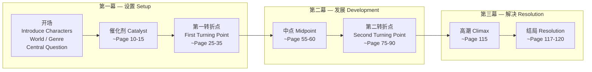
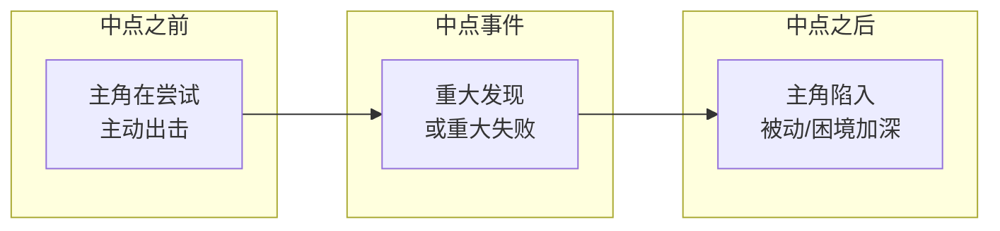

# 第08课：三幕式故事结构

## Learning Objectives

- 理解三幕式结构的基本原理：设置、发展、解决
- 掌握第一幕的核心元素：角色介绍、世界观建立、Catalyst
- 认识第一转折点（First Turning Point）的功能和时机
- 理解第二幕的冲突发展和中点的作用
- 掌握第二转折点（Second Turning Point）的意义
- 学习第三幕的紧迫感、高潮和结局的节奏
- 了解标准长片（120分钟）的页数分配

---

## 什么是三幕式故事结构

三幕式故事结构（Three-Act Structure）是西方叙事传统中最基础、最经典的故事架构方式。它的根源可以追溯到亚里士多德的《诗学》，后经 Syd Field、Linda Seeger 等编剧理论家发展为现代编剧的标准框架。

最简单的理解：

| 幕（Act） | 功能 | 俗称 |
|---|---|---|
| **第一幕（Act 1）** | 开始（Beginning） | Setup — 设置 |
| **第二幕（Act 2）** | 中间（Middle） | Development — 发展 / Confrontation — 对抗 |
| **第三幕（Act 3）** | 结束（End） | Resolution — 解决 |

---

## 第一幕：设置（Setup）— 页 1-25

第一幕的任务是**把观众放进你的故事世界**。在这个阶段，观众需要知道的是：

### 需要建立的元素

- **主角（Protagonist）** — 谁是故事的核心人物？他的日常生活是怎样的？
- **主要角色（Other Characters）** — 谁将在故事中扮演重要角色？
- **地点（Location）** — 故事发生在哪里？这个空间有什么独特之处？
- **时间（Time）** — 故事发生在什么时代？什么季节？故事跨度多久？
- **类型（Genre）** — 这是一部什么电影？喜剧还是惊悚片？观众应该期待什么？

### Catalyst（催化剂）

> [!NOTE]
> Catalyst（催化剂）是 Linda Seeger 使用的术语，有时也被称为 Inciting Incident（激励事件）。它是**推动故事向前发展的关键事件**—— 发生在主角身上、迫使他不得不做出反应的事情。

Catalyst 通常出现在第 10-15 页左右。它的作用是打破主角的"正常世界"，促使故事真正开始。

**例子：**
- 《黑客帝国》：Neo 接到"红色药丸还是蓝色药丸"的选择
- 《星战》：Luke 收到 R2-D2 带来的 Leia 公主的全息信息
- 《海底总动员》：鲨鱼袭击 Marlin 的家，Nemo 被抓走

### 中央故事问题（Central Story Question）

在第一幕的结尾，观众心目中应该形成一个清晰的问题：

- "这个主角能成功吗？"
- "他们最后会在一起吗？"
- "这个秘密会被揭穿吗？"

这个**中央故事问题（Central Story Question）** 将驱动整部电影直到最后一幕才给出答案。

### 第一转折点（First Turning Point）— 页 25-35

第一转折点是第一幕结束、第二幕开始的临界点。它通常是一个**不可预测的转折（Unpredictable Twist）**，将故事推向一个全新的方向。

> [!WARNING]
> 第一转折点不是 Catalyst。Catalyst 启动了故事，而第一转折点将故事从"设置阶段"推入"发展阶段"。Catalyst 让主角进入冒险，第一转折点让冒险变得不可逆转。

---

## 第二幕：发展（Development）— 页 35-75/90

第二幕通常是最长的一幕（约占剧本总长度的一半），也是冲突最密集的部分。

### 第二幕的核心任务

- **冲突深化（Conflict Intensification）** — 主角面临的障碍越来越艰难
- **主题展开（Theme Development）** — 故事的主题通过角色的选择和行为更加清晰地呈现
- **关系发展（Relationship Development）** — 角色之间的关系在压力下变化、成长或破裂
- **次要情节（Subplot）** — 次要角色的故事线与主情节交织

### 中点（Midpoint）— 约页 55-60

中点是第二幕内部的一个关键节点，它将第二幕一分为二。

> [!TIP]
> 中点的作用是**改变故事的情绪基调（Mood Shift）**。如果前半段是较轻松的节奏，中点之后应该变得更黑暗；反之亦然。中点之后的氛围应该与之前显著不同。

**节奏变化示意：**

### 第二转折点（Second Turning Point）— 页 75-90

这是一个残酷的节点。在编剧理论中，它常常被描述为：

> **"Burn it to the ground."（把它烧成灰烬。）**

在这个时刻，**似乎一切都完了（All Seems Lost）**：

- 主角尝试了所有方法，但都失败了
- 最后一条路似乎也被堵死了
- 盟友离开，敌人获胜
- 主角被迫面对最深的恐惧

> [!NOTE]
> 第二转折点的目的是让观众产生"主角不行了，这个故事要怎么收场？"的紧迫感。正是这种绝望为第三幕的高潮爆发提供了势能。没有足够的低谷，高潮就不够高。

---

## 第三幕：解决（Resolution）— 页 90-120

第三幕是故事的收尾阶段。这时节奏加快，紧张感达到顶点。

### 第三幕的核心特征

- **紧迫感（Urgency）** — 时间不多了，选择有限，后果严重
- **主角的决战（Final Confrontation）** — 主角必须在最后关头做出关键行动
- **解决中央问题（Answer Central Question）** — 第一幕提出的问题终于得到答案

### 高潮（Climax）— 结局前约 5 页

高潮是故事的**情感和戏剧性的最高点**。

- 大约在结局前 5 页左右发生
- 主角与阻碍的最终正面对决
- 所有的次要情节在此汇聚

### 结局（Resolution）— 最后 3-5 页

高潮之后，故事进入结局阶段。此时：
- 新的平衡建立
- 角色的最终状态被展示
- 观众的情感得到释放

> [!TIP]
> 有经验的编剧知道：**高潮之后的结局不是"第二段剧情"**。一旦高潮结束，剧本应该尽快收尾。过长的高潮后场面会稀释高潮带来的情感冲击力。通常 3-5 页的结局已经足够。

---

## 页数参考与短片适配

### 标准长片参考

| 部分 | 页码范围 | 说明 |
|---|---|---|
| 第一幕 | 约 1-25 | Catalyst ~页 10-15；第一转折点 ~页 25 |
| 第二幕 | 约 25-90 | 中点 ~页 55-60；第二转折点 ~页 75-90 |
| 第三幕 | 约 90-120 | 高潮 ~页 115；结局 ~页 117-120 |

> [!NOTE]
> 这些页码是**参考值（Reference Points）**，不是铁律。有些电影的第一转折点在第 20 页，有些在第 30 页。关键在于理解每一幕和每一个转折点的**功能**，而不必死守精确的页码。

### 短片怎么适应三幕结构

如果你的剧本是短片（比如 15 分钟 / 15 页），这些比例需要等比缩放：

| 长片（120 页） | 短片（15 页） | 功能 |
|---|---|---|
| 第一幕 ~25 页 | 第一幕 ~3 页 | 快速建立世界 |
| 第一转折点 ~25-35 页 | 第一转折点 ~3-5 页 | 进入发展阶段 |
| 第二幕 ~55 页 | 第二幕 ~7-8 页 | 冲突核心 |
| 第二转折点 ~75-90 页 | 第二转折点 ~9-11 页 | 看似一切完了 |
| 第三幕 ~30 页 | 第三幕 ~4 页 | 高潮和结局 |

> [!WARNING]
> 短片没有"宽裕"的展开时间。你需要让 Catalyst 尽快发生，有时第一页就得出现。每一页都必须推进故事。

---

## 本章小结

三幕式结构是编剧最基本、最强大的工具。第一幕设置主角和世界（~前 25 页），通过 Catalyst 和中央故事问题启动叙事，在第一转折点进入第二幕。第二幕（~35-90 页）是冲突的主体部分，中点和第二转折点分别调整节奏和制造绝望，为第三幕蓄势。第三幕（~90-120 页）通过高潮和结局回答中央故事问题，完成角色的情感弧线。

记住：这些页码是参考，不是法律。真正重要的是理解**每一幕的功能**—— 设置、发展、解决。

---

## 下一步

- **下一课：** [[0009-beats-scenes-sequences|第09课：节拍、场景与序列]] — 学习构成剧本的"乐高积木"
- **课后练习：** 选一部你喜欢的电影，在观看时记下：Catalyst 发生在第几分钟？第一转折点在哪里？中点事件是什么？第二转折点在哪里？高潮在哪里？对照本课描述的页数分布，看看这部电影是否"标准"。然后思考：即使它偏离了标准分布，是否同样有效？
- **自我测验：**
  1. 三幕分别对应哪三个"B"开头的英文词？
  2. Catalyst 和 First Turning Point 的区别是什么？
  3. 中点（Midpoint）在故事中起什么作用？
  4. Second Turning Point 被描述为什么样的场景？
  5. 高潮通常预留多少页？结局呢？
  6. 一部 15 分钟的短片应该如何适应三幕结构？

参考答案

1. Beginning（开始）、Middle（中间）、End（结束）。
2. Catalyst 是推动故事启动的关键事件（约页 10-15），而 First Turning Point（约页 25-35）是将故事从设置阶段推入发展阶段的不可逆转的转折。
3. 中点改变故事的情绪基调——如果前半段轻松，中点后变沉重；反之亦然。它把第二幕分成两个不同的阶段。
4. "Burn it to the ground"——看起来一切都完了，主角的所有努力似乎都失败了。
5. 高潮通常距离终场约 5 页，结局约 3-5 页。
6. 按比例缩放：15 页短片中，第一幕约 3 页，第一转折点约 3-5 页，第二幕约 7-8 页，第二转折点约 9-11 页，第三幕约 4 页。Catalyst 必须尽快出现，有时就在第 1 页。

---

> **参考：** [[reference/glossary|编剧术语表]] | [[reference/three-act-structure|三幕结构速查]]