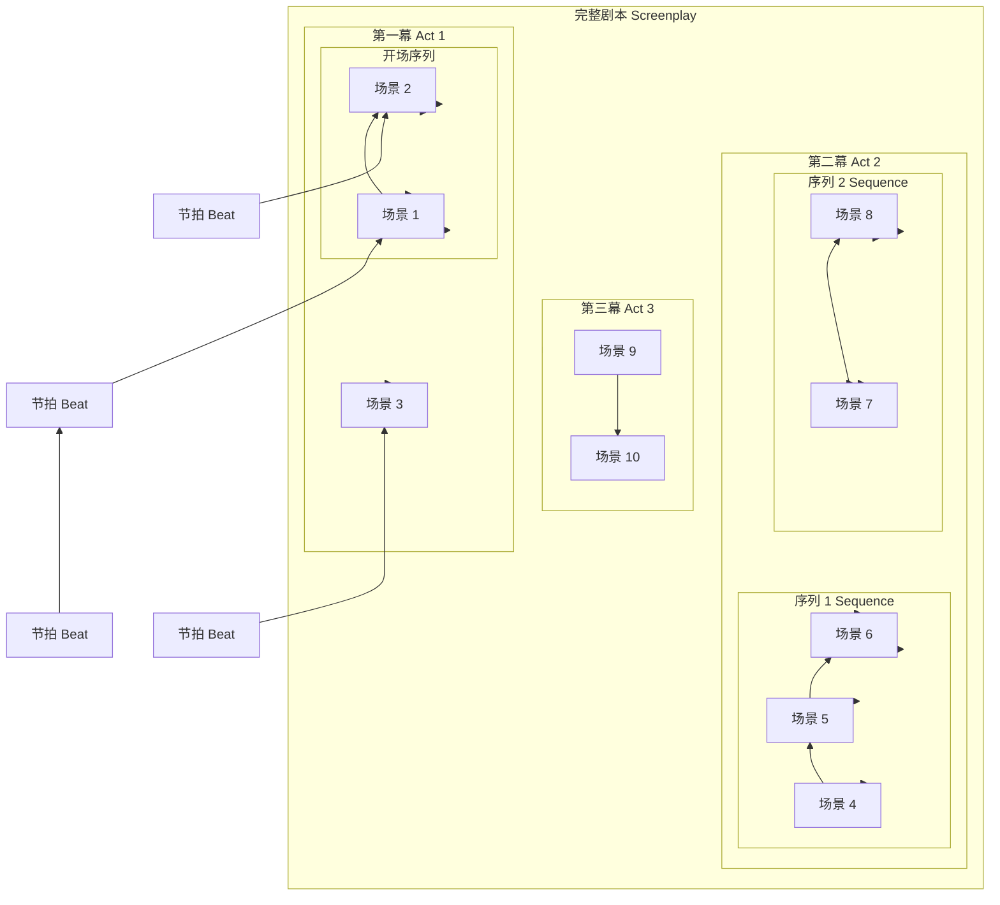
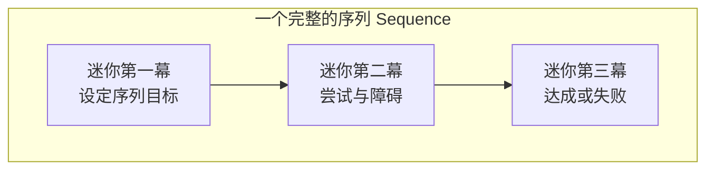

# 第09课：节拍、场景与序列

## Learning Objectives

- 理解剧本的层级构建系统：Beat -> Scene -> Sequence -> Act -> Script
- 掌握 Beat（节拍）作为最小故事单元的定义
- 理解 Scene（场景）的概念及其特征
- 学习 Sequence（序列）作为"迷你三幕剧"的构建方式
- 理解对比（Contrast）在故事讲述中的作用

---

## 剧本的构建层级

你的剧本像乐高（LEGOs）一样由不同大小的构建块组成。从最小单元到整体，层级结构如下：



这个金字塔结构的核心思想是：**更大的单元由更小的单元构成，每一层都有其独特的叙事功能。**

---

## Beat（节拍）：最小的故事单元

**Beat（节拍）** 是剧本中**最小的构建单元**。它描述的是一个**事件或一系列紧密相关的事件（Event or Series of Events）**。

### Beat 的特征

- **不可再分** — Beat 是叙事的最小 "原子"
- **功能单一** — 每个 Beat 服务一个具体的叙事目的
- **有方向性** — Beat 推动故事从一个状态进入下一个状态

### Beat 的例子

假设一个场景是"两个人在咖啡馆谈判"：

```
场景：咖啡馆谈判

Beat 1:  甲方出价（甲方提出条件）
Beat 2:  乙方拒绝（乙方驳回应答）
Beat 3:  甲方加码（甲方提高价格）
Beat 4:  乙方威胁离开（乙方站起身）
Beat 5:  甲方妥协（甲方叫住乙方，接受条件）
```

这 5 个 Beat 构成了一个完整场景。每个 Beat 都改变了角色之间的力量关系和情感状态。

> [!NOTE]
> 一个场景可以包含多个 Beat，而一个 Beat 也可能跨越多个场景。关键在于：Beat 是故事推进的最小情感或信息单元，而不是时间或空间的单元。

---

## Scene（场景）：一个时间一个地点

**Scene（场景）** 的定义非常明确：

> 一个场景 = 一个地点 + 一个特定时间

换句话说，当你改变了**地点（Location）** 或**时间（Time）**，你就进入了一个新的场景。

### 场景的基本结构

每个场景在剧本中都通过**场景标题（Slugline / Scene Heading）** 来标识：

```
INT. 咖啡馆 - 白天
```

或

```
EXT. 海滩 - 黄昏
```

### 场景的分类

| 类别 | 说明 | 示例标题 |
|---|---|---|
| 内景（Interior / INT.） | 室内场景 | INT. 公寓 - 夜晚 |
| 外景（Exterior / EXT.） | 室外场景 | EXT. 城市街道 - 白天 |
| 内外结合（INT./EXT.） | 跨越内外 | INT./EXT. 车内 - 白天 |

### 场景的功能

- **推进情节** — 展示故事的前进
- **揭示角色** — 通过角色的言行展示性格
- **建立氛围** — 通过视觉和声音营造情绪
- **提供信息** — 以自然的方式交代必要的背景

> [!TIP]
> 新手编剧常见的错误是："一个场景只完成一件事"。好的场景往往同时完成多个任务 —— 推进情节的同时揭示角色，制造紧张感的同时传递信息。好的场景是"多任务"的。

---

## Sequence（序列）：迷你三幕剧

**Sequence（序列）** 是一系列**相互关联的场景**的组合。序列是连接"场景"（小单元）和"幕"（大单元）的关键中间层。

### 序列的本质：一个迷你三幕剧

每个序列本身就可以看作一个小型的三幕故事：



### 序列的例子

以一部悬疑片为例：

```
序列："寻找失踪的钥匙"

场景 1: 主角发现保险箱的钥匙不见了（迷你 Catalyst）
场景 2: 主角质问同事，同事否认（迷你冲突 -> 迷你中点）
场景 3: 主角翻找办公室，被经理撞见（迷你危机）
场景 4: 主角在洗手间找到了钥匙——原来是早上自己放错了（迷你高潮/解决）
```

这个序列本身有：
- **自己的Catalyst** — 发现钥匙不见
- **自己的冲突** — 质问同事、翻找办公室
- **自己的中点** — 被经理撞见
- **自己的解决** — 找到钥匙

### 为什么序列很重要

1. **故事节奏控制** — 序列为长片的"中段平淡"提供了内部起伏
2. **次级叙事弧** — 序列提供了故事内部的"小目标"，让观众有持续的满足感
3. **结构清晰** — 当你把整个剧本分解为序列后，你会更清楚地看到故事的逻辑

> [!WARNING]
> 一个常见的剧本问题是"第二幕塌陷" —— 故事进入第二幕后，观众感觉不到前进的动力。解决这个问题的关键就是：**确保第二幕中的每一个序列都有自己清晰的起点、冲突和终点**。当序列被精心设计时，整部电影就不会有"沉闷的中段"。

---

## 对比：情绪的有意识编排

> [!NOTE]
> 对比（Contrast）是故事讲述中最强大但最容易被忽视的工具之一。

对比的本质是：**如果你想让观众感受到某种情绪，就要在此之前让他们感受到相反的情绪。**

### 对比的常见模式

| 当前序列的情绪 | 下一个序列的情绪 | 效果 |
|---|---|---|
| 紧张 | 轻松 | 轻松的感觉被放大 |
| 欢乐 | 悲伤 | 悲伤更加深刻 |
| 希望 | 绝望 | 绝望更加强烈 |
| 平静 | 恐惧 | 恐惧更加尖锐 |
| 快节奏 | 慢节奏 | 慢节奏显得意味深长 |

### 对比的实际应用

想象一部电影中连续的三个序列：

```
序列 1: 主角和恋人在海边度过浪漫的一天（幸福、轻松）
序列 2: 主角发现恋人隐瞒了一个重大秘密（震惊、背叛感）
序列 3: 主角独自一人在雨夜中行走（悲伤、孤独）
```

如果没有序列 1 的"幸福"，序列 2 的"震惊"和序列 3 的"悲伤"就不会有那么大的冲击力。**对比让情感产生放大效应。**

### 对比不只是情感

对比可以应用于故事的方方面面：

- **节奏对比** — 快动作场景后接慢节奏的反思场景
- **视觉对比** — 明亮鲜艳的场景接黑暗压抑的场景
- **对白密度对比** — 对话密集的话语场景接几乎没有对白的动作序列
- **角色对比** — 乐观的角色与悲观的角色在同一场景中

> [!TIP]
> 在规划剧本的结构时，把你设计好的序列列出来，检查相邻序列的情感基调是否过于一致。如果连续三四个序列都是"紧张的追逐"，观众会产生审美疲劳。有意识地在高峰之后安排低谷，在紧张之间安排喘息的空间。

---

## 四种构建块的对比一览

| 层级 | 定义 | 长度 | 功能 | 类比 |
|---|---|---|---|---|
| **Beat（节拍）** | 一个事件或事件集合 | 几十秒到几分钟 | 改变角色状态或关系 | 原子 |
| **Scene（场景）** | 一个地点 + 一个时间 | 1-3 页 | 推进情节或揭示角色 | 分子 |
| **Sequence（序列）** | 一系列关联场景 | 5-15 页 | 构成一个完整的迷你故事弧 | 器官 |
| **Act（幕）** | 一系列关联序列 | 25-60 页 | 完成故事的一个大阶段 | 系统 |

---

## 本章小结

剧本的构建层级从最小的 Beat 开始，通过 Scene、Sequence 和 Act，最终组成完整的 Script。理解这四个层次之间的关系，是专业编剧和业余爱好者之间的重要区别。

- **Beat（节拍）** 是最小的叙事单元，一个事件改变故事状态
- **Scene（场景）** = 一个地点 + 一个时间，通过 Slugline 标识
- **Sequence（序列）** 是一系列关联的场景，本身构成一个迷你三幕剧
- **对比（Contrast）** 是故事表达情感的核心工具 —— 有意识地安排相邻序列的情感反差，让观众的情绪体验更加强烈

当你开始规划剧本时，先从 Sequence 层面思考：你的故事由哪几个序列构成？每个序列的"迷你三幕"起点、冲突和终点是什么？相邻序列之间的情感对比是否足够？等到这些宏观问题解决后，再深入到 Scene 和 Beat 的细节层面。

---

## 下一步

- **下一课：** [[0010-outline-index-cards-treatment|第10课：大纲、索引卡与 Treatment]] — 学习如何在动笔之前用工具把你的故事固定下来
- **课后练习：** 拿一部你熟悉的电影，试着将它分解为序列。每个序列用一个句子概括。看看一部 90-120 分钟的电影包含多少个序列（通常 8-12 个）。然后检查相邻序列之间是否存在情感对比。
- **自我测验：**
  1. 剧本的五大构建层级从最小到最大是什么？
  2. Beat（节拍）的定义是什么？
  3. Scene（场景）的核心定义是什么？什么时候你需要开始一个新的场景？
  4. 为什么说 Sequence 是"迷你三幕剧"？
  5. 对比（Contrast）在故事讲述中起什么作用？

<details><summary>参考答案</summary>

1. Beat（节拍）-> Scene（场景）-> Sequence（序列）-> Act（幕）-> Script（剧本）。
2. Beat 是一个事件或一系列紧密相关的事件，是剧本中的最小叙事单元。
3. 一个场景 = 一个地点 + 一个特定时间。当你改变地点或时间时，你就进入了一个新场景。
4. 因为每个 Sequence 本身具有类似三幕剧的结构：有自己的小 Catalyst（目标设定）、小冲突（尝试与障碍）和小解决（达成或失败）。
5. 对比通过相邻序列之间的情感反差来放大观众的情绪体验 —— 没有前面的"幸福"，后面的"悲伤"就不会那么深刻。

</details>

---

> **参考：** [[reference/glossary|编剧术语表]] — 查看本课涉及的关键术语定义（如 Beat、Scene、Sequence）