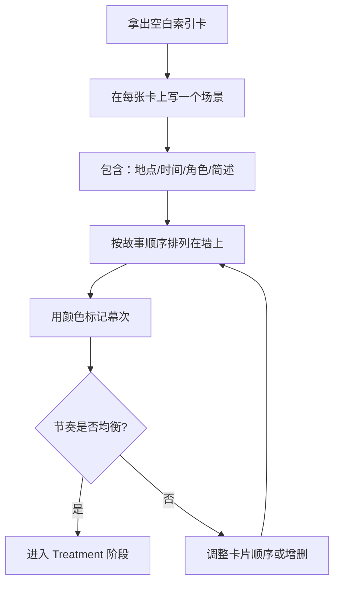
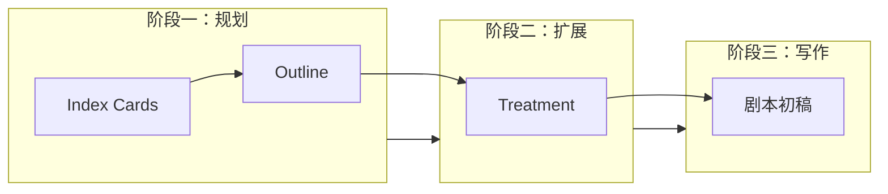

# 第10课：大纲、索引卡与 Treatment

## Learning Objectives

- 理解大纲（Outline）作为剧本蓝图的作用
- 掌握索引卡（Index Cards）的用法：每张卡代表一个场景
- 学会用颜色标记区分戏剧幕次
- 理解 Treatment 的定义、用途和长度规范
- 掌握 Treatment 与大纲的区别
- 认识 Treatment 作为"迷你测试"的价值

---

## 1. Outline — 剧本的蓝图

### 1.1 什么是 Outline

**Outline（大纲）** 是剧本的蓝图（blueprint），也是你在动笔写 Treatment 和完整剧本之前最重要的一步。它不是正式文档，而是你用来理清故事逻辑的私人工具。

> [!NOTE]
> 如果把剧本比作一栋建筑，Outline 就是建筑师的施工蓝图。它不负责外观装饰，只负责结构稳固。

### 1.2 Outline 包含什么

一个完整的 Outline 通常包含：

- **幕次结构** — 第一幕、第二幕、第三幕的起止点
- **关键节拍** — 催化剂（Catalyst）、第一转折点、中点、第二转折点、高潮
- **场景序列** — 每个场景的简要描述
- **角色弧线** — 主角从起点到终点的变化轨迹

### 1.3 Outline 的写作时机

Outline 应该在以下步骤之后、Treatment 之前完成：

```
创意收集 -> Logline -> Story Structure -> Outline -> Treatment -> 剧本初稿
```

---

## 2. Index Cards — 每张卡一个场景

### 2.1 什么是 Index Cards

**Index Cards（索引卡）** 是编剧用来可视化故事结构的小卡片。每张卡片代表一个场景，包含以下信息：

- **场景地点（Location）**
- **时间（Time）**
- **出场角色（Characters）**
- **1-2 句场景描述（1-2 Sentence Description）**

### 2.2 物理卡片 vs 数字卡片

| 方式 | 优点 | 缺点 |
|------|------|------|
| 物理卡片（实体） | 可以贴在墙上，全局可视；随时用手调整顺序 | 携带不便；容易丢失 |
| 数字卡片（软件） | 联网保存；易分享；Celtx/WriterDuet 等内置支持 | 缺乏"贴满墙"的视觉冲击 |

### 2.3 用颜色标记幕次

> [!TIP]
> 使用不同颜色的笔或标记来区分戏剧幕次：
> - **蓝色** — 第一幕（Setup）
> - **黄色** — 第二幕前半段（Rising Action）
> - **橙色** — 第二幕后半段（Complications）
> - **红色** — 第三幕（Resolution and Climax）

颜色编码让你在墙上一眼就能看出故事节奏是否均衡。如果某一种颜色明显偏多或偏少，说明你的故事结构可能需要调整。

### 2.4 实操方法



### 2.5 实践练习

> [!QUESTION]
> 假设你的短片有 12 个场景，分布在三幕中：第一幕 4 个场景、第二幕 5 个场景、第三幕 3 个场景。请为其中任意 3 个场景编写索引卡内容（每个场景包含地点、时间、角色和 1-2 句描述）。

<details><summary>参考示例</summary>

**场景 1（第一幕 — 蓝色）**
- 地点：John 的公寓客厅
- 时间：傍晚
- 角色：John, Sarah
- 描述：John 和 Sarah 正在打包行李，气氛紧张。Sarah 发现 John 把她的照片藏起来了，质问他是否还在联系前女友。

**场景 2（第二幕 — 黄色）**
- 地点：市中心咖啡馆
- 时间：次日白天
- 角色：John, 咖啡师 Mike
- 描述：John 独自在咖啡馆写日记，Mike 过来搭话，建议他直接向 Sarah 坦白一切，而不是逃避。

**场景 3（第三幕 — 红色）**
- 地点：Sarah 家门前
- 时间：深夜
- 角色：John, Sarah
- 描述：John 站在 Sarah 门口，手里拿着一封信。他犹豫了很久才按门铃。Sarah 开门，两人对视。
</details>

---

## 3. Treatment — 散文形式的故事

### 3.1 什么是 Treatment

**Treatment** 是以散文形式（prose）写成的故事版本，比 Outline 更详细，但**不包含对白**（dialogue）。它描述了剧本中将要发生的关键事件，但不是剧本本身。

> [!WARNING]
> Treatment 不需要写对白！它是"讲故事的文档"，不是"表演的蓝图"。

### 3.2 Treatment 的两个目的

1. **让你自己更了解这个故事** — 在写完整剧本之前，先用散文把故事过一遍，你会发现结构上的漏洞和角色逻辑问题。
2. **发给制片人/投资人征求意见** — Treatment 是你在写完整剧本之前，用于获取反馈和寻找合作伙伴的重要文档。

### 3.3 Treatment 的长度

Treatment 的长度没有硬性规定，但有一个行业惯例：

| 类型 | 典型长度 | 说明 |
|------|----------|------|
| 短片 Treatment | 1-3 页 | 简洁明了，聚焦核心冲突 |
| 长片 Treatment | 5-10 页 | 行业标准，大多数编剧和制片公司接受 |
| 超级详细版 | 70+ 页 | James Cameron 的《阿凡达》Treatment 接近 70 页，但这是特例 |

> [!TIP]
> 如果你是初学者，先从 3-5 页的短 Treatment 开始练习。长篇 Treatment 是经验丰富编剧的奢侈品。

### 3.4 为什么要先写 Treatment

**Treatment 是"迷你测试"（mini test）**。在你投入数周甚至数月去写完整剧本之前，Treatment 让你以较低的成本来验证故事的有效性：

1. 你发现故事逻辑是否自洽
2. 你发现角色动机是否合理
3. 你发现节奏是否存在问题
4. 如果 Treatment 就让人读不下去，剧本也很难救

> [!NOTE]
> 把 Treatment 想象成电影的全片预览（trailer）——它用简洁的方式呈现了整个故事的精髓。如果预览不吸引人，正片也很难让人买票。

### 3.5 Outline 与 Treatment 的对比

| 维度 | Outline | Treatment |
|------|---------|-----------|
| 形式 | 要点/列表 | 散文段落 |
| 详细程度 | 粗略 | 详细 |
| 包含对白 | 否 | 否 |
| 用途 | 自我梳理 | 自我梳理 + 对外展示 |
| 长度 | 通常 1-3 页 | 3-10+ 页 |
| 受众 | 编剧自己 | 编剧 + 制片人/投资人 |

---

## 4. 从 Outline 到 Treatment 再到剧本



这个流程的核心逻辑是：**逐层细化，低风险试错**。在每一步中，你都能以较低的时间成本发现故事的问题，而不必等到写完 120 页剧本才意识到结构崩溃。

---

## 5. 本课核心知识

- **Outline** 是剧本的结构化蓝图，在 Treatment 前完成
- **Index Cards** 每张代表一个场景，包含地点、时间、角色和简述
- 用**不同颜色标记幕次**，快速检查节奏是否均衡
- **Treatment** 是散文形式的故事扩展版，不含对白
- Treatment 的两个目的：让你更了解故事 + 发给制片人征求意见
- Treatment 的典型长度为 3-10 页，但 James Cameron 可以写 70 页
- Treatment 是写完整剧本前的"迷你测试"

---

## 课程链接

- 上一课：[[0009-beats-scenes-sequences|第09课：节拍、场景与序列]]
- 下一课：[[0011-what-is-a-screenplay|第11课：什么是剧本]]
- 参考：[[reference/glossary|编剧术语表]]

## 自我测试

1. Outline 和 Treatment 的根本区别是什么？
2. Index Cards 上应该包含哪四个要素？
3. 为什么 Treatment 不写对白？
4. Treatment 的典型行业长度是多少页？
5. 为什么说 Treatment 是一个"迷你测试"？

## 课后作业

1. 为你自己的故事（或你选择的一部电影）写一份 1 页的 Outline，列出所有场景的三幕分布。
2. 为每个场景创建一张索引卡，用颜色标记幕次，贴在墙上或数字白板上。
3. 将 Outline 扩展为一份 2-3 页的 Treatment，用散文形式讲述整个故事，不添加对白。
4. 找一位朋友或同学读你的 Treatment，请他们用一句话概括故事——如果他们能说清楚，你的 Treatment 就合格了。