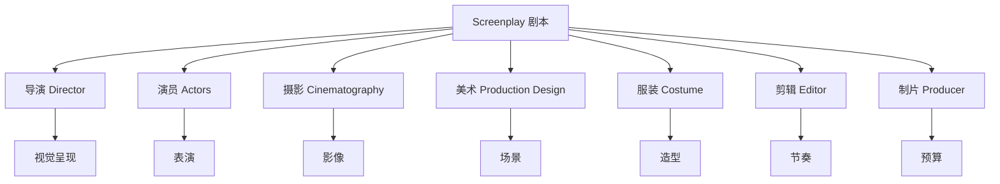

# 第11课：什么是剧本

## Learning Objectives

- 理解剧本作为各部门"蓝图"的核心角色
- 掌握页面长度规范：短片约 15 页，长片 90-120 页
- 理解 1 页 = 1 分钟银幕时间的换算规则
- 了解封面页（Title Page）的构成要素
- 掌握 Slugline 的格式标准：INT/EXT. LOCATION - DAY/NIGHT
- 理解 FADE IN / FADE OUT 的使用惯例

---

## 1. Screenplay — 所有部门的蓝图

### 1.1 剧本的本质

**Screenplay（剧本）** 是整部电影的蓝图（blueprint / map / skeleton）。它不是最终产品，而是一份指导性文档，告诉所有参与的部门：

- **导演** — 故事是怎样的，镜头该往哪里走
- **演员** — 你的角色是什么样的人，要说什么话
- **摄影** — 场景在什么光线条件下拍摄
- **美术** — 需要搭建什么样的场景
- **服装** — 角色穿什么
- **剪辑** — 素材应该如何组装

> [!NOTE]
> 剧本本身不是为普通读者阅读的文学作品，它是一个实用工具，为整个电影制作团队服务。

### 1.2 电影工业的"宪法"

在电影制作中，剧本是所有决策的起点。制片人根据它估算预算，导演根据它制定拍摄计划，各部门根据它准备资源。没有剧本，电影制作就是一片混乱。



---

## 2. 页面长度规范

### 2.1 行业标准

剧本的页面长度直接对应银幕时间。行业中有两个基本规则：

| 项目 | 页面数 | 银幕时间 | 适用场景 |
|------|--------|----------|----------|
| 短片（Short Film） | 约 15 页 | 约 15 分钟 | 电影节参赛、个人作品、在线发布 |
| 长片（Feature Film） | 90-120 页 | 90-120 分钟 | 影院上映、流媒体、电视电影 |

### 2.2 为什么短片建议 15 分钟

> [!TIP]
> 如果你想用短片参加电影节，**15 分钟以内**是黄金标准。绝大多数电影节的短片单元都会优先考虑 15-20 分钟以内的作品。超过这个时间，要么会被归入"中片"类别，要么可投递的节展数量会大幅减少。

### 2.3 1 页 = 1 分钟的规则

行业经验法则：**1 页剧本 ≈ 1 分钟银幕时间**。

这个规则基于标准剧本格式（12 号 Courier 字体、特定的页边距和间距）。如果你改变了格式，这个换算关系就不成立了。

> [!WARNING]
> 1 页 = 1 分钟是估算值，不是精确公式。动作密集的场景可能 1 页不到 1 分钟，而对白密集的场景可能 1 页超过 1 分钟。但作为初始规划工具，这个规则非常有用。

---

## 3. 剧本的组成要素

### 3.1 封面页（Title Page）

封面页是剧本的第一印象，必须包含以下信息：

| 要素 | 说明 |
|------|------|
| **Film Title**（片名） | 剧本的完整标题 |
| **Format**（格式） | 标明是 Short Film 还是 Feature Film |
| **Date + Version**（日期/版本） | 写作日期和版本号，方便追踪修改历史 |
| **Writer Name(s)**（作者） | 编剧的姓名（或笔名） |
| **Contact**（联系方式） | 邮箱或电话，方便制片人联系你 |

封面页示例：

```
                    THE LAST LIGHT

                    A Short Film

                    Written by
                    John Doe

                    Version 2.0
                    July 30, 2026

                    johndoe@email.com
```

> [!NOTE]
> 封面页不需要花哨的设计，不需要图片或插图。在好莱坞，干净、专业的纯文本封面页才是标准。

### 3.2 角色描述页（Character Description Page）

这是一个**可选项**，但聪明的编剧会准备一张。它列出的主要角色的简要描述，包括：

- 角色姓名
- 年龄范围
- 外貌特征（简略）
- 性格关键词

制片人拿到剧本时，如果附带角色描述页，他们会更容易在阅读时将角色可视化。这是一个体现专业度的加分项。

### 3.3 正文格式

剧本正文由以下几个要素构成：

#### Slugline / Scene Heading（场景标题）

**Slugline（场景标题）** 是每个场景的第一行，告诉读者场景发生在哪里、什么时间。标准格式：

```
INT. 或 EXT.  具体地点  -  白天或夜晚
```

| 组成部分 | 选项 | 含义 |
|----------|------|------|
| INT. / EXT. | **INT.** = Interior（室内），**EXT.** = Exterior（室外） | 告诉剧组是棚拍还是外景 |
| Location | 具体地点，如 KITCHEN、PARK、CAR | 标明场景发生的具体位置 |
| - | 连字符分隔 | 分隔地点和时间 |
| DAY / NIGHT | **DAY**（白天）、**NIGHT**（夜晚）、**DAWN**（黎明）、**DUSK**（黄昏） | 告诉摄影组光线条件 |

完整示例：

```
INT. JOHN'S APARTMENT - NIGHT
```

也表示：

- 这是一个室内场景（INT.）
- 在 John 的公寓里（JOHN'S APARTMENT）
- 发生在晚上（NIGHT）

#### Action / Description（动作描写）

- 描述场景中发生了什么
- 只写观众能看到和听到的内容
- 使用**现在时**（present tense）
- 句子简洁有力，避免文学化的修辞

```
John 把钥匙扔在桌上，发出一声闷响。他没有开灯，径直走向窗边，拉开窗帘。月光照亮了他疲惫的脸。
```

#### Character Name（角色名）

当角色开口说话时，角色名出现在对白上方，居中：

```
JOHN
（对 Sarah）
你来了。
```

#### Dialogue（对白）

角色名下方是对白文本，左缩进，用于排版区分：

```
JOHN
我没想到你真的会来。
我以为你早就放弃了。
```

#### Parenthetical（角色提示）

有时在角色名和对白之间加入小括号内的提示，标明说话语气或动作。但**不要滥用**。

```
JOHN
（轻声地）
对不起。
```

### 3.4 剧本格式总览表

| 要素 | 格式要求 | 示例 |
|------|----------|------|
| **Slugline** | 全部大写，INT./EXT. 开头 | `INT. OFFICE - DAY` |
| **Action** | 两端对齐，现在时，简洁 | `Tom 推开椅子，站了起来。` |
| **Character** | 居中，第一次出现时全部大写 | `TOM` |
| **Dialogue** | 左缩进，角色名下方 | `我们不能这样做。` |
| **Parenthetical** | 角色名下，小括号，居中 | `（低声）` |
| **Transition** | 右对齐，全部大写（慎用） | `CUT TO:` |

---

## 4. FADE IN / FADE OUT 惯例

### 4.1 FADE IN

每个剧本的开头，通常是：

```
FADE IN:
```

然后进入第一个场景的 Slugline。

### 4.2 FADE OUT

剧本的结尾：

```
FADE OUT.
```

或：

```
THE END
```

> [!WARNING]
> 初学者经常在每一场之间使用 FADE IN / FADE OUT，这是错误的。FADE IN 只在剧本最开头用一次，FADE OUT 只在最结尾用一次。场景之间使用 `CUT TO:` 或直接空行即可。

### 4.3 现代习惯

在当代剧本写作中，很多编剧已经省略 FADE IN 和 FADE OUT，直接从第一个场景的 Slugline 开始。

```
（不再写 FADE IN:）

INT. COFFEE SHOP - DAY

（直接进入场景）
```

---

## 5. 剧本示例（微型）

```
FADE IN:

EXT. CITY PARK - DAY

阳光明媚，鸽子在地上啄食。JOHN（30岁，普通打扮）坐在长椅上，手里捏着一封信。

SARAH（28岁，神情紧张）从远处走来，停在 John 面前。

SARAH
你看了？

JOHN
看了。

Sarah 在他身边坐下，沉默了良久。

SARAH
那不是我的本意。

JOHN
那你的本意是什么？

Sarah 没有回答，只是看向远方。

FADE OUT.
```

---

## 6. 本课核心知识

- **剧本是电影的蓝图** — 它服务导演、演员、摄影、美术、剪辑和制片人
- **短片建议约 15 页** — 15 分钟以内是电影节的最佳长度
- **长片标准 90-120 页** — 1 页约等于 1 分钟银幕时间
- **封面页**需要包含：片名、格式、日期和版本、作者、联系方式
- **角色描述页**是可选项，但能体现专业度
- **Slugline** 格式：`INT./EXT. LOCATION - DAY/NIGHT`
- **FADE IN** 只在开头用一次，**FADE OUT** 只在结尾用一次

---

## 课程链接

- 上一课：[[0010-outline-index-cards-treatment|第10课：大纲、索引卡与 Treatment]]
- 下一课：[[0012-celtx-software|第12课：使用免费编剧软件 Celtx]]
- 参考：[[reference/script-format|剧本格式速查]]
- 参考：[[reference/glossary|编剧术语表]]

## 自我测试

1. 为什么说剧本是电影的蓝图？
2. 短片的最佳页面长度是多少？为什么？
3. 1 页剧本约等于多少分钟银幕时间？
4. 封面页必须包含哪五个要素？
5. Slugline 的标准格式是什么？请写出一个示例。
6. FADE IN 应该在剧本中出现多少次？

## 课后作业

1. 找一部你喜欢的电影的剧本（可在网上搜索 PDF），对照本课讲的格式要素，标出封面页、Slugline、Action、Character、Dialogue。
2. 写一个 2 页的微型剧本，用上你学到的所有格式要素，确保 Slugline、动作描写和对白的格式完全正确。
3. 将你写的微型剧本分享给一位朋友阅读，问他们能否理解每个场景发生的地点和时间——如果他们能，你的剧本格式就合格了。