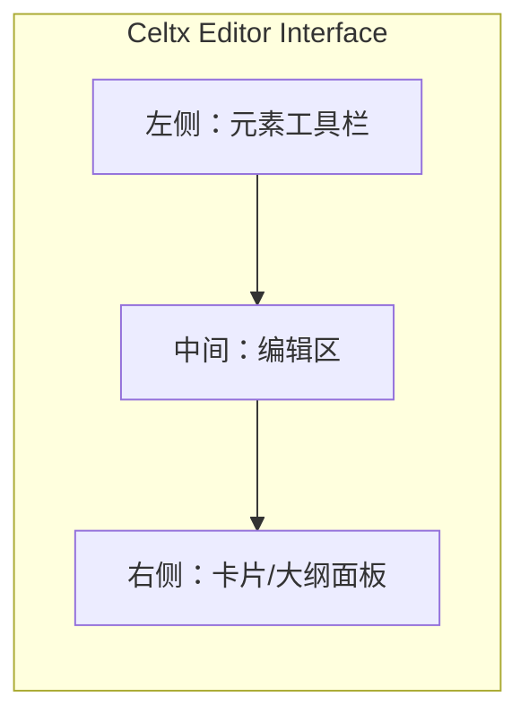
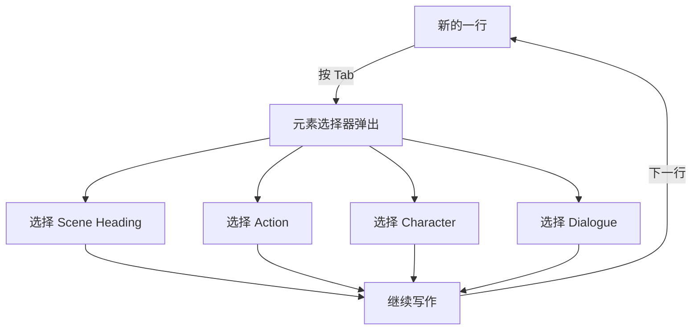

# 第12课：使用免费编剧软件 Celtx

## Learning Objectives

- 了解 Celtx 的核心功能：在线、离线、手机端、多人协作
- 学会创建账户和新建项目
- 理解免费版和付费版的区别
- 掌握设置封面页（Title Page）的方法
- 学会写场景标题（Scene Heading）、动作描写（Action）、角色名（Character）和对白（Dialogue）
- 掌握 Tab 键在不同元素间切换的技巧
- 了解转场（Transition）和镜头提示（Shot）的使用时机
- 学会分享项目和导出 PDF

---

## 1. Celtx 概述

### 1.1 什么是 Celtx

**Celtx** 是一款广泛使用的编剧软件，它具备以下特点：

- **基于云端（Cloud-based）** — 在线保存，随时随地访问
- **也支持离线使用** — 即使没有网络，你仍然可以在本地写作
- **手机端可用** — 在 iOS 和 Android 上都有 App，灵感来了随时记录
- **多人协作** — 可以邀请其他编剧一起在线编辑同一个项目

> [!NOTE]
> Celtx 的核心理念是"剧本在云端"——你在地铁上写两行，回家打开电脑，它们已经同步好了。

### 1.2 Celtx vs 其他软件

| 软件 | 价格 | 平台 | 适合 |
|------|------|------|------|
| Celtx | 免费 + 付费 | Web / Desktop / Mobile | 初学者、中小型项目 |
| Final Draft | 付费（约 $250） | Desktop | 专业编剧、好莱坞标准 |
| WriterDuet | 免费 + 付费 | Web / Desktop / Mobile | 协作写作 |
| Fade In | 付费（约 $80） | Desktop | 性价比之选 |

---

## 2. 开始使用 Celtx

### 2.1 创建账户

1. 访问 Celtx 官网（celtx.com）
2. 点击 **Sign Up**（注册）
3. 使用邮箱注册，或使用 Google / Facebook 账号快捷登录
4. 验证邮箱后即可开始使用

### 2.2 新建项目

登录后，你会看到 Dashboard（仪表盘）：

1. 点击 **New Project**（新建项目）
2. 选择 **Script Writing**（剧本写作）
3. 输入项目名称（如 "My First Screenplay"）
4. 选择剧本类型：**Film**（电影）、**TV**（电视）、**Theater**（舞台剧）、**Comic**（漫画）等——我们选 Film
5. 点击 **Create** 完成

> [!TIP]
> 项目名称建议使用你的剧本片名。后期项目多了之后，按名称搜索会方便很多。

### 2.3 Celtx 编辑界面介绍

创建项目后，你会进入编辑界面：

- **左侧工具栏** — 剧本元素切换（Scene Heading, Action, Character, Dialogue 等）
- **中间主编辑区** — 你的剧本在这里写
- **右侧面板** — 卡片视图（Index Cards）、大纲视图等
- **顶部栏** — 项目名称、分享按钮、导出按钮



---

## 3. 免费版 vs 付费版

### 3.1 Celtx 的定价策略

Celtx 采用 Freemium 模式：

| 功能 | 免费版 | 付费版 |
|------|--------|--------|
| 基本写作 | 支持 | 支持 |
| 自动格式 | 支持 | 支持 |
| 项目数量 | 有限（通常是 1-3 个） | 无限制 |
| 导出 PDF | 支持 | 支持 |
| 离线使用 | 支持 | 支持 |
| 多人协作 | 有限 | 完整支持 |
| 大纲/卡片视图 | 支持 | 支持 |
| 存储空间 | 有限 | 无限制 |

> [!WARNING]
> 免费版足够你完成整部剧本的写作。不要因为功能限制而付费——等你确认自己会坚持写下去，再考虑升级。初学者不需要在工具上花钱。

---

## 4. 编写剧本元素

### 4.1 场景标题 / Scene Heading

在编辑区中，点击 **Scene Heading** 元素（或使用快捷键），然后输入：

```
INT. COFFEE SHOP - DAY
```

Celtx 会自动将场景标题设置为全部大写（ALL CAPS）。

### 4.2 动作描写 / Action

在场景标题下方，按回车，Celtx 会自动切换到 Action 模式。输入：

```
John 推开咖啡店的门，铃铛叮当作响。他环顾四周，看到 Sarah 坐在角落里。
```

### 4.3 角色名 / Character

按回车后点击工具栏的 **Character** 元素（或使用快捷键），输入角色名：

```
JOHN
```

Celtx 会自动居中并且大写角色名。

### 4.4 对白 / Dialogue

角色名输入完成后按回车，Celtx 会自动切换到 Dialogue 模式。输入对白：

```
你一个人来的？
```

### 4.5 从动作到对白的完整操作

```
1. 场景标题：INT. COFFEE SHOP - DAY
2. 动作：John 走向 Sarah 的桌子。
3. 角色名：JOHN
4. 对白：我看到你了。
5. 角色名：SARAH
6. 对白：我知道你会来。
```

### 4.6 Tab 键 — 你的高效工具

> [!TIP]
> **Tab 键**是 Celtx 中最重要的快捷键。当你写了一个元素后，按 Tab 键会弹出元素切换菜单，让你在同一行内快速切换元素类型。熟悉 Tab 键的用法后，你的写作速度至少提升一倍。

| 操作 | 效果 |
|------|------|
| 在新行按 Tab | 打开元素选择器 |
| 连续按 Tab | 在 Scene Heading / Action / Character / Dialogue 之间循环 |
| 直接打字 + Tab | 快速切换当前行元素类型 |



---

## 5. 转场和镜头提示

### 5.1 转场（Transition）

转场效果如 `CUT TO:`、`DISSOLVE TO:`、`FADE IN:`、`FADE OUT:` 在 Celtx 中作为单独的元素存在。

> [!WARNING]
> **不要滥用转场！** 在职业剧本中，绝大多数场景之间不需要任何转场。直接从一个场景的最后一个字符跳到下一个场景的 Slugline 就可以了。转场是导演的职责，不是编剧的。

只在以下情况下使用转场：
- 剧本开头：`FADE IN:`
- 剧本结尾：`FADE OUT.` 或 `THE END`
- 特殊的叙事需要（如时间跳跃）

### 5.2 镜头提示（Shot）

Celtx 也支持镜头提示（如 `CLOSE UP:`、`WIDE SHOT:`、`POV:`），但同样：

> [!NOTE]
> 写镜头提示相当于你在做导演的工作。除非该镜头对叙事至关重要（比如从小细节展开场景），否则留给导演决定。大多数剧本不需要任何镜头提示。

---

## 6. 分享与协作

### 6.1 邀请协作者

1. 在项目页面点击 **Share**（分享）按钮
2. 输入协作者的邮箱地址
3. 选择权限级别：
   - **Can Edit**（可编辑） — 可以修改剧本内容
   - **Can Comment**（可评论） — 只可添加评论，不可修改
   - **Can View**（可查看） — 只读权限

### 6.2 多人同时写作

Celtx 支持实时协作（类似 Google Docs），你可以和另一位编剧同时编辑同一个项目，看到彼此的修改高亮显示。特别适合编剧搭档（writing partnership）使用。

---

## 7. 导出与打印

### 7.1 导出为 PDF

1. 点击顶部菜单的 **File**（文件）
2. 选择 **Export**（导出）
3. 选择 **PDF**
4. 确认页边距和字体设置
5. 保存到本地

PDF 是行业标准格式，发送给制片人或投稿参赛都需要 PDF。

### 7.2 打印

同样在菜单栏中选择 **Print**（打印）即可。Celtx 会自动应用标准的剧本格式（Courier 12pt、标准页边距、标准缩进）。

### 7.3 格式保护

> [!TIP]
> Celtx 的核心理念之一是保护你的格式。你不需要手动调整字体、间距或对齐——Celtx 会在导出时自动应用行业标准格式。你只需要专注于内容。

---

## 8. 在 Celtx 中设置封面页

### 8.1 标题页编辑

1. 在项目 Dashboard 中点击 **Title Page**（封面页）
2. 填写以下字段：
   - **Title**（片名）
   - **Author**（作者）
   - **Contact**（联系方式）
   - **Draft / Date**（草稿编号 / 日期）
   - **Notes**（备注，可选）
3. 点击 **Save** 保存

### 8.2 封面页预览

封面页会作为剧本 PDF 的第一页导出。Celtx 会自动将其格式化为标准封面页样式。

---

## 9. 本课核心知识

- **Celtx** 是一款支持在线、离线、手机端和多人协作的免费编剧软件
- 创建项目后选择 **Script Writing > Film**
- **免费版**足够初学者完成整部剧本
- 使用工具栏或 **Tab 键**在 Scene Heading / Action / Character / Dialogue 之间切换
- **转场**（Transition）和**镜头提示**（Shot）要慎用——留给导演决定
- 通过 **Share** 按钮邀请协作者，可设置编辑/评论/查看权限
- 导出为 **PDF** 是行业标准

---

## 课程链接

- 上一课：[[0011-what-is-a-screenplay|第11课：什么是剧本]]
- 下一课：[[0013-8-steps-writing-screenplay|第13课：撰写剧本的 8 个步骤]]
- 参考：[[reference/glossary|编剧术语表]]

## 自我测试

1. Celtx 支持哪些使用场景（在线/离线/手机）？
2. 免费版和付费版的主要区别是什么？
3. 在 Celtx 中切换剧本元素类型的快捷键是什么？
4. 为什么不应该在剧本中频繁使用转场和镜头提示？
5. 在 Celtx 中如何导出剧本？导出的标准格式是什么？

## 课后作业

1. 前往 celtx.com 注册一个免费账户，创建一个新的剧本项目。
2. 使用本课学到的知识，写一个 2 页的微型剧本，包含至少 3 个场景标题、5 段动作描写、2 组角色名和对白。
3. 导出为 PDF，检查格式是否正确。
4. （进阶）邀请一位同学或朋友作为协作者，在项目中添加评论，体验协作功能。