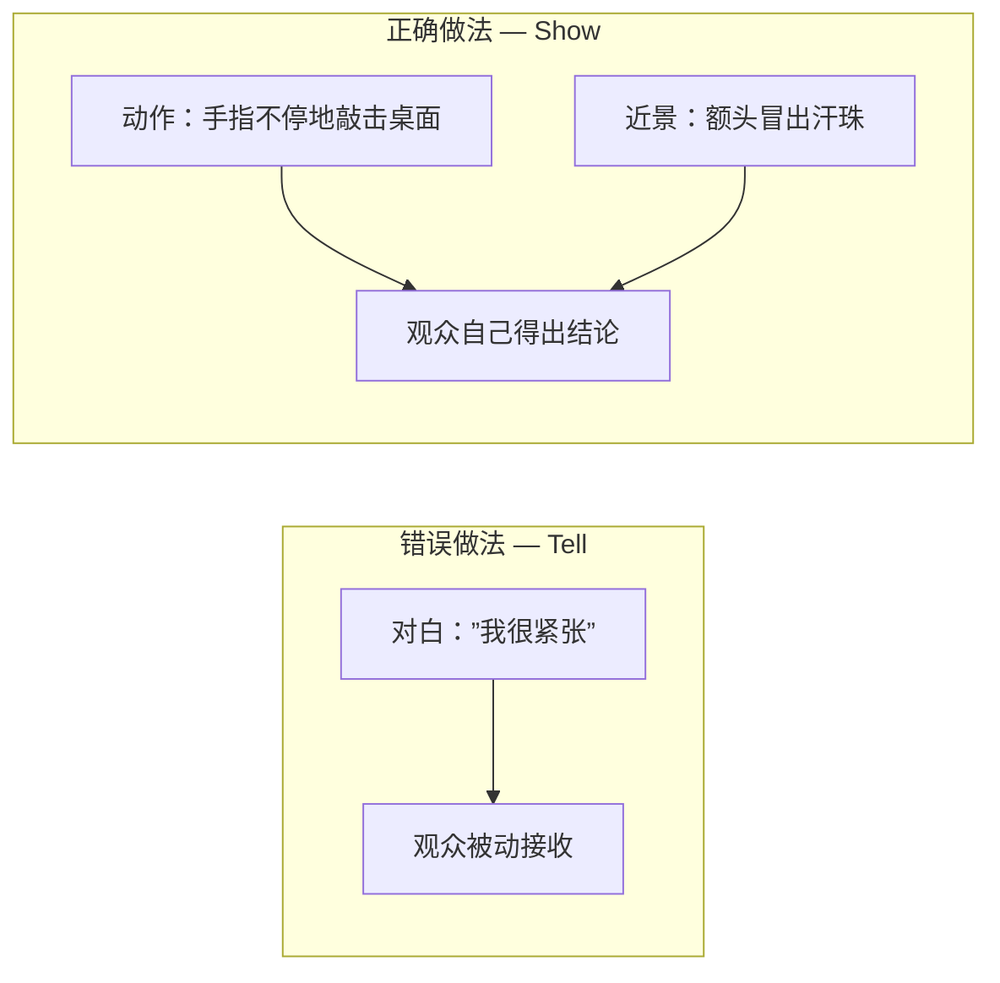
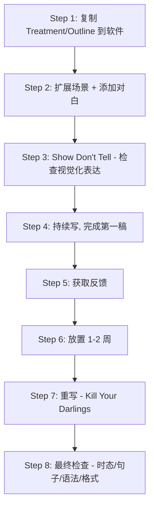

# 第13课：撰写剧本的 8 个步骤

## Learning Objectives

- 掌握从 Treatment/Outline 到完整剧本的 8 步写作流程
- 理解"Show Don't Tell"在编剧中的具体实践
- 学会如何给出和接收剧本反馈
- 理解"Kill Your Darlings"——删改的必要性
- 掌握剧本语言的三大黄金法则：现在时、简洁句、正确语法
- 理解前 15-20 页的决定性作用

---

## 1. 写作前的心理准备

### 1.1 先读成功剧本

在动笔之前，**先读一些已经拍成电影的成功剧本**。选择与你想要写的相同或相近类型的剧本：

- 你想写恐怖片？读《The Conjuring》的剧本
- 你想写科幻片？读《Ex Machina》的剧本
- 你想写喜剧片？读《Juno》的剧本

> [!TIP]
> 读成功剧本的目的是感受"正确的节奏"。你会看到专业编剧如何在 1 页内完成一个场景，如何在 2 页内完成一段紧张的对白。这不是抄袭，而是**语感训练**。

### 1.2 前 15-20 页决定一切

这是整个课程中最重要的原则之一：

> [!WARNING]
> **你的前 15-20 页必须要精彩绝伦**。因为制片人（producers）和剧本审读人（script readers）在这 15-20 页内就会决定是否要继续读下去。如果开头让他们觉得无聊，你的剧本永远不会被翻到第 21 页。

这意味着：
- 第一页就要吸引人——不要花 10 页做背景铺垫
- 尽快展示你的故事核心——不要让读者等太久
- 前 15 页至少要让读者感受到冲突和张力

---

## 2. 8 个步骤详解

### 第 1 步：将 Treatment / Outline 复制到软件中

打开你的编剧软件（如 [[0012-celtx-software|Celtx]]），将之前写好的 [[0010-outline-index-cards-treatment|Treatment 或 Outline]] 复制进去。

此时的文档是粗略的骨架——每个场景可能只有一两句话的描述。但你已经有了结构性基础，接下来的工作就是**血肉填充**。

```
（示例——初始状态）

INT. KITCHEN - DAY

John 和 Sarah 在厨房争吵。Sarah 发现了一张照片。

INT. CAR - NIGHT

John 独自开车，神情沮丧。
```

> [!NOTE]
> 这一步的目的是让你从"规划者"心态切换到"写作者"心态。软件打开了，大纲就位了——你现在唯一的任务就是把每一个场景变成完整的剧本文本。

### 第 2 步：扩展场景 + 添加真实的对白

这是最耗时的一步。你需要为每个场景做两件事：

**扩展 Action 描写** — 将场景标题下的一句话描述扩展成完整的动作描写。考虑：
- 角色在这个场景中做了什么？
- 场景中有什么重要物件？
- 光线、氛围是什么样的？

**添加对白** — 让角色说话。关键原则：

> [!WARNING]
> **不要让角色说出显而易见的（obvious）话。** 在现实中，人们不会说"我正在走进厨房，因为我要喝水"——剧本中对白也是如此。对白应该揭示角色的内心、推动剧情或制造张力，而不是复述观众已经看到的东西。

| 不要这样写 | 更好的写法 |
|------------|-----------|
| "我现在很生气，因为你骗了我。" | （John 把咖啡杯重重摔在地上。沉默。） |
| "我们正在下雨天开车去机场。" | （镜头从雨刷扫过挡风玻璃切到 John 紧握方向盘的手。） |

### 第 3 步：Show, Don't Tell

写作最基础也是最容易被忽视的原则——**展示，而不是讲述**。

剧本是视听媒体（audiovisual medium）。观众是通过眼睛和耳朵来接收故事的，不是通过角色的自言自语。能用一个动作表达的情绪，就不要用对白解释。



**场景示例对比：**

Tell（讲述）：
```
JOHN
我很紧张。我不想见她。
SARAH
你为什么不早说？
```

Show（展示）：
```
John 的手指在桌面上敲出急促的节奏。咖啡杯被拿起又放下，咖啡溅到了桌布上。门铃响了。他猛地站起来，又坐下。
SARAH
（弯腰去拿包）
挂了吧。你可以直接走。
（John 没有动。）
```

### 第 4 步：持续写，直到第一稿完成

> [!TIP]
> **先完成，再完美。**

在写第一稿时，不要回头修改。不要停在一个场景上纠结措辞。如果你觉得某个句子不完美，写个大概就行，标记出来，然后前进到下一个场景。修改是第 7 步的事。

**为什么不能在第一稿阶段修改？**
- 你可能写完第 30 页后发现第 5 页的场景根本不需要——你现在改得再完美也是白改
- 完美主义是写作的最大敌人
- 完成感本身就是巨大的动力

### 第 5 步：获取反馈

第一稿完成后，把它交给别人读。

**找谁读？**
- 你信任的朋友或家人
- 编剧小组或写作社群
- 网络上的编剧论坛

**问什么？**
- 故事哪里觉得无聊？（最重要的问题）
- 角色动机是否合理？
- 有没有让你困惑的地方？
- 整体节奏如何？

> [!WARNING]
> 不要解释你的剧本。读者读到的就是他们读到的。如果你需要解释你的意图，说明那个意图没有成功传达到纸上。

### 第 6 步：放置 1-2 周，用新鲜眼光看

反馈收集完毕后，**把剧本收起来**。在这 1-2 周内：

- 不要打开它
- 不要想它
- 去看别的电影，读别的书

1-2 周后，用"陌生人"的眼光重新读你的剧本。你会在自己都意想不到的地方发现问题：

- 原来这个场景这么拖拉
- 原来这句对白这么尴尬
- 原来这个角色的动机从一开始就没交代清楚

> [!NOTE]
> 大脑的记忆会美化自己的作品。放置一段时间能打断这种美化效应，让你看到真实的版本。

### 第 7 步：重写和打磨

**Kill Your Darlings（杀掉你心爱的角色/场景/对白）**——这是编剧圈最著名的建议之一。

> [!TIP]
> 你写了一个非常得意的场景？你对某句对白爱不释手？但如果它**不能推动故事**，删掉它。不管它多精彩，只要它是多余的，就是有害的。

重写时可以按以下顺序检查：
1. **结构层面** — 三幕是否清晰？节奏是否恰当？
2. **场景层面** — 每个场景是否都有存在的必要？
3. **对白层面** — 有没有什么地方可以砍掉一半？
4. **动作层面** — 有没有更好的"展示"替代"讲述"？

### 第 8 步：最终检查

在完成所有改写后，做最后一次通读检查：

| 检查项 | 说明 |
|--------|------|
| **现在时（Present Tense）** | 所有动作描写都应该是现在时，不能出现过去时或未来时 |
| **简洁有力的句子（Short Punchy Sentences）** | 每句话只传达一个信息。紧凑、不拖沓 |
| **正确的语法和拼写（Correct Grammar & Spelling）** | 语法错误和专业性不匹配。使用拼写检查工具 |
| **格式正确** | Slugline、角色名、对白缩进都符合行业标准 |

---

## 3. 完整流程总览



---

## 4. 本课核心知识

- **前 15-20 页**必须精彩——这是制片人决定是否继续读的关键窗口
- 写作前**先读成功剧本**，培养语感
- **8 个步骤**：复制大纲 → 扩展场景 → Show Don't Tell → 完成初稿 → 获取反馈 → 放置 1-2 周 → 重写 → 最终检查
- **不要让角色说出显而易见的事**
- **Kill Your Darlings**——删掉任何不推动故事的内容，无论你多喜欢它
- 剧本语言三大法则：**现在时、简洁句、正确语法**

---

## 课程链接

- 上一课：[[0012-celtx-software|第12课：使用免费编剧软件 Celtx]]
- 下一课：[[0014-9-steps-short-film|第14课：撰写短片的 9 个步骤]]
- 参考：[[reference/glossary|编剧术语表]]

## 自我测试

1. 8 个步骤中，哪一步是初学者最容易跳过的？
2. 为什么前 15-20 页如此重要？
3. "Kill Your Darlings"是什么意思？
4. "Show Don't Tell"的核心区别是什么？请各举一个例子。
5. 为什么第一稿写完后要放置 1-2 周再修改？

## 课后作业

1. 如果你已经有了一部剧本的第一稿，把它交给一位朋友读，收集反馈。如果没有，回到你的 Treatment，执行第 1-4 步，写一个 5 页的短片初稿。
2. 在第 1 稿完成后，执行第 6 步——放置一周。然后带着新鲜眼光通读一遍，记下所有你想修改的地方。
3. 找一句你剧本中"Tell"的例子（角色用对白说出了观众已经能看到的东西），改写成"Show"的版本。
4. 在最终稿中进行第 8 步检查，确保每句话都在现在时，简短有力，没有语法错误。