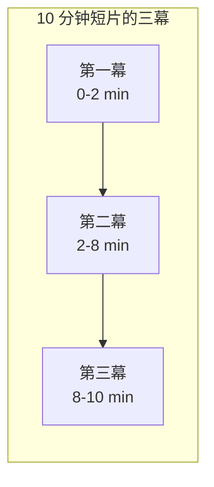
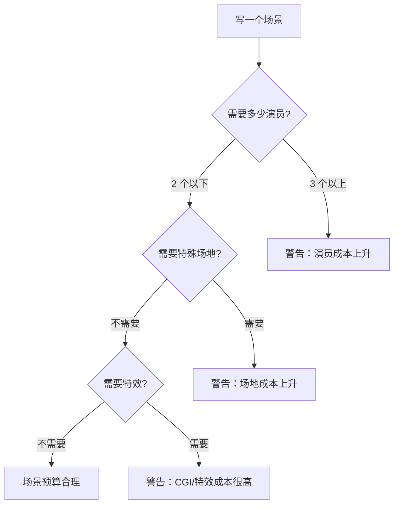
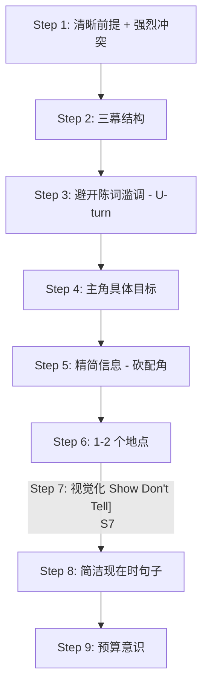

# 第14课：撰写短片的 9 个步骤

## Learning Objectives

- 理解短片和长片的本质差异
- 掌握撰写短片剧本的 9 个步骤
- 学会在有限篇幅中构建有效冲突
- 理解为什么"短片像序列而不是压缩的长片"
- 掌握预算意识在短片创作中的重要性
- 学会识别和避免短片中的常见陈词滥调

---

## 1. 短片 vs 长片——根本区别

### 1.1 为什么选择拍短片

选择拍短片而不是长片，通常有以下原因：

- **预算和后勤限制** — 我们没有几十万甚至几百万去拍一部长片
- **纯粹喜欢短片形式** — 有些故事天生就适合在 15 分钟内讲完
- **作为长片的练习** — 短片是进入电影制作的最佳起点
- **参赛和展示** — 短片是电影节的通行证

> [!NOTE]
> 短片不是"压缩的长片"。你不能把一部长片的故事硬塞进 15 分钟。短片是一种独立的艺术形式，有自己的叙事规律。

### 1.2 关键洞察：短片像序列

本课最重要的概念：

> [!TIP]
> **短片的长度更像一个"序列（sequence）"，而不是一整部"长片（feature film）"。**

回顾 [[0009-beats-scenes-sequences|第09课]] 中学到的知识：序列（sequence）是节拍和场景的集合体，是一个"微三幕"结构。短片就是这么大——它不是一个宏大的史诗，而是一个精致的片段。

如果用一句话总结短片的本质：

> 短片不是在 15 分钟内讲一个 90 分钟的故事。而是在 15 分钟内讲一个只属于 15 分钟的故事。

---

## 2. 9 个步骤详解

### 第 1 步：清晰简洁的前提 + 强烈的冲突

短片的篇幅决定了**前提必须无比清晰**。观众没有时间琢磨复杂的设定。

- 前提（premise）应该能用一句话说清
- 冲突（conflict）不能缓慢积累——它必须从一开始就存在或迅速建立

```
好的短片前提示例：
"一个女孩在深夜的便利店发现自己被跟踪了。"
"一位老人在公园长椅上等一个永远不会来的人。"
```

### 第 2 步：开端、发展、结局（三幕结构）

即使只有 10-15 分钟，三幕结构仍然有效：

| 幕 | 占全片比例 | 在 10 分钟短片中的位置 |
|------|-----------|----------------------|
| **第一幕（Setup）** | ~20% | 第 0 - 2 分钟 |
| **第二幕（Development）** | ~60% | 第 2 - 8 分钟 |
| **第三幕（Resolution）** | ~20% | 第 8 - 10 分钟 |

但是在短片中，幕与幕之间的过渡要比长片更紧凑。你不需要一个 3 分钟的第一幕——45 秒到一个足够到达催化剂的场景就足够了。



### 第 3 步：避开陈词滥调——做一个"U 型转弯"

**Cliché（陈词滥调）** 是短片最大的敌人。因为短片短，每一个情节选择都会被放大。如果你的故事走向是观众能预料到的，他们会在 3 分钟内失去兴趣。

> [!WARNING]
> **不要在观众预期的方向上直走。** 在他们以为故事会这样发展的时候，做一个"U-turn（U 型转弯）"。

**常见短片陈词滥调：**
- 一个人被追杀，最后发现是梦
- 主角其实已经死了/是鬼魂
- 整个故事都是"发生在脑海中的想象"
- 杀手和受害者竟然是兄弟/姐妹/恋人

> [!TIP]
> 这并不是说上述情节永远不能用。而是如果你要用，就必须用全新的方式来讲，让观众大吃一惊。

### 第 4 步：主角要有具体的目标

短片的主角需要一个**具体的、可衡量的目标**。抽象的"我想找到幸福"在短片中很难展现。但 "我想在这通电话结束前说服她别走" 就很具体。

| 模糊的目标 | 具体的目标 |
|-----------|-----------|
| 他想要修复这段关系 | 他要在咖啡变凉之前说服女友留下 |
| 她想证明自己 | 她要在 3 分钟演讲中赢得全场掌声 |
| 他想回家 | 他要在午夜前找到那辆自行车 |

### 第 5 步：信息要精炼——砍掉不必要的配角

短片没有多余的空间给"可有可无"的角色。每引入一个角色，你就需要时间让观众记住他/她。

- 如果某个角色不推动情节，**删掉他/她**
- 如果某个信息可以用一句对白传递，**不需要专门用一个场景来交代**
- 主角的朋友、同事、路人——只有对冲突有关键作用才保留

### 第 6 步：1-2 个地点就够了

**用 1-2 个地点完成你的短片。** 这不仅是为了省钱，更是为了凝练故事。

| 优秀短片例子 | 地点数 | 说明 |
|------------|--------|------|
| 两个杀手在电话亭里 | 1 个（电话亭） | 全程没有离开过 |
| 女儿在父亲葬礼上 | 1-2 个（葬礼现场 + 回忆片段） | 聚焦情感 |
| 深夜便利店的对峙 | 1 个（便利店） | 空间有限，张力无限 |

> [!NOTE]
> 有限的地点强制你依赖创意——而创意是免费的。

### 第 7 步：视觉化——Show Don't Tell

这与 [[0013-8-steps-writing-screenplay|第13课]] 的原则完全一致，但在短片中更为关键。短片没有 30 分钟的时间来慢慢塑造角色。

```
不好的 Tell 写法：
JOHN
（对 Sarah）
我害怕失去你。

好的 Show 写法：
John 的手一直握着 Sarah 的手腕，力道大到她皱眉。但他似乎没有注意到。
```

### 第 8 步：简洁有力的句子 + 现在时

短片的剧本比长片更依赖阅读体验。因为每一页都很珍贵，你的语言必须**极度精炼**：

- 一句只传达一个信息
- 去掉多余的形容词和副词
- 所有动作描写使用**现在时**

| 不好的写法 | 好的写法 |
|-----------|---------|
| Tom 非常缓慢地、小心翼翼地推开了那扇看起来已经很旧的门。 | Tom 推开门。铰链发出尖叫。 |
| 她正在用一种悲伤的眼神望着窗外，似乎在思考着什么很重要的事。 | Mary 望着窗外。她的手指在玻璃上画了一个圈。 |

### 第 9 步：始终把预算放在心上

短片不是好莱坞大片。你在写每一个场景的时候都应该问自己：

- 这个场景需要几个演员？（越少越好）
- 这个场景需要特殊道具吗？（不需要就别写）
- 这个场景需要特效 / CGI 吗？（除非你认识做特效的朋友，否则别写）
- 这个场景需要车戏/追逐戏/爆炸戏吗？（这些都很贵）



> [!WARNING]
> 短片不是练习花钱的场景。很多初学者在短片中写追车戏、枪战、CGI 怪物，然后发现根本拍不了。在短片阶段，**创意比预算更重要**。一个在咖啡馆里的精彩对话，永远比一个五毛特效的怪物追逐戏更有力量。

---

## 3. 短片不需要反转（Twist）

> [!TIP]
> 你的短片不需要一个"惊喜反转"来让人记住。一个讲述清晰、情感真实的独立故事就足够了。

很多初学者认为短片必须有 M. Night Shyamalan 式的反转才能成功。但事实上，很多最优秀的短片讲述的都只是**一个简单的、真实的人类瞬间**：

- 一个老人在公园喂鸽子，一个小孩跑过来，他们分享了沉默的几分钟
- 一个女孩在雨中等着，一把伞出现在她头顶
- 一个男人在深夜写下最后一封信，然后把信塞进抽屉

> [!NOTE]
> 反转是一种工具，不是必需品。如果你能讲一个动人的故事，观众不会在意"最后有没有反转"。

---

## 4. 短片创作的 9 步流程总览



---

## 5. 短片创作清单

| # | 步骤 | 检查项 | 完成? |
|---|------|------|------|
| 1 | 前提与冲突 | 前提能一句话说清吗? 冲突从一开始就存在或迅速到来吗? | [] |
| 2 | 三幕结构 | 有没有明确的开端/发展/结局? 三幕的比例是否合适? | []|
| 3 | 避开陈词滥调 | 故事走向是观众能预料的吗? 有没有做了"U-turn"? | [] |
| 4 | 主角目标 | 主角的目标具体且可衡量吗? | [ ] |
| 5 | 精简信息 | 有没有可以删掉的配角? 有没有可以用一句话解决的信息? | [] |
| 6 | 地点 | 是否控制在 1-2 个地点以内? | [ ]|
| 7 | 视觉化 | 有没有"讲述"可以改成"展示"的地方? | [ ]|
| 8 | 句子风格 | 所有动作描写都是现在时吗? 句子简洁有力吗? 语法正确吗? | [] |
| 9 | 预算意识 | 场景是否超出你的实际拍摄能力? 特效/车戏/多人场景是否必要? | [ ] |
| Bonus | 反转 | 你的故事是否可以没有反转也成立? | [ ] |

---

## 6. 本课核心知识

- **短片不是压缩的长片** — 它更像一个序列（sequence）而非整部电影
- **9 个步骤**：清晰前提 → 三幕结构 → 避开陈词滥调（U-turn） → 具体目标 → 精简信息 → 1-2 地点 → 视觉化 → 简洁句子 → 预算意识
- **陈词滥调**是短片的最大敌人——做观众意料之外的转向
- **主角的目标必须具体且可衡量**
- **1-2 个地点**足够支撑一部优秀短片
- **反转不是必需品** — 好的独立故事本身就足够有力
- **预算意识**是短片编剧的基本素养

---

## 课程链接

- 上一课：[[0013-8-steps-writing-screenplay|第13课：撰写剧本的 8 个步骤]]
- 下一课：[[0015-goal-setting-writers-block|第15课：目标设定与克服写作障碍]]
- 参考：[[reference/glossary|编剧术语表]]

## 自我测试

1. 短片和长片的最大区别是什么? 为什么说短片像一个"序列"?
2. 9 个步骤中，哪一步是初学者最容易忽略的?
3. 什么是短片创作的"U-turn"原则?
4. 为什么短片建议控制在 1-2 个地点以内?
5. 一部没有反转的短片可以是好短片吗? 为什么?

## 课后作业

1. 写一个 3 页的短片剧本，完整的脚本。用一个非常具体的核心冲突（比如"在便利店关门前的最后 3 分钟"）。
2. 对照上方的短片创作清单逐项检查你的剧本。至少找出 2 个需要修改的地方。
3. （进阶）如果你的短片中使用了多于 2 个地点，尝试将其中一个地点删除，把关键情节合并到主要地点。观察这对故事的影响。
4. 将你的短片剧本发放给三位朋友，问他们：什么是最吸引你的? 有没有哪里让你觉得无聊或被冒犯了?

</details>