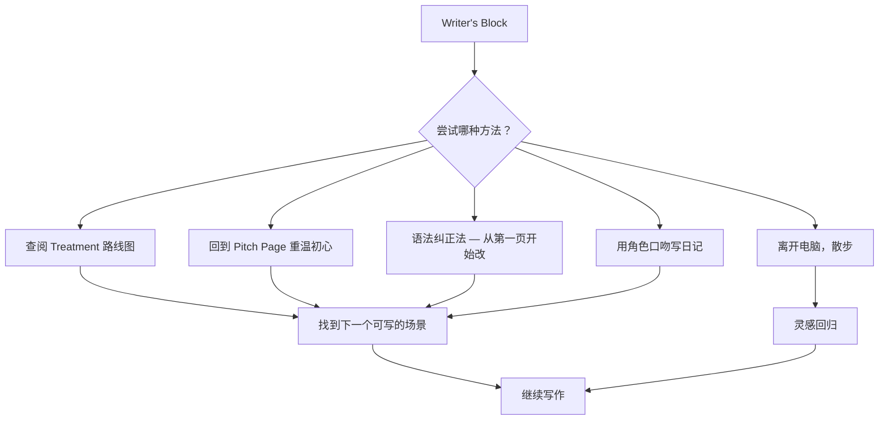
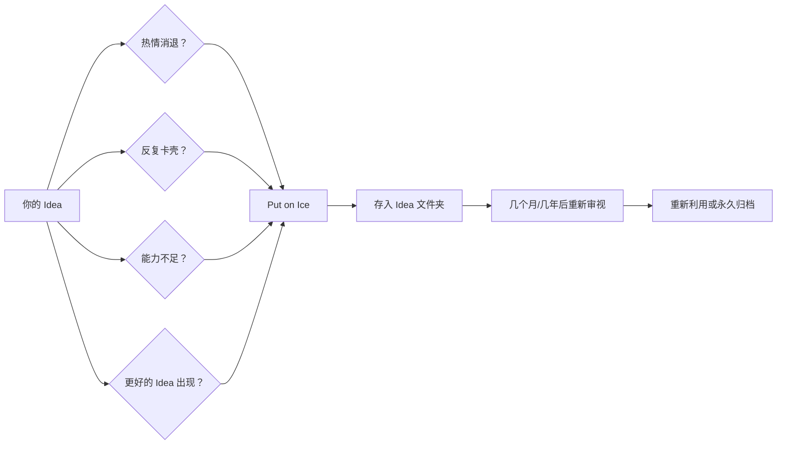

# 第15课：目标设定与克服写作障碍

## Learning Objectives

- 学会设定个人 deadline 并为自己建立 accountability 机制
- 找到适合自己生活节奏的写作习惯
- 了解不同类型剧本的典型创作时间表
- 掌握克服 Writer's Block 的多种实用技巧
- 知道何时应该将一个 idea "put on ice"

---

## 1. 设定个人 Deadline

> [!TIP]
> 你大概听过有人吹嘘自己在写剧本，但他们永远写不完。区别在哪里？在于目标设定。

很多人卡在"写剧本"这个模糊的概念上，从未给自己设定过一个明确的终点。要把模糊的愿望变成具体的目标，你需要做到以下几点：

### 1.1 写下确切日期

不要只说"我这个月要写完剧本"。打开日历，选定一个具体的完成日期，把它写下来。这个日期应该：

- **现实可行** — 根据你的生活节奏来设定，不要凭空想象
- **有挑战性** — 足够紧迫让你保持动力
- **具体到天** — 不是"三月"，而是"3月15日"

### 1.2 告诉别人

KP-106: Set personal deadlines and be accountable — tell someone.

把你写下的日期告诉一个会追着你问的人。这个人可以是：

- 一位同样在写作的朋友
- 你的伴侣或家人
- 一个写作小组的成员
- 甚至是在社交媒体上公开宣布

> [!WARNING]
> Accountability 的关键在于对方会真正跟进。如果你告诉的人只是说"好的加油"然后不再过问，这个机制就失效了。选择一个会认真追问你进度的人。

---

## 2. 找到你的写作习惯

KP-107: Find writing habits (morning, evening, weekly blocks).

每个人的生活和能量周期不同，没有一种写作习惯适合所有人。关键是尝试并找到适合你的节奏。

### 常见写作习惯类型

| 类型 | 适合人群 | 建议 |
|---|---|---|
| **早晨写作** | 晨型人，早上头脑清醒 | 早起30-60分钟，在开始一天其他事务前写作 |
| **晚间写作** | 夜猫子，白天被工作/学习占据 | 留出睡前一小时，作为一天创作的收尾 |
| **固定时间块** | 日程繁忙但有一定灵活性 | 每周安排2-3个1-2小时的写作时段，像约会一样不可取消 |
| **微习惯法** | 很难找到大块时间 | 每天写15分钟，重在坚持而非单次产出量 |

### 尝试不同的时间

不要害怕做实验。如果你尝试了一周早晨写作发现不行，就换成晚上。关键不是"什么时候应该写"，而是"什么时候你能写得出来"。

---

## 3. 时间规划指南

KP-108: Timeline depends on your project.

| 项目类型 | 建议时间 | 每日投入 | 说明 |
|---|---|---|---|
| **Short Film (短片)** | ~1 周 | 1-2 小时/天 | 5-15页剧本，结构简单 |
| **Feature Film (长片)** | ~1 个月 | 1-2 小时/天 | 90-120页剧本，需要更多构思和修改 |
| **TV Episode (剧集)** | ~2 周 | 1-2 小时/天 | 30-60页，有固定格式和节奏要求 |

> [!NOTE]
> 这些时间指的是从 outline 到第一稿的时间。后续的修改和打磨需要额外的时间。记住：写完第一稿只是完成了一半工作。

---

## 4. 克服 Writer's Block

KP-109: Writer's block happens to everyone. Use your treatment as a roadmap.

Writer's Block（写作障碍）不是才华枯竭，而是方法出了问题。当你坐在空白页面前大脑一片空白时，试试以下方法：

### 4.1 使用 Treatment 作为路线图

这也是为什么在 [[0010-outline-index-cards-treatment|第10课：大纲、索引卡与Treatment]] 中强调先写 Treatment 的原因。当你已经有一份详细的 Treatment 时，你就永远不会面对"不知道写什么"的困境。你只需要把 Treatment 中的每一个段落扩展成完整的场景。

治疗 writer's block 的最佳方法就是：**不要从零开始**。

### 4.2 保持写作

KP-109: Keep writing -- even if it's bad.

坚持写下去。如果某个场景写不出来，就跳过它，先写后面有灵感的部分。写得很烂也没关系 — 你之后会修改的。最糟糕的不是写得烂，而是什么都没写。

> [!TIP]
> "You can't edit a blank page." — 你无法修改一张白纸。先写出一个糟糕的初稿，你就有东西可以改进了。

### 4.3 其他实用技巧

KP-110: Remedies for writer's block:

1. **Review your pitch page** — 回到 [[0007-pitch-page-logline-synopsis|第07课：Pitch Page、Logline、Synopsis]] 重新阅读你的 Pitch Page 和 Logline。提醒自己这个故事为什么让你兴奋。
2. **Correct grammar from the start** — 对一个完美主义者来说，一个技巧是从第一页开始就让语法完全正确。这会让你的大脑进入"认真模式"。
3. **Take a walk** — 离开电脑，出去走走。身体活动能激活大脑的不同区域，灵感往往在你不再盯着屏幕时出现。
4. **Write a diary entry** — 如果写不出剧本的场景，就写一篇日记。用角色的口吻写一篇日记，描述他/她此刻的感受。这不一定是剧本的一部分，但它能帮你进入角色的内心世界。

---

## 5. 不要与奥斯卡得主比较

KP-111: Don't compare yourself to Oscar winners.

这一点再怎么强调都不为过。当你刚开始学习编剧时，拿自己的第一稿和《寄生虫》或《瞬息全宇宙》比较是不公平的。那些 Oscar-winning 剧本：

- 经过了无数次的修改和打磨
- 有专业编剧顾问和制片人的反馈
- 在拍摄过程中又经历了大量调整
- 代表的是行业顶尖水平

你的目标是**完成**你的剧本，而不是写出奥斯卡级别的作品。写作就像任何技能一样 — 需要大量练习才能达到高水平。

> [!WARNING]
> 比较是偷走快乐的贼。你唯一应该比较的对象是"昨天的自己"。只要今天的你比昨天多写了一页，你就赢了。

---

## 6. 何时将创意"Put on Ice"

KP-112: When to put an idea on ice.

不是所有 idea 都值得现在写。有时候，你需要把某个想法暂时搁置。什么时候应该这样做？

### 适合"put on ice"的信号

1. **你反复尝试但始终无法推进** — 如果某个 idea 你尝试了好几次都卡在同一个地方，可能它还不够成熟
2. **你对这个 idea 的热情明显消退** — 如果你想到要写它就感到疲惫而非兴奋，也许是时候放一放了
3. **你当前的能力还不足以驾驭它** — 有些故事需要更多的技巧和经验才能写好，这没关系
4. **另一个 idea 让你更兴奋** — 如果你脑子里有一个更强烈的想法在呼唤你，去追那个

### 如何"Put on Ice"

把 idea "put on ice" 不是"扔掉"。把它放进一个文件夹里，记录下你已经有的想法、场景和构思。几个月或几年后回来再看，你可能会发现：

- 你现在有更好的方法来处理它
- 这个 idea 其实不如你当初想的那么好
- 它和一两个其他 idea 结合起来变成更好的故事

---

## 7. 创作完成 Checklist

在结束本课之前，确认你已经完成了以下事项：

- [ ] 设定了一个具体的完成日期
- [ ] 告诉了一个会跟进你进度的人
- [ ] 确定了自己的写作习惯（早晨/晚间/固定块）
- [ ] 根据项目类型预估了所需时间
- [ ] 准备好了一份 Treatment 作为你的写作地图
- [ ] 将至少一个备选 idea 存入"on ice"文件夹
- [ ] 准备好了 writer's block 应急方案

---

## 课后实践

### 实践 1：设定你的 Deadline

打开日历，为你的当前项目设定一个具体的完成日期，然后立刻告诉一个会跟进你的人。

Reveal answer

不要只是想一想，现在就做。打开你的日历应用、发一条消息给一个朋友、在你的写作群组里宣布你的目标。Accountability 的力量来自于对外公开承诺。

### 实践 2：设计你的写作习惯

接下来一周，尝试一种你从未试过的写作习惯（如果你通常是晚上写，试试早晨；如果你习惯周末集中写，试试工作日微习惯）。

Reveal answer

实验结束后问自己两个问题：(1) 这个时间段我写得出来吗？(2) 这个习惯我能坚持吗？如果两个答案都是"是"，恭喜你找到了你的节奏。如果不是，下周换一种方式继续实验。

### 实践 3：建立你的 Writer's Block 应急包

写下你自己的"writer's block 急救方案"，包含至少 3 个具体步骤。把它贴在你的书桌旁。

Reveal answer

你的方案可能看起来像这样：
1. 先深呼吸，离开座位走 5 分钟
2. 打开 Treatment 文件，找到下一个能写的场景标记
3. 如果还不行，打开 Pitch Page 重新读一遍 logline
4. 设置一个 25 分钟的番茄钟，告诉自己"就写 25 分钟，写多烂都行"
5. 25 分钟后如果还在卡，今天就休息，明天再战

### 实践 4：整理你的 Idea 仓库

把至少两个你目前没有在写的 idea 写下来，加上你已经有的构思，放进一个 "Ideas on Ice" 文件夹中。

Reveal answer

每个 idea 记录以下信息：Logline（一句话概括）、主要的角色和冲突、你当初为什么对这个 idea 感到兴奋。这会让你将来重新捡起它时更容易进入状态。

---

## 本课要点速览

- **设定 deadline** — 写下确切日期并告诉一个会跟进的人
- **找到习惯** — 尝试不同的写作时段，找到最适合你的节奏
- **合理规划** — 短片约1周，长片约1个月（每天1-2小时）
- **治疗 writer's block** — 用 Treatment 做地图，写不出来就跳过去，走一走，写角色日记
- **不要比较** — 你的第一稿不需要和奥斯卡作品比
- **适时冷藏** — 不是每个 idea 都需要现在写，放一放可能更好

---

> 下节课预告：[[0016-bonus-next-steps|第16课：BONUS — 进阶之路]]