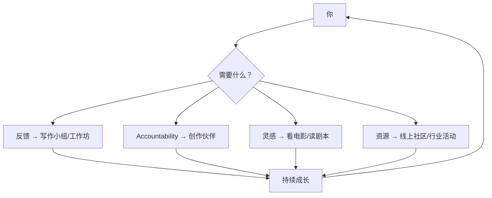
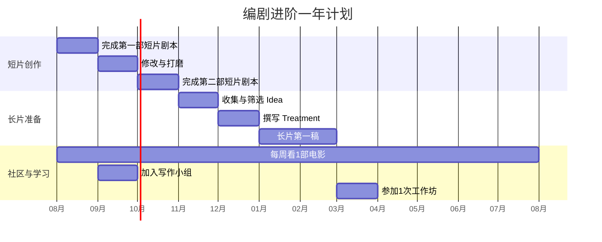

# 第16课：BONUS — 进阶之路

## Learning Objectives

- 了解课程结束后如何继续学习和提升编剧技能
- 掌握寻找反馈和社区支持的途径
- 建立长期创作实践的计划
- 认识从编剧到电影制作全流程的可能性

---

## 1. 恭喜你完成课程

如果你一路学到了这里，意味着你已经完成了 Screenwriting for Beginners 的全部核心课程。你学到的技能包括：

- [[0003-your-mission|明确你的创作使命]]
- [[0004-watch-analyze|用编剧视角分析电影]]
- [[0007-pitch-page-logline-synopsis|撰写 Pitch Page、Logline 和 Synopsis]]
- [[0008-three-act-structure|掌握三幕式故事结构]]
- [[0010-outline-index-cards-treatment|用大纲和 Treatment 规划故事]]
- [[0011-what-is-a-screenplay|正确的剧本格式]]
- [[0012-celtx-software|使用 Celtx 等编剧软件]]
- [[0013-8-steps-writing-screenplay|撰写完整剧本]]
- [[0015-goal-setting-writers-block|设定目标和克服写作障碍]]

但完成课程不是终点，而是起点。

---

## 2. 推荐后续学习方向

### 2.1 从短片开始

如果你还没有完成一个完整的短片剧本，这是你的首要任务。短片是：

- 最容易完成的 — 5-15 页，周期短
- 最容易获得反馈的 — 可以请朋友阅读 10 页的剧本
- 最容易制作的 — 如果有机会拍出来，短片是最可行的选择

> [!TIP]
> 即使你的最终目标是写长片，先写 2-3 个短片剧本也是最好的训练。每一个完成的作品都会给你信心和经验。

### 2.2 向长片进发

如果你已经完成了一个短片剧本，可以考虑挑战 Feature-Length Screenplay（90-120 页）。

- 使用 [[0008-three-act-structure|三幕式结构]] 作为支柱
- 用 [[0010-outline-index-cards-treatment|Treatment]] 规划每个场景
- 设定 [[0015-goal-setting-writers-block|deadline 和 accountability 机制]]

### 2.3 其他编剧教育途径

> [!NOTE]
> 本课程的导师还提供更全面的电影制作课程 "Award Winning Filmmaker"，覆盖从编剧到导演、制片的全流程。如果你对电影制作整体感兴趣，可以深入了解。

---

## 3. 社区的力量

### 3.1 为什么要加入社区

写作本质上是孤独的，但你不需要独自完成一切。一个良好的社区可以提供：

- **反馈** — 能读你的剧本并给出建设性意见的人
- **Accountability** — 会追问你进度的人
- **灵感** — 看到别人在写作，你也会被激励
- **资源** — 行业信息、比赛信息、合作机会
- **情感支持** — 一个理解你正在经历什么的人群

### 3.2 寻找你的创作社群

你可以通过以下方式建立自己的编剧社群：

1. **线上写作小组** — 定期在 Zoom 上碰面，彼此分享进度和作品
2. **本地编剧聚会** — 查看 Meetup 等平台上的本地活动
3. **Facebook / Discord 群组** — 寻找活跃的编剧社区（课程导师有一个私人的 Facebook 群组供学员交流）
4. **写作工作坊** — 参加线下的编剧工作坊
5. **创作伙伴** — 找到一个同样在写剧本的人，每周互相 check-in

### 3.3 Peer Mentoring 的重要性

不要低估同行之间的互帮互助。即使你只是初学者，你也能：

- 给其他人的剧本提供新鲜视角
- 通过阅读别人的作品学习什么有效、什么无效
- 在被别人追问进度时获得动力

> [!WARNING]
> 给你的反馈应该是建设性的。"我不喜欢这个"不是有用的反馈。试试："这个角色的动机在第三页不太清楚，能不能多给一点背景？"

---

## 4. 建立你的创作系统

### 4.1 持续输入

编剧需要持续吸收养分。建立一个"输入系统"：

- **每周至少看一部电影** — 用 [[0004-watch-analyze|观影分析]] 的方法，写 [[reference/film-diary-template|观影日记]]
- **每月读一个剧本** — 可以从你喜欢的电影的 shooting script 开始
- **保持观察** — 日常生活中的人、对话、细节都是素材

### 4.2 持续输出

- **保持写作习惯** — 即使没有在写完整剧本，也保持每天/每周写作
- **尝试不同形式** — 短片、长片、剧集、甚至短篇小说
- **修改旧作品** — 隔几个月回来看你以前写的剧本，你会惊讶地发现自己进步了多少

### 4.3 记录你的成长

创建一个"编剧成长档案"，记录：

- 你完成了哪些剧本
- 你收到了什么反馈
- 你看了什么电影、读了什么剧本
- 你的技能在哪些方面进步了

---

## 5. BONUS 资源清单

### 推荐的后续学习资源

| 资源类型 | 建议 | 目的 |
|---|---|---|
| 完整电影制作课程 | Award Winning Filmmaker（导师的进阶课程） | 从编剧到导演/制片的全流程学习 |
| 行业社区 | 导师的私人 Facebook 群组 | 与同期学员交流、获得反馈 |
| 剧本阅读 | 奥斯卡获奖剧本、优秀电影 shooting scripts | 学习大师的写作技巧 |
| 创作工具 | Celtx, Final Draft, WriterDuet | 持续使用专业工具 |
| 参考书籍 | Syd Field, Blake Snyder, Robert McKee | 深化理论知识 |

### 一年自我提升计划

---

## 6. 导师的最后一句话

你完成了这门课程，这意味着你已经有了开始写剧本所需的一切。从 [[0007-pitch-page-logline-synopsis|Pitch Page]] 到 [[0013-8-steps-writing-screenplay|8个步骤]]，从 [[0008-three-act-structure|三幕结构]] 到 [[0015-goal-setting-writers-block|克服写作障碍]] — 工具都在你的工具箱里了。

现在唯一要做的事情就是：**写**。

> [!TIP]
> 最好的编剧不是最有天赋的人，而是最能坚持的人。写下去，完成它，然后写下一个。

---

## 课后实践

### 实践 1：制定你的个人进阶计划

根据本课的一年计划模板，制定你自己未来 3-6 个月的编剧进阶计划。

Reveal answer

你的计划应该包含：
- 具体的创作目标（完成几个剧本？多长？）
- 学习目标（读几本编剧书？看多少部电影？）
- 社区目标（加入什么群组？找几个写作伙伴？）
- 时间线和里程碑

把这些写下来，贴在你能看到的地方。

### 实践 2：加入一个社区

本周内加入至少一个编剧社区（线上群组、本地活动、或者找到一位创作伙伴）。

Reveal answer

如果你不知道从哪里开始：在 Facebook 搜索 "screenwriting group"，或者在 Meetup.com 搜索当地的编剧聚会。即使只是加入一个群组先潜水观察，也是第一步。

### 实践 3：完成你的第一个剧本

如果你还没有完成任何剧本，现在就设定一个 [[0015-goal-setting-writers-block|deadline]]，用你在课程中学到的所有技能，从 outline 到 Treatment 到第一稿，写一个完整的短片剧本。

Reveal answer

回顾 [[0014-9-steps-short-film|第14课：撰写短片的9个步骤]]，按步骤执行。记住：你的目标是"完成"，而不是"完美"。完美可以在修改阶段追求。

---

## 本课要点速览

- **完成课程只是起点** — 真正的学习在写作实践中
- **从短片开始** — 先完成后完美，建立信心
- **寻找社区** — 反馈、 accountability、灵感和支持都来自社群
- **建立系统** — 持续输入（看电影、读剧本）+ 持续输出（坚持写作）
- **保持联系** — 和同期学员保持联系，互相支持
- **唯一要做的事** — 写

---

> 课程全部完成。现在，去写你的剧本吧。

---

*"The best screenwriter isn't the most talented one. It's the one who finishes."*