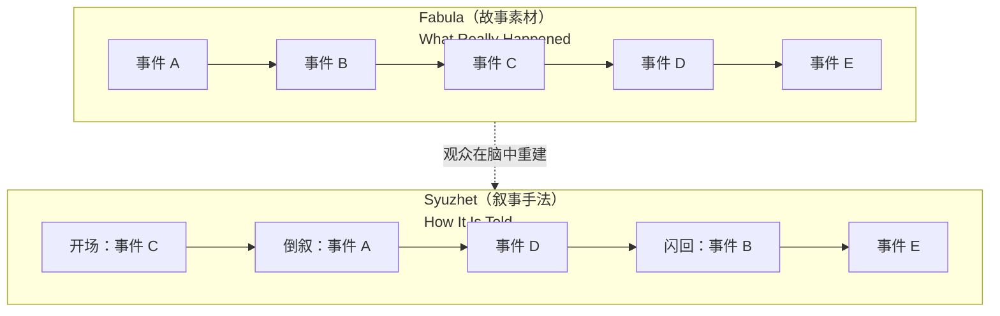
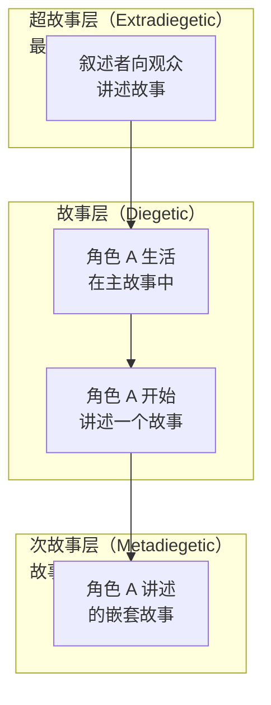

# 补充课01：叙事 vs 情节 — 故事的基本构成

## Learning Objectives

- 理解 Story（故事）与 Plot（情节）的核心区别
- 掌握 Fabula 与 Syuzhet 这一对叙事学基础概念
- 认识 Diegesis（故事世界）的含义及其对编剧的意义
- 了解叙事层次：框架叙事与嵌入式叙事
- 学会用这些概念分析和设计自己的剧本

---

## Story vs Plot：一个经典区分

英国小说家 E.M. Forster 在《小说面面观》（Aspects of the Novel, 1927）中提出了一个关于叙事学的经典区分：

> **Story（故事）：** "The king died and then the queen died."（国王死了，然后王后也死了。）
>
> **Plot（情节）：** "The king died, and then the queen died of grief."（国王死了，然后王后因悲伤过度而死。）

两种表述有完全一样的事件序列，但第二个多了一个关键元素：**因果关系（Causality）**。

| 维度 | Story（故事） | Plot（情节） |
|---|---|---|
| 核心 | 时间顺序（What happens next?） | 因果关系（Why does it happen?） |
| 逻辑 | "然后……然后……"（and then... and then...） | "因此……因此……"（therefore... therefore...） |
| 功能 | 满足好奇心 | 满足理解和情感参与 |
| 编剧关注 | 是否有趣/吸引人 | 是否有必然性和情感深度 |

> [!WARNING]
> 很多初学者编剧的错误是**只关注 Story 层面的"发生了什么"**，而忽略了 Plot 层面的"为什么发生"。观众可以原谅一个简单的故事，但不会原谅一个没有因果逻辑的情节。

### 对编剧的实践意义

当你构思剧本时，可以问自己两个问题：

1. **Story 层面：** 这些事件串联起来有趣吗？观众会想知道"接下来呢"吗？
2. **Plot 层面：** 这些事件之间有必然的因果关系吗？后一个事件是否由前一个事件驱动？

最优秀的剧本两者兼备：有令人着迷的 Story 节奏，也有层层递进的 Plot 逻辑。

---

## Fabula vs Syuzhet：故事素材 vs 叙事手法

俄国形式主义（Russian Formalism）学者提出了另一对更精细的概念：

- **Fabula（故事素材 / 原始故事）：** 所有事件的**时间顺序集合**，不考虑如何被讲述。它是抽象的，是观众在脑中重新构建的"完整故事"。
- **Syuzhet（叙事手法 / 情节编排）：** 观众实际看到的**叙事呈现方式**，包括倒叙、非线性的时间跳跃、省略、重点渲染等技法。

> [!TIP]
> 把 Fabula 想象成**时间线上真实发生的所有事情**，把 Syuzhet 想象成**你选择让观众看到这些事情的方式和顺序**。优秀的叙事 = 巧妙的 Syuzhet 让 Fabula 的揭示既出乎意料又合情合理。

### 常见 Syuzhet 技法

| 技法 | 说明 | 例子 |
|---|---|---|
| 倒叙（Flashback） | 跳回过去的事件 | 《泰坦尼克号》以老年 Rose 的回忆展开 |
| 非线性叙事（Non-linear） | 打乱时间顺序 | 《Pulp Fiction》将三条时间线交错呈现 |
| 框套叙事（Frame Narrative） | 用"讲故事"的行为包裹叙事 | 《The Princess Bride》祖父给孙子读书 |
| 不可靠叙事（Unreliable Narrator） | 叙事者的可信度成疑 | 《The Usual Suspects》Verbal Kint 的供述 |

### 游戏案例分析：Her Story

《Her Story》是理解 Fabula vs Syuzhet 的绝佳案例。

- **Fabula（真实故事素材）：** 一个女人在 1994 年经历的一系列事件 —— 双胞胎姐妹的身份互换、争吵、意外死亡、掩盖真相、警方审讯。
- **Syuzhet（叙事呈现）：** 玩家通过搜索关键词观看一段段审讯录像片段，录像按**非时间顺序**呈现。玩家必须自己拼凑出完整的 Fabula。

> [!QUESTION]
> 思考一下：如果《Her Story》按 Fabula 的时间顺序（从 1994 年到审讯日）线性讲述，效果会怎样？为什么 Syuzhet 的碎片化呈现反而增强了叙事体验？

提示

碎片化呈现让玩家成为了"侦探"—— 主动重建故事，而非被动接收。这种参与感是游戏媒介独有的优势。如果按时间顺序线性讲述，就变成了一部普通的刑侦剧。

---

## Diegesis：故事世界

**Diegesis（故事世界 / 叙事世界）** 是指故事发生的**虚构世界**，包括其中所有的人物、地点、事件和规则。

这个概念在叙事学中分为两个层面：

| 层面 | 定义 | 例子 |
|---|---|---|
| **Diegetic（故事内）** | 故事世界中存在的一切 | 角色说的话、场景中的物体、观众能听到的角色能听到的声音 |
| **Non-diegetic（非故事内）** | 观众能感知但角色不能感知的元素 | 背景音乐、字幕、画外音解说（有时） |

> [!NOTE]
> 在经典好莱坞电影中，背景音乐（Film Score）通常是 non-diegetic 的 —— 角色听不到，但观众能听到。当角色突然也能听到背景音乐时（如《Joker》中 Arthur 在浴室里的场景），就会产生一种元叙事的超现实感。

### Diegesis 对编剧的意义

1. **世界观一致性：** 你的故事世界有它自己的规则。如果世界规则是"魔法存在"，那么在第三幕突然出现"其实魔法是科技"就需要铺垫。
2. **信息的可信度：** 角色如何获取信息、信息的准确性如何，都取决于你在 Diegesis 中设置的规则。
3. **叙事层次的突破：** 当角色意识到自己身处故事中（如《Deadpool》打破第四面墙），Diegesis 被有意打破，产生喜剧或元叙事效果。

---

## 叙事层次：框架叙事与嵌入式叙事

故事可以在故事中嵌套另一个故事，创造**多层叙事（Narrative Levels）**。

| 层 | 名称 | 功能 |
|---|---|---|
| **Extradiegetic** | 超故事层 | 叙述者所在的层级，直接面向观众 |
| **Diegetic** | 故事层 | 故事主体的层级 |
| **Metadiegetic / Hypodiegetic** | 次故事层 | 角色在故事中讲述的另一个故事 |

### 经典例子

- **《The Princess Bride》：** 祖父在病房给孙子读书（Extradiegetic）→ 书中的童话世界（Diegetic）→ 童话中角色讲述自己的往事（Metadiegetic）
- **《盗梦空间》（Inception）：** 每一层梦境都是一层嵌入式叙事。任务在梦境中越深，时间流速越慢，叙事层次越复杂。

> [!TIP]
> 嵌入式叙事的核心功能不是"炫技"，而是用嵌套故事来**补充、对比或评论主故事的主题**。如果你的嵌套故事不能与主故事产生主题对话，那就是多余的。

---

## 将叙事理论应用到你的剧本

当你构思一个新剧本时，可以用以下问题来检视：

| 概念 | 问自己的问题 |
|---|---|
| Story vs Plot | 我是在罗列事件，还是每个事件之间有因果推力？ |
| Fabula vs Syuzhet | 我选择用什么顺序呈现这些事件？这种顺序有何效果？ |
| Diegesis | 我的故事世界内部规则是否一致？观众和角色的信息差是什么？ |
| 叙事层次 | 有没有必要使用嵌套故事？嵌套故事对主主题有何贡献？ |

---

## 本章小结

- **Story（故事）** 是事件的时间序列；**Plot（情节）** 是事件之间的因果连接。编剧的核心工作是将前者提升为后者。
- **Fabula** 是故事的"原材料"（完整的时间线事件）；**Syuzhet** 是叙事的"呈现方式"（选择和排列）。两者之间的张力是叙事技巧的源泉。
- **Diegesis** 是故事世界，包括其中所有角色能感知和不能感知的元素。世界观一致性是信任感的基石。
- **叙事层次** 允许故事中嵌套故事，但嵌套必须有主题意义，不能为复杂而复杂。

这些概念是叙事学的基础工具。它们在主课程的 [[0008-three-act-structure|三幕结构]] 和 [[0009-beats-scenes-sequences|节拍、场景与序列]] 中都会隐式地发挥作用 —— 理解它们，你会对自己在结构层面做出的每一个选择更加笃定。

---

## 下一步

- **下一课：** [[s02-scene-sequel|补充课02：场景内部结构 — Scene + Sequel 模型]] — 从宏观叙事进入微观场景构造
- **课后练习：** 选一部你最近看过的电影。写一篇 300 字的短文，尝试区分：1）这部电影的 Fabula（按时间顺序列出所有事件）；2）它的 Syuzhet（实际呈现顺序）。分析两者之间的差异产生了什么效果。推荐对比电影：《Memento》、《Eternal Sunshine of the Spotless Mind》、《Arrival》。
- **自我测验：**
  1. E.M. Forster 区分 Story 和 Plot 的经典句子是什么？
  2. Fabula 和 Syuzhet 的核心区别是什么？
  3. Diegesis 中的 Diegetic 和 Non-diegetic 元素各举一例。
  4. 什么是嵌入式叙事？举一个例子。
  5. 为什么碎片化的 Syuzhet 在《Her Story》中有效？

参考答案

1. "The king died and then the queen died" = Story；"The king died, and then the queen died of grief" = Plot。
2. Fabula 是所有事件的按时间顺序的完整集合（故事素材）；Syuzhet 是叙事者选择呈现这些事件的方式和顺序（叙事手法）。同一个 Fabula 可以有不同的 Syuzhet。
3. Diegetic：角色之间的对话、场景中的物体声响；Non-diegetic：背景音乐（配乐）、字幕、观众才能听到的画外音。
4. 嵌入式叙事是故事中嵌套另一个故事。例如《The Princess Bride》中，祖父给孙子读的故事里，角色又讲述了自己的往事。
5. 碎片化呈现让玩家成为主动的"侦探"，在脑中重建 Fabula，增强了参与感和沉浸感。按时间线线性讲述则会削弱这种发现体验。

---

> **参考：** [[reference/glossary|编剧术语表]]