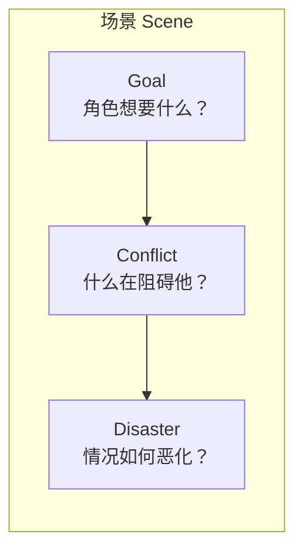
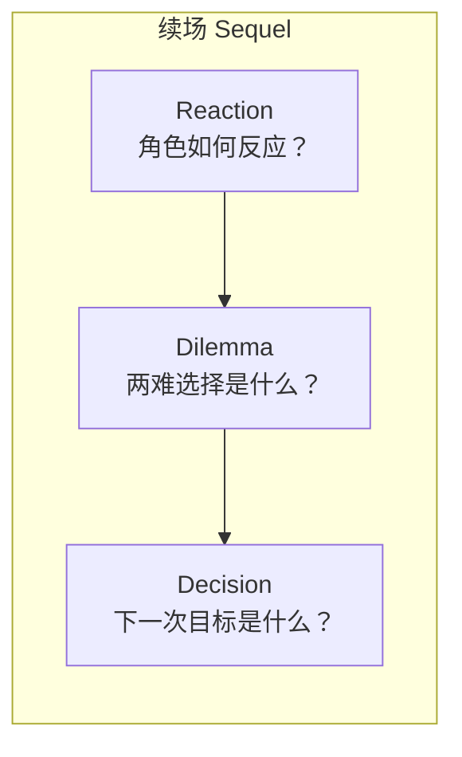
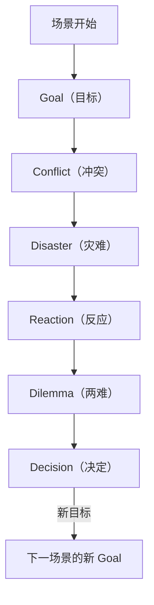
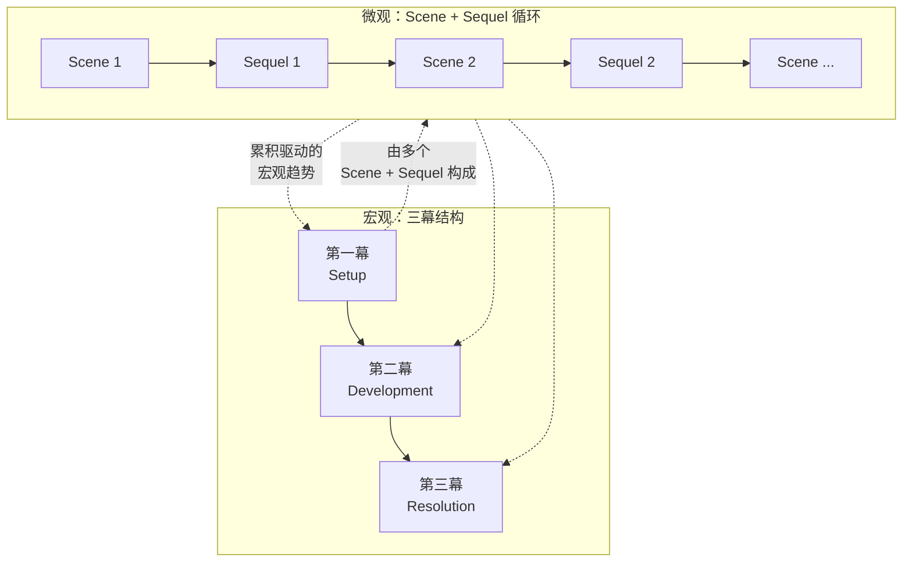

# 补充课02：场景内部结构 — Scene + Sequel 模型

## Learning Objectives

- 理解 Scene（场景）和 Sequel（续场）的交替机制
- 掌握 Scene 的三要素：Goal → Conflict → Disaster
- 掌握 Sequel 的三要素：Reaction → Dilemma → Decision
- 学会用此模型分析和优化自己的场景
- 对比 Scene + Sequel 微观结构与三幕宏观结构的关系

---

## 从宏观到微观

主课程的 [[0008-three-act-structure|三幕结构]] 提供了故事的宏观框架，[[0009-beats-scenes-sequences|节拍、场景与序列]] 展示了故事构建的层级系统。现在我们需要放大到**最小的叙事单元——场景内部**去看：一个场景为什么有效？另一个场景为什么"只是发生了"？

编剧理论家 Dwight V. Swain 在他的经典著作《Techniques of the Selling Writer》（1965）中给出了一个至今仍在被广泛使用的模型。

---

## Scene（场景）：Goal → Conflict → Disaster

Swain 定义了一个**有效的场景（Scene）** 必须包含三个部分：



### 1. Goal（目标）

每个场景的主角必须有一个**明确的、具体的、在场景结束时可以判断是否达成的目标**。

| 维度 | 说明 | 例子 |
|---|---|---|
| 具体性 | 观众必须清楚地知道主角在争取什么 | 不是"想和他搞好关系"而是"想问出藏匿地点" |
| 可判断性 | 场景结束时观众能判断目标是否达成 | "他拿到钥匙了吗？"—— 是/否 |
| 动机强度 | 目标对主角必须是重要的 | 失败的结果越严重，张力越强 |

> [!NOTE]
> Goal 必须**可见（Visible）**。内心活动、"想要变得更好"这种抽象目标无法在场景中表现为具体的冲突。把你的场景目标转化为一个可以"演出来"的行动。

### 2. Conflict（冲突）

一旦目标明确，就必须有**对立力量**阻止主角达成目标。

冲突的来源：

- **其他角色：** 最常见的冲突来源。对方有相反的目标。
- **环境：** 自然力量、时间压力、物理障碍。
- **社会系统：** 法律、规章制度、社会期待。
- **角色自身：** 内心的矛盾、恐惧、道德困境（但这更常在 Sequel 中处理）。

> [!WARNING]
> 一个常见的错误是"友善的冲突"—— 角色看似在争论，但实际上并没有真正的利害冲突。真正的 Conflict 必须让观众感到"如果主角输了，代价是真实的"。

### 3. Disaster（灾难 / 转折）

场景必须以一个**灾难性的转折**结束 —— 主角**没有达成目标**，而且情况**比开始更糟糕**。

Disaster 的功能：

- **制造悬念：** 观众想知道"那接下来怎么办？"
- **推动叙事：** 主角被迫改变策略
- **积蓄势能：** 每一次失败都让最终的成功更有价值

> [!TIP]
> 一个最有力的 Disaster 往往不是简单地"失败了"，而是"表面上成功了，但背后隐藏了更大的危机"或者"失败后发现了一个更令人不安的真相"。

---

## Sequel（续场）：Reaction → Dilemma → Decision

如果场景总是以 Disaster 结束，故事会变得压抑而疲惫。Swain 设计了 **Sequel（续场）** 作为场景之间的"呼吸空间"。



> [!NOTE]
> Sequel 不一定是独立的一个"场景"。它可以是一段蒙太奇、一个简短的过渡镜头，甚至只是一个节拍——关键在于它执行了 Reation → Dilemma → Decision 的处理功能。

### 1. Reaction（反应）

Disaster 之后，角色需要时间消化。

- 情感反应：愤怒、悲伤、恐惧、困惑
- 生理反应：疲惫、颤抖、沉默
- 认知反应：试图理解发生了什么

> [!QUESTION]
> 想想《The Empire Strikes Back》中，Luke 发现 Vader 是自己父亲后的反应。为什么直接跳到"Luke 制定新计划"会削弱场景的力量？

### 2. Dilemma（两难困境）

角色面临一个新的**选择难题** —— 不是"好 vs 坏"，而是"坏 vs 更坏"或"不确定 vs 不确定"。

有效的 Dilemma 特征：
- 没有明显正确的答案
- 每一个选择都有代价
- 角色必须放弃某些重要东西

### 3. Decision（决定 / 新目标）

从 Dilemma 中，角色做出一个新的决定，这个决定就是**下一个场景的 Goal**。于是循环重新开始。

---

## Scene + Sequel 的完整循环



### 节奏模式

一个成功的剧本中的 Scene + Sequel 交替大致呈现这样的节奏：

```
Scene 1 (高张力) → Sequel 1 (中低张力，反思) → Scene 2 (更高张力) → Sequel 2 (略低) → ...
```

随着故事推进，Sequel 越来越短（角色没有时间喘息），Scene 越来越长且张力递增。

> [!TIP]
> 在动作片或惊悚片中，Sequel 可能被压缩到几乎看不见 —— 角色从一个 Disaster 直接冲向下一个 Goal。在剧情片中，Sequel 可以有完整的场景长度，让观众和角色一起消化和思考。

---

## 一个有效的 Scene 和一个"只是发生"的 Scene

| 维度 | 有效的 Scene | "只是发生"的 Scene |
|---|---|---|
| Goal | 明确、具体、可判断 | 模糊、抽象、不存在 |
| Conflict | 有真实利害的对立 | 温和的讨论或没有阻力 |
| Disaster | 情况恶化，引出新问题 | 场景平淡结束，一切照旧 |
| Sequel | 角色反思并做出决定 | 直接跳到下一件事 |

> [!WARNING]
> 如果写完一个场景后你发现"什么都没改变"，那这个场景很可能属于"只是发生"的类型。重写的方向通常是：要么**增加冲突的尖锐性**，要么**让 ending 的 Disaster 更有破坏力**。

---

## Scene + Sequel 与三幕结构的对比

[[0008-three-act-structure|三幕结构]] 是**宏观尺度**的叙事骨架，Scene + Sequel 是**微观尺度**的叙事单元。它们不是替代关系，而是互补关系。



每一幕都由多个 Scene + Sequel 循环构成。三幕结构的转折点（Catalyst、Midpoint、Climax）实际上就是**具有特别强大的 Disaster 的场景** —— 它们的"灾难"大到足以改变整个故事的方向。

---

## 实践练习：分析一个已知场景

选择一部你熟悉的电影中的一个经典场景，用 Scene + Sequel 模型分析。

### 参考模板

**电影：** ____________
**场景描述：** ____________

| 元素 | 你的分析 |
|---|---|
| **Scene** | |
| Goal（主角在这个场景中想要什么？） | |
| Conflict（谁/什么在阻止他？） | |
| Disaster（场景结束时情况怎么恶化了？） | |
| **Sequel**（如果场景中有，或你认为下一个节拍/场景中应该有的） | |
| Reaction（角色的情感/身体/认知反应） | |
| Dilemma（角色面临的两难选择） | |
| Decision（角色决定做什么？新目标是什么？） | |

<details><summary>示例分析：《The Dark Knight》审讯室场景</summary>

**电影：** The Dark Knight (2008)
**场景描述：** Batman 在审讯室审问 Joker，试图找出 Rachel 和 Harvey 被关押的地点。

| 元素 | 分析 |
|---|---|
| **Scene** | |
| Goal | Batman 想让 Joker 说出 Rachel 和 Harvey 的下落 |
| Conflict | Joker 拒绝配合并不断玩弄 Batman 的心理，挑衅他 |
| Disaster | Batman 通过暴力强迫 Joker 说出了地址，但在出发后 Joker 揭示"你选错了 —— 你只能救一个人"。Batman 看似成功，实则中了圈套 |
| **Sequel**（隐含在接下来的蒙太奇中） | |
| Reaction | Batman 的震惊和绝望（他意识到自己被操纵了） |
| Dilemma | 去救 Rachel 还是 Harvey？他没有时间同时救两人 |
| Decision | Batman 决定去救 Rachel（尽管观众后来知道他被骗了）|

这个场景之所以有力，是因为 Disaster 不是简单的"没问出来"，而是"问出来了但情况的糟糕程度翻倍了"。
</details>

---

## 本章小结

- **Scene（场景）：** Goal → Conflict → Disaster。这是一个有效场景的骨架。没有明确的 Goal，Conflict 就无从谈起；没有 Disaster，场景就没有向前推进的动力。
- **Sequel（续场）：** Reaction → Dilemma → Decision。这是一个场景与下一个场景之间的桥梁，让角色（和观众）有时间消化上一个 Disaster，并制定新的目标。
- Scene 和 Sequel 交替出现，形成故事的微观节奏。随着戏剧张力增强，Sequel 逐渐缩短。
- 宏观的 [[0008-three-act-structure|三幕结构]] 由无数个 Scene + Sequel 循环组成。每一个大转折（Catalyst、Midpoint、Climax）本质上都是一个具有全局影响力的 Disaster。

---

## 下一步

- **下一课：** [[s03-hero-journey-seven-point|补充课03：英雄之旅与七点结构]] — 从微观场景结构回到宏观叙事模板，探索 Campbell 的神话学结构
- **课后练习：** 看一遍你最喜欢电影的前 20 分钟。找出前 5 个场景，逐一分析每个场景的 Goal、Conflict、Disaster。如果某个场景缺少其中一个元素，思考为什么 —— 是导演故意为之（如悬疑片的信息隐藏），还是场景本身存在结构性问题？
- **自我测验：**
  1. Dwight Swain 定义的 Scene 三要素是什么？
  2. Sequel 三要素是什么？
  3. Disaster 的功能是什么？为什么不能是"主角失败了，一切照旧"？
  4. 一个"只是发生"的场景和一个有效的场景在 Goal 上有什么区别？
  5. 为什么在动作片中 Sequel 通常比剧情片中更短？

<details><summary>参考答案</summary>

1. Goal（目标）→ Conflict（冲突）→ Disaster（灾难/转折）。
2. Reaction（反应）→ Dilemma（两难困境）→ Decision（决定/新目标）。
3. Disaster 的功能是制造悬念、推动叙事和积蓄情感势能。如果 Disaster 没有让情况变得更糟，观众就没有理由关心接下来会发生什么。每次失败都应该让通往最终成功的路径更有挑战性。
4. 有效的场景有明确的、具体的、可判断的 Goal（如"拿到钥匙"）；"只是发生"的场景的 Goal 要么不存在，要么模糊抽象（如"想和他搞好关系"）。
5. 在动作片中，紧迫感要求主角几乎没有喘息空间，情绪节奏不允许长时间的沉思。而在剧情片中，Silence 和反思本身就是主题的一部分，Sequel 可以占据更多篇幅。

</details>

---

> **参考：** [[reference/glossary|编剧术语表]]